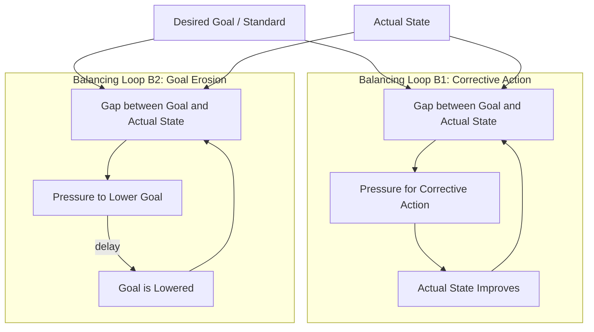

## Drifting Goals Archetype

### Definition

The Drifting Goals archetype is a systems archetype describing a reinforcing erosion pattern: when a gap exists between a desired goal and the actual state of a system, and pressure to close that gap is uncomfortable or costly, the goal itself gets quietly lowered instead of the actual state being improved. Repeated over time, this produces a slow, often imperceptible decline in performance standards — the system "drifts" toward whatever is easiest to achieve rather than what was originally intended.

It belongs to the family of "erosion" or "shifting the burden to the intervenor" archetypes, closely related to **Shifting the Burden**, but distinguished by its specific mechanism: the erosion happens to the *standard* itself, not to a compensating action.

### Structure and Causal Mechanism

The archetype is built from two balancing feedback loops sharing a common variable — the gap between goal and actual state:

1. **Balancing Loop 1 (Corrective Action)**: Gap → pressure to take corrective action → actual state improves → gap closes.
2. **Balancing Loop 2 (Goal Erosion)**: Gap → pressure to reduce the goal → goal is lowered → gap closes.

Both loops close the same gap, but only one addresses the underlying reality. The system has two equally valid ways to relieve the tension created by a gap, and Loop 2 is typically the path of least resistance: it requires no investment, no confrontation with root causes, and produces immediate relief from the discomfort of shortfall.

A delay is a structurally necessary element: the effects of eroded goals are usually not felt for a long time, which is precisely why the erosion is not caught and corrected early.

### Diagram (svg_diagram)

### Key Points

- **Two competing balancing loops**: Both loops are legitimate ways to close a gap; the archetype emerges specifically because the lower-effort loop (lowering the goal) is chosen repeatedly instead of the higher-effort loop (improving reality).
- **The delay is critical**: A time lag between goal erosion and its consequences masks the cumulative effect. Each individual erosion looks small and reasonable in isolation; the compounding effect only becomes visible much later.
- **Self-reinforcing at the meta level**: Each time the goal is lowered, the new (lower) goal becomes the new baseline against which future gaps are measured, so the next erosion starts from an already-degraded position. This produces an exponential-like decay in standards over long time horizons, even though each individual loop is balancing.
- **Distinct from Eroding Goals in some literature naming**: Some texts use "Eroding Goals" and "Drifting Goals" interchangeably; others reserve "Drifting Goals" for cases where perception of the actual state is also distorted (i.e., the gap is misjudged, not just the goal mismanaged). Both variants share the same core loop structure.
- **Perceived vs. actual state matters**: In more detailed formulations, "actual state" is filtered through a reporting or perception delay, meaning decision-makers often adjust goals based on a stale or optimistic reading of reality, compounding the erosion.

### Real-World Examples

**Example — Software Delivery Deadlines**

A team commits to a two-week sprint goal. Midway through, it's clear the goal will be missed. Two options exist: work overtime or cut scope to fix the process failure (Loop 1), or simply redefine "done" for the sprint — deferring tests, disabling quality gates, or shrinking the definition of the deliverable (Loop 2). Each sprint, "done" quietly means less. After a year, "shippable quality" has eroded so far that critical defects are considered normal, but no single retrospective flagged a dramatic drop because each increment was small.

**Example — Personal Fitness Goals**

Someone sets a goal to run 5 km three times a week. After missing a few sessions due to fatigue, instead of addressing the root cause (schedule, recovery, motivation), they revise the goal to "run when I can." Each missed target quietly redefines the new normal downward until the original goal is unrecognizable, and the erosion is rationalized at each step as reasonable given circumstances.

**Example — Manufacturing Quality Standards**

A factory sets a defect-rate target of 0.5%. When the line consistently produces 1.2%, management — facing cost and schedule pressure — reclassifies certain defect types as "acceptable variance" rather than fixing the process. The published defect rate now looks compliant, but actual product quality has not improved; the standard itself absorbed the pressure.

### Leverage Points and Interventions

- **Hold the goal fixed and visible**: Anchor the goal to an external, non-negotiable reference (a regulatory standard, a customer requirement, a physical constraint) so it cannot be quietly renegotiated by internal actors under pressure. This is the single highest-leverage intervention — it removes Loop 2 as a viable pressure valve.
- **Shorten the feedback delay**: Since delay hides the cumulative erosion, instrumenting the system to report cumulative drift (not just current-period comparisons) makes the pattern visible before it compounds. Track the goal's value over time as its own trend line, not just gap-to-current-goal.
- **Strengthen Loop 1's capacity**: Invest in whatever makes corrective action (Loop 1) less costly or more feasible — automation, training, added capacity, or process redesign — so that improving actual state becomes the path of least resistance rather than lowering the goal.
- **Require explicit authorization to change the goal**: Introduce friction specifically on Loop 2 — e.g., goal changes require sign-off from a party not experiencing the immediate performance pressure — while leaving Loop 1 frictionless.
- **Audit against the original baseline, not the current goal**: Periodically re-measure actual performance against the goal as originally set (or an external benchmark), not the currently drifted goal, to reveal how far erosion has progressed.

### Distinguishing from Related Archetypes

| Archetype | Core Mechanism | Key Difference from Drifting Goals |
| --- | --- | --- |
| Shifting the Burden | A symptomatic solution is used instead of a fundamental solution, atrophying the capacity for the fundamental fix | The *goal/standard* stays fixed; a *substitute action* is used instead. In Drifting Goals, the standard itself is what erodes |
| Eroding Goals | Same loop structure as Drifting Goals | Often treated as a synonym; where distinguished, it typically excludes the added complication of *perceived*-state distortion |
| Limits to Growth | A reinforcing growth loop is countered by a balancing loop that introduces a constraint | No standard-erosion mechanism; the limiting loop is about capacity, not aspiration |
| Tragedy of the Commons | Multiple actors independently over-exploit a shared resource | Involves multiple agents and a shared resource pool; Drifting Goals can occur within a single agent or team |

### Detection Checklist

- Are current performance targets lower than they were 6–12 months ago, without a corresponding documented reason?
- Is "acceptable" performance defined relative to recent actuals rather than an original or external standard?
- Do retrospectives or reviews compare against the *current* goal rather than the *original* goal?
- Has a metric's definition changed (denominator, scope, exclusions) coincident with periods of underperformance?

[Inference] Detecting this pattern in practice is difficult specifically because each individual goal adjustment is usually defensible in isolation; the archetype is best identified by examining the trend of the goal itself over a long time window, not any single revision.

### Related Topics

- Shifting the Burden Archetype
- Limits to Growth Archetype
- Reinforcing vs. Balancing Feedback Loops
- Leverage Points (Meadows' framework)
- Goal-Seeking Behavior in Feedback Systems
- Tragedy of the Commons Archetype
- Success to the Successful Archetype
- Delays in Feedback Systems