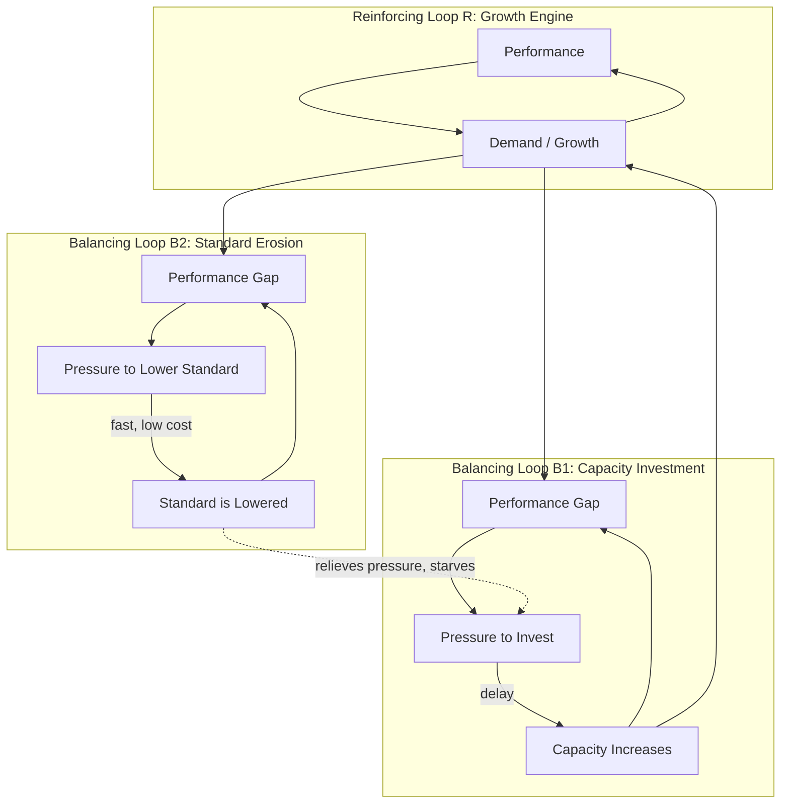

## Growth and Underinvestment Archetype

### Definition

Growth and Underinvestment is a systems archetype describing how growth stalls — or reverses — when capacity investment fails to keep pace with rising demand, and performance standards are lowered (rather than capacity being built) to make the shortfall look acceptable. It combines a reinforcing growth engine, a balancing capacity-constraint loop, and a second balancing loop in which the *performance standard itself* erodes to mask the constraint. This third loop is what distinguishes it from a simple S-shaped growth curve: growth doesn't just plateau against a limit, it collapses because the signal that should trigger investment is suppressed.

### Structure and Causal Mechanism

The archetype involves three interacting loops around a common variable — performance (e.g., service quality, delivery speed, product quality):

1. **Reinforcing Loop R (Growth Engine)**: Performance → demand/orders/customers increase → growth → (with adequate capacity) performance is sustained or improved → further growth.
2. **Balancing Loop B1 (Capacity Investment)**: Performance under pressure from demand → perceived need for capacity → investment in capacity → capacity increases → performance improves, supporting further growth.
3. **Balancing Loop B2 (Standard Erosion)**: Performance under pressure from demand → gap between demand and capacity → instead of investing, the performance standard is lowered → perceived gap closes → pressure to invest in capacity is relieved → capacity investment does not occur.

The critical dynamic: B2 acts as a release valve that competes with B1. If B2 is faster, cheaper, or less politically costly than B1 (which is almost always true — lowering a standard is instantaneous and free; building capacity takes time and capital), decision-makers will systematically choose B2. This starves the capacity-investment loop of the pressure it needs to activate, so growth (R) eventually stalls because capacity constraints are never actually resolved — they are relabeled as normal.

### Diagram (svg_diagram)

### Key Points

- **Three loops, not two**: The archetype requires the reinforcing growth loop *plus* two competing balancing loops fighting over the same gap. Without the growth loop, this reduces to plain Drifting/Eroding Goals.
- **Asymmetric loop speed is the root cause**: B2 (lower the standard) is almost always faster and cheaper than B1 (build capacity). Whichever loop closes the gap first relieves the pressure that would have driven the other — so speed asymmetry, not malice or incompetence, is what drives underinvestment.
- **Delay in B1 is structural**: Capacity investment — hiring, building infrastructure, expanding plant — has an inherent lag. This delay makes B1 look unattractive in the short term compared to the instant relief of B2, biasing decisions toward erosion even when decision-makers know better.
- **The erosion is often invisible in the metric that matters**: Customers/users may not immediately notice a slightly lower service standard, so short-term feedback (complaints, churn, defect reports) fails to trigger corrective action — a further delay that reinforces the pattern.
- **Distinguishes from simple Limits to Growth**: In Limits to Growth, growth halts because it *hits* a real, unaddressed physical or resource limit. In Growth and Underinvestment, the limit is never actually hit as a hard physical constraint — it's obscured through standard erosion, and the eventual stall or collapse comes from that longer-term erosion rather than a sudden discovery of the ceiling.

### Real-World Examples

**Example — Cloud Infrastructure Scaling**

A SaaS product's user base grows rapidly (Loop R). Server response times degrade under load. Instead of investing in scaling infrastructure and engineering headcount early (Loop B1), the team quietly redefines "acceptable" latency SLAs upward each quarter (Loop B2) and stops treating minor timeouts as incidents. Growth continues for a while, but eventually reliability degrades enough that customers churn faster than new signups can replace them, and growth reverses — the underlying capacity gap was never closed, only hidden.

**Example — Airline Fleet and Customer Service Capacity**

An airline's passenger volume grows (Loop R). Rather than investing early in additional aircraft, ground staff, or call-center capacity (Loop B1), management raises the acceptable on-time-departure threshold and lengthens acceptable hold times for customer service (Loop B2). The perceived quality gap closes on paper, but real service quality degrades. Eventually customer satisfaction collapses and growth stalls or reverses as passengers switch carriers.

**Example — Public Water Utility**

A city's population grows, straining an aging water-treatment plant. Instead of committing capital to expand plant capacity (Loop B1), officials relax water-quality or pressure standards to keep reported metrics within "compliance" (Loop B2). The utility avoids the politically costly capital investment for years, until the underlying infrastructure gap forces an eventual crisis — often a hard failure rather than a graceful correction.

### Behavioral Reference Pattern

Over time, systems caught in this archetype typically show a characteristic trajectory: initial healthy growth, followed by a stealthy plateau or slight decline masked by relabeled metrics, followed eventually by a visible collapse once the standard cannot be eroded any further without triggering a crisis (e.g., regulatory intervention, catastrophic failure, mass customer defection). [Inference] The eventual collapse is often sharper than a simple S-curve plateau because the accumulated, hidden gap between real capacity and real demand is released all at once rather than being continuously and gradually corrected.

### Leverage Points and Interventions

- **Fix the performance standard as an external, non-negotiable anchor**: As in Drifting Goals, tying the standard to something outside the control of the pressured decision-maker (contractual SLA, regulatory limit, safety threshold) removes B2 as a viable escape valve.
- **Make the capacity gap visible in leading, not lagging, indicators**: Track queue depth, utilization rates, or demand-to-capacity ratios directly, rather than only tracking the standard/metric that can be redefined. Leading indicators are harder to quietly erode.
- **Reduce the delay in Loop B1**: Pre-approve capacity investment budgets tied to growth triggers (e.g., automatic scaling budgets tied to usage thresholds) so that the capacity-building loop can respond as fast as the erosion loop.
- **Separate the metric-setting authority from the metric-reporting authority**: If the same team facing demand pressure also controls the definition of "acceptable," erosion is structurally likely. Independent audit or a separate governance body for standards reduces this risk.
- **Model capacity requirements against a growth forecast, not current demand**: Investing based on trailing demand guarantees a perpetual lag; investing against a forecast anticipates the gap before it forces a standard-lowering response.

### Distinguishing from Related Archetypes

| Archetype | Core Mechanism | Key Difference from Growth and Underinvestment |
| --- | --- | --- |
| Limits to Growth | Reinforcing growth loop meets a balancing loop from a real, fixed constraint | No standard-erosion loop; the constraint is confronted directly, not hidden |
| Drifting Goals | Two balancing loops compete to close a gap by lowering the goal vs. fixing reality | No reinforcing growth loop driving demand; Growth and Underinvestment layers this pattern on top of an active growth engine |
| Shifting the Burden | A symptomatic fix substitutes for a fundamental fix, atrophying the capacity for the fundamental fix | The substitute in Shifting the Burden is an *action*; here the substitute is *lowering the bar itself* |
| Tragedy of the Commons | Multiple agents deplete a shared resource by individually rational overuse | Involves a single system's internal capacity-vs-demand tension, not multiple competing agents over a shared pool |

### Detection Checklist

- Has a service-level standard, quality threshold, or SLA been revised upward (i.e., relaxed) during a period of demand growth?
- Are capacity investment decisions consistently delayed relative to demand growth, with "the numbers still look fine" cited as justification?
- Is the organization tracking demand-to-capacity ratio, or only the post-erosion, currently-defined performance metric?
- Did a past "brief service dip" get normalized into the new baseline expectation without a follow-up capacity investment?

### Related Topics

- Drifting Goals Archetype
- Limits to Growth Archetype
- Shifting the Burden Archetype
- Reinforcing vs. Balancing Feedback Loops
- Capacity Planning and Queueing Theory
- Leverage Points (Meadows' framework)
- S-Curve (Logistic) Growth Models
- Delays in Feedback Systems