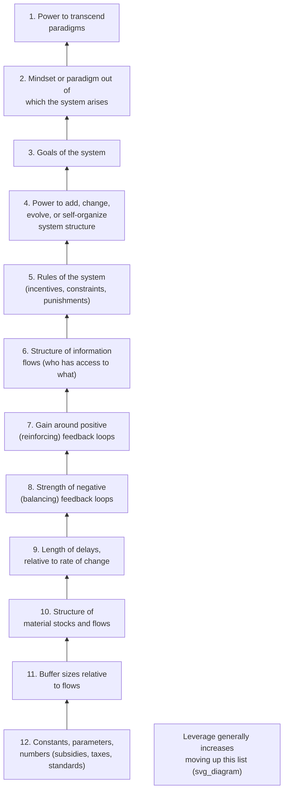
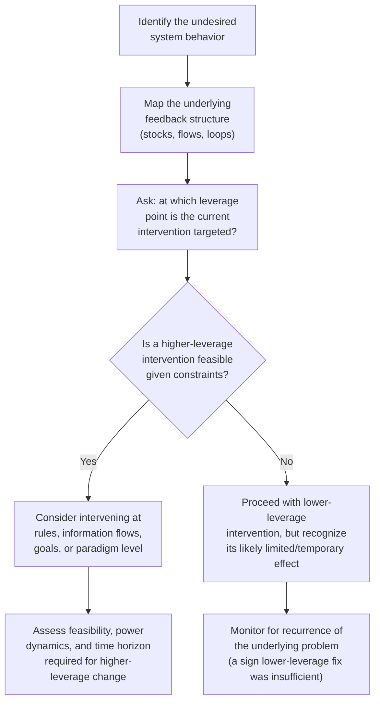

## Donella Meadows' Twelve Leverage Points

### Overview

Donella Meadows' Twelve Leverage Points, first articulated in her 1997 paper "Places to Intervene in a System" and later refined in her 1999 essay of the same name, present a ranked framework for identifying where within a complex system an intervention is likely to produce the greatest change with the least effort. The framework orders intervention points from least effective (parameters — the places people most commonly try to intervene) to most effective (paradigms and transcending paradigms — the places people rarely think to intervene, yet which produce the most profound systemic change). The central, counterintuitive insight of the framework is that leverage generally increases as interventions move from concrete, tangible system elements toward the abstract rules, information structures, and mindsets that generate the system's behavior in the first place.

### The Twelve Leverage Points, Ranked (Least to Most Effective)

**Key Points**

- Meadows explicitly cautioned that the exact ranking and boundaries between adjacent leverage points are not rigid or universally fixed — she described the list as a heuristic developed through practice and observation, not a precise mathematical ordering, and noted that the order of some adjacent points is debatable
- The general principle holds more reliably than any specific point's exact rank: interventions targeting *information, rules, goals, and paradigms* tend to produce more profound, lasting change than interventions targeting *physical stocks, flows, or numerical parameters* — even though the latter are far more commonly the default target of policy and management interventions
- Higher-leverage interventions are typically harder to execute (they often require overturning conventional wisdom, redistributing power, or shifting deeply held assumptions), which partly explains why lower-leverage parameter-tweaking remains the most common form of intervention attempted in practice

### 12. Constants, Parameters, Numbers

The least effective (though most commonly attempted) leverage point: adjusting numerical values such as subsidies, taxes, standards, or fixed quantities within an already-existing system structure.

**Example:** Adjusting a minimum wage rate, a tax percentage, or a pollution emission standard within an unchanged regulatory and economic structure. **Key Points**: Such changes can matter for individuals affected by them, but rarely alter the system's fundamental behavior pattern, since the underlying structure, feedback loops, and rules generating that behavior remain untouched.

### 11. Buffer Sizes Relative to Flows

The size of stabilizing stocks (buffers) relative to the flows moving through them — larger buffers relative to flow volatility make a system more stable and resilient to disturbance, but buffers are often physically fixed and expensive to alter (e.g., warehouse capacity, reservoir size).

**Example:** Increasing a company's cash reserves relative to its revenue volatility, or expanding a reservoir's storage capacity relative to seasonal rainfall variation, both increase system stability but require significant physical or financial investment to change.

### 10. Structure of Material Stocks and Flows

The physical architecture of a system — the layout of roads, factories, pipelines, or distribution networks — which strongly shapes what behaviors are structurally possible, but is typically very costly and slow to redesign once built.

**Example:** The physical layout of a city's road network shapes traffic flow patterns for decades; redesigning it (as opposed to adjusting traffic signal timing, a parameter-level change) requires major infrastructure investment but can produce fundamentally different traffic behavior.

### 9. Length of Delays, Relative to Rate of Change

The time lags in feedback loops relative to how fast the monitored variable is changing — delays that are too long relative to a system's rate of change often cause overshoot, oscillation, or instability, connecting directly to delay dynamics discussed in the Limits to Growth and Fixes That Fail archetypes.

**Example:** Reducing the delay between detecting a supply chain shortage and adjusting production orders can significantly reduce bullwhip-effect oscillation, even without changing any other system parameter.

### 8. Strength of Negative (Balancing) Feedback Loops

The power of a balancing loop relative to the disruptions it must correct — strengthening a balancing loop (relative to the size of shocks it must counteract) increases a system's ability to maintain stability and self-correct.

**Example:** Strengthening a thermostat's responsiveness (faster, more sensitive temperature correction) or strengthening an organization's quality-control feedback loop (faster detection and correction of defects) increases system stability against disturbances.

### 7. Gain Around Positive (Reinforcing) Feedback Loops

The strength of a reinforcing loop's amplification — reducing the gain of a harmful reinforcing loop (e.g., a runaway escalation or compounding depletion dynamic) is typically a much higher-leverage intervention than trying to counteract its effects downstream with a parameter-level fix.

**Example:** Reducing the interest rate on compounding debt (lowering the reinforcing loop's gain) has a more profound long-term effect on debt trajectories than periodically adjusting a fixed payment amount (a parameter-level intervention).

### 6. Structure of Information Flows

Who has access to what information, and how quickly — Meadows considered restructuring information flows (making previously invisible information visible to relevant decision-makers) one of the most surprisingly high-leverage and often low-cost interventions available.

**Example:** Adding real-time energy usage feedback to household utility meters (making previously invisible consumption information visible to the people making consumption decisions) has been observed to reduce energy use significantly, without any change to price, technology, or physical infrastructure.

**Key Points**

- This leverage point is often underused precisely because it is cheap and structurally simple relative to its potential effect — creating new information channels or making existing information visible to different actors can shift behavior substantially without requiring any change to rules, incentives, or physical structure

### 5. Rules of the System

The incentives, punishments, constraints, and formal/informal rules that shape what actions are rewarded, permitted, or penalized within the system — Meadows considered rules a significantly higher-leverage point than most parameter or structural interventions, since rules shape the behavior of every actor operating under them simultaneously.

**Example:** Changing a company's compensation structure from pure sales-volume commission to a structure that also rewards customer retention and satisfaction can systemically reshape sales behavior across the entire sales force, a more powerful lever than adjusting individual sales targets (a parameter-level change).

### 4. Power to Add, Change, Evolve, or Self-Organize System Structure

The capacity of a system (or the actors within it) to restructure itself — the ability to self-organize, innovate, or fundamentally reconfigure the rules and structure that govern it, rather than being locked into a fixed structure set by an external authority.

**Example:** An organizational culture that empowers teams to redesign their own workflows and reporting structures in response to changing needs has substantially more adaptive leverage than an organization where structure can only be changed via slow, centralized top-down decree.

### 3. Goals of the System

The purpose that the system's rules, structure, and feedback loops are designed to pursue — changing a system's stated or de facto goal reorients essentially all lower-leverage elements (parameters, rules, information flows) toward a new end.

**Example:** Shifting a company's core goal from "maximize quarterly shareholder returns" to "maximize long-term stakeholder value" — if genuinely embedded in the system's rules, incentives, and information structures — reorients decision-making across the entire organization far more profoundly than adjusting any individual policy or parameter within the old goal structure.

**Key Points**

- A commonly cited pitfall (which Meadows herself highlighted) is a mismatch between an organization's *stated* goal and its *actual, revealed* goal (the one its rules and incentives genuinely optimize for) — high leverage comes from changing the real, operative goal encoded in the system's structure, not merely from restating an aspirational mission

### 2. Mindset or Paradigm Out of Which the System Arises

The shared, often unstated, set of beliefs, assumptions, and values from which a system's goals, rules, and structures emerge — Meadows argued that the paradigm is the source from which goals and rules are generated in the first place, making a paradigm shift more powerful than any subsequent change made within the old paradigm's assumptions.

**Example:** The shift in mainstream economic paradigm from treating natural resources as effectively infinite and externalities as irrelevant, toward treating ecological limits and externalities as central economic variables, reshapes what goals, rules, and metrics are even considered relevant — a change more fundamental than any policy adjustment made within the prior paradigm.

**Key Points**

- Paradigm shifts are difficult to engineer deliberately and often emerge gradually through accumulated anomalies, generational change, or crisis, rather than through direct top-down intervention — Meadows suggested that paradigms shift less through argument and more through pointing at anomalies, standing firmly in a new paradigm, and working with people who are ready to see it, since paradigms are, by nature, resistant to being changed by argument from within their own logic

### 1. Power to Transcend Paradigms

The highest leverage point in Meadows' framework: the capacity to recognize that *no* paradigm is objectively, universally "true" — including one's own — and to hold paradigms loosely enough to move fluidly between different framings as the situation demands, rather than being permanently anchored to any single worldview.

**Key Points**

- Meadows described this leverage point in more philosophical and personal terms than the others, framing it less as a specific intervention technique and more as a stance of flexibility, humility, and non-attachment toward any single explanatory framework
- This leverage point is less directly actionable as a discrete "intervention" and more descriptive of a meta-level capacity that enables an intervenor to move fluidly among the other eleven leverage points, choosing the most appropriate paradigm-informed intervention for a given context rather than being locked into one worldview's default toolkit

### Illustrative Leverage-Effort Relationship

<svg xmlns="http://www.w3.org/2000/svg" viewBox="0 0 640 380">
<text x="20" y="24" font-size="15" font-weight="bold" fill="#222">Leverage vs. Typical Intervention Frequency (svg_diagram)</text>
<line x1="70" y1="320" x2="600" y2="320" stroke="#333" stroke-width="2" />
<line x1="70" y1="320" x2="70" y2="40" stroke="#333" stroke-width="2" />
<text x="290" y="350" font-size="13" fill="#333">Leverage Point (12 → 1)</text>
<text x="20" y="180" font-size="13" fill="#333" transform="rotate(-90 20,180)">Magnitude</text>
<path d="M90,150 Q150,145 210,140 Q270,130 330,115 Q390,95 450,70 Q510,50 570,35" fill="none" stroke="#27ae60" stroke-width="2.5" />
<path d="M90,60 Q150,70 210,90 Q270,120 330,160 Q390,210 450,260 Q510,290 570,305" fill="none" stroke="#c0392b" stroke-width="2.5" />
<text x="90" y="45" font-size="11" fill="#333">12</text>
<text x="565" y="45" font-size="11" fill="#333">1</text>
<line x1="420" y1="55" x2="440" y2="55" stroke="#27ae60" stroke-width="3" />
<text x="445" y="59" font-size="12" fill="#333">Systemic leverage (potential impact)</text>
<line x1="420" y1="75" x2="440" y2="75" stroke="#c0392b" stroke-width="3" />
<text x="445" y="79" font-size="12" fill="#333">Typical frequency of attempted intervention</text>
</svg>

The illustrative pattern captures Meadows' central observation: systemic leverage tends to increase from parameters toward paradigms, while the frequency with which interventions are actually attempted tends to run in the opposite direction — most real-world intervention effort concentrates on the low-leverage end of the spectrum.

### Applying the Framework: A Diagnostic Workflow

### Common Pitfalls

**Key Points**

- **Defaulting to parameter-level intervention out of habit**: Because parameters (taxes, subsidies, targets, budgets) are the most familiar, measurable, and politically visible levers, they are disproportionately targeted even when a higher-leverage rule, information, or goal-level intervention would be more effective for the same effort
- **Treating the twelve-point ranking as a rigid, precise formula**: Meadows herself cautioned against over-literal application of the exact order — the framework is a heuristic for shifting attention toward generally higher-leverage categories of intervention, not a precise scoring system to be applied mechanically to every situation
- **Underestimating the difficulty of higher-leverage interventions**: Rule, goal, and paradigm-level changes are more powerful but also typically require more political capital, longer time horizons, and greater tolerance for resistance than parameter tweaks — a realistic intervention strategy accounts for this feasibility trade-off rather than assuming higher leverage is always the pragmatic choice
- **Confusing a stated goal with the system's actual operative goal**: As Meadows noted, systems often behave according to their real, revealed goal (embedded in incentives and rules) rather than their publicly stated aspiration — intervening only at the level of stated mission or vision without addressing the underlying incentive structure will typically fail to produce the intended systemic effect
- [Inference] The relative effectiveness of any specific leverage point in a specific real-world system depends heavily on that system's particular structure, actors, and context; the twelve-point ordering reflects Meadows' generalized observation across many systems rather than a guaranteed ranking for every individual case, so specific intervention choices should be informed by systemic diagnosis of the actual system in question rather than by the abstract ranking alone

**Related Topics**

- Reinforcing and Balancing Feedback Loop Fundamentals
- Delays in Feedback Loops and Their Effect on System Stability
- Escalation Archetype (reinforcing loop gain as leverage point)
- Drifting Goals Archetype (goals as a leverage point)
- Shifting the Burden Archetype (rules and information structure interventions)
- Policy Resistance and Structural Validity in System Dynamics
- Paradigm Shifts and Mental Models in Systems Thinking
- Sensitivity Analysis and Scenario Testing (for testing intervention leverage empirically)