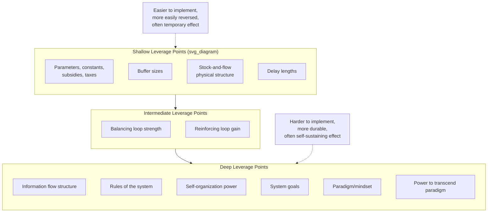
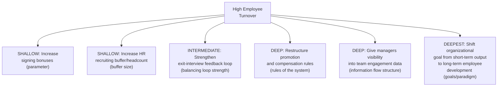

## Shallow versus Deep Leverage Points

### Overview

Shallow versus Deep Leverage Points is a conceptual lens for grouping Donella Meadows' twelve leverage points into two broad tiers based on how fundamentally an intervention reshapes a system's underlying structure and behavior, rather than treating all twelve points as a single undifferentiated scale. "Shallow" leverage points act on the visible, tangible surface of a system — its numbers, buffers, and physical structures — producing effects that are relatively easy to achieve but often limited, temporary, or easily reversed. "Deep" leverage points act on the system's rules, information architecture, goals, and paradigms — producing effects that are harder to achieve but tend to be more profound, durable, and self-sustaining because they reshape the very structure that generates the system's behavior in the first place.

### The Shallow-to-Deep Spectrum

### Defining Characteristics of Shallow Leverage Points

**Key Points**

- **Correspond to Meadows' lower-numbered points (12 through roughly 9)**: constants/parameters, buffer sizes, physical stock-and-flow structure, and delay lengths
- **Directly observable and measurable**: shallow leverage points typically involve quantities that can be seen on a balance sheet, a physical blueprint, or a dashboard — making them the natural, intuitive target for most decision-makers
- **Relatively easy and fast to implement**: adjusting a tax rate, a budget line, or a numeric target usually requires far less organizational or political effort than changing a rule, a goal, or an information structure
- **Effects are often temporary or reversible without addressing root structure**: because the underlying rules, incentives, and information architecture generating the system's behavior remain unchanged, shallow interventions frequently need to be repeated or increased over time to sustain the same effect (a dynamic connected to the Fixes That Fail and Shifting the Burden archetypes, where a "quick fix" at the shallow level fails to resolve a deeper structural cause)
- **Politically and organizationally low-friction**: shallow interventions rarely require challenging entrenched interests, restructuring power, or overturning conventional assumptions, which is part of why they are disproportionately favored in practice relative to their actual leverage

### Defining Characteristics of Deep Leverage Points

**Key Points**

- **Correspond to Meadows' higher-numbered points (roughly 6 through 1)**: information flow structure, rules of the system, self-organization power, system goals, paradigm/mindset, and the power to transcend paradigms
- **Act on the generative structure rather than the surface output**: deep interventions change *why* and *how* a system produces its behavior, rather than adjusting a single numerical output of that behavior
- **Effects tend to be durable and self-sustaining**: because a changed rule, goal, or paradigm continues to shape every subsequent decision made within the system, the effect of a deep intervention persists without requiring repeated re-application, unlike a shallow parameter adjustment
- **Harder, slower, and more resistant to implement**: deep interventions often require redistributing power, overturning established incentives, or shifting widely held assumptions — encountering significant structural and psychological resistance, particularly from actors who benefit from the existing rules, goals, or paradigm
- **Effects often cascade across the entire system simultaneously**: because rules, information access, and goals typically apply system-wide rather than to a single localized variable, deep interventions tend to reshape the behavior of many actors and processes at once, rather than one isolated part of the system

### Comparative Table

| Dimension | Shallow Leverage Points | Deep Leverage Points |
| --- | --- | --- |
| Meadows' points included | 12 (parameters) through ~9 (delays) | ~6 (information) through 1 (transcending paradigms) |
| Ease of implementation | High — often a single administrative decision | Low — often requires sustained effort, coalition-building, or cultural change |
| Speed of effect | Fast, often immediate | Slow, often emergent over months or years |
| Durability of effect | Often temporary; may erode or require repetition | Durable; self-sustaining once embedded |
| Visibility/tangibility | Highly visible, easily measured | Often invisible or abstract (assumptions, incentive structures) |
| Typical resistance encountered | Low political/organizational friction | High — challenges existing power, incentives, or beliefs |
| Risk if used alone | Symptom relief without resolving root cause (risk of Shifting the Burden or Fixes That Fail dynamics) | Implementation difficulty may prevent the intervention from ever being realized in practice |

### Worked Example: Corporate Employee Turnover

Consider an organization experiencing high employee turnover, illustrating the shallow-to-deep spectrum applied to a single problem:

**Analysis:**

- **Shallow intervention** (signing bonuses) may reduce turnover temporarily but does not address whatever underlying dissatisfaction is driving people to leave — turnover often returns to its prior level once bonuses normalize across the industry or the underlying dissatisfaction persists unaddressed (a Fixes That Fail-style delayed relapse)
- **Intermediate intervention** (exit-interview feedback loop) surfaces useful diagnostic information but does not itself change anything unless that information is acted upon
- **Deep intervention** (restructuring compensation/promotion rules, or changing what data managers can see) reshapes incentives and awareness system-wide, producing more durable behavioral change across the whole organization, not just for individuals targeted by a bonus
- **Deepest intervention** (shifting the organizational goal itself, if genuinely embedded in rules and incentives) reorients essentially every decision made under the new goal, representing the most profound but also most difficult-to-achieve change

### Why Shallow Interventions Dominate in Practice

**Key Points**

- **Speed and political feasibility**: Shallow interventions can typically be authorized and implemented by a single decision-maker quickly, while deep interventions often require broader organizational buy-in, sustained effort, or the redistribution of power and resources
- **Measurability and accountability pressure**: Shallow interventions produce fast, easily attributable results (useful for quarterly reporting or short political cycles), while deep interventions' effects are slower to materialize and harder to attribute directly to a specific decision
- **Lower personal or organizational risk**: Proposing a parameter adjustment rarely threatens existing power structures or challenges anyone's core assumptions, whereas proposing a rule, goal, or paradigm change can directly threaten stakeholders who benefit from the current structure — creating strong incentive to avoid deep interventions even when they would be more effective
- **Genuine uncertainty about deep intervention design**: Unlike a parameter (where the required adjustment is often numerically calculable), the correct new rule, information structure, or goal is frequently far less obvious, requiring more exploratory, iterative, and judgment-intensive design work

### Combining Shallow and Deep Interventions

**Key Points**

- Shallow and deep interventions are not mutually exclusive — a well-designed intervention strategy often uses a shallow intervention to provide immediate relief or stabilization *while* a deep intervention is being designed and implemented, provided the shallow measure does not itself erode the capacity or motivation to pursue the deep one (the core risk highlighted in the Shifting the Burden archetype)
- A useful diagnostic question when evaluating any proposed intervention: "if we stopped actively maintaining this intervention, would the system's behavior revert to its prior pattern?" A "yes" answer typically indicates a shallow intervention that has not altered the underlying generative structure; a "no" answer suggests the intervention has reached a sufficiently deep leverage point to be self-sustaining
- [Inference] In practice, the boundary between "shallow" and "deep" is a matter of degree rather than a sharp binary — Meadows' original twelve points form a continuous spectrum, and the shallow/deep grouping is an interpretive simplification useful for practical triage rather than a rigid formal classification with precise cutoffs

### Illustrative Durability-vs-Effort Comparison

<svg xmlns="http://www.w3.org/2000/svg" viewBox="0 0 640 360">
<text x="20" y="24" font-size="15" font-weight="bold" fill="#222">Shallow vs. Deep: Effort and Durability (svg_diagram)</text>
<line x1="80" y1="300" x2="580" y2="300" stroke="#333" stroke-width="2" />
<line x1="80" y1="300" x2="80" y2="40" stroke="#333" stroke-width="2" />
<text x="280" y="330" font-size="13" fill="#333">Implementation Effort →</text>
<text x="20" y="180" font-size="13" fill="#333" transform="rotate(-90 20,180)">Durability of Effect →</text>
<circle cx="140" cy="260" r="9" fill="#e67e22" />
<text x="155" y="264" font-size="12" fill="#333">Parameter tweak (shallow)</text>
<circle cx="200" cy="230" r="9" fill="#e67e22" />
<text x="215" y="234" font-size="12" fill="#333">Buffer size change (shallow)</text>
<circle cx="320" cy="170" r="9" fill="#f1c40f" />
<text x="335" y="174" font-size="12" fill="#333">Balancing loop strength (intermediate)</text>
<circle cx="420" cy="110" r="9" fill="#27ae60" />
<text x="435" y="114" font-size="12" fill="#333">Rule change (deep)</text>
<circle cx="500" cy="70" r="9" fill="#27ae60" />
<text x="360" y="55" font-size="12" fill="#333">Paradigm shift (deepest)</text>
</svg>

### Common Pitfalls

**Key Points**

- **Mistaking shallow relief for genuine resolution**: A shallow intervention's fast, visible effect can be mistaken for having "solved" the problem, when the underlying generative structure (rules, information gaps, goals) remains unchanged and likely to reproduce the same symptom later
- **Assuming deep interventions are always the "correct" choice regardless of feasibility**: Deep interventions carry real implementation risk, cost, and time horizons — in some situations, a shallow intervention genuinely is the appropriate choice given time constraints, even if it is understood to be a temporary measure rather than a permanent fix
- **Underestimating how shallow interventions can undermine deep ones**: As highlighted in the Shifting the Burden archetype, repeated reliance on shallow fixes can actively erode the organizational capacity, attention, or political will needed to ever pursue the deeper structural change
- **Treating the shallow/deep distinction as a strict binary rather than a spectrum**: Some interventions (e.g., strengthening a balancing feedback loop) sit in an intermediate zone and may behave more like shallow or more like deep interventions depending on the specific system and context
- Whether a specific intervention will prove durable ("deep" in effect) or merely temporary ("shallow" in effect) in a given real-world system is not always predictable in advance with certainty; [Inference] classifying a planned intervention as shallow or deep before implementation is itself a judgment call informed by structural analysis, not a guaranteed prediction of its eventual real-world durability

**Related Topics**

- Donella Meadows' Twelve Leverage Points
- Shifting the Burden Archetype
- Fixes That Fail Archetype
- Reinforcing and Balancing Feedback Loop Fundamentals
- Drifting Goals Archetype (goals as a deep leverage point)
- Paradigm Shifts and Mental Models in Systems Thinking
- Policy Resistance and Structural Validity in System Dynamics
- Model Validation and Calibration (for testing whether an intervention's effect is durable versus reversible)