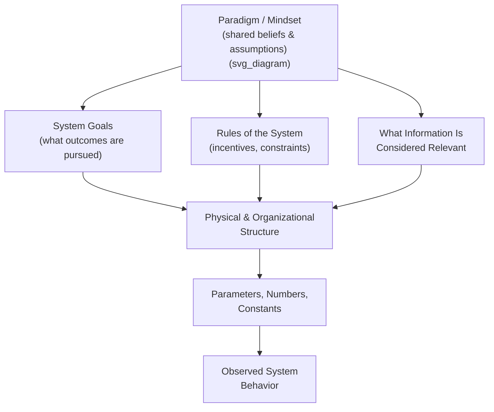
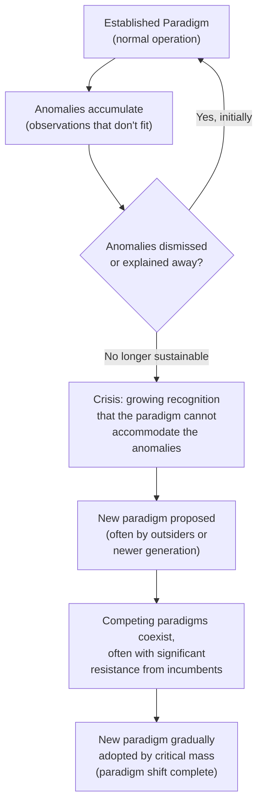

## Paradigms and Paradigm Shifts as High Leverage

### Overview

Paradigms and Paradigm Shifts as High Leverage examines the second-highest of Donella Meadows' twelve leverage points: the shared, often unexamined set of beliefs, assumptions, and values from which a system's goals, rules, and structures arise. A paradigm functions as the generative source code of a system — it determines what goals are considered legitimate, what rules seem sensible, what information is deemed relevant, and even what problems are recognized as problems in the first place. Because every lower-leverage element of a system (its parameters, structure, rules, and goals) is downstream of its paradigm, shifting the paradigm itself reshapes all of these simultaneously — making it, in Meadows' framework, one of the most powerful yet most difficult intervention points available.

### What a Paradigm Is, Structurally

A paradigm is not a rule, goal, or piece of information within a system — it is the shared cognitive and cultural framework that determines which rules, goals, and information are considered valid, thinkable, or even visible in the first place.

**Key Points**

- A paradigm operates largely below conscious awareness for most participants within a system — it is the water a fish swims in, rarely questioned because it is rarely even perceived as a choice or assumption rather than simply "how things are"
- Because a paradigm determines what counts as a legitimate goal, rule, or relevant piece of information, attempting to change goals or rules *without* addressing an incompatible underlying paradigm tends to produce resistance, reversion, or superficial compliance rather than genuine, lasting change
- Paradigms are shared at a social/cultural level (an organization, a profession, a society), not merely held by a single individual — which is part of why they are so difficult to shift: changing one person's mind does not change the paradigm if the surrounding social structure continues to reinforce the old framework

### Why Paradigm-Level Intervention Ranks So High

Meadows placed paradigm shifts near the top of her twelve-point hierarchy because a paradigm is causally upstream of virtually every other leverage point: goals, rules, information structures, and physical systems are all, in effect, downstream expressions of the paradigm that generated them.

**Key Points**

- **Cascading effect**: A genuine paradigm shift reshapes goals, rules, and information structures simultaneously and system-wide, rather than requiring separate, piecemeal interventions at each lower level
- **Resolves root incompatibility rather than symptom mismatch**: Many persistent policy failures occur because a new rule or goal is imposed on top of an unchanged paradigm that is fundamentally incompatible with it — the old paradigm's logic continues to generate resistance, workarounds, or reversion, undermining the new rule's intended effect (connecting to the Policy Resistance concept in system dynamics)
- **Self-sustaining once adopted**: Once a new paradigm is genuinely internalized by a critical mass of actors within a system, it continues generating congruent goals, rules, and behaviors without requiring continuous external enforcement — in contrast to shallow interventions that typically require sustained maintenance to persist

### Historical and Conceptual Roots: Kuhn's Paradigm Shifts

Meadows' use of the term "paradigm" draws on philosopher of science Thomas Kuhn's concept of scientific paradigm shifts, in which an established scientific framework is eventually replaced not through gradual accumulation of evidence alone, but through a more discontinuous reorganization of the fundamental assumptions and questions considered legitimate within a field.

**Key Points**

- Kuhn observed that paradigm shifts in science are often resisted most strongly not by evidence but by the professional, institutional, and psychological investment established practitioners have in the existing paradigm — a dynamic Meadows extended to paradigms in social, economic, and organizational systems more broadly
- [Unverified] The specific mechanisms and pace of paradigm change in social/organizational contexts (as opposed to formal scientific paradigms) are less rigorously documented in the systems-thinking literature than Kuhn's original scientific case studies, so applying this framework to a specific organizational or societal paradigm shift involves some degree of extrapolation from the scientific-paradigm model

### Real-World Examples of Paradigm-Level Shifts

#### 1. Shareholder Primacy to Stakeholder Value in Corporate Governance

A shift from the paradigm that a corporation's sole legitimate purpose is maximizing shareholder returns, toward a paradigm recognizing employees, customers, communities, and the environment as legitimate stakeholders whose interests warrant consideration — when genuinely adopted, this reshapes what goals are considered legitimate (Meadows' point 3), what rules seem sensible (compensation structures, reporting requirements), and what information is tracked (ESG metrics alongside financial ones).

#### 2. Mechanistic to Ecological Worldview in Environmental Policy

A shift from viewing nature primarily as a resource to be exploited for economic production, toward viewing ecological systems as interconnected, finite, and foundational to long-term economic and social wellbeing — this paradigm shift underlies the emergence of concepts like ecological economics, circular economy design, and planetary boundaries as legitimate policy considerations, none of which were coherent goals within the prior extractive paradigm.

#### 3. Deficit-Based to Strengths-Based Paradigms in Social Work and Education

A shift from viewing individuals or communities primarily through the lens of their deficits and problems to be fixed, toward recognizing existing strengths, assets, and capabilities as the primary basis for intervention design — this reshapes what goals interventions pursue, what information practitioners gather, and what rules govern program design.

#### 4. Command-and-Control to Agile/Adaptive Management Paradigms

A shift in organizational management from a paradigm assuming that detailed upfront planning and hierarchical control produce the best outcomes, toward a paradigm assuming that iterative experimentation, decentralized decision-making, and rapid feedback loops produce better outcomes under uncertainty — this reshapes organizational rules (approval processes), information flows (who needs visibility into what), and goals (predictable execution vs. adaptive learning).

#### 5. Disease-Treatment to Prevention/Wellness Paradigms in Healthcare

A shift from a paradigm centered on treating disease after it manifests, toward a paradigm centered on preventing disease and promoting wellness before onset — this reshapes what goals healthcare systems pursue, what information is considered clinically relevant (social determinants of health, lifestyle factors), and what rules govern reimbursement and resource allocation.

### Mechanisms Through Which Paradigm Shifts Occur

Meadows was explicit that paradigms are notoriously resistant to being changed through direct argument or evidence presented from within their own logic, and suggested several alternative mechanisms more likely to succeed:

**Key Points**

- **Pointing at anomalies and failures of the old paradigm** — repeatedly and persistently highlighting observations or outcomes the old paradigm cannot adequately explain or address, gradually building recognition of the paradigm's inadequacy (echoing Kuhn's anomaly-accumulation mechanism)
- **Speaking loudly and with confidence from the new paradigm** — rather than trying to prove the new paradigm correct through argument within the old paradigm's own terms, Meadows suggested articulating and modeling the new paradigm directly and consistently
- **Working with the receptive, not the resistant** — focusing energy on those already open to or curious about the new paradigm (often newer entrants, younger practitioners, or those already experiencing the old paradigm's failures directly) rather than attempting to convert the most entrenched defenders of the status quo
- **Introducing the new paradigm into places of public visibility and power** — helping the new paradigm gain legitimacy and momentum by embedding it in visible institutions, media, or influential networks, rather than keeping it confined to marginal or private discourse
- [Inference] These mechanisms, as articulated by Meadows, reflect a qualitative, experience-based synthesis rather than an empirically validated causal model — their relative effectiveness for any specific paradigm shift is not something that can be predicted with precision, and should be treated as heuristic guidance rather than a guaranteed formula

### Illustrative Diagram: Paradigm as Root of the Intervention Tree

<svg xmlns="http://www.w3.org/2000/svg" viewBox="0 0 640 380">
<text x="20" y="24" font-size="15" font-weight="bold" fill="#222">Paradigm as Root Cause Structure (svg_diagram)</text>
<circle cx="320" cy="70" r="34" fill="#8e44ad" opacity="0.85" />
<text x="320" y="66" font-size="12" fill="white" text-anchor="middle">Paradigm</text>
<text x="320" y="80" font-size="12" fill="white" text-anchor="middle">(root)</text>
<line x1="320" y1="104" x2="200" y2="160" stroke="#666" stroke-width="2" />
<line x1="320" y1="104" x2="320" y2="160" stroke="#666" stroke-width="2" />
<line x1="320" y1="104" x2="440" y2="160" stroke="#666" stroke-width="2" />
<circle cx="200" cy="180" r="26" fill="#2980b9" />
<text x="200" y="184" font-size="11" fill="white" text-anchor="middle">Goals</text>
<circle cx="320" cy="180" r="26" fill="#2980b9" />
<text x="320" y="184" font-size="11" fill="white" text-anchor="middle">Rules</text>
<circle cx="440" cy="180" r="26" fill="#2980b9" />
<text x="440" y="184" font-size="10" fill="white" text-anchor="middle">Info Flow</text>
<line x1="200" y1="206" x2="200" y2="260" stroke="#666" stroke-width="2" />
<line x1="320" y1="206" x2="320" y2="260" stroke="#666" stroke-width="2" />
<line x1="440" y1="206" x2="440" y2="260" stroke="#666" stroke-width="2" />
<rect x="160" y="260" width="80" height="30" rx="4" fill="#27ae60" />
<text x="200" y="279" font-size="10" fill="white" text-anchor="middle">Structure</text>
<rect x="280" y="260" width="80" height="30" rx="4" fill="#27ae60" />
<text x="320" y="279" font-size="10" fill="white" text-anchor="middle">Structure</text>
<rect x="400" y="260" width="80" height="30" rx="4" fill="#27ae60" />
<text x="440" y="279" font-size="10" fill="white" text-anchor="middle">Structure</text>
<text x="320" y="330" font-size="12" fill="#555" text-anchor="middle">Changing the root reshapes every branch;</text>
<text x="320" y="348" font-size="12" fill="#555" text-anchor="middle">changing a branch alone leaves the root (and other branches) untouched</text>
</svg>

### Distinguishing Paradigm Shifts from Goal Changes

| Aspect | Goal Change (Leverage Point 3) | Paradigm Shift (Leverage Point 2) |
| --- | --- | --- |
| Scope | A specific target or purpose the system pursues | The underlying worldview from which any goal is even considered legitimate |
| Can occur independently? | Often attempted alone, but risks reversion if incompatible with the existing paradigm | Paradigm shifts inherently reshape goals as a downstream consequence |
| Typical resistance source | Stakeholders who benefit from the current goal | Deeply held, often unconscious beliefs about how the world works |
| Durability without deeper change | Vulnerable to erosion if the underlying paradigm remains unchanged (connects to Drifting Goals archetype) | Self-sustaining, since it reshapes the very logic that would otherwise erode an imposed goal |

### Practical Considerations for Attempting Paradigm-Level Intervention

**Key Points**

- **Recognize that paradigm shifts operate on longer time horizons than most organizational or policy cycles**: attempting to force a paradigm shift within a single budget cycle or political term is typically unrealistic; genuine paradigm change is more often measured in years or generations
- **Distinguish rhetorical paradigm claims from genuinely embedded paradigm shifts**: an organization or policy may adopt new paradigm-aligned language (e.g., "stakeholder value," "sustainability") without the underlying rules, incentives, and information structures actually changing — a superficial labeling that does not constitute a real paradigm shift and will not produce the corresponding systemic effect
- **Anticipate resistance from those materially or psychologically invested in the current paradigm**: because a paradigm shift threatens the legitimacy of the goals, rules, and status associated with the old paradigm, expect resistance proportional to how much the current paradigm benefits incumbent actors
- **Use lower leverage points as interim measures while working toward paradigm change**: as with the shallow/deep leverage framework, tactical parameter or rule-level adjustments can provide interim stability or relief while the slower work of paradigm shift is pursued, provided the interim measures do not themselves erode the momentum toward deeper change

### Common Pitfalls

**Key Points**

- **Attempting to argue a paradigm shift using logic from within the old paradigm**: Since a paradigm determines what counts as valid evidence or reasoning in the first place, arguments framed entirely within the old paradigm's assumptions are unlikely to persuade those still operating within it — Meadows' suggested mechanisms (anomalies, confident articulation of the new frame, working with the receptive) are explicitly alternatives to direct argumentative persuasion
- **Mistaking surface-level rhetorical adoption for genuine paradigm change**: Declaring a new paradigm publicly while leaving the underlying rules, incentives, and information structures unchanged produces symbolic rather than substantive change, and the old paradigm's logic will likely continue generating the same underlying behavior
- **Underestimating the time and resistance involved**: Expecting paradigm-level change to occur on the same timescale as a parameter or rule adjustment typically leads to premature abandonment of the effort or to substituting a shallower, faster intervention that does not achieve the intended depth of change
- **Assuming a single "correct" paradigm exists to be discovered**: Meadows' highest leverage point (the power to transcend paradigms) explicitly cautions against treating any paradigm — including a newly adopted one — as final, objective truth rather than one useful, provisional framework among possible others
- Whether a specific real-world change genuinely constitutes a "paradigm shift" as opposed to a smaller-scale goal or rule change is often a matter of degree and interpretation rather than a sharply defined boundary; [Inference] classifying a given historical or ongoing change as paradigm-level should be treated as an analytical judgment rather than an objectively verifiable fact in most cases

**Related Topics**

- Donella Meadows' Twelve Leverage Points
- Shallow versus Deep Leverage Points
- Drifting Goals Archetype
- Policy Resistance and Structural Validity in System Dynamics
- Kuhn's Structure of Scientific Revolutions (conceptual origin of paradigm shift)
- Mental Models in Systems Thinking
- Shifting the Burden Archetype (rule/paradigm mismatch dynamics)
- Model Validation and Calibration (for testing whether a claimed paradigm shift produces measurable structural change)