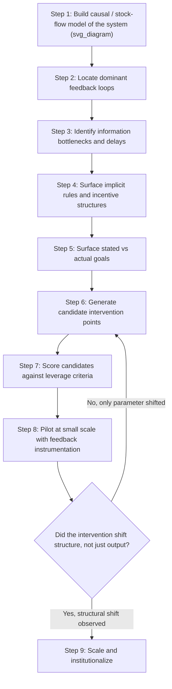

## Identifying High-Leverage Interventions in Practice

### Overview

Identifying high-leverage interventions is the applied discipline of locating where, within a system's structure, a small, well-placed action produces disproportionately large and durable change. It operationalizes Donella Meadows' leverage points framework by moving from an abstract hierarchy of "places to intervene" toward a repeatable diagnostic process: mapping system structure, testing candidate intervention points against leverage criteria, and validating that a proposed change shifts the system's underlying rules, information flows, or goals rather than merely adjusting a numerical parameter.

The practical challenge is that high-leverage points are usually counterintuitive. Meadows observed that people intuitively push on parameters (subsidies, taxes, standards) because those are visible and politically tractable, while the leverage that actually reorganizes system behavior lies deeper — in feedback loops, information structures, rules, and paradigms — and is often invisible from within the system.

### Recap: The Leverage Points Hierarchy

Meadows' twelve leverage points, ordered from lowest to highest leverage:

1. Constants, parameters, numbers (subsidies, taxes, standards)
2. Sizes of buffers relative to flows
3. Structure of material stocks and flows
4. Length of delays relative to system change rates
5. Strength of negative (balancing) feedback loops
6. Gain around positive (reinforcing) feedback loops
7. Structure of information flows (who has access to what)
8. Rules of the system (incentives, punishments, constraints)
9. Power to add, change, or self-organize system structure
10. Goals of the system
11. Mindset or paradigm the system arises from
12. Power to transcend paradigms

**Key Points**

- Lower-numbered points (12→1 in original ordering, here listed low-to-high leverage) are easier to find and manipulate but yield weaker, more easily countered effects.
- Higher leverage points (rules, goals, paradigms) are harder to locate and shift but produce structural, self-sustaining change.
- [Inference] Meadows herself cautioned that the hierarchy is not strictly rank-ordered in every case — context can invert the relative power of two adjacent points.

### Why Leverage Points Are Often Missed

Several structural reasons cause practitioners to intervene at low-leverage points by default:

- **Visibility bias**: parameters and stocks are measurable and reportable; feedback structures and paradigms are not.
- **Political tractability**: changing a tax rate is procedurally easier than changing an institution's goal.
- **Mental model lag**: actors act on the model of the system they carry in their heads, which is frequently outdated relative to the system's actual current structure.
- **Delay-induced misattribution**: when cause and effect are separated by long delays, interventions get credited or blamed incorrectly, causing effort to concentrate on visible, short-delay parameters.

### A Practical Diagnostic Workflow

The identification process below sequences diagnostic steps from structural mapping to leverage testing to validation.

**Step 1 — Build a structural model.** Construct a causal loop diagram (CLD) or stock-and-flow diagram of the system in question. Without an explicit model, "leverage" is guesswork; the model is what makes leverage points locatable rather than merely narrated.

**Step 2 — Locate dominant feedback loops.** Identify which reinforcing (R) and balancing (B) loops currently dominate system behavior. Ask: which loop, if strengthened or weakened, would most change the trajectory?

**Step 3 — Identify information bottlenecks and delays.** Map who receives what data, how fast, and with how much distortion. Missing or delayed feedback (e.g., a cost not shown to the decision-maker who incurs it) is frequently a higher-leverage point than any parameter downstream of it.

**Step 4 — Surface rules.** Rules include formal policies, contracts, incentive schemes, and informal norms. Ask which single rule, if changed, would make many current workarounds unnecessary.

**Step 5 — Surface goals.** Distinguish the system's stated goal from its revealed goal (the goal implied by what the system actually optimizes for, visible in its incentive and measurement structure). Divergence between stated and revealed goals is itself a diagnostic signal pointing toward high leverage.

**Step 6 — Generate candidates.** For each structural feature found in Steps 2–5, generate at least one concrete, implementable intervention.

**Step 7 — Score against leverage criteria** (see next section).

**Step 8 — Pilot with instrumentation.** Before scaling, run the intervention at reduced scope with explicit before/after measurement of the *structural* variable (loop strength, delay length, information reach), not just the output metric.

**Step 9 — Institutionalize.** Lock in the change via rule, structure, or role change so it does not decay once attention moves elsewhere.

### Leverage Scoring Criteria

When comparing candidate interventions, score each against these dimensions rather than relying on rank position in Meadows' list alone:

| Criterion | Question | Low Score | High Score |
| --- | --- | --- | --- |
| Structural depth | Does it change a rule/goal/paradigm or just a parameter? | Adjusts a number | Rewrites a rule or goal |
| Persistence | Does the effect require ongoing enforcement? | Reverts without maintenance | Self-sustaining once applied |
| Reach | How many loops/stocks does it touch? | Single local effect | Cascades across subsystems |
| Reversibility of resistance | How easily can actors route around it? | Easily circumvented | Closes the workaround path |
| Delay to effect | How long until the structural shift shows up? | [Inference] Often inversely related to persistence — faster effects tend to be shallower | Longer delay often correlates with deeper structural leverage |
| Political/resource cost | What does it cost to implement? | High cost, high resistance | Low cost relative to effect size |

**Key Points**

- A useful heuristic: an intervention is likely low-leverage if its main effect disappears the moment monitoring stops.
- An intervention is likely high-leverage if it changes what actors *want* to do, not merely what they are *permitted or forced* to do.

### Worked Example: Reducing Hospital Readmissions

**Context**: A hospital system has a high 30-day readmission rate.

- **Low-leverage candidate (parameter)**: Increase the penalty fine per readmission. Effect: hospitals may game discharge coding rather than change care quality. [Inference] This is a plausible response given typical incentive-gaming dynamics, not a guaranteed outcome.
- **Medium-leverage candidate (buffer/delay)**: Extend post-discharge follow-up window from 48 hours to 14 days with a dedicated care coordinator. Effect: shortens the information delay between discharge and detection of complications, strengthening an existing balancing loop.
- **Higher-leverage candidate (information flow)**: Give primary care physicians real-time visibility into ED and inpatient records at other facilities. Effect: closes an information gap that was causing redundant or contradictory care decisions system-wide.
- **Highest-leverage candidate (goal/rule)**: Shift hospital reimbursement from fee-for-service to bundled/value-based payment tied to patient outcomes over a care episode. Effect: changes the system's *revealed goal* from "maximize billable encounters" to "maximize patient health per episode," which reorganizes downstream behavior (staffing, discharge planning, follow-up) without needing to specify each behavior individually.

**Output**: The value-based payment shift is higher leverage not because it is listed higher in Meadows' hierarchy in the abstract, but because scoring it against the criteria table shows greater structural depth, persistence, and reach than the parameter-level fine.

### Common Failure Modes in Practice

- **Leverage point misidentification**: mistaking a buffer/stock fix for a rule fix (e.g., adding more emergency inventory instead of fixing the demand-forecasting information delay that caused stockouts).
- **Leverage without legitimacy**: identifying a correct high-leverage point (e.g., a goal change) but lacking the authority or coalition to change it, resulting in a technically correct diagnosis with no implementable path — Meadows explicitly noted paradigm-level leverage is real but requires disproportionate consensus-building to move.
- **Positive feedback loop leverage misapplied destructively**: strengthening a reinforcing loop is high leverage but can amplify harm as easily as benefit; leverage is directionally neutral and must be paired with judgment about desired system behavior.
- **Ignoring second-order resistance**: systems often have self-correcting mechanisms (homeostasis) that resist externally imposed high-leverage changes; a rule change without addressing the actors who benefit from the old rule frequently gets reversed or eroded. [Unverified] The specific erosion timeline varies by system and is not generalizable to a fixed number.

### Diagnostic Questions Checklist

- What does the system actually optimize for, based on revealed behavior rather than stated mission?
- Which feedback loop, if traced backward, explains most of the current problematic trend?
- Where is information generated but not delivered to the actor who needs it to act?
- Which rule, if removed, would make the largest number of current workarounds unnecessary?
- Is the proposed fix addressing a symptom (stock level) or a structure (flow rate, loop gain, rule)?
- Would this intervention still hold if monitoring or enforcement were withdrawn?

### Relationship to Adjacent Concepts

- **System archetypes**: Recognizing archetypes (e.g., "Shifting the Burden," "Fixes that Fail") is often the fastest route to spotting where leverage has been misapplied historically in a given system.
- **Stock-and-flow modeling**: Provides the quantitative substrate needed to test whether a candidate intervention actually shifts a flow rate or loop gain versus a one-time stock adjustment.
- **Paradigm shifts**: The highest leverage points (goals, paradigms) are frequently outside the scope of a single intervention project and instead require sustained narrative and coalition work over longer time horizons.

**Related Topics**

- Causal Loop Diagrams and Feedback Loop Identification
- System Archetypes (Shifting the Burden, Tragedy of the Commons, Fixes that Fail)
- Stock-and-Flow Modeling Fundamentals
- Distinguishing Stated Goals from Revealed Goals in Organizations
- Delays in Feedback Loops and Their Effect on System Stability
- Paradigm Shifts as the Highest Leverage Point
- Policy Resistance and Self-Correcting System Behavior