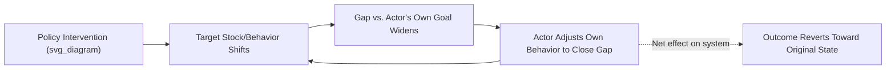

## Policy Resistance and Why Interventions Fail

### Overview

Policy resistance is the systems-thinking term for the tendency of complex systems to counteract, absorb, or neutralize deliberate interventions, producing outcomes that fall short of, or even reverse, the intervention's intended effect. It is not a claim that systems are malicious or that interventions are poorly designed in isolation — it is a structural claim: multiple actors and feedback loops, each pursuing locally rational goals, interact in ways that push the system back toward its prior behavior pattern. Jay Forrester, who coined the concept in the context of urban and corporate system dynamics, described it as the reason well-intentioned policies frequently produce results opposite to those intended.

### Core Mechanism

A system under policy resistance can be described structurally: an intervention changes one variable, but the system contains other feedback loops — often invisible to the intervener — that respond to that change in a way that offsets it.

$$\Delta \text{Outcome} = \Delta \text{Intervention} + \sum_{i} \Delta \text{CompensatingLoop}_i$$

When the compensating loops are strong and fast relative to the intervention's intended effect, $\Delta \text{Outcome} \approx 0$ or negative, even though $\Delta \text{Intervention}$ was substantial.

**Key Points**

- Policy resistance arises from the existence of multiple goals held by multiple actors within the same system, not from a single flawed decision.
- The more forcefully an intervention pushes on a stock or parameter, the more strongly compensating balancing loops tend to react — a pattern sometimes called the "boomerang effect" [Inference] in later systems-dynamics literature, though this label is descriptive shorthand rather than a formally distinct mechanism from generic balancing-loop counteraction.
- Resistance is frequently *distributed*: no single actor is resisting the policy on purpose, but the aggregate of individually rational responses recreates the original problem.

### Structural Diagram: Generic Policy Resistance Pattern

This loop is a balancing (negative feedback) loop centered not on the intervener's goal but on some other actor's independent goal. The intervener sees "resistance"; the actors involved simply see themselves restoring their own equilibrium.

### Common Structural Causes

- **Competing goals among actors**: Different stakeholders (regulators, firms, consumers, employees) each have their own goal-seeking balancing loop; a policy optimized for one loop's goal disturbs another loop, which then pushes back.
- **Delays masking early success**: Short-term improvement is visible before the compensating loop fully activates, leading to premature declarations of success followed by later reversal.
- **Substitution and compensation effects**: Actors substitute an unregulated behavior for a regulated one that achieves the same underlying goal (e.g., traffic-calming on one street pushing volume to a parallel street).
- **Escalation between competing balancing loops**: When two or more actors each try to correct the gap between their own goal and the current state by countering the other's action, the result is an arms-race–like escalation rather than convergence — this is a specific sub-pattern of policy resistance often called the "Escalation" archetype.
- **Rule-goal mismatch**: The literal rule can be complied with while the underlying goal is defeated, because the rule was written as a parameter constraint rather than a goal realignment (see Leverage Points hierarchy — rules are lower leverage than goals for this reason).

### Worked Example: Traffic Congestion Policy

A city adds highway lanes to reduce congestion (parameter-level intervention on capacity).

1. **Immediate effect**: Travel time drops; congestion appears solved.
2. **Compensating loop activates**: Lower travel time makes driving more attractive relative to transit or relocation decisions. Commuters who previously avoided the route, moved closer to work, or used transit now shift back to driving that route.
3. **New equilibrium**: Traffic volume rises until travel time returns to approximately the pre-intervention level — a well-documented empirical pattern known as **induced demand**.
4. **Outcome**: The parameter (lane capacity) changed permanently, but the target behavior (congestion) reverted, because the intervention did not touch the actual goal-seeking loop (commuters minimizing their own travel time/cost) that generated the original congestion.

**Example**

- **Low-leverage fix attempted**: Add lanes (parameter/capacity).
- **Loop that defeated it**: Commuter mode-choice balancing loop, seeking minimum personal travel time.
- **Higher-leverage alternative**: Congestion pricing that changes the cost structure actors optimize against (a rule-level change), or land-use policy that changes the goal of "minimize commute" itself by reducing commute distance (a goal-level change).

### Diagnostic Signals of Policy Resistance

- Short-term improvement followed by gradual reversion toward baseline over a period longer than the initial evaluation window.
- Stakeholder behavior described as "gaming," "workaround," or "unintended consequence" shortly after implementation.
- Multiple, independently reasonable actor behaviors that, in aggregate, reconstruct the pre-intervention system state.
- A metric improves while a related, unmeasured proxy for the same underlying goal worsens (e.g., emissions per unit falls while total units produced rises, leaving total emissions unchanged).

### Distinguishing Policy Resistance from Simple Implementation Failure

| Dimension | Simple Implementation Failure | Policy Resistance |
| --- | --- | --- |
| Cause | Poor execution, insufficient resources, wrong target | Structurally sound execution met by system-level counter-adjustment |
| Fix | Improve execution of the same policy | Requires locating and addressing the compensating loop or higher leverage point |
| Signature | Effect never appears | Effect appears, then decays or reverses |
| Actor behavior | Non-compliance or error | Rational, goal-seeking adjustment by unaffected or indirectly affected actors |

### Strategies for Overcoming Policy Resistance

- **Map the full stakeholder goal set before intervening.** Identify every actor whose balancing loop could be disturbed by the proposed change, not only the target population.
- **Intervene at the goal or rule level rather than the parameter level** where feasible, since compensating loops are typically organized around actors' actual goals — changing the goal reduces the incentive to compensate at all.
- **Use bundled or multi-point interventions** that close off the most likely compensation channels simultaneously (e.g., pairing congestion pricing with transit investment so the compensating "switch back to driving" loop has a weaker pull).
- **Extend the evaluation time horizon** past the expected activation delay of likely compensating loops before declaring success.
- **Engage affected actors in the design process** to surface hidden goals and likely workaround behaviors before rather than after rollout. [Inference] Participatory design is widely recommended in the systems-dynamics literature as a mitigation, though its effectiveness is context-dependent and not universally guaranteed.

### Relationship to Leverage Points

Policy resistance is the systemic phenomenon that explains *why* low-leverage interventions (points 1–4 in the Meadows hierarchy: parameters, buffers, stock-flow structures, delays) tend to underperform — they leave the underlying feedback loop architecture, rules, and goals untouched, so the system's other goal-seeking loops remain fully intact and available to counteract the change. Recognizing a pattern of policy resistance during a pilot (Step 8 of the leverage-point diagnostic workflow) is itself strong evidence that the intervention needs to move higher up the leverage hierarchy.

**Related Topics**

- System Archetypes: Fixes that Fail, Shifting the Burden, Escalation
- Balancing (Negative) Feedback Loop Dynamics
- Induced Demand and Compensation Effects
- Goals vs. Rules as Leverage Points
- Stakeholder Mapping for Systemic Interventions
- Delay-Induced Misattribution in Policy Evaluation
- Multi-Point and Bundled Intervention Design