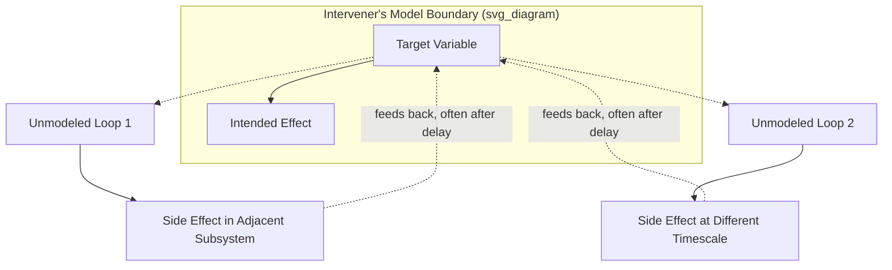

## Unintended Consequences of Systemic Interventions

### Overview

Unintended consequences are outcomes of an intervention that were neither planned nor foreseen by the intervener, arising because the system into which the intervention was introduced contains interconnections, feedback loops, and actor behaviors that extend beyond the intervener's mental model of the system. Where policy resistance describes the system pushing back *toward* the original state, unintended consequences is the broader category: the intervention succeeds at its stated goal but simultaneously produces side effects elsewhere in the system — effects that can be neutral, beneficial, or harmful, and that may appear in a different subsystem, at a different timescale, or to a different population than the one targeted.

The concept traces to sociologist Robert K. Merton's 1936 analysis of "the unanticipated consequences of purposive social action," and was later absorbed into systems dynamics as a natural consequence of intervening in any system with more interdependencies than the intervener has modeled.

### Core Distinction from Policy Resistance

**Key Points**

- Policy resistance: the *target* outcome reverts or fails to materialize because a compensating loop cancels it out.
- Unintended consequences: the target outcome *is* achieved, but one or more *other* outcomes — unforeseen and often in a different domain — are produced alongside it.
- The two frequently co-occur: an intervention can simultaneously get counteracted on its primary goal (policy resistance) while creating a fresh side effect elsewhere (unintended consequence).
- [Inference] Not every unintended consequence is negative; the same structural gap in the intervener's model that produces harmful surprises can also produce beneficial spillovers, though harmful cases dominate the literature because they are what prompts retrospective analysis.

### Structural Origin: The Boundary of the Model

Every intervention is designed against a *model* of the system — whether explicit (a simulation) or implicit (a mental model). Unintended consequences occur specifically at the boundary of that model: variables, actors, or loops that exist in the real system but were excluded from the model used to design the intervention.

The dotted lines crossing the model boundary represent real system connections the intervener did not account for. Because these paths are outside the model, their effects are — by construction — unpredicted at design time, though many become explainable in hindsight once traced.

### Typology of Unintended Consequences

Merton's original typology, still used as the standard classification:

| Type | Description | Example |
| --- | --- | --- |
| Unexpected benefit | A positive side effect not anticipated by design | A public health campaign against smoking incidentally reduces house fires from unattended cigarettes |
| Unexpected drawback (perverse result) | The intervention worsens the very problem it targeted, or worsens a related one | Antibiotic overuse in the target population accelerates resistant-strain evolution |
| Perverse incentive | The intervention creates a new incentive that undermines the goal | A "pay per cobra killed" bounty (the historical "Cobra Effect") leads to cobra farming, increasing the cobra population once the bounty ends |
| Displacement | The problem moves to a different location, population, or form rather than disappearing | Stricter policing in one neighborhood displaces crime to a neighboring, less-monitored one |

**Example**

- **Intervention**: Rent control caps to protect tenant affordability (rule-level intervention).
- **Intended effect**: Lower, stable rents for current tenants.
- **Unintended consequence(s)**: [Inference] A substantial body of economic literature associates strict rent control with reduced landlord investment in maintenance and reduced new rental construction over time, though the magnitude and consistency of this effect vary by study design, market, and control regime, and remain debated among economists.
- **Classification**: Falls under "unexpected drawback," since a policy intended to increase affordability can, through the modeled supply-side channel, contribute to housing supply constraints that put upward pressure on rents system-wide over a longer horizon.

### Why Unintended Consequences Are Structurally Unavoidable (in Degree)

- **Model incompleteness**: No practical model captures every interconnection in a complex system; the question is not whether the model is incomplete but how much and where.
- **Nonlinear interactions**: Two known effects, each benign individually, can interact multiplicatively or in a threshold-triggering way once combined — a pattern invisible from either effect studied in isolation.
- **Delay-obscured causality**: Long delays between intervention and consequence make the causal link difficult to trace, so the consequence is frequently misattributed to an unrelated cause or missed entirely.
- **Cross-scale effects**: An intervention designed for one scale (individual, firm, city) can produce effects that only appear at a different scale (population, industry, region) where the aggregation of many individually rational responses creates emergent behavior absent from any single actor's response.
- **Adaptive actor behavior**: In systems containing intelligent, adaptive agents (as opposed to purely mechanical systems), actors reinterpret and route around interventions in ways that are, by definition, not fully predictable in advance.

### Mitigation Strategies

- **Widen the model boundary before intervening**: Explicitly list adjacent subsystems, actor groups, and timescales that the primary model excludes, and assess plausible spillover paths into each.
- **Pilot with broad-spectrum monitoring, not just target-metric monitoring**: Track a basket of plausibly-related indicators outside the direct target, not only the intended outcome metric, so early-stage side effects surface before they compound.
- **Stagger and stage rollout**: Phased implementation allows detection of emergent effects at small scale before system-wide commitment, trading rollout speed for reduced downside exposure.
- **Pre-mortem analysis**: Before implementation, deliberately construct plausible narratives of how the intervention could fail or backfire, drawing especially on affected-actor incentive analysis (who benefits from defeating or routing around this change, and how).
- **Build in feedback and reversal mechanisms**: Design interventions with built-in review points and the structural ability to reverse or adjust, since irreversible interventions carry higher downside risk exactly because unintended consequences cannot be fully ruled out in advance.
- **Cross-disciplinary review**: Because unmodeled connections frequently cross domain boundaries (e.g., an economic policy with ecological effects, or a technical system change with social effects), review by practitioners outside the primary intervention discipline increases the chance of surfacing an overlooked path.

### Relationship to the Leverage Points Framework

Unintended consequences risk is not evenly distributed across leverage levels. [Inference] Higher-leverage interventions (rule, goal, and paradigm changes) tend to touch more of the system's structure simultaneously and therefore have a larger surface area for unintended consequences, even though they are also more likely to succeed at their primary goal without being defeated by policy resistance. This creates a practical tradeoff: low-leverage interventions are more contained (smaller blast radius for surprises) but more likely to fail outright via policy resistance; high-leverage interventions are more likely to work, but any side effects they produce tend to be more consequential and harder to reverse. This tradeoff is a central reason careful modeling and staged rollout matter more, not less, as an intervention moves up the leverage hierarchy.

### Diagnostic Checklist Before Implementation

- What actor groups, besides the direct target, have any interaction with the variable being changed?
- What is the longest plausible delay before a side effect could surface, and does the evaluation window cover it?
- What incentive does this change create that did not exist before, and who is best positioned to exploit it?
- Is there a historical analogue (similar intervention, similar system type) whose side effects are documented?
- What is the reversal cost if a significant unintended consequence is discovered post-rollout?

**Related Topics**

- Policy Resistance and Compensating Feedback Loops
- System Archetypes: Fixes that Fail, Tragedy of the Commons
- Perverse Incentives and Goodhart's Law
- Model Boundary Selection in System Dynamics
- Pre-Mortem and Scenario Analysis Techniques
- Staged Rollout and Reversible Intervention Design