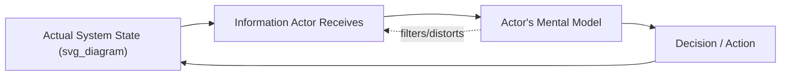
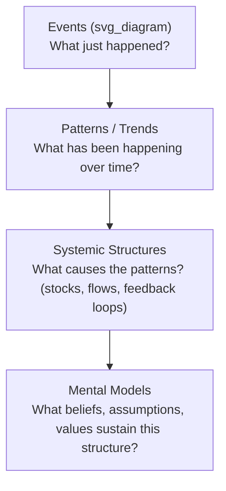

## The Role of Mental Models in Systems Behavior

### Overview

A mental model, in the systems-thinking sense, is the internal representation an actor holds of how a system works — its structure, causal relationships, and expected behavior — which that actor uses to interpret information and decide how to act within the system. Mental models matter in systems thinking because they are not passive descriptions of the system; they are an active input to system behavior. Actors do not respond to the system as it actually is, but to the system as they perceive it to be through their mental model, and their resulting decisions become part of the system's actual dynamics. This creates a structural loop between cognition and system behavior that is central to explaining why systems persist, resist change, and sometimes shift abruptly.

### Core Structural Claim

Mental models sit inside the decision-making loop of every actor in a system:

The critical feature of this loop is the dotted feedback line: the mental model does not only process incoming information, it also filters what information is attended to, how it is interpreted, and what counts as a relevant signal at all. This is why two actors observing the same system state frequently reach different, sometimes contradictory, conclusions about what is happening and what should be done.

**Key Points**

- Mental models are simplifications by necessity; no actor holds a complete representation of a complex system, so every mental model involves selective omission.
- The gap between an actor's mental model and the system's actual structure is a primary source of policy resistance and unintended consequences, because interventions are designed against the model, not against the system itself.
- Mental models are typically implicit and unexamined; actors are often unaware of the specific assumptions embedded in their own model of the system.

### Mental Models as a Leverage Point

In Meadows' leverage points hierarchy, "the mindset or paradigm out of which the system arises" (point 11) is explicitly a claim about shared mental models operating at the level of an entire system or society. Individual mental models operate at a smaller scale but function analogously: they are the paradigm-equivalent for a single actor's local decision-making. Because they filter both perception and action, correcting a systemically important mental model can be higher-leverage than adjusting the actor's incentives or the rules that govern them, since a rule change filtered through an unchanged, incompatible mental model is frequently reinterpreted, resisted, or worked around (see Policy Resistance).

### How Mental Models Generate System Behavior Patterns

- **Anchoring on structure that no longer exists**: Actors continue to act on a mental model of the system that reflects a past state, even after the actual system has changed — a common cause of delayed or maladaptive responses to structural shifts.
- **Event-level thinking vs. structural thinking**: Most actors' default mental models represent systems as sequences of discrete events ("sales dropped last quarter") rather than as underlying stocks, flows, and feedback structures ("the sales-drop event is the visible tip of a longer-running reinforcing loop involving customer churn and referral decline"). Systems dynamics education is largely aimed at shifting practitioners from event-level to structural mental models.
- **Confirmation-consistent information filtering**: Because the mental model filters incoming information, actors disproportionately notice and retain information confirming their existing model and discount disconfirming information, which slows the model's correction even when the system's actual behavior has diverged from what the model predicts.
- **Divergent mental models among interacting actors**: When multiple actors in the same system hold incompatible mental models, their individually rational decisions (each consistent with their own model) can combine into system behavior that surprises all of them — a structural source of the emergent, unintended dynamics discussed in Unintended Consequences of Systemic Interventions.

### The Iceberg Model (Levels of Understanding)

A widely used framework for locating where mental models sit relative to other explanatory levels of a system:

- **Events**: the visible, immediate occurrences (a stockout, a customer complaint, a market crash).
- **Patterns/trends**: recurring events observed over time, revealing a trajectory rather than an isolated incident.
- **Systemic structures**: the stocks, flows, feedback loops, and delays that produce the pattern.
- **Mental models**: the beliefs, assumptions, and values that led actors to design, tolerate, or reproduce that structure in the first place.

The iceberg model's practical claim is that intervening at the events or patterns level addresses symptoms, intervening at the structural level addresses the mechanism, but intervening at the mental-model level addresses *why the structure was built and is maintained that way* — making it the deepest, and typically highest-leverage, level in this particular framework.

**Example**

- **Event**: A software team repeatedly ships features late.
- **Pattern**: Deadlines have been missed in nine of the last twelve sprints.
- **Structure**: A reinforcing loop where underestimated timelines lead to rushed, low-quality code, which generates rework debt, which further slows future estimates.
- **Mental model**: Team leadership believes "aggressive deadlines are what motivate high performance," an assumption that causes the same optimistic-estimation structure to be reconstructed sprint after sprint even after repeated failure — meaning any fix applied only at the structural level (e.g., adding a QA buffer) is likely to be undermined again unless this underlying belief is also surfaced and revised.

### Methods for Surfacing and Testing Mental Models

- **Causal loop diagramming as an elicitation tool**: Asking actors to draw their own causal loop diagram of a system externalizes assumptions that are otherwise implicit, making disagreements between actors' models explicit and discussable.
- **The "left-hand column" technique (Argyris)**: Actors write down what they actually thought and felt during a conversation or decision alongside what they actually said or did, surfacing the gap between the mental model driving their real reasoning and the model they present publicly.
- **Model-based simulation comparison**: Running a formal system dynamics model against an actor's stated expectations for how the system will behave; divergence between simulated and expected behavior pinpoints exactly where the actor's mental model departs from the system's actual structure.
- **Scenario and counterfactual questioning**: Asking "what would you expect to happen if X changed?" reveals the causal assumptions embedded in an actor's model, since the answer necessarily draws on their internal representation of the system's structure.

**Key Points**

- [Inference] Surfacing a mental model does not automatically correct it; the literature on organizational learning generally treats explicit articulation as a necessary but not sufficient step, since actors can articulate an assumption clearly and still fail to update it in the face of disconfirming evidence (a pattern related to single-loop vs. double-loop learning, see below).
- Techniques that make mental models explicit and comparable across actors are foundational to group-level systems interventions, since divergent unexamined models among stakeholders are a common cause of stalled or contradictory intervention efforts.

### Single-Loop vs. Double-Loop Learning (Argyris & Schön)

- **Single-loop learning**: An actor detects an error and corrects the *action* to better achieve the existing goal, without questioning the underlying mental model or governing assumptions that produced the error in the first place.
- **Double-loop learning**: An actor detects an error and questions the underlying mental model, goals, or values that led to the action, potentially revising the model itself rather than just the action.

This distinction maps directly onto the leverage points hierarchy: single-loop learning corresponds to adjustments at the parameter/rule level, while double-loop learning corresponds to intervention at the mental-model/paradigm level, and is correspondingly harder to achieve because it requires an actor to treat their own model as provisional rather than as a fixed description of reality.

### Practical Implications for Systemic Intervention Design

- Any intervention should include an explicit assessment of the mental models held by the actors whose behavior the intervention depends on, not only the formal rules and incentives governing them.
- Interventions that conflict with deeply held mental models are more likely to be reinterpreted, resisted, or reversed (linking directly to Policy Resistance), even when the formal rule or parameter change is implemented correctly.
- Changing a mental model is typically slower and requires more sustained engagement (dialogue, shared modeling exercises, exposure to disconfirming evidence over time) than changing a rule or parameter, consistent with mental models' position near the high-leverage, high-delay end of the leverage points hierarchy.
- [Unverified] The specific conditions under which a mental model reliably updates in response to disconfirming evidence, as opposed to being rationalized away, remain an active area of study in cognitive and organizational psychology rather than a settled, generalizable rule.

**Related Topics**

- The Iceberg Model and Levels of Systemic Understanding
- Single-Loop vs. Double-Loop Learning (Argyris & Schön)
- Causal Loop Diagramming as a Model-Elicitation Tool
- Paradigms as the Highest Leverage Point (Meadows)
- Policy Resistance Rooted in Unexamined Mental Models
- Organizational Learning and Shared Mental Model Alignment
- Confirmation Bias and Information Filtering in Complex Systems