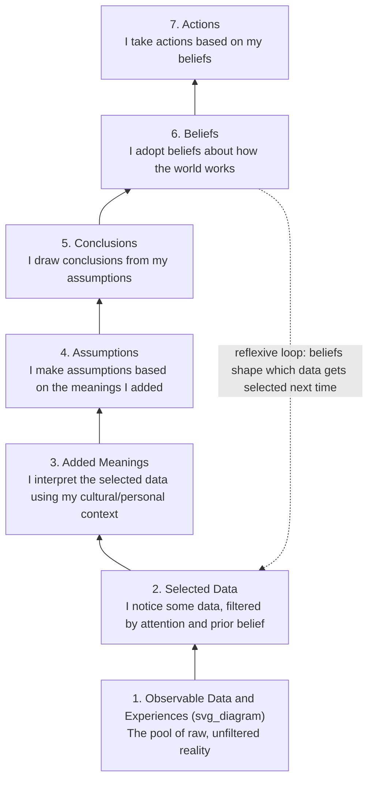

## Ladder of Inference

### Overview

The Ladder of Inference is a cognitive model, developed by organizational psychologist Chris Argyris and popularized by Peter Senge in *The Fifth Discipline*, that describes the sequence of mental steps an individual moves through — usually in milliseconds and mostly outside conscious awareness — between observing raw data and taking action. It is used in systems thinking as a diagnostic tool for locating exactly where an actor's reasoning departs from observable reality, which is essential for understanding how divergent mental models (see The Role of Mental Models in Systems Behavior) form and persist even when actors are looking at the same underlying system.

### The Seven Rungs

**Key Points**

- The ladder is climbed almost instantly and largely unconsciously; the model's value comes from deliberately slowing this process down to inspect it.
- The reflexive loop from rung 6 back to rung 2 is structurally important: existing beliefs shape what data an actor selects for attention in the future, creating a self-reinforcing cycle in which a belief, once formed, systematically filters incoming evidence to appear increasingly confirmed — a cognitive analogue of a reinforcing feedback loop.
- Only rung 1 (observable data) is, in principle, shared and verifiable by multiple observers; every rung above it is progressively more shaped by the individual's interpretive filters.

### Detailed Description of Each Rung

1. **Observable data and experiences**: The complete set of raw, unfiltered facts and events available to be perceived — analogous to the full information environment of a system before any actor's attention has acted on it.
2. **Selected data**: The subset of available data an actor actually notices. Selection is unavoidable (no actor can attend to all available data) and is shaped by prior experience, culture, role, and existing beliefs.
3. **Added meanings**: The actor interprets the selected data, assigning significance to it. This step draws on personal and cultural context and is where the same raw data point can be assigned different meanings by different observers.
4. **Assumptions**: Based on the meaning assigned, the actor makes assumptions — inferential leaps that go beyond what the data itself establishes.
5. **Conclusions**: Assumptions are combined and extended into conclusions about the situation, person, or system in question.
6. **Beliefs**: Repeated conclusions solidify into more general, durable beliefs about how the world or the system in question works.
7. **Actions**: The actor acts based on these beliefs, and the action itself becomes new data in the shared environment, which other actors (and the same actor later) will select from, interpret, and climb their own ladder on.

### Worked Example

**Example**

- **Rung 1 (data)**: A colleague does not respond to an email within 24 hours.
- **Rung 2 (selection)**: I notice the lack of reply; I do not equally notice that this colleague has replied to five other emails from other people within that same window.
- **Rung 3 (meaning)**: I interpret the non-reply as significant rather than incidental.
- **Rung 4 (assumption)**: I assume the colleague is deliberately avoiding me.
- **Rung 5 (conclusion)**: I conclude the colleague is upset with me about something.
- **Rung 6 (belief)**: I form a general belief that this colleague is unreliable or passive-aggressive in their communication.
- **Rung 7 (action)**: I stop looping them into decisions proactively, escalate issues around them instead of through them, and become more guarded in future interactions.
- **Reflexive loop**: My belief that they are "unreliable" now causes me to notice future slow replies more readily (selection bias reinforcing rung 6), while a fast reply from them is more likely to be dismissed as an exception rather than updating the belief.

At no point in this sequence did the colleague's actual reason for the delay (which might be entirely unrelated — a meeting, a different priority, an email filter issue) enter the analysis; the entire chain from rung 2 onward was constructed by the observer's own inferential process.

### Why the Ladder Matters for Systems Thinking

- **Explains divergent mental models among stakeholders**: Because rungs 2 through 6 are individually shaped, two actors observing the same system-level data (e.g., a declining metric) can climb to entirely different, mutually incompatible beliefs about its cause — a direct mechanism generating the "divergent mental models" problem described in the parent topic.
- **Explains resistance to disconfirming evidence**: The reflexive loop (belief shaping future data selection) is a cognitive-level reinforcing loop that parallels the system-level reinforcing loops discussed elsewhere in this course; it is a primary reason beliefs about a system, once formed, are difficult to revise through new data alone.
- **Provides a diagnostic vocabulary for group dialogue**: When two people disagree about a system's behavior, tracing each person's reasoning back down their own ladder to the shared rung-1 data frequently reveals that the underlying disagreement is not about facts but about the meanings, assumptions, or beliefs layered on top of shared facts — reframing an intractable-seeming disagreement into a tractable one.

### Practical Techniques for Using the Ladder

- **Climb-down inquiry**: When encountering a stated belief or conclusion, ask "what data led you to that?" and continue asking down through each rung until reaching the shared, observable data both parties can verify.
- **Left-hand column exercise (Argyris)**: Participants write down what they were actually thinking (their ladder climb) in a column beside what they actually said aloud, exposing the private inferential leaps that never entered the conversation but drove the response.
- **"Ladder-checking" in meetings**: Before acting on a conclusion in a group setting, explicitly separate the observable data from the interpretation layered on top of it, and invite others to check whether they select and interpret the same data the same way.
- **Advocacy paired with inquiry**: When presenting a conclusion, also state the data and reasoning that produced it (advocacy), and explicitly invite others to test that reasoning (inquiry) — this combination is a core practice in Argyris and Senge's broader organizational learning framework, of which the ladder is one component.

### Relationship to Other Course Concepts

- The ladder operates at the level of an individual cognitive event, while mental models (previous item) describe the more durable, structural product accumulated from many climbs of the ladder over time — the ladder is the process, the mental model is the resulting structure.
- The rung-6-to-rung-2 reflexive loop is a cognitive-scale instance of the same reinforcing-feedback-loop mechanism discussed at the system-structural scale, meaning the same diagnostic instinct ("what loop is self-reinforcing here?") transfers directly from analyzing systems to analyzing an individual's or group's reasoning process.
- [Inference] Because the ladder model describes an internal cognitive process rather than a directly observable system, its rungs are best treated as a useful descriptive and diagnostic framework for structuring reflection and dialogue, rather than as an empirically measured sequence of discrete neural or cognitive stages.

**Related Topics**

- The Role of Mental Models in Systems Behavior
- Advocacy and Inquiry in Organizational Dialogue (Argyris)
- Confirmation Bias and Reflexive Feedback in Belief Formation
- The Iceberg Model and Levels of Systemic Understanding
- Double-Loop Learning and Assumption Testing
- Facilitation Techniques for Surfacing Divergent Stakeholder Models