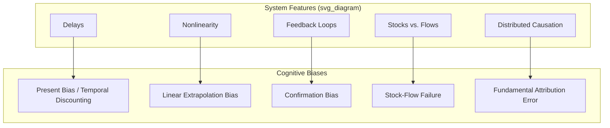

## Cognitive Biases That Distort Systems Understanding

### Overview

Cognitive biases are systematic, predictable deviations from normative or rational judgment that arise from the heuristics human cognition uses to process information efficiently. In systems thinking, these biases are not incidental errors — they interact with specific structural features of complex systems (delays, nonlinearity, feedback, emergence) in ways that make certain classes of systemic misjudgment highly recurrent and predictable across domains and populations. This item surveys the biases most consequential for understanding and intervening in systems, organized by which structural feature of systems they most directly distort.

### Structural Map of Bias-to-System-Feature Interaction

### Bias 1: Present Bias and Delay Discounting (Interacts with System Delays)

Actors systematically undervalue future consequences relative to present ones, and this discounting is disproportionately steep for effects separated from their cause by a long delay.

- **Effect on systems understanding**: When a system's dominant feedback loop involves a multi-year delay (e.g., environmental degradation, pension underfunding, infrastructure decay), present bias causes actors to underweight the eventual consequence relative to immediate costs of acting now, systematically favoring low-leverage, short-delay interventions over higher-leverage, longer-delay ones.
- **Systems-thinking implication**: This bias is a cognitive-level explanation for why parameter-level "quick fixes" (Meadows' lower leverage points) are chronically over-selected relative to structural or paradigm-level interventions, independent of any political-feasibility argument (see Critiques and Extensions of Leverage Points Theory).

### Bias 2: Linear Extrapolation Bias (Interacts with Nonlinearity)

Humans are demonstrably poor at intuitively projecting exponential, logistic, or other nonlinear growth patterns, tending to underestimate future values of exponentially growing quantities and to expect trends to continue linearly past inflection points.

$$N(t) = N_0 e^{rt}$$

- **Effect on systems understanding**: In systems governed by reinforcing loops (compounding growth, contagion, viral adoption), actors systematically misjudge how quickly a stock will grow, typically underestimating the near-term trajectory before an inflection point and overestimating continued growth after the system enters a saturation phase.
- **Example**: [Inference] Widely cited studies on exponential-growth bias (e.g., in the context of pandemic case counts) generally find that participants underestimate future totals when shown early-stage exponential data, consistent with this bias, though the specific magnitude of underestimation varies across study populations and framings.

### Bias 3: Confirmation Bias (Interacts with Feedback Loops in Belief Formation)

Actors preferentially seek, interpret, and recall information that confirms their existing beliefs about a system, while discounting disconfirming information — the same mechanism described as the rung-6-to-rung-2 reflexive loop in the Ladder of Inference.

- **Effect on systems understanding**: Once an actor forms a belief about which variable is driving a system's behavior, subsequent evidence is filtered through that belief, making misdiagnosed causal structures self-reinforcing and unusually resistant to correction through additional data alone.
- **Systems-thinking implication**: This is a primary mechanism by which divergent mental models among stakeholders persist even when all parties have access to the same underlying data (see The Role of Mental Models in Systems Behavior).

### Bias 4: Stock-Flow Failure (Interacts with Stock/Flow Structure)

A well-documented finding in the systems dynamics literature is that people, including those with quantitative training, frequently fail to correctly infer a stock's behavior from information about its inflows and outflows — for example, believing a stock is decreasing because its net flow rate is decreasing, when in fact a still-positive net flow rate means the stock continues to increase.

$$\frac{dS}{dt} = \text{Inflow}(t) - \text{Outflow}(t)$$

A stock $S$ increases as long as $\text{Inflow}(t) > \text{Outflow}(t)$, even if the *rate* of increase is itself declining — a distinction bias 4 shows people routinely miss.

- **Example**: Believing that "the rate of new infections is declining" (a flow-rate observation) means the total number of currently infected people (the stock) is also declining, when the stock continues rising as long as new infections exceed recoveries, just at a decelerating pace.
- **Systems-thinking implication**: [Inference] This bias is often cited as a foundational justification for teaching explicit stock-and-flow diagramming as a corrective technique — externalizing the calculation onto a diagram or simulation compensates for a documented, replicated gap in intuitive stock-flow reasoning, though the degree of improvement from training varies across studies and populations.

### Bias 5: Fundamental Attribution Error (Interacts with Distributed/Structural Causation)

The tendency to attribute another person's or group's behavior to their disposition or character rather than to the situational or structural forces acting on them, while attributing one's own behavior to situational factors.

- **Effect on systems understanding**: When a system produces an undesirable outcome (e.g., high employee turnover, chronic congestion, recurring supply shortages), this bias causes actors to attribute the outcome to the dispositions of the people involved ("employees today lack loyalty," "drivers are inconsiderate") rather than to the structural incentives and feedback loops actually producing the aggregate behavior — precisely the shift systems thinking is designed to correct (see the iceberg model's structural level in The Role of Mental Models in Systems Behavior).
- **Systems-thinking implication**: This bias is a major reason interventions default toward changing individuals (training, exhortation, blame) rather than changing structure (rules, incentives, information flows), even when structural intervention would carry substantially higher leverage.

### Additional Consequential Biases

- **Availability heuristic**: Judging the likelihood or importance of a system event based on how easily examples come to mind, which biases attention toward recent, vivid, or media-covered events over statistically more significant but less salient structural trends.
- **Anchoring**: Over-relying on an initial reference point (e.g., a historical baseline value) when estimating a system's current or future state, causing systematic under- or over-adjustment when the system has genuinely shifted.
- **Normalcy bias**: Underestimating the likelihood or impact of a disruption because the system has not previously exhibited that behavior, relevant to underestimating tipping points and regime shifts in resilience-oriented systems analysis.
- **Base rate neglect**: Ignoring the underlying statistical prevalence of an event or state in favor of specific, salient case information, which distorts estimates of how common a given system failure mode actually is.
- **Illusion of control**: Overestimating the degree to which an actor's actions determine a system's outcome, relevant to overestimating the leverage of a favored intervention while underestimating the role of feedback loops and other actors.

### Debiasing Techniques Specific to Systems Contexts

- **Explicit stock-and-flow and causal loop diagramming**: Externalizes structural reasoning onto a shared visual artifact, reducing reliance on intuitive (and bias-prone) mental calculation, directly targeting bias 4.
- **Reference class forecasting**: Deliberately grounding predictions in a documented base rate from comparable historical cases rather than case-specific intuition, targeting base rate neglect and the illusion of control.
- **Pre-mortem and red-team exercises**: Structured exercises that require generating disconfirming scenarios before committing to an intervention, directly counteracting confirmation bias by making the search for disconfirming evidence a required step rather than a voluntary one.
- **Simulation and gaming**: Interactive system dynamics simulations (e.g., the "Beer Game" in supply chain education) have been used specifically to let participants experience nonlinear and delay-driven system behavior directly, since experiential correction has shown more durable effects than verbal explanation alone in some documented educational contexts. [Inference] The degree of transfer from simulation-based learning to real-world decision-making is generally treated in the literature as positive but incomplete, rather than as a fully resolved debiasing solution.
- **Structured attribution review**: Explicitly asking "what structural/incentive factors could produce this behavior regardless of who is involved?" before attributing an outcome to individual disposition, directly targeting fundamental attribution error.

### Relationship to Other Course Concepts

- Cognitive biases are the mechanism-level explanation for many phenomena described more abstractly elsewhere in this chapter and the previous one: present bias helps explain the under-selection of high-leverage interventions (Identifying High-Leverage Interventions in Practice), confirmation bias explains persistence of the mental-model gaps that drive policy resistance and unintended consequences, and fundamental attribution error explains the recurring tendency to misdiagnose structural problems as people problems.
- [Inference] Because these biases are well-documented at the individual cognitive level but operate within group and organizational settings in systems-thinking practice, their aggregate effect on group-level system diagnosis is plausible by extension but is less directly and less uniformly measured than the individual-level bias literature itself.

**Related Topics**

- The Ladder of Inference and Reflexive Belief Loops
- The Role of Mental Models in Systems Behavior
- Stock-and-Flow Diagramming as a Debiasing Technique
- Exponential Growth Bias and Reinforcing Loop Misjudgment
- Fundamental Attribution Error and Structural vs. Dispositional Diagnosis
- Simulation-Based Systems Education (e.g., the Beer Distribution Game)
- Reference Class Forecasting and Base Rate Neglect