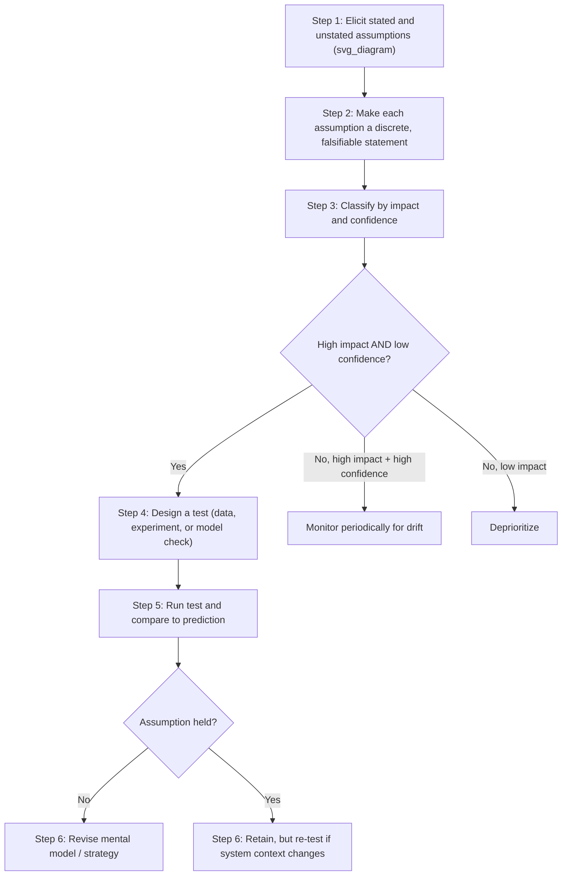

## Assumption Surfacing and Testing

### Overview

Assumption surfacing and testing is the structured practice of making an actor's or group's implicit beliefs about a system's structure and behavior explicit, and then subjecting those beliefs to deliberate scrutiny against evidence, alternative interpretations, or formal models. It is the operational, action-oriented counterpart to the diagnostic frameworks covered earlier in this chapter: the Ladder of Inference identifies *where* assumptions enter reasoning (rung 4), and the discussion of mental models explains *why* they persist; this item covers the concrete techniques for extracting those assumptions from an actor's head and testing whether they hold.

### Why Assumptions Require Deliberate Surfacing

Assumptions embedded in a mental model are, by default, invisible to the person holding them — not because they are being concealed, but because they typically operate below the level of conscious articulation, functioning as background premises rather than as claims the actor consciously entertains and could easily state if asked directly. Two structural properties of assumptions make this default invisibility consequential:

- **They compound**: Rung 4 (assumptions) sits below rung 5 (conclusions) and rung 6 (beliefs) on the Ladder of Inference, so an unexamined assumption propagates forward into every conclusion and belief built on top of it, and eventually into every action that belief informs.
- **They resist self-correction**: The reflexive loop in the Ladder of Inference (existing beliefs shaping future data selection) means an unsurfaced, incorrect assumption tends to appear increasingly confirmed over time rather than increasingly challenged, absent a deliberate intervention to test it.

**Key Points**

- Surfacing is a necessary but not sufficient step: making an assumption explicit does not itself prove or disprove it, it only makes it available for testing.
- Assumptions are not inherently wrong; the goal of surfacing and testing is not to eliminate assumptions (impossible, given the necessity of simplification in any mental model) but to distinguish load-bearing assumptions that are actually true from load-bearing assumptions that are false or outdated.
- The highest-priority assumptions to surface are those that are both **high-impact** (much of the current strategy or model depends on them) and **low-confidence** (the actor has not actually verified them against evidence).

### The Surfacing-Testing Workflow

**Step 1 — Elicitation.** Extract assumptions from actors using structured prompts rather than open-ended questions, since assumptions are, by definition, not spontaneously offered.

**Step 2 — Make each assumption falsifiable.** Rewrite vague premises as specific, checkable claims. "Customers value speed" is not testable as stated; "at least 60% of surveyed customers rank delivery speed above price when choosing a vendor" is.

**Step 3 — Classify by impact and confidence.** Impact/confidence mapping (see matrix below) prioritizes limited testing resources toward the assumptions most likely to be both wrong and consequential if wrong.

**Step 4 — Design a test.** The test method depends on the assumption type (see techniques below): some are testable against existing data, some require a small experiment, some require formal modeling, and some can only be tested through direct stakeholder dialogue.

**Step 5 — Run and compare.** Execute the test and compare the actual result to what the assumption predicted, rather than to what the actor hoped for — a distinction that matters because motivated reasoning can otherwise reinterpret an ambiguous result as confirmatory.

**Step 6 — Revise or retain.** An assumption that fails its test should propagate a revision back through every conclusion and decision built on it; an assumption that passes should still be flagged for re-testing if the surrounding system context changes materially.

### Impact/Confidence Prioritization Matrix

|  | Low Confidence | High Confidence |
| --- | --- | --- |
| **High Impact** | Test immediately — highest risk to current strategy | Monitor for drift; re-test if context changes |
| **Low Impact** | Deprioritize — low payoff for testing effort | No action needed |

### Elicitation Techniques

- **Assumption-mapping workshops**: A facilitated group session in which stakeholders individually list the assumptions underlying a shared plan or model, followed by group discussion of where individual lists diverge — divergence itself is diagnostic of an unexamined, contested assumption.
- **"What would have to be true?" framing**: Working backward from a stated conclusion or plan to enumerate the full set of conditions that would need to hold for it to succeed, which surfaces assumptions the original reasoning treated as given rather than stated.
- **Pre-mortem analysis**: Asking participants to imagine the intervention has already failed and to generate plausible reasons why, which surfaces risk-relevant assumptions that positive planning discussions tend to leave unstated (directly related to the mitigation strategies discussed in Unintended Consequences of Systemic Interventions).
- **Devil's advocacy / structured dissent**: Formally assigning a participant or subgroup the role of challenging the majority view, which counteracts the natural social tendency to leave shared assumptions unchallenged in group settings.
- **Left-hand column technique (Argyris)**: As introduced with the Ladder of Inference, this technique surfaces the private reasoning (including unstated assumptions) behind a stated position by having the actor record what they were actually thinking alongside what they said aloud.

### Testing Techniques by Assumption Type

- **Data-testable assumptions** (claims about current or historical fact): Test against existing datasets, records, or direct measurement. Example: "Most support tickets come from enterprise customers" is checkable against ticket metadata without new data collection.
- **Behavioral/causal assumptions** (claims about how actors will respond to a change): Test via small-scale pilot, A/B test, or natural experiment before full-scale rollout — directly connecting to the pilot-and-instrument step of the leverage-point diagnostic workflow (Identifying High-Leverage Interventions in Practice).
- **Structural assumptions** (claims about how the system's feedback loops or stock-flow structure behave): Test via formal system dynamics simulation, comparing the actor's predicted system trajectory against the simulated trajectory under the same initial conditions.
- **Values/goal assumptions** (claims about what an actor or organization actually wants, as opposed to what it states it wants): Test by comparing stated goals against revealed goals inferable from actual incentive structures and resource allocation (see the stated-vs-revealed goal distinction discussed under leverage points).

**Example**

- **Stated assumption**: "Reducing the approval workflow from five steps to two will speed up project delivery."
- **Made falsifiable**: "Average time-to-approval will decrease by at least 30% within the first two full sprints after the workflow change, without a corresponding increase in post-approval revision requests."
- **Impact/confidence classification**: High impact (this is the core justification for the change), low confidence (untested against this specific team and this specific workflow history).
- **Test design**: Pilot the two-step workflow with one team for one quarter, instrumenting both approval time and downstream revision-request rate.
- **Possible outcome**: Approval time drops as predicted, but revision requests rise sharply — revealing an unstated companion assumption ("the removed review steps were not catching meaningful errors") that turned out to be false, meaning the original assumption was only partially correct and the mental model needs revision rather than wholesale rejection.

### Common Failure Modes in Assumption Testing

- **Testing the easy assumption instead of the load-bearing one**: Teams often gravitate toward testing whichever assumption is most convenient to check rather than the one the plan's success most depends on.
- **Confirmation-seeking test design**: Designing a test in a way that is more likely to confirm than disconfirm the assumption (e.g., piloting with an unusually favorable team or customer segment), which defeats the purpose of testing while providing false reassurance.
- **Stopping at surfacing without testing**: Groups sometimes treat the act of listing assumptions in a workshop as the完成 (completion) of the exercise, without following through to Steps 4–6, leaving the surfaced assumptions just as unverified as before, only now documented.
- **Failure to re-test after context change**: An assumption validated under one set of system conditions is treated as permanently confirmed, even after the surrounding system has shifted enough that the original test no longer applies.

### Relationship to Other Course Concepts

- Assumption surfacing operationalizes rung 4 of the Ladder of Inference, converting an otherwise invisible cognitive step into an explicit, shared, testable artifact.
- It is a direct prerequisite for reliable leverage-point identification (Identifying High-Leverage Interventions in Practice), since a leverage-point diagnosis built on an untested assumption about system structure carries the same risk of failure as any other intervention built on a flawed mental model.
- It provides the practical mechanism for achieving double-loop learning (introduced under The Role of Mental Models in Systems Behavior): double-loop learning requires questioning governing assumptions, and assumption surfacing and testing is the concrete technique by which that questioning is operationalized rather than left as an aspirational stance.

**Related Topics**

- The Ladder of Inference and the Origin of Assumptions
- Double-Loop Learning and Governing Variable Revision
- Pre-Mortem Analysis and Risk Surfacing
- Pilot Design and Structural Hypothesis Testing
- Stated vs. Revealed Goals in Organizational Systems
- Facilitation Techniques for Group Mental Model Alignment