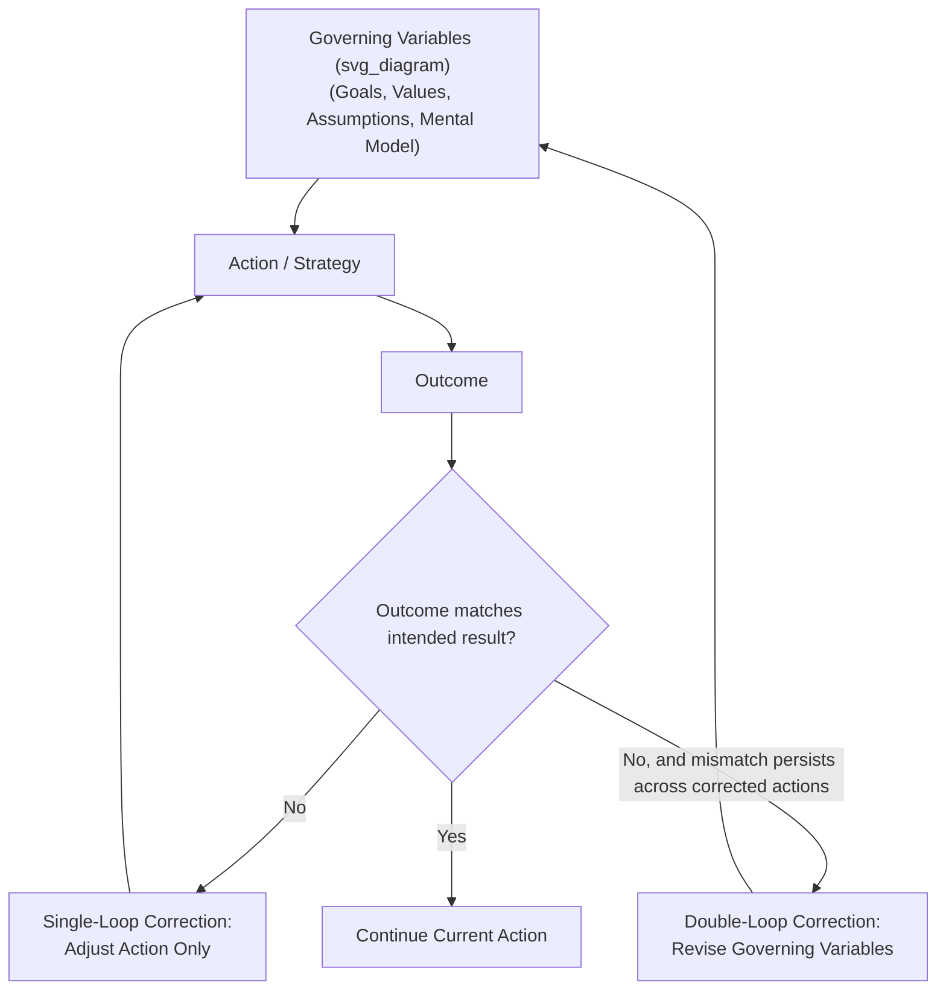

## Single-Loop versus Double-Loop Learning

### Overview

Single-loop and double-loop learning is a distinction developed by Chris Argyris and Donald Schön describing two structurally different ways an actor or organization responds to an error, a mismatch between expected and actual outcomes, or feedback that a goal is not being met. The distinction has been referenced repeatedly across the preceding items in this chapter (the Ladder of Inference, mental models, assumption testing) as the conceptual anchor explaining why some corrective responses fix a symptom while others revise the underlying structure producing it. This item treats the distinction directly as its own topic, with its formal structure, detection criteria, and organizational implications.

### Core Definitions

- **Single-loop learning**: When an actor detects a mismatch between an intended and an actual outcome, they correct the *action* to better achieve the existing goal, without examining or revising the governing variables (goals, values, assumptions, mental model) that produced the original action.
- **Double-loop learning**: When an actor detects the same mismatch, they trace the error back to the governing variables themselves, and revise those variables — potentially changing the goal, the underlying strategy, or the mental model — before selecting a new action.

**Key Points**

- The word "loop" refers to a feedback loop connecting action, outcome, and correction; "single" vs. "double" refers to how many links in that causal chain the correction actually revises.
- Single-loop learning is not inherently deficient — it is the appropriate and efficient response when the governing variables are sound and only the action needs adjustment (e.g., a thermostat correcting temperature without questioning the target setpoint).
- Double-loop learning is more costly (in time, cognitive effort, and organizational disruption) but is required whenever the governing variables themselves — not just the action — are the actual source of the recurring mismatch.

### Structural Diagram

The critical structural feature is that the single-loop correction path (returning to "Action") never touches the governing-variables box, while the double-loop path explicitly routes the correction back through governing variables before a new action is even selected.

### The Thermostat Analogy (Argyris's Original Illustration)

Argyris illustrated the distinction using a thermostat:

- **Single-loop behavior**: A thermostat set to 68°F detects the room is at 65°F and turns on the heat. It corrects the deviation from the setpoint without questioning whether 68°F is the correct setpoint.
- **Double-loop behavior**: A thermostat that could ask "why is 68°F the target? Would a different setpoint better serve comfort and energy efficiency given current conditions?" and revise the setpoint itself, would be engaging in an analogue of double-loop learning — the correction reaches back to the governing variable (the setpoint), not just the current action (heating or not).

Ordinary thermostats are, by design, single-loop devices; the analogy is meant to show that single-loop correction is often exactly the right response for a well-designed, stable goal, and that the interesting organizational question is recognizing *when* the goal itself, not just the action, needs revisiting.

### Detection Criteria: How to Tell Which Loop Is Occurring

| Signal | Single-Loop | Double-Loop |
| --- | --- | --- |
| Response to repeated failure of the same type | Same governing goal/strategy retained; tactics adjusted each time | Underlying goal, strategy, or assumption is questioned and potentially replaced |
| Question asked after an error | "How do we do this better/faster/more accurately?" | "Should we be doing this at all, or doing it this way?" |
| Scope of what changes | Action, procedure, parameter | Goal, value, governing assumption, or mental model |
| Relationship to Ladder of Inference | Correction occurs at rungs 5–7 (conclusion/belief/action) without revisiting rungs 3–4 | Correction reaches back to rungs 3–4 (meanings, assumptions) or earlier |
| Relationship to leverage points | Corresponds to parameter/rule-level leverage (lower in Meadows' hierarchy) | Corresponds to goal/paradigm-level leverage (higher in Meadows' hierarchy) |

**Key Points**

- A practical diagnostic: if the *same type* of error keeps recurring despite repeated single-loop corrections, this is a signal that the governing variables — not the action — are the actual source of the mismatch, and that double-loop learning is required rather than another round of single-loop adjustment.
- Double-loop learning does not always mean discarding the governing variable; it can also mean explicitly re-confirming it after genuine scrutiny, which is different from never having examined it at all.

### Worked Example

**Example**

- **Situation**: A customer support team consistently misses its resolution-time target.
- **Single-loop attempt 1**: Add more staff to handle volume. Outcome: resolution time briefly improves, then degrades again as ticket volume grows to fill the added capacity.
- **Single-loop attempt 2**: Introduce a stricter internal SLA with escalation penalties. Outcome: agents begin closing tickets prematurely to meet the clock, and reopened-ticket rate rises — resolution time on the metric improves, but the underlying customer problem is not actually resolved (a policy-resistance-like symptom, see Policy Resistance and Why Interventions Fail).
- **Double-loop question**: Instead of asking "how do we resolve tickets faster," the team asks "why do we have this volume and complexity of tickets in the first place, and is 'resolution time' the right governing metric for what we're actually trying to achieve (customer success), or is it a proxy that's being gamed?"
- **Double-loop revision**: The team revises its governing variable from "minimize resolution time" to "minimize recurring, non-resolved customer issues," which leads to a different strategy entirely — investing in root-cause defect fixes upstream in the product, rather than any further tuning of the support-ticket-handling action itself.
- **Outcome**: This example illustrates why repeated single-loop attempts at the same governing goal can produce a sequence of superficially different actions that all fail for a structurally related reason — the goal itself, not the tactic, was misaligned with the actual desired outcome.

### Why Double-Loop Learning Is Harder to Achieve

- **Governing variables are often implicit**: As established under mental models and the Ladder of Inference, the assumptions and goals driving a strategy are frequently unexamined, so double-loop learning first requires the surfacing step covered in Assumption Surfacing and Testing before revision is even possible.
- **Defensive routines (Argyris)**: Organizations and individuals develop self-protective patterns of communication ("defensive routines") that avoid surfacing threatening or embarrassing assumptions, because questioning a governing variable often implies that a past decision, made in good faith, was wrong — a socially and psychologically costly admission that single-loop correction avoids.
- **Measurement incentives reward single-loop behavior**: Performance metrics are often built around the current governing variable (e.g., resolution time), which means organizational incentives can actively reward continued single-loop optimization of the metric even when that metric has become disconnected from the actual underlying goal — a form of Goodhart's Law interacting with the single/double-loop distinction.
- **Time and disruption cost**: Revising governing variables typically requires broader stakeholder buy-in, more time, and more organizational disruption than adjusting a single action, making double-loop learning less attractive under time pressure even when it is structurally the correct response.

### Practical Techniques for Enabling Double-Loop Learning

- **After-action review with explicit governing-variable questions**: Standard "what happened / what should we do differently" retrospectives default to single-loop framing; adding an explicit prompt ("what assumption or goal, if wrong, would explain this recurring pattern?") pushes the review toward double-loop territory.
- **Tracking repeated-failure patterns across single-loop corrections**: Explicitly logging each single-loop fix attempted for a recurring problem; if the list of attempted fixes grows without resolving the underlying pattern, this list itself is evidence that a governing-variable-level (double-loop) intervention is needed.
- **Reducing defensive-routine incentives**: Structuring review processes to separate "what governing assumption turned out to be wrong" from "who is at fault for holding it," reducing the psychological cost of surfacing a mistaken governing variable and making double-loop learning less threatening to raise.
- **Pairing with assumption surfacing and testing**: Since double-loop learning requires identifying which governing variable to revise, the elicitation and testing techniques covered in the previous item are the direct operational mechanism for making double-loop learning something a team can deliberately practice rather than something that happens only by accident or crisis.

### Relationship to Leverage Points and Systemic Intervention

The single/double-loop distinction is the individual- and organizational-learning analogue of the leverage points hierarchy covered in the previous chapter: single-loop learning operates at the level of actions and parameters (low leverage), while double-loop learning operates at the level of goals and governing assumptions (high leverage). Recognizing when a system exhibits recurring policy resistance despite repeated single-loop-style interventions is a strong practical signal, at the organizational-learning level, that a double-loop (goal- or paradigm-level) intervention is required rather than another iteration of parameter-level adjustment.

**Related Topics**

- The Ladder of Inference and Where Corrections Re-Enter Reasoning
- Assumption Surfacing and Testing as an Enabler of Double-Loop Learning
- Argyris's Defensive Routines and Organizational Learning Barriers
- Policy Resistance as a Signal for Double-Loop Intervention
- Goodhart's Law and Metric-Governing Variable Misalignment
- Leverage Points: Rules and Goals vs. Parameters