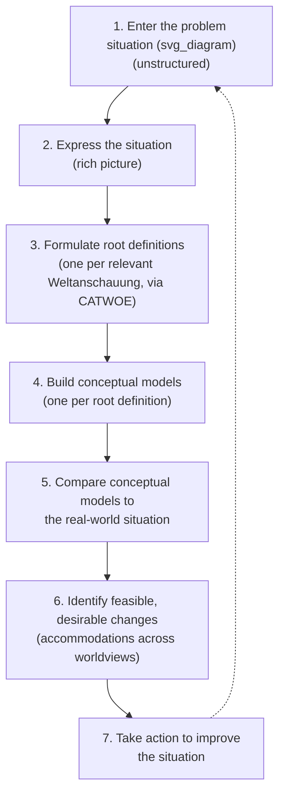

## Worldview and Weltanschauung in Systems Inquiry

### Overview

Weltanschauung — German for "worldview," adopted directly into the systems-thinking lexicon — refers to the comprehensive set of values, beliefs, and assumptions about the nature of reality and what constitutes meaningful knowledge that an observer brings to any act of systems inquiry, determining what that observer considers to be a "system," what counts as a relevant boundary, and what an intervention is even meant to achieve. The concept is most closely associated with Peter Checkland's Soft Systems Methodology (SSM), where it functions as a foundational, load-bearing term distinct from — and deeper than — the mental models and mindsets covered elsewhere in this chapter.

### Distinguishing Weltanschauung from Mental Models and Paradigms

**Key Points**

- A **mental model** (covered earlier in this chapter) is an actor's representation of how a *specific* system works — its structure, causal relationships, and expected behavior.
- A **Weltanschauung** is broader and more foundational: it is the framework of values and assumptions about reality itself that determines which systems an actor perceives as existing at all, which boundaries are considered natural or arbitrary, and which outcomes are considered improvements versus deteriorations.
- Meadows' "paradigm" (leverage point 11) and Checkland's "Weltanschauung" are closely related concepts from different traditions — [Inference] both describe deep, largely tacit belief structures that generate a system's visible goals and rules, though Checkland's use of the term is specifically embedded in a formal methodology (SSM) for handling multiple, conflicting Weltanschauungen in a single inquiry, whereas Meadows' treatment is more general and less methodologically prescriptive.
- Two observers can examine the identical physical situation and disagree fundamentally about whether it even constitutes a "problem," because their differing Weltanschauungen assign different meaning and value to the same observable facts — this is a structurally deeper form of disagreement than differing mental models of a shared, agreed-upon system.

### Why Weltanschauung Matters for Systems Inquiry

Checkland developed the concept specifically to address a limitation he identified in "hard" systems engineering approaches: hard approaches assume the problem and the system boundary are objectively given and that inquiry can proceed directly to optimizing within that boundary. Checkland argued that in human activity systems (as opposed to purely engineered or natural systems), the boundary, the problem definition, and even whether a "system" exists at all are constructed by the observer's Weltanschauung, not discovered as objective fact.

- **Boundary-setting is not neutral**: What is included inside a system boundary versus treated as "environment" outside it is a choice shaped by the inquirer's worldview, and different worldviews will draw that boundary differently even when examining the same real-world situation.
- **"Improvement" is Weltanschauung-relative**: Whether a proposed change counts as an improvement depends on what the evaluator values; a change that improves the system according to one stakeholder's Weltanschauung may constitute a deterioration according to another's, even when both parties agree on all the observable facts.
- **Multiple legitimate Weltanschauungen can coexist**: In human activity systems, Checkland's approach explicitly rejects the assumption that there is one objectively correct problem definition to be discovered, treating the presence of multiple, sometimes conflicting worldviews among stakeholders as a normal and expected feature of the inquiry, not an obstacle to be eliminated before analysis can begin.

### Root Definitions and the CATWOE Framework

Checkland's Soft Systems Methodology operationalizes Weltanschauung through the construction of **root definitions** — concise statements of what a "relevant system" is, from a specific, declared point of view — built using the **CATWOE** mnemonic:

- **C — Customers**: Who benefits (or is victimized) by the system's activity?
- **A — Actors**: Who carries out the system's activities?
- **T — Transformation process**: What input is converted into what output by the system?
- **W — Weltanschauung**: What worldview makes this transformation meaningful and this system definition sensible? This is the element that makes the other five elements cohere into a particular, situated perspective rather than a neutral description.
- **O — Owner**: Who has the authority to stop or fundamentally change the system?
- **E — Environmental constraints**: What external factors does the system take as given, outside its own control?

**Key Points**

- The presence of "W" as an explicit, mandatory element in CATWOE is the methodology's way of forcing the analyst to make the underlying worldview explicit rather than leaving it as an unstated background assumption — directly paralleling the assumption-surfacing techniques covered earlier in this chapter.
- The same transformation process (T) can be given entirely different root definitions depending on which Weltanschauung is applied, producing different, non-competing but genuinely distinct valid analyses of "the same" situation.

**Example**

- **Situation**: A city is redeveloping a vacant industrial lot.
- **Root definition under a "economic development" Weltanschauung**: A system, owned by the city council, operated by developers and planning staff, that transforms undeveloped land into tax-generating commercial property, for the benefit of the municipal budget and future employers, constrained by zoning law and available capital — reflecting a worldview in which land value is primarily measured by economic output.
- **Root definition under a "community resilience" Weltanschauung**: A system, owned by the same city council but conceived from a different worldview, that transforms underused land into shared community infrastructure (housing, green space, gathering areas), operated by residents and community organizations, for the benefit of existing local residents, constrained by the same zoning law and capital limits — reflecting a worldview in which land value is primarily measured by community wellbeing and continuity.
- Both root definitions describe the same physical lot and the same formal owner, but the CATWOE elements for Customers, Actors, and especially the meaning of "improvement" diverge entirely because the underlying Weltanschauung differs — illustrating why stakeholder conflict over an intervention is frequently a Weltanschauung-level disagreement rather than a disagreement over facts.

### The Soft Systems Methodology Process (Brief Structural Overview)

The methodology explicitly builds *multiple* conceptual models (Step 4), one for each distinct, relevant Weltanschauung surfaced in Step 3, rather than converging prematurely on a single model — reflecting the core premise that no single worldview has privileged access to the "true" definition of the problem situation.

### Practical Implications for Systemic Intervention

- **Stakeholder conflict diagnosis**: When stakeholders appear to disagree about facts but the disagreement persists despite shared data, the underlying disagreement is frequently at the Weltanschauung level (what counts as improvement, whose benefit matters) rather than at the factual or even mental-model level — a distinction that changes what kind of resolution process is appropriate.
- **Intervention legitimacy**: An intervention designed from a single Weltanschauung, without surfacing that other legitimate worldviews exist among affected stakeholders, is more likely to be perceived as illegitimate or to be quietly undermined by stakeholders whose worldview it disregards — connecting directly to the power/politics critique of leverage points theory (Critiques and Extensions of Leverage Points Theory).
- **Accommodation over consensus**: SSM explicitly aims for "accommodations" — changes that stakeholders holding different Weltanschauungen can each accept as sufficient, even without full agreement on the underlying worldview — rather than assuming a single, objectively correct resolution must be found before action can proceed.
- **Boundary critique**: Explicitly asking "whose Weltanschauung determined this system boundary, and who is excluded or marginalized by that boundary choice?" is a technique shared with critical systems heuristics (Ulrich), used to surface whose values were privileged when the scope of an intervention was defined.

### Relationship to Other Course Concepts

- Weltanschauung sits structurally "above" mental models: a mental model describes an actor's representation of a specific system's mechanics, while Weltanschauung determines which system, boundary, and evaluative criteria that actor even perceives as relevant in the first place.
- It provides a methodological answer to the ambiguity critique of Meadows' points 10–11 (goals and paradigm) discussed in Critiques and Extensions of Leverage Points Theory: where Meadows' framework asserts that paradigms are high-leverage but offers limited procedural guidance for working with them, Checkland's CATWOE and root-definition process offers a concrete, repeatable technique for making worldview explicit and comparable across stakeholders.
- [Inference] The relationship between Weltanschauung-level disagreement and the Ladder of Inference is one of scope rather than mechanism: the ladder describes how any individual, regardless of worldview, climbs from data to action, while Weltanschauung describes the deepest background frame within which that individual's rung-2 selection and rung-3 meaning-making already operate.

**Related Topics**

- Soft Systems Methodology (SSM) and the Seven-Stage Process
- CATWOE Analysis and Root Definition Construction
- Critical Systems Heuristics and Boundary Critique (Ulrich)
- Paradigms as the Highest Leverage Point (Meadows)
- Stakeholder Conflict Diagnosis: Facts vs. Values vs. Worldview
- Accommodation vs. Consensus in Multi-Stakeholder Systems Interventions