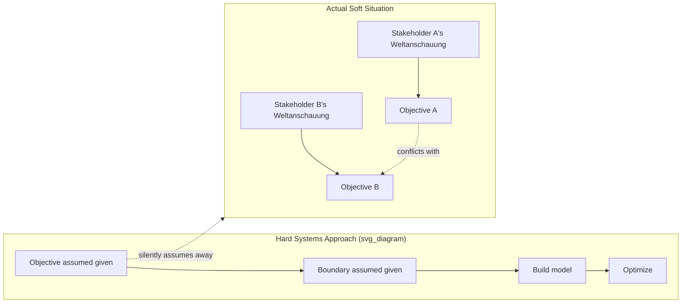

## Hard versus Soft Systems Problems

### Overview

The hard/soft distinction classifies systems problems according to whether the problem, the system boundary, and the criteria for a good solution can be treated as objectively given (hard) or are instead contested, ambiguous, and dependent on the differing Weltanschauungen of the stakeholders involved (soft). The distinction was formalized by Peter Checkland to explain why classical systems engineering methods, which work well for one class of problem, systematically fail or mislead when applied to the other class — and to justify the development of Soft Systems Methodology (SSM) as a distinct approach for the latter.

### Core Definitions

- **Hard systems problem**: A problem where the goal is agreed upon and reasonably well-defined in advance, the system boundary is largely uncontested, and the task is to find the most efficient means of achieving that agreed goal. The inquiry proceeds as *optimization within a given structure*.
- **Soft systems problem**: A problem where the goal itself is contested or unclear, different stakeholders hold different and sometimes incompatible Weltanschauungen about what the "real" problem even is, and the system boundary is itself a matter of perspective rather than an objective given. The inquiry must proceed as *structuring an ill-defined situation* before any optimization can meaningfully occur.

**Key Points**

- The distinction is not about the technical complexity of the domain (a "hard" system can be highly complex, like a jet engine's control system) — it is about whether the *problem definition itself* is settled or contested.
- Most real-world organizational and social situations contain elements of both: a soft, contested outer problem (what should this organization be trying to achieve, and for whom?) often surrounds a genuinely hard inner sub-problem (given that goal, what is the most efficient logistics route?).
- Applying a hard-systems method to a genuinely soft problem produces a technically well-optimized answer to a question that was never actually agreed upon, which frequently generates the very stakeholder resistance and legitimacy problems discussed under Weltanschauung and worldview conflict.

### Comparison Table

| Dimension | Hard Systems Problem | Soft Systems Problem |
| --- | --- | --- |
| Goal definition | Clear, agreed, given at the outset | Ambiguous, contested, must be constructed through inquiry |
| System boundary | Objectively given or uncontroversial | Depends on stakeholder Weltanschauung; multiple valid boundaries exist |
| Stakeholder agreement | Assumed / largely present | Assumed absent or partial; divergent worldviews expected |
| Nature of the inquiry | Optimization: find the best means to a known end | Learning and accommodation: structure the problem and negotiate a workable way forward |
| Typical methods | Operations research, systems engineering, simulation optimization, cost-benefit analysis | Soft Systems Methodology, critical systems heuristics, stakeholder dialogue processes |
| What counts as "solved" | A measurable, technically optimal or near-optimal outcome against the stated goal | An accommodation that stakeholders with differing worldviews can each accept, even without full consensus |
| Example domain | Designing an efficient supply-chain routing algorithm for a fixed delivery network | Deciding what a struggling public hospital's mission and priorities should be amid conflicting stakeholder views |

### The Hard-Systems Assumption and Why It Fails on Soft Problems

Classical (hard) systems engineering rests on an implicit sequence: define the objective → define the system boundary → build a model → optimize within it. This sequence is only valid if the objective and boundary are genuinely uncontested inputs rather than outputs of the inquiry itself.

When a hard-systems method is applied to a situation that actually has the soft structure on the right, the method's first step ("objective assumed given") silently selects one stakeholder's Weltanschauung — usually whichever stakeholder commissioned or funded the study — while treating it as the neutral, objective starting point for everyone. This is the structural mechanism behind the stakeholder-legitimacy problem introduced in the previous item: the optimization itself may be technically flawless while still failing because it optimized the wrong, contested objective from the perspective of other stakeholders.

**Example**

- **Framed as hard**: "Optimize hospital bed allocation to minimize average patient wait time." This treats "minimize wait time" as the agreed, uncontested goal and proceeds directly to an operations-research optimization model.
- **Actually soft**: Different stakeholders hold different Weltanschauungen about what the hospital should prioritize — administrators may weight cost-efficiency and turnover, clinicians may weight patient safety and continuity of care, patients and families may weight dignity and communication, and public health officials may weight equitable access across the surrounding population. "Minimize average wait time" is not a neutral translation of "run a good hospital" — it is administrators' Weltanschauung, encoded as if it were the objective goal.
- **Consequence of misclassification**: A technically optimal bed-allocation algorithm built on the hard framing may reduce average wait time while triaging in ways that clinicians experience as clinically inappropriate and that patients experience as impersonal, generating resistance that has nothing to do with the algorithm's technical correctness and everything to do with an unexamined, contested objective having been treated as settled.

### Diagnostic Questions for Classifying a Problem

- Do all relevant stakeholders agree on what a "good outcome" looks like, or would they describe success differently?
- Is the system boundary (what's included, what's environment) obvious and uncontroversial, or would different stakeholders draw it differently?
- Has the goal been stated as if it were objective fact, when it is actually one stakeholder's framing (often the client or funder commissioning the analysis)?
- Would surfacing multiple root definitions (via CATWOE, from the previous item) reveal genuinely different, non-reconcilable framings of "the system," or would they converge on essentially the same definition?
- Is the disagreement, if any, about facts and means (suggesting a hard problem with a factual dispute) or about values and ends (suggesting a genuinely soft problem)?

If the answers reveal genuine, persistent divergence in worldview about ends rather than just disagreement about means, the situation should be treated as soft regardless of how technically well-specified the surface-level task appears.

### Practical Implications for Method Selection

- **Hard problems**: Proceed directly with quantitative optimization, simulation, or systems engineering methods; the main risk is technical (a poorly specified model), not a legitimacy or boundary problem.
- **Soft problems**: Begin with problem structuring (rich pictures, root definitions, CATWOE, stakeholder Weltanschauung mapping) *before* any optimization is attempted, since optimizing before the problem is structured risks solving the wrong problem efficiently.
- **Mixed problems (most common in practice)**: Use SSM-style structuring to first negotiate an accommodation on the soft, contested outer question (what should we be trying to achieve, and for whom), and only then apply hard-systems optimization methods to the resulting, now-agreed inner sub-problem.
- [Inference] Checkland's own later work (with Scholes, in "Soft Systems Methodology in Action") emphasized that most real interventions require moving between hard and soft modes iteratively rather than making a single upfront classification and staying within it, since resolving one soft ambiguity often reveals a further, previously hidden one.

### Common Misclassification Failure Modes

- **Premature hardening**: Treating a genuinely soft, contested situation as hard by adopting one stakeholder's framing as the objective goal without surfacing that alternative framings exist — the mechanism illustrated in the hospital example above.
- **Over-softening a genuinely hard sub-problem**: Spending excessive time on stakeholder negotiation and worldview reconciliation for a technical sub-question where stakeholders in fact already agree on the goal, delaying a straightforward optimization unnecessarily.
- **Mistaking technical complexity for softness**: Assuming a problem is "soft" merely because the underlying system is complicated (many variables, nonlinear interactions) when in fact all stakeholders agree on the goal — complexity and contestedness are independent dimensions, and a complex-but-agreed problem is still a hard problem in Checkland's sense.

### Relationship to Other Course Concepts

- The hard/soft distinction is the direct methodological justification for Soft Systems Methodology and its Weltanschauung-centered CATWOE technique, covered in the previous item: SSM exists specifically because hard-systems assumptions break down on soft problems.
- It connects to the power/politics critique of leverage points theory (Critiques and Extensions of Leverage Points Theory): identifying a technically correct high-leverage point within a hard-systems frame does not resolve whether that leverage point is legitimate or acceptable across stakeholders holding different Weltanschauungen — that requires treating the situation as soft first.
- It reframes policy resistance and unintended consequences (covered in the prior chapter) as sometimes arising not from an incomplete model of a genuinely hard system, but from the mistaken treatment of an actually soft, contested situation as if it were hard — meaning the "compensating loop" that appeared to defeat an intervention was, in some cases, simply a different stakeholder's Weltanschauung reasserting itself.

**Related Topics**

- Worldview and Weltanschauung in Systems Inquiry
- Soft Systems Methodology (SSM) — Full Seven-Stage Process
- CATWOE Analysis and Root Definition Construction
- Rich Pictures as a Problem-Structuring Tool
- Critical Systems Heuristics and Boundary Critique (Ulrich)
- Operations Research and Hard Systems Optimization Methods