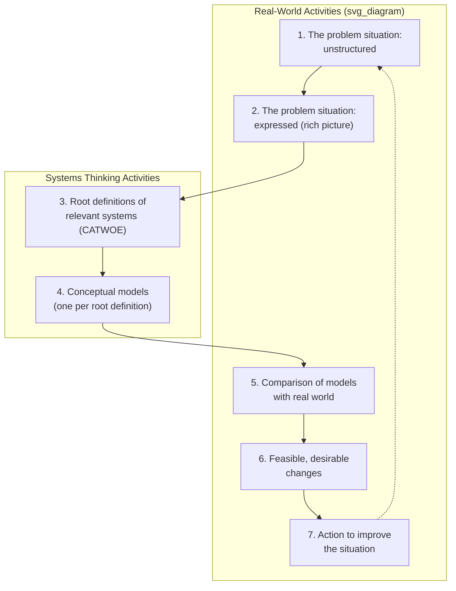

## Overview of Checkland's Soft Systems Methodology

### Overview

Soft Systems Methodology (SSM) is a structured approach for inquiring into and improving ill-defined, real-world problem situations — particularly human activity systems in which stakeholders hold different, sometimes conflicting Weltanschauungen about what the problem is and what a good outcome would look like. Developed by Peter Checkland at Lancaster University over an extended action-research program beginning in the 1970s and consolidated in *Systems Thinking, Systems Practice* (1981) and later *Soft Systems Methodology in Action* (1990, with Jim Scholes), SSM was created specifically because classical hard-systems engineering methods presuppose an agreed goal and boundary that soft problems, by definition, do not have (see Hard versus Soft Systems Problems).

This item provides the integrated overview of the full methodology; individual components (Weltanschauung, CATWOE, root definitions) were introduced in the preceding items and are drawn together here into the complete process.

### Foundational Premise

SSM treats "system" as an epistemological device — a way of organizing thinking about a situation — rather than an ontological claim that the situation *is* objectively a system with a discoverable, correct boundary. This is the methodology's central departure from hard systems thinking:

**Key Points**

- SSM does not ask "what is the system?" as though there were one correct answer to discover; it asks "what systems could usefully be conceived here, from which relevant points of view, to help us think about improving this situation?"
- Because multiple, equally legitimate Weltanschauungen typically exist among stakeholders in a real problem situation, SSM expects and works with multiple, parallel system definitions rather than converging on a single model before any learning has occurred.
- The methodology's output is not a single optimized solution but a negotiated **accommodation** — a change (or set of changes) that stakeholders holding different worldviews can each accept as an improvement, without necessarily agreeing on the underlying worldview itself.

### The Seven-Stage Process

Checkland's original formulation presents SSM as seven stages, conventionally drawn as a cycle split between "real-world" activities (which require engaging directly with stakeholders and the situation) and "systems thinking" activities (which can be done analytically, off to the side).

1. **The problem situation: unstructured.** Entry into a real-world situation perceived as problematic by someone, without yet imposing any analytical structure on it.
2. **The problem situation: expressed.** Building a **rich picture** — an informal, often hand-drawn diagram capturing the people, structures, processes, conflicts, and issues in the situation, deliberately avoiding premature systems-language or causal-loop formalization at this stage so that the messiness of the real situation is not filtered out too early.
3. **Root definitions of relevant systems.** For each Weltanschauung identified as relevant to the situation, construct a root definition using CATWOE (see Worldview and Weltanschauung in Systems Inquiry), producing multiple, parallel definitions of "a system that could be relevant here."
4. **Conceptual models.** For each root definition, build a conceptual model — a structured diagram of the minimum set of activities logically necessary to carry out the transformation (T) named in that root definition, given its Weltanschauung. This model is explicitly a logical construct derived from the root definition, not a description of the current real-world organization.
5. **Comparison of models with the real world.** The conceptual models built in Stage 4 (idealized, logical) are compared against the actual, messy real-world situation expressed in Stage 2, surfacing gaps, mismatches, and areas of stakeholder disagreement or surprise.
6. **Feasible and desirable changes.** From the comparison, identify changes that are both **systemically desirable** (justifiable by at least one of the root definitions/conceptual models) and **culturally feasible** (acceptable given the actual power structures, culture, and constraints of the real situation) — the intersection of these two criteria is where SSM's practical recommendations are drawn from.
7. **Action to improve the situation.** Implement the identified changes, which alters the real-world situation, in principle restarting the cycle since the "improved" situation will itself contain new problems and perspectives worth examining.

### Why the Process Alternates Between Real-World and Systems-Thinking Modes

The split between the two tracks is methodologically deliberate: Stages 1, 2, 5, 6, and 7 require direct engagement with actual stakeholders, politics, and constraints, while Stages 3 and 4 can proceed as a more detached, logical exercise once the relevant Weltanschauungen have been identified. Checkland's key design decision was ensuring the logical, idealized conceptual models built in the systems-thinking track (Stage 4) are never mistaken for the real-world situation itself — Stage 5's explicit comparison step exists precisely to prevent the idealized model from being implemented unreflectively, without checking it against actual constraints and stakeholder reactions.

### Root Definitions and Conceptual Models: A Worked Example Continued

Building on the redevelopment-lot example introduced under Weltanschauung:

**Example**

- **Root definition (economic development Weltanschauung)**: A council-owned system operated by developers and planning staff that transforms undeveloped land into tax-generating commercial property for the benefit of the municipal budget, constrained by zoning law and capital availability.
- **Conceptual model derived from it (Stage 4)**: A logical sequence of necessary activities — assess land value, solicit developer proposals, evaluate proposals against revenue projections, negotiate terms, approve permits, monitor construction, collect tax revenue — built purely from what the root definition logically requires, independent of how the council currently, actually operates.
- **Comparison with real world (Stage 5)**: The actual council process is found to lack any structured mechanism for evaluating proposals against revenue projections (Stage 5 surfaces this as a gap between the idealized model and current practice), and separately, community stakeholders operating from the resilience Weltanschauung object that the entire process omits any activity representing their conceptual model's core transformation (converting land into shared community benefit).
- **Feasible and desirable changes (Stage 6)**: Adding a structured revenue-projection evaluation step is both systemically desirable (justified by the economic conceptual model) and culturally feasible (a procedural addition, not a power realignment). Fully replacing the process with the community-resilience conceptual model may be systemically desirable from that Weltanschauung but culturally infeasible given the council's actual authority structure — SSM's accommodation logic would instead look for a partial change (e.g., a mandated percentage of the lot reserved for community use) that both worldviews can accept as an improvement, even though neither gets its full conceptual model implemented.

### Distinctive Methodological Commitments

- **Learning system, not solution-generating system**: Checkland repeatedly emphasized that SSM is fundamentally a *learning* cycle — its purpose is to structure inquiry and debate about an ill-defined situation, not to mechanically output a single correct answer the way a hard-systems optimization would.
- **Iteration and re-entry are expected, not exceptional**: Because Stage 7's action changes the real-world situation, and because a soft problem situation is never fully and finally "solved" in the hard-systems sense, re-entering the cycle (the dotted line from Stage 7 back to Stage 1 in the diagram) is treated as the normal, expected continuation of the methodology rather than a sign of prior failure.
- **Accommodation, not consensus, is the success criterion**: SSM does not require stakeholders to resolve their differing Weltanschauungen or reach philosophical agreement — it requires only that a specific, concrete change be acceptable enough, from each relevant worldview, for action to proceed.
- **Rich pictures resist premature formalization**: Deliberately using an informal, unstructured diagramming technique at Stage 2 (rather than jumping straight to a causal loop diagram or stock-flow model) is intended to preserve situational richness — conflicts, power dynamics, informal relationships — that a formal modeling notation would tend to filter out before it has even been noticed.

### Common Critiques of SSM

- [Inference] Some critics, particularly from more quantitatively oriented systems-engineering traditions, have argued that SSM's explicit avoidance of a single, measurable success criterion makes it harder to evaluate the methodology's own effectiveness across cases, compared with hard-systems methods that have well-defined optimization metrics.
- The methodology requires significant facilitation skill and sustained stakeholder engagement to execute well, which can make it resource-intensive relative to a hard-systems method applied to a problem that turns out, on inspection, to have been more tractable than initially assumed.
- Critics have also noted that "cultural feasibility" (Stage 6) risks entrenching existing power imbalances if applied uncritically — a change that is desirable from a marginalized stakeholder's root definition but "culturally infeasible" given current power structures may simply never be implemented, which is part of the motivation behind Ulrich's later development of critical systems heuristics as an explicit complement addressing whose voices are structurally excluded from the feasibility judgment in the first place.

### Relationship to Other Course Concepts

- SSM is the direct methodological application of the Weltanschauung concept and CATWOE technique introduced in the previous chapter item, and of the hard/soft distinction introduced immediately prior to this item.
- Stage 6's dual criteria (systemically desirable, culturally feasible) function as a soft-systems analogue to the leverage-and-feasibility scoring discussed in Identifying High-Leverage Interventions in Practice and the power/politics critique of leverage points theory — both frameworks separately recognize that a technically or logically justified intervention is not automatically an implementable one.
- The cyclical, never-finally-resolved structure of SSM (Stage 7 looping back to Stage 1) parallels the time-varying nature of leverage points discussed in the critiques chapter: just as a leverage point can shift as a system adapts, a soft problem situation continues generating new root definitions and new comparisons as the situation itself evolves through intervention.

**Related Topics**

- Worldview and Weltanschauung in Systems Inquiry
- Hard versus Soft Systems Problems
- CATWOE Analysis and Root Definition Construction
- Rich Pictures as a Problem-Structuring Tool
- Critical Systems Heuristics and Boundary Critique (Ulrich)
- Accommodation versus Consensus in Multi-Stakeholder Interventions