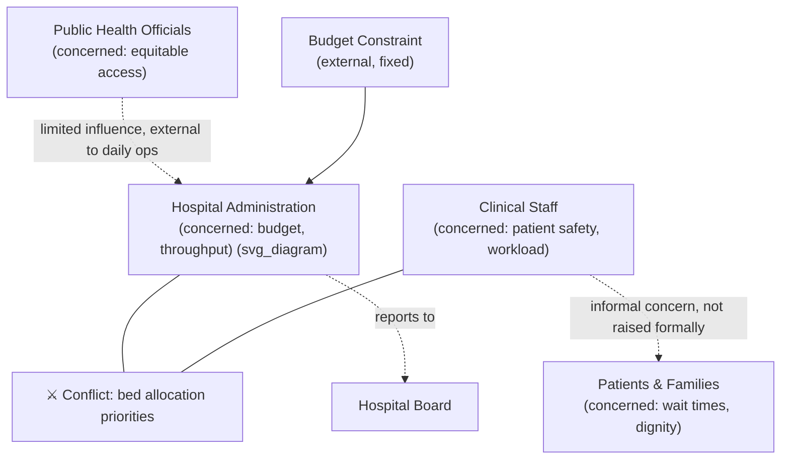

## Rich Pictures

### Overview

A rich picture is an informal, often hand-drawn diagram used at Stage 2 of Checkland's Soft Systems Methodology to express a problem situation in as unstructured and non-reductive a way as possible before any formal systems language, boundary, or model is imposed on it. Its purpose is to capture the messiness of a real-world situation — the people, relationships, structures, conflicts, concerns, and constraints — in a form that preserves ambiguity and multiple perspectives, deliberately resisting the premature analytical tidiness that a causal loop diagram, stock-flow diagram, or org chart would impose too early in the inquiry.

### Why Rich Pictures Exist: The Premature-Formalization Problem

Any formal diagramming notation (causal loop diagrams, stock-and-flow diagrams, flowcharts) requires the analyst to have already decided what counts as a variable, a relationship, or a boundary before drawing anything. In a genuinely soft problem situation (see Hard versus Soft Systems Problems), those decisions are exactly what is contested and not yet known — imposing formal structure at this stage risks encoding one stakeholder's Weltanschauung as if it were the objective starting point, before alternative framings have even been surfaced.

**Key Points**

- Rich pictures are deliberately informal precisely so that the act of drawing does not force premature commitments about system boundary, causality, or which elements matter.
- They are a **Stage 2 tool in SSM** (see Overview of Checkland's Soft Systems Methodology) — positioned after unstructured entry into the situation (Stage 1) but before any root definitions or CATWOE analysis (Stage 3), which come later precisely because they require decisions the rich picture is meant to defer.
- A rich picture is not intended to be logically consistent, exhaustively labeled, or professionally polished — messiness and apparent disorganization in the drawing itself is a feature, reflecting the messiness of the actual situation, not a flaw to be corrected.

### What a Rich Picture Typically Contains

There is no fixed notation for rich pictures (unlike causal loop diagrams or CATWOE, which have defined symbols and mnemonics), but practitioners conventionally include:

- **Actors and stakeholders**: Represented as simple figures, labeled roles, or named groups, positioned to reflect their relationships and relative influence.
- **Structures**: Physical, organizational, or institutional structures relevant to the situation (buildings, departments, reporting lines) drawn as simple shapes rather than formal org-chart boxes.
- **Processes and activities**: What people or groups actually do, often shown with simple arrows or annotated actions rather than formal process-flow symbols.
- **Relationships and communication**: Lines, arrows, or connecting symbols between actors, which can represent formal reporting relationships, informal alliances, communication channels, or conflicts — often distinguished visually (e.g., a jagged or crossed line for conflict, a dotted line for weak or informal connection).
- **Concerns, conflicts, and issues**: Frequently rendered as symbolic devices — a common convention uses a "crossed swords" icon to mark an explicit conflict between two parties, a question mark to flag an unresolved issue, or a thought-bubble to represent a stakeholder's stated concern or worry.
- **Environmental and external constraints**: Elements outside any single stakeholder's control (regulations, budget limits, market conditions) represented at the picture's periphery.

### Illustrative Structure (Simplified Schematic)

Because rich pictures are inherently informal, freehand artifacts without a fixed notation, the diagram below is a schematic representation of the *kind* of relationships a rich picture captures — a genuine rich picture would be hand-drawn with idiosyncratic symbols specific to the situation and the drawer, not a structured flowchart.

This schematic captures, in a compressed way, several things a genuine rich picture would show in more idiosyncratic and situationally specific visual form: which relationships are formal versus informal, where explicit conflict exists, which actors have limited practical influence despite a stated interest, and which constraints are treated as fixed rather than negotiable — all without yet defining a system boundary, a root definition, or a causal model.

### How Rich Pictures Are Constructed in Practice

- **Direct stakeholder engagement**: Analysts typically build rich pictures through interviews, workshops, or direct observation, rather than from documents alone, since much of what a rich picture aims to capture (informal relationships, unstated concerns, felt conflicts) is not recorded in formal organizational documentation.
- **Iterative refinement, not one-shot drawing**: A rich picture is usually built up over multiple passes as more of the situation is understood, with earlier assumptions revised as new stakeholder perspectives are incorporated.
- **Group construction as a technique**: Having multiple stakeholders contribute to or react to a shared rich picture in a workshop setting can itself surface disagreements about the situation — a stakeholder disputing how a relationship or conflict is depicted is, in effect, surfacing a divergent Weltanschauung before the formal CATWOE stage makes that divergence explicit.
- **No "correct" rich picture**: Because it reflects the analyst's (and workshop participants') current understanding rather than an objective diagram, two analysts working the same situation independently may produce different rich pictures — this is expected and not treated as an error, since the rich picture's value lies in what it surfaces for discussion, not in achieving a single canonical representation.

**Example**

- **Situation**: A municipal public-transit agency facing declining ridership and a budget shortfall.
- **Rich picture elements a practitioner might draw**: The agency's finance director (worried expression, "budget shortfall" thought bubble, arrow to a shrinking money symbol), bus drivers (speech bubble: "routes changed without our input"), riders (drawn as scattered figures at bus stops with a clock symbol indicating long waits), a city council member (drawn at the periphery, connected by a dotted line indicating infrequent, indirect engagement despite formal oversight authority), a crossed-swords icon between the finance director and the drivers' union over a proposed route consolidation, and an external arrow labeled "state funding formula (fixed, outside agency control)" pointing into the finance director's box.
- **What this surfaces before any formal modeling**: The drawing makes visible that the drivers' union has a grievance not directly connected to ridership numbers, that the city council's formal oversight role is disconnected from its actual day-to-day engagement, and that at least one major constraint (state funding formula) is being treated as fixed rather than a variable subject to advocacy — all of which are relevant inputs to Stage 3's root-definition construction but would likely be missed by jumping directly to a ridership-optimization model.

### Rich Pictures Compared to Formal Systems Diagrams

| Dimension | Rich Picture | Causal Loop / Stock-Flow Diagram |
| --- | --- | --- |
| Notation | Informal, freehand, no fixed symbol set | Formal, standardized notation (arrows, polarity signs, stock/flow icons) |
| Purpose | Express the situation broadly, preserve ambiguity and multiple perspectives | Model causal structure and dynamic behavior precisely |
| Timing in inquiry | Early (Stage 2 of SSM), before boundary or root definition is fixed | Later, once a system boundary and relevant variables have been agreed or assumed |
| Treats boundary as | Not yet decided; boundary emerges from later stages | Given; required as an input to draw the diagram |
| Suitable problem type | Soft, contested, ill-defined situations | Hard, or already-structured soft situations where boundary and variables are agreed |

### Common Mistakes When Constructing Rich Pictures

- **Premature structuring**: Analysts trained in formal diagramming methods often default to imposing boxes, hierarchies, or causal arrows onto a rich picture, defeating its purpose of deferring structural commitments.
- **Excluding conflict or sensitive concerns**: Omitting visible tension between stakeholders to keep the picture politically comfortable removes exactly the information the rich picture is meant to surface, since unstated conflict is often the actual source of the problem situation's difficulty.
- **Treating the rich picture as a final deliverable**: A rich picture is an intermediate artifact meant to inform Stage 3 (root definitions); presenting it as if it were itself the analytical conclusion skips the methodology's actual analytical work.
- **Over-standardizing across projects**: Because there is no fixed notation, attempting to enforce a single reusable symbol legend across every rich picture a practitioner draws can undermine the technique's responsiveness to what is actually distinctive about each specific situation.

### Relationship to Other Course Concepts

- Rich pictures are the direct real-world-facing predecessor to CATWOE and root-definition construction (Worldview and Weltanschauung in Systems Inquiry): the conflicts, actors, and concerns surfaced informally in the rich picture become candidate inputs for identifying which distinct Weltanschauungen are relevant enough to warrant a separate root definition.
- They function as a practical antidote to premature problem-hardening (Hard versus Soft Systems Problems): by resisting formal structure at the outset, rich pictures make it harder to accidentally encode a single stakeholder's framing as the objective starting point of the inquiry.
- The technique's emphasis on capturing what is *not* formally documented parallels the assumption-surfacing and mental-model techniques from the previous chapter (Assumption Surfacing and Testing, the Ladder of Inference) — both aim to externalize tacit, otherwise invisible content before it silently shapes the analysis.

**Related Topics**

- Overview of Checkland's Soft Systems Methodology
- Worldview and Weltanschauung in Systems Inquiry
- CATWOE Analysis and Root Definition Construction
- Hard versus Soft Systems Problems
- Stakeholder Mapping and Conflict Surfacing Techniques
- Causal Loop Diagrams as a Later-Stage Formal Modeling Tool