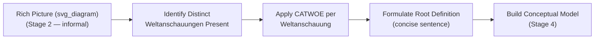

## CATWOE Analysis

### Overview

CATWOE is the mnemonic and analytical checklist Peter Checkland developed to guide the construction of root definitions in Stage 3 of Soft Systems Methodology, ensuring that each root definition explicitly and completely specifies the perspective (Weltanschauung), participants, and constraints that make a proposed "relevant system" meaningful. While CATWOE and Weltanschauung were introduced together in an earlier item as part of the root-definition concept, this item treats CATWOE itself as the primary subject: its six elements individually, the analytical discipline of applying it rigorously, and its role as the pivot between the informal rich picture (Stage 2) and the formal conceptual model (Stage 4).

### The Six Elements in Full

- **C — Customers**: The beneficiaries or victims of the system's transformation — who is affected by what the system does, whether positively or negatively. Customers are not necessarily paying clients in the commercial sense; they are simply whoever is on the receiving end of the transformation's output.
- **A — Actors**: The people or roles who carry out, or would carry out, the activities that constitute the transformation. Actors are the "who does the work," distinct from Customers ("who receives the effect of the work").
- **T — Transformation process**: The core of the root definition — a statement of what input state is converted into what output state. Conventionally written as $Input \rightarrow Output$, this is the single activity the entire system exists to perform, from the stated Weltanschauung.
- **W — Weltanschauung**: The worldview that makes the transformation meaningful and worth doing in the specified way. This is the element that gives the other five their coherence and their justification — without stating W, a reader cannot tell why this particular transformation, these particular customers, and this particular boundary were chosen over alternatives.
- **O — Owner**: The person or body with the authority to stop the system, fundamentally change it, or decide it should exist at all. The Owner is distinct from Actors: an owner may never personally carry out any of the system's activities but retains ultimate authority over whether the system continues to operate in this form.
- **E — Environmental constraints**: Factors external to the system that it must take as given rather than as something it can alter — regulatory requirements, physical limitations, budget ceilings, or other boundary conditions imposed from outside the system's own scope of control.

**Key Points**

- CATWOE is not a data-collection checklist to be filled in mechanically from observed facts; it is a discipline for making a root definition's assumptions and perspective fully explicit and internally consistent, given a specific, chosen Weltanschauung.
- Every element should be traceable back to and consistent with the stated W — if the Customers, Actors, or Environmental constraints named do not actually follow from the stated worldview, this is a signal that the root definition is not yet internally coherent.
- CATWOE is typically applied once per relevant Weltanschauung identified from the rich picture and prior stakeholder engagement (Stage 2), producing multiple, parallel CATWOE analyses and root definitions for a single problem situation — not one single, consensus CATWOE.

### The Analytical Sequence: From Rich Picture to Root Definition

CATWOE sits structurally between the informal, unstructured rich picture and the formal conceptual model: it is the mechanism by which the felt conflicts and multiple perspectives surfaced informally in the rich picture get translated into precise, analyzable statements suitable for building a logical model in Stage 4.

### Worked Example: Full CATWOE Table

Continuing the hospital bed-allocation situation introduced under Hard versus Soft Systems Problems, here is a complete CATWOE analysis for the administrative Weltanschauung, followed by the corresponding table for the clinical Weltanschauung, showing how the same situation produces two internally coherent but substantively different analyses.

**Administrative Weltanschauung**

| Element | Content |
| --- | --- |
| C — Customers | The hospital's budget stakeholders (board, funders) and, secondarily, the pool of future patients who benefit from a financially sustainable hospital |
| A — Actors | Bed-management staff, admissions coordinators, administrative schedulers |
| T — Transformation | Unallocated bed capacity and incoming patient demand → efficiently allocated beds, minimizing average wait time and maximizing throughput |
| W — Weltanschauung | A hospital's core obligation is to serve the maximum number of patients efficiently within fixed resource constraints; wait time and throughput are the primary legitimate measures of service quality |
| O — Owner | Hospital administration / board |
| E — Environmental constraints | Fixed total bed count, staffing budget, regulatory reporting requirements on wait-time metrics |

**Clinical Weltanschauung**

| Element | Content |
| --- | --- |
| C — Customers | Individual patients currently admitted or awaiting admission, and their families |
| A — Actors | Physicians, nurses, clinical case managers |
| T — Transformation | A patient with an undetermined care pathway → a patient placed in the clinically most appropriate setting for their specific condition |
| W — Weltanschauung | Clinical appropriateness and patient safety must take precedence over throughput efficiency; a "fast" allocation that places a patient in a clinically unsuitable bed is not actually a successful transformation, regardless of its effect on wait-time metrics |
| O — Owner | Clinical leadership / medical director |
| E — Environmental constraints | Same fixed bed count and staffing budget, plus clinical protocols and accreditation standards that constrain which patients can occupy which bed types |

**Key Points**

- Both tables describe the same physical hospital and the same fixed bed count (a shared Environmental constraint), yet the Transformation, Customers, and especially Weltanschauung differ substantially — this is precisely the divergence CATWOE is designed to make explicit rather than leave as an implicit source of later conflict.
- Note that "efficient allocation" (administrative T) and "clinically appropriate placement" (clinical T) are not simply the same transformation described in different words — they can produce genuinely different bed-assignment decisions in a real case, which is why Stage 5 (comparing conceptual models built from each root definition against the real-world situation) is where this divergence becomes practically consequential.

### Constructing the Root Definition Sentence

Once CATWOE elements are identified, Checkland's convention is to compress them into a single, dense root-definition sentence, often structured as: *"A system, owned by [O], operated by [A], that transforms [T's input] into [T's output], for the benefit of [C], given [W], within the constraints of [E]."*

**Example**

- **From the administrative CATWOE table above**: "A system, owned by hospital administration, operated by bed-management and admissions staff, that transforms unallocated bed capacity and patient demand into efficiently allocated beds minimizing wait time, for the benefit of budget stakeholders and future patients, given that efficient throughput is the hospital's primary service obligation, within the constraints of a fixed bed count and staffing budget."
- **From the clinical CATWOE table above**: "A system, owned by clinical leadership, operated by physicians, nurses, and case managers, that transforms a patient's undetermined care pathway into placement in the clinically most appropriate setting, for the benefit of individual patients and families, given that clinical appropriateness must take precedence over throughput, within the constraints of the same bed count and staffing budget plus clinical protocols."

### Common Errors in Applying CATWOE

- **Conflating Customers and Actors**: Naming the same group in both C and A without checking whether they are actually both the beneficiary/victim of the transformation and the one carrying it out — these are frequently, but not always, different groups, and treating them as automatically identical can hide who actually bears the consequences of the transformation.
- **Stating W as a goal rather than a worldview**: Writing something like "W: to reduce costs" states an objective, not a worldview — the CATWOE-appropriate version explains *why* reducing costs is the right way to frame the situation at all (e.g., "a hospital's sustainability depends on operating within its funding envelope, and cost control is therefore a legitimate, primary lens for evaluating hospital operations"), since the goal itself should be *derivable from* the stated worldview, not substituted for it.
- **Treating Owner as whoever manages daily operations**: Confusing Owner (who can stop or fundamentally redefine the system) with Actors (who perform its activities) or with a day-to-day manager who lacks authority to discontinue the system entirely.
- **Listing Environmental constraints that are actually within the system's control**: Including a factor as "given, external, unchangeable" when it is, from a different Weltanschauung, actually a negotiable or challengeable element — for instance, treating "fixed bed count" as a hard external constraint when a different root definition might treat bed-count expansion as itself part of the transformation to be pursued.
- **Producing only one CATWOE for a genuinely multi-perspective situation**: Applying CATWOE once, from whichever perspective is most convenient or most vocal, defeats its purpose; the analytical discipline requires at least one CATWOE per Weltanschauung identified as genuinely relevant from the rich picture and stakeholder engagement.

### CATWOE's Role in the Broader SSM Cycle

CATWOE's output (the root definition) is what Stage 4 uses to build a conceptual model — a logically derived sequence of activities required to carry out the stated transformation, given the stated worldview. Because CATWOE forces every element of the root definition to be explicit and internally traceable to a stated Weltanschauung, the resulting conceptual model built in Stage 4 is a rigorous logical construct rather than an ad hoc description, which is precisely what allows Stage 5's comparison against the real-world situation to be analytically meaningful: gaps and mismatches identified in that comparison can be traced back to a specific CATWOE element rather than remaining vague.

**Key Points**

- CATWOE is the discipline that prevents SSM's use of multiple Weltanschauungen from collapsing into vague, unstructured "everyone sees it differently" hand-waving — each perspective is required to be worked through to the same level of analytical rigor.
- The quality of everything downstream in SSM (the conceptual model, the comparison, the identified feasible-and-desirable changes) depends on how carefully and honestly CATWOE was applied at Stage 3; a root definition that skips or fudges an element (most commonly W) propagates that gap through the rest of the methodology.

### Relationship to Other Course Concepts

- CATWOE is the direct analytical successor to the rich picture (Rich Pictures): the actors, conflicts, and concerns drawn informally there become the raw material from which distinct Weltanschauungen are identified and formalized here.
- It operationalizes the Weltanschauung concept (Worldview and Weltanschauung in Systems Inquiry) into a repeatable, checklist-driven technique, giving practitioners a concrete method rather than only an abstract awareness that worldviews differ.
- It is the input to conceptual model-building and comparison (Stages 4–5 of Overview of Checkland's Soft Systems Methodology), making CATWOE the hinge point of the entire SSM cycle between informal problem expression and formal, comparable modeling.

**Related Topics**

- Rich Pictures as a Problem-Structuring Tool
- Overview of Checkland's Soft Systems Methodology
- Worldview and Weltanschauung in Systems Inquiry
- Root Definitions and Conceptual Model Construction (Stage 4)
- Hard versus Soft Systems Problems
- Comparing Conceptual Models Against Real-World Situations (Stage 5)