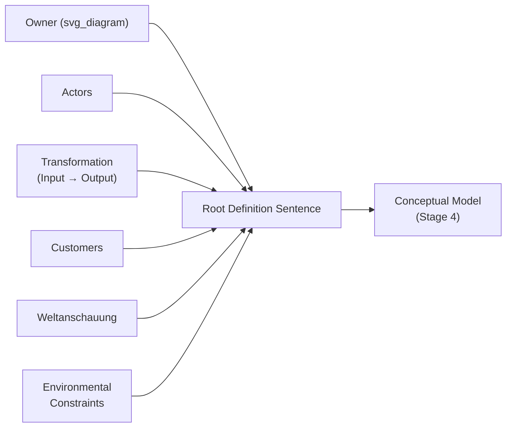

## Root Definitions of Purposeful Activity Systems

### Overview

A root definition is the concise, formally structured sentence at the center of Stage 3 of Soft Systems Methodology that defines what Checkland termed a **purposeful activity system**: a human activity system considered as if it were pursuing a purpose, from one declared point of view. Where the preceding item covered CATWOE as the analytical checklist used to derive a root definition's content, this item focuses on the root definition itself — its formal properties, the concept of a purposeful activity system it encodes, the criteria for a well-formed root definition, and its function as the direct input to Stage 4's conceptual model.

### What "Purposeful Activity System" Means

Checkland's phrase is precise and each word carries analytical weight:

- **Purposeful**: The system is modeled *as if* it has a purpose — SSM does not claim the real-world situation objectively has this purpose, only that conceiving of it this way, from a stated Weltanschauung, is a useful device for structuring inquiry. This is a deliberate epistemological stance, not a factual claim about the world.
- **Activity**: The system is defined in terms of what it *does* (a transformation carried out through activities), not in terms of physical structures, departments, or job titles. A root definition never begins by naming an existing organizational unit; it begins by naming a transformation.
- **System**: The word is used in the epistemological sense established under Weltanschauung — a way of organizing thought about the situation, not a claim that a bounded, discoverable entity exists in reality independent of the observer's chosen perspective.

**Key Points**

- A root definition describes a *notional* system that could be relevant to thinking about the problem situation — it is explicitly not a description of an actual, currently existing organization, department, or process.
- Because the same real-world situation can be conceived as many different purposeful activity systems (one per relevant Weltanschauung), a single problem situation typically yields several parallel, non-competing root definitions, as established in the previous two items.
- The purposeful activity system named in a root definition is the direct object that Stage 4's conceptual model will elaborate into a logical structure of necessary activities.

### The Formal Structure of a Root Definition

A well-formed root definition compresses all six CATWOE elements into a single sentence using Checkland's standard template:

$$\text{"A system, owned by } O\text{, operated by } A\text{, that transforms } T_{\text{in}} \text{ into } T_{\text{out}}\text{, for the benefit of } C\text{, given that } W\text{, within the constraints of } E\text{."}$$

**Key Points**

- The Transformation (T) is the grammatical and logical core of the sentence — Owner, Actors, Customers, Weltanschauung, and Environmental constraints all exist to specify and justify a single stated transformation, not the reverse.
- A root definition should be checkable sentence-by-sentence against its own CATWOE table (see the previous item): if a reader cannot locate each of the six elements within the sentence, the root definition is incompletely specified.

### Criteria for a Well-Formed Root Definition

- **Single, coherent transformation**: A root definition should name one transformation, not a bundle of loosely related activities. A root definition that reads as "transforms X into Y, and also manages Z, and also coordinates W" has not yet isolated the core purposeful activity and should be split into multiple root definitions if more than one genuinely distinct transformation is present.
- **Internal consistency with the stated Weltanschauung**: Every other element (who benefits, who acts, what's treated as a fixed constraint) must be logically derivable from the stated W, as emphasized in the CATWOE item — a root definition whose Customers or Environmental constraints don't follow from its stated worldview is not yet internally coherent.
- **Verifiable at the right level of resolution**: A root definition should be abstract enough to allow a conceptual model with several distinct activities to be derived from it (typically Checkland's guidance suggests conceptual models built from a root definition should decompose into roughly six or so main activities, though this is a practical rule of thumb rather than a strict requirement), but concrete enough that its Transformation is not so vague as to be untestable against the real world at Stage 5.
- **Explicitly perspectival, not neutral**: A root definition should read as *a* way of seeing the situation, not as *the* objective description of it — language that presents the transformation as uncontroversial fact, rather than as following from a stated W, risks silently smuggling in one stakeholder's Weltanschauung as though it were neutral (the premature-hardening failure discussed under Hard versus Soft Systems Problems).

### Primary Task versus Issue-Based Root Definitions

Checkland distinguishes two broad types of root definition, depending on what kind of purposeful activity system is being conceived:

- **Primary task root definitions**: Describe a system corresponding to a recognized, already-existing task or function that some organization or group is formally charged with carrying out (e.g., "a system that admits, treats, and discharges patients"). These map relatively directly onto existing organizational structures, even though the root definition itself remains a notional construct.
- **Issue-based root definitions**: Describe a system built around a cross-cutting concern, conflict, or issue that does not correspond to any single existing organizational unit — for example, "a system that resolves competing claims on bed capacity between administrative and clinical priorities" cuts across the primary-task boundaries of admissions, clinical care, and finance simultaneously.

**Key Points**

- Issue-based root definitions are often more directly useful for genuinely soft, contested problem situations, since the contested issue itself, rather than any single department's existing mandate, is what the inquiry needs to address.
- A single SSM study frequently develops both types in parallel — primary-task root definitions to capture how existing functions currently operate, and issue-based root definitions to capture the cross-cutting concern that motivated the inquiry in the first place.

### Worked Example: Deriving Root Definitions from the Hospital CATWOE Tables

Continuing directly from the two CATWOE tables constructed in the previous item:

**Example**

- **Primary-task root definition (administrative Weltanschauung)**: "A system, owned by hospital administration, operated by bed-management and admissions staff, that transforms unallocated bed capacity and patient demand into efficiently allocated beds minimizing wait time, for the benefit of budget stakeholders and future patients, given that efficient throughput is the hospital's primary service obligation, within the constraints of a fixed bed count and staffing budget." This maps closely onto the existing, formally recognized admissions and bed-management function.
- **Primary-task root definition (clinical Weltanschauung)**: The corresponding sentence built from the clinical CATWOE table, mapping onto the existing clinical care function.
- **Issue-based root definition (cutting across both)**: "A system, owned jointly by administrative and clinical leadership, operated by a cross-functional bed-placement committee, that transforms competing administrative-efficiency and clinical-appropriateness claims on a fixed bed into a single, jointly defensible placement decision, for the benefit of both budget stakeholders and individual patients, given that neither efficiency nor clinical appropriateness alone is a sufficient criterion for bed allocation, within the constraints of the existing bed count, staffing, and clinical protocols." This root definition does not correspond to any single existing department — it names a notional system whose entire purpose is to resolve the specific tension the two primary-task root definitions revealed.
- **Why the issue-based version matters**: The primary-task root definitions each describe a coherent, internally consistent system from their own Weltanschauung, but neither, by itself, addresses the actual conflict driving the problem situation. The issue-based root definition is what allows Stage 4 to build a conceptual model specifically of the conflict-resolution activity itself, rather than leaving the conflict implicit and unaddressed across two parallel, non-communicating primary-task analyses.

### From Root Definition to Conceptual Model: What Comes Next

A root definition is not itself a model of activities — it is a compressed specification from which Stage 4 derives a conceptual model: a structured diagram showing the minimum logically necessary activities required to carry out the stated transformation, sequenced and connected according to logical dependency (an activity that requires information or output from another activity is placed downstream of it). The rigor of that derivation depends directly on how precisely and completely the root definition specified its Transformation and Weltanschauung — a vague or internally inconsistent root definition produces a correspondingly vague or incoherent conceptual model.

### Common Errors Specific to Root Definition Construction

- **Naming an existing department instead of a transformation**: Writing "the admissions department" as if that were the root definition, rather than deriving the transformation the admissions department could be conceived as carrying out — the root definition must describe a notional purposeful activity system, not label an existing structure.
- **Smuggling in a solution**: Writing a root definition that already presupposes a particular intervention (e.g., "a system that reduces wait time by adding beds") rather than describing the transformation itself neutrally with respect to how it might be achieved — the "how" belongs in the conceptual model derived afterward, not in the root definition.
- **Skipping issue-based framing in a genuinely soft, cross-cutting problem**: Producing only primary-task root definitions mapped onto existing departments when the actual problem situation is fundamentally about a cross-cutting conflict, leaving the central issue unaddressed by any single root definition.
- **Conflating multiple transformations in one sentence**: As noted above, a root definition naming several loosely connected activities has not yet isolated its core purposeful activity system and should be decomposed into separate root definitions.

### Relationship to Other Course Concepts

- Root definitions are the direct output of CATWOE analysis (CATWOE Analysis) — CATWOE is the checklist-driven process, the root definition is its compressed, sentence-form product.
- They formalize the multiple-Weltanschauung premise established under Worldview and Weltanschauung in Systems Inquiry into concrete, comparable, checkable artifacts, rather than leaving "different worldviews exist" as an unstructured observation.
- They are the direct input to conceptual model construction (Stage 4) and the subsequent comparison against the real-world situation (Stage 5), both introduced in Overview of Checkland's Soft Systems Methodology — meaning the quality of the entire remaining SSM cycle depends on the rigor applied at this stage.

**Related Topics**

- CATWOE Analysis
- Overview of Checkland's Soft Systems Methodology
- Worldview and Weltanschauung in Systems Inquiry
- Conceptual Model Construction (Stage 4 of SSM)
- Primary Task versus Issue-Based Systems Analysis
- Hard versus Soft Systems Problems