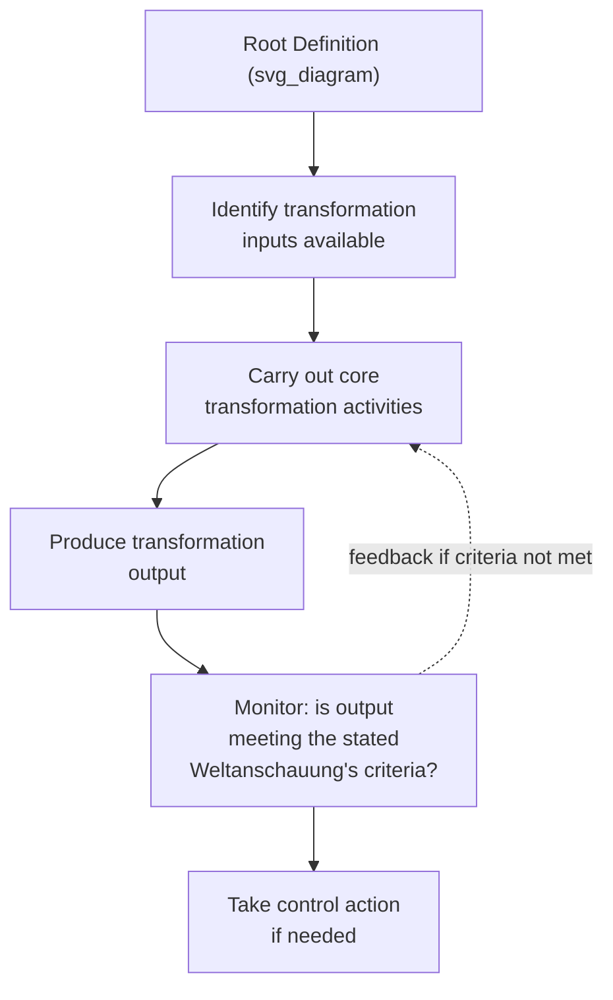
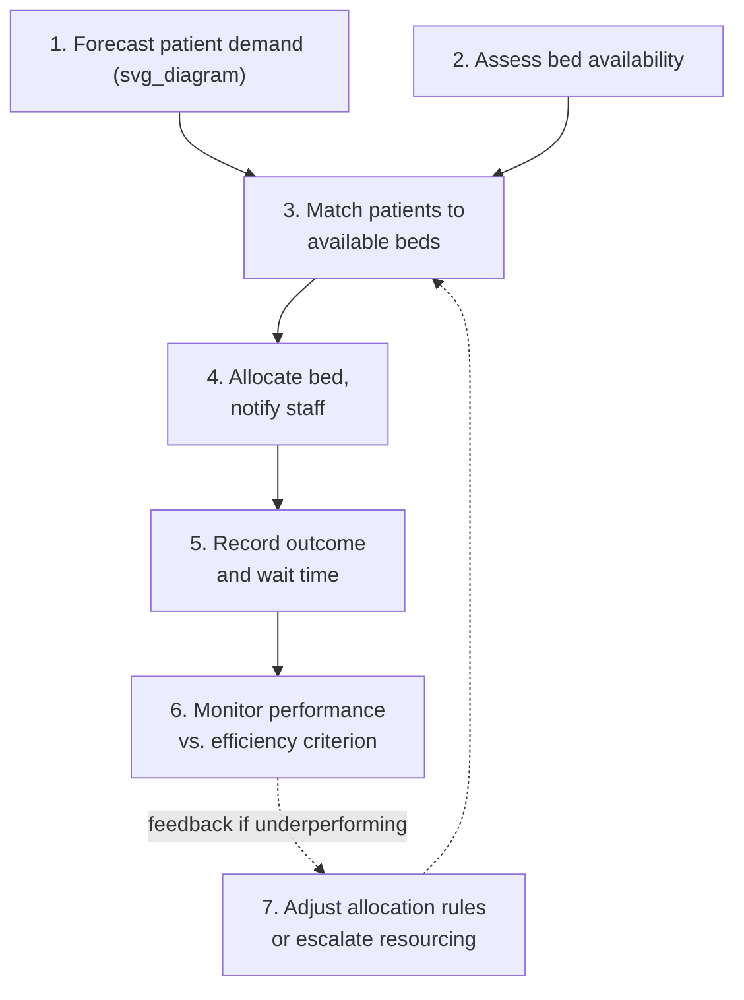

## Conceptual Models and Comparison with Reality

### Overview

This item covers Stages 4 and 5 of Soft Systems Methodology: building a conceptual model from a root definition, and comparing that model against the real-world situation. These two stages form the analytical hinge of SSM — Stage 4 takes the compressed root definition (see Root Definitions of Purposeful Activity Systems) and expands it into a structured diagram of necessary activities; Stage 5 then takes that idealized diagram and holds it up against the actual, messy situation captured in the rich picture, generating the concrete gaps and disagreements that Stage 6 will use to identify feasible, desirable changes.

### Stage 4: Building the Conceptual Model

A conceptual model is a diagram of the minimum set of activities logically necessary to carry out the transformation named in a root definition, connected by dependency (an activity requiring input from another is placed downstream of it). Critically, the conceptual model is derived by **logical entailment from the root definition alone** — it is not a description of how the real-world organization currently operates, and it is not permitted to draw on the analyst's knowledge of the actual situation. This separation is deliberate: it ensures the model that gets compared against reality in Stage 5 is a genuine logical construct, not an unconsciously "reality-adjusted" model that has already smuggled in observed practice.

**Key Points**

- The guiding question for Stage 4 is: "given only this root definition, what activities would logically have to happen, and in what order, for this transformation to occur?" — not "what does this organization actually do?"
- Checkland's practical convention suggests conceptual models typically decompose into a modest number of main activities (often cited as roughly five to nine), grouped and sequenced by logical dependency rather than by any existing departmental structure.
- Every activity in the conceptual model should be traceable back to an element of the root definition's CATWOE — an activity that cannot be justified by the stated Transformation, Weltanschauung, or Environmental constraints does not belong in the model.

### Deriving the Conceptual Model: Method

1. Take the transformation ($T_{in} \rightarrow T_{out}$) as the model's ultimate output activity.
2. Work backward, asking what activities must logically precede the transformation, given the stated Weltanschauung, Actors, and Environmental constraints.
3. Continue decomposing until each activity is a single, coherent verb-phrase action (e.g., "assess bed availability," not a vague compound like "manage the department").
4. Sequence activities by logical dependency, using arrows to show which activities require input or output from which others.
5. Add monitoring and control activities where the root definition's Weltanschauung implies ongoing evaluation is part of the purposeful activity (Checkland's methodology explicitly treats monitoring/control as a distinct, expected category of activity in most conceptual models, since a purposeful system is generally understood to include some mechanism for checking whether the transformation is being achieved).

### Worked Example: Conceptual Model from the Administrative Root Definition

Continuing the hospital bed-allocation case built through the previous two items, here is a conceptual model logically derived from the administrative root definition ("...transforms unallocated bed capacity and patient demand into efficiently allocated beds minimizing wait time...").

**Example**

Logically necessary activities (derived from the root definition alone, not from observed practice):

1. Forecast incoming patient demand by unit/specialty.
2. Assess current bed availability across units.
3. Match incoming patients to available beds according to an efficiency criterion (e.g., minimizing time-to-placement).
4. Allocate the bed and notify relevant staff.
5. Record allocation outcome and resulting wait time.
6. Monitor aggregate wait-time performance against the administrative Weltanschauung's efficiency criterion.
7. Adjust allocation rules or escalate resourcing needs if monitored performance falls short.

Note that this model contains no reference to any specific real department, software system, or named role beyond what the root definition itself implies — it is a logical construct built purely from the Transformation and Weltanschauung stated in Stage 3.

### Stage 5: Comparing the Conceptual Model Against Reality

Stage 5 takes the idealized conceptual model built in Stage 4 and systematically compares it, activity by activity, against what the rich picture (Stage 2) and further stakeholder engagement reveal about how the situation actually operates. The comparison is not intended to "correct" the conceptual model to match reality — the model's value lies precisely in being an idealized, logically pure construct against which the real situation's gaps become visible.

**Key Points**

- The comparison generates a structured list of differences: activities the model implies but that do not actually occur, activities that occur in reality but serve no purpose the model can account for, and activities that occur but are performed differently than the model implies would be logically necessary.
- Checkland describes several formal modes of comparison, including informal general discussion of the differences with stakeholders, more structured question-by-question comparison (does this activity happen? who does it? how well?), and, less commonly, comparing the model against a formal historical reconstruction of how the situation developed over time.
- A difference identified in Stage 5 is not automatically a "problem to fix" — some differences will turn out to be justified once discussed with stakeholders (the real-world activity serves a purpose the idealized model, built from only one Weltanschauung, did not capture), while others genuinely indicate a gap between what the administrative Weltanschauung would require and what is currently happening.

### Worked Example: Comparison Table for the Bed-Allocation Model

**Example**

| Conceptual Model Activity | Present in Reality? | Comparison Finding |
| --- | --- | --- |
| 1. Forecast patient demand by unit | Partially | Forecasting exists for scheduled surgical admissions but not for emergency department admissions, which the model treats as equally in scope |
| 2. Assess bed availability | Yes | Performed, but via a manual phone-call process rather than the real-time system the efficiency Weltanschauung would seem to require |
| 3. Match patients to beds by efficiency criterion | Yes, but modified | Matching occurs, but clinical staff routinely override efficiency-based matches on safety grounds — an activity the administrative-only conceptual model does not account for at all |
| 4. Allocate and notify | Yes | Performed as modeled |
| 5. Record outcome and wait time | Yes | Performed, feeding the hospital's official wait-time metric |
| 6. Monitor performance vs. efficiency criterion | Yes | Performed monthly by administration |
| 7. Adjust rules or escalate resourcing | Rarely | Monitoring occurs, but the feedback loop back into rule adjustment is largely absent — poor monthly performance is recorded but historically has not triggered rule changes |

**Key finding from the comparison**: Activity 3's "clinical override" gap is the single most consequential finding — it reveals that the real-world situation already contains an informal mechanism reconciling the administrative Weltanschauung's model with the clinical Weltanschauung's concerns (see the parallel clinical CATWOE table from the CATWOE Analysis item), even though the purely administrative conceptual model, built from only one Weltanschauung, has no way to represent or evaluate that mechanism on its own terms. This is precisely the kind of finding that motivates building an issue-based root definition and conceptual model (introduced in the previous item) explicitly around the administrative/clinical tension, rather than relying on either single-Weltanschauung model in isolation.

### Why the Comparison Must Precede Any Recommended Change

Checkland's sequencing is deliberate: Stage 6 (identifying feasible, desirable changes) draws directly and only from the differences surfaced in Stage 5's comparison, not from the conceptual model alone. Recommending a change based on the conceptual model in isolation — without the comparison step — risks proposing a logically elegant activity structure that ignores real, functioning mechanisms (like the clinical override in the example above) that the idealized model was never built to represent, since it was derived from only one Weltanschauung.

**Key Points**

- The comparison step is what prevents SSM from collapsing into a hard-systems approach that simply implements the idealized model wholesale (a failure mode discussed under Hard versus Soft Systems Problems as premature hardening) — it forces every proposed change to be checked against what is actually happening and why, before being labeled desirable or feasible.
- Comparisons across multiple conceptual models (one per relevant Weltanschauung) frequently surface the same real-world activity as serving different, sometimes competing, purposes depending on which model is doing the comparing — this multiplicity of interpretation is expected and is itself useful diagnostic information for Stage 6.

### Relationship to Other Course Concepts

- Stage 4's conceptual model is the direct logical elaboration of the root definition covered in the previous item — the rigor of the root definition's CATWOE analysis (CATWOE Analysis) determines how well-founded the resulting conceptual model will be.
- Stage 5's comparison connects the formal, idealized modeling track back to the real-world, stakeholder-facing track first opened by the rich picture (Rich Pictures), completing the loop Checkland designed between "systems thinking" and "real-world" activities (Overview of Checkland's Soft Systems Methodology).
- The comparison findings feed directly into Stage 6's dual criteria of systemic desirability and cultural feasibility, meaning the quality of eventual recommended action depends on how honestly and thoroughly Stage 5's comparison was conducted, not merely on how logically elegant Stage 4's model is in isolation.

**Related Topics**

- Root Definitions of Purposeful Activity Systems
- CATWOE Analysis
- Overview of Checkland's Soft Systems Methodology
- Rich Pictures as a Problem-Structuring Tool
- Feasible and Desirable Change (Stage 6 of SSM)
- Hard versus Soft Systems Problems