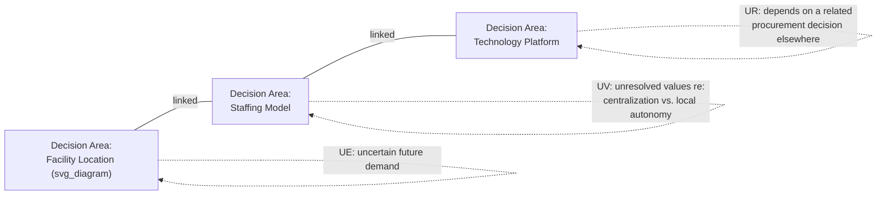

## Other Problem Structuring Methods

### Overview

Problem Structuring Methods (PSMs) are a family of approaches, of which Soft Systems Methodology is one prominent member, developed to help groups of stakeholders with differing perspectives, objectives, and information jointly frame and work through complex, ill-defined ("wicked") problems before committing to a specific course of action. This item surveys the major PSMs beyond SSM — Strategic Choice Approach, Strategic Options Development and Analysis, Robustness Analysis, and Critical Systems Heuristics — situating each relative to the soft/hard distinction and to SSM's Weltanschauung-centered approach already covered in this chapter.

### Common Ground Across Problem Structuring Methods

**Key Points**

- All PSMs share the premise established under Hard versus Soft Systems Problems: for genuinely soft, contested problems, the problem definition itself must be constructed through structured inquiry rather than assumed as a given input to optimization.
- PSMs generally prioritize transparency and participation — making stakeholders' assumptions, criteria, and disagreements visible to the group — over producing a single, mathematically optimal answer.
- Most PSMs are explicitly designed to be used in facilitated group workshops rather than by a single analyst working alone, since surfacing multiple perspectives is central to their purpose.
- Where SSM's central technique is worldview-differentiated root definitions (CATWOE), the other methods surveyed here structure a problem primarily around uncertainty, decision sequencing, or ethical boundary-setting instead.

### Strategic Choice Approach (SCA)

Developed by John Friend and Allen Hickling, SCA structures problems as a set of **interconnected decision areas**, explicitly designed to help a group manage uncertainty about the problem, about the environment, and about related decisions, without forcing premature commitment to a single course of action.

- **Decision areas**: Distinct choices that need to be made, represented as nodes; two decision areas are linked if a choice made in one constrains or influences the options available in the other.
- **Three types of uncertainty SCA explicitly names**: uncertainty about the working environment (UE), uncertainty about guiding values or objectives (UV), and uncertainty about related decisions elsewhere in the decision network (UR) — SCA treats these as distinct types requiring different management responses (e.g., gather more information for UE, engage further stakeholder dialogue for UV, monitor for UR).
- **Comparison areas**: Where alternative combinations of choices across linked decision areas are compared against each other on selected criteria, rather than each decision area being optimized independently.
- **Progressive commitment**: SCA explicitly supports partial decisions — committing now to some decision areas while deliberately keeping others open pending more information — rather than requiring the group to resolve the entire decision network simultaneously.

**Example**

- A regional health authority deciding where to locate a new clinic (Decision Area 1) links directly to decisions about staffing model (Decision Area 2, since a larger central facility implies different staffing than several small satellite clinics) and technology platform (Decision Area 3, since a centralized facility may support a different records system). SCA would map these links explicitly, classify the demand-forecast uncertainty affecting Decision Area 1 as UE, the stakeholder disagreement over centralization affecting Decision Area 2 as UV, and a pending, externally-controlled procurement timeline affecting Decision Area 3 as UR — then help the group decide which decision areas can be committed to now and which should be deliberately left open pending resolution of the relevant uncertainty.

### Strategic Options Development and Analysis (SODA)

Developed by Colin Eden, SODA uses **cognitive mapping** to represent an individual stakeholder's chain of reasoning — concepts and the causal/means-end links between them — and then merges multiple stakeholders' individual cognitive maps into a shared group map, surfacing where reasoning chains converge, diverge, or conflict.

- **Cognitive maps**: Built from stakeholder interviews, representing statements as concept nodes connected by arrows indicating "leads to" or "is a means of achieving" relationships, allowing an individual's implicit reasoning structure to be made explicit — a technique with clear affinity to the Ladder of Inference's concern with tracing reasoning back to its origins, though SODA formalizes the tracing into a diagrammatic method applied across multiple stakeholders simultaneously.
- **Merging maps**: Individual maps are combined into a composite group map, revealing shared goals that different stakeholders reach via different reasoning paths, and genuine conflicts where stakeholders' means-end chains actually contradict each other rather than merely differing in emphasis.
- **Facilitated workshops (typically using dedicated software, historically Decision Explorer)**: SODA is usually practiced in real-time facilitated sessions where the merged map is displayed and iteratively revised with the group present, making the surfacing of disagreement a live, collaborative process rather than a report delivered after the fact.

**Key Points**

- SODA's cognitive-mapping technique is, in effect, a formalized, multi-stakeholder extension of surfacing the reasoning chains the Ladder of Inference describes at the individual level — connecting directly back to that earlier chapter item.
- Unlike SSM's CATWOE, which centers the analysis on differing Weltanschauungen about what the system *is*, SODA centers on differing chains of *reasoning toward action*, making it particularly suited to strategy workshops where the goal is to converge on a jointly ownable action plan rather than to compare competing system definitions.

### Robustness Analysis

Developed within the operational-research tradition (notably by Jonathan Rosenhead), Robustness Analysis addresses situations of deep uncertainty about the future by evaluating initial decisions not against a single predicted future, but against how many different, plausible future states each candidate initial decision would remain compatible with.

- **Core logic**: Rather than committing to a full plan now, identify an initial, near-term decision that keeps open the largest number of good future options across a range of plausible future scenarios — deferring full commitment until more information is available, similar in spirit to SCA's progressive-commitment principle but formalized around explicit scenario comparison.
- **Robustness as a criterion**: An initial decision is considered more "robust" the more of the plausible future scenarios it remains a good starting point for, even if it is not the single best decision under any one specific predicted future.

$$\text{Robustness}(d) = \frac{|\{s \in S : d \text{ remains a viable starting choice under scenario } s\}|}{|S|}$$

where $d$ is a candidate initial decision and $S$ is the set of plausible future scenarios considered.

**Example**

- A city choosing an initial transit infrastructure investment under uncertainty about future population growth patterns might compare a flexible bus-rapid-transit corridor (compatible with several different future growth scenarios, since routes can be adjusted) against a fixed-rail line (optimal under one specific high-density growth scenario but poorly suited to several other plausible scenarios) — Robustness Analysis would favor the bus corridor as the more robust *initial* decision, without claiming to have predicted which growth scenario will actually occur.

### Critical Systems Heuristics (CSH)

Developed by Werner Ulrich, drawing on Habermasian critical theory, CSH is explicitly focused on surfacing whose values, knowledge, and interests are included in — or excluded from — the boundary of a systems analysis, functioning as a deliberate complement to and check on the other PSMs surveyed here (and on SSM itself).

- **Boundary critique**: CSH's central technique — systematically asking who benefits from how a system's boundary has been drawn, whose knowledge was consulted in drawing it, and whose interests are affected by decisions made within that boundary but who were not included in making them.
- **Twelve boundary questions**: Organized around four categories — sources of motivation (who is the intended beneficiary, and what is the actual purpose?), sources of control (who has decision-making power, and what resources are at their command?), sources of expertise (whose knowledge counts as relevant, and who provides it?), and sources of legitimacy (whose interests are affected, and who can speak for those not represented?) — each asked in both an "is" mode (how the boundary currently stands) and an "ought" mode (how stakeholders believe it should stand), with the gap between the two modes being the diagnostic output.
- **Explicit ethical orientation**: Unlike SCA, SODA, and Robustness Analysis, which are primarily decision-support techniques, CSH is explicitly normative — its purpose is to surface and challenge unjust or exclusionary boundary judgments, not merely to structure a decision process neutrally.

**Key Points**

- CSH is frequently used *alongside* SSM specifically to address the critique, noted in Overview of Checkland's Soft Systems Methodology, that SSM's "cultural feasibility" criterion in Stage 6 can risk entrenching existing power structures by treating current power distribution as simply a given constraint rather than something itself open to critique.
- Applying CSH's boundary questions to a root definition (asking, for instance, whether the stated Owner and Customers in a CATWOE table reflect who *should* hold power and benefit, versus who currently does) provides a direct, structured bridge between CSH and the Weltanschauung/CATWOE apparatus covered earlier in this chapter.

### Comparative Summary

| Method | Primary Structuring Device | Best Suited For |
| --- | --- | --- |
| SSM | Multiple Weltanschauung-based root definitions (CATWOE) | Situations where stakeholders disagree fundamentally about what the system *is* or should achieve |
| Strategic Choice Approach | Interconnected decision areas and typed uncertainty | Complex decision networks with multiple linked choices and varying kinds of uncertainty |
| SODA | Merged individual cognitive maps | Strategy development where stakeholders need to converge on jointly-ownable action from differing reasoning chains |
| Robustness Analysis | Comparison of initial decisions against multiple future scenarios | Deep uncertainty about the future where full commitment should be deferred |
| Critical Systems Heuristics | Boundary critique via twelve normative questions | Surfacing whose interests and knowledge are excluded from an analysis's boundary, often as a check on other PSMs |

### Choosing and Combining Methods

- [Inference] The problem-structuring literature generally treats these methods as complementary rather than strictly competing, with practitioners often combining them — for example, using SSM to establish differing root definitions, then applying CSH's boundary questions to critique each root definition's Owner and Customer assignments, then using SCA to sequence the resulting decisions under acknowledged uncertainty.
- The choice of method (or combination) depends on which structural feature of the problem is most salient: fundamentally differing worldviews about the system's purpose points toward SSM; a complex web of linked decisions under multiple uncertainty types points toward SCA; divergent stakeholder reasoning chains that need convergence toward joint action points toward SODA; deep uncertainty about the future favoring deferred commitment points toward Robustness Analysis; and concern about whose interests are structurally excluded points toward CSH.

### Relationship to Other Course Concepts

- All five methods surveyed here address, in different structural ways, the same underlying premise this chapter opened with: genuinely soft problems require structuring before optimization (Hard versus Soft Systems Problems).
- CSH's boundary critique directly extends and formalizes the power/politics critique of Meadows' leverage points framework discussed in Critiques and Extensions of Leverage Points Theory, and the parallel critique of SSM's cultural-feasibility criterion noted in this chapter's SSM overview.
- SODA's cognitive mapping technique is a direct multi-stakeholder, workshop-based formalization of the individual reasoning-tracing process described by the Ladder of Inference earlier in this course.

**Related Topics**

- Overview of Checkland's Soft Systems Methodology
- Worldview and Weltanschauung in Systems Inquiry
- The Ladder of Inference
- Critical Systems Heuristics and Boundary Critique (Ulrich)
- Decision-Making Under Deep Uncertainty
- Facilitated Group Modeling Techniques in Systems Practice