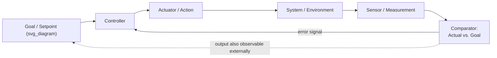

## First-Order Cybernetics: Control and Communication

### Overview

Cybernetics, from the Greek *kybernetes* ("steersman"), is the interdisciplinary study of control and communication in animals, machines, and organizations, formalized by Norbert Wiener in his 1948 book *Cybernetics: Or Control and Communication in the Animal and the Machine*. First-order cybernetics — the field's founding phase, running roughly from the late 1940s through the 1960s and closely associated with the Macy Conferences — treats the observer as standing *outside* the system being studied, analyzing how a system regulates itself through feedback, without the observer's own act of observation being considered part of the system under analysis. This positions first-order cybernetics as the direct theoretical foundation beneath much of the systems-thinking vocabulary already used throughout this course — feedback loops, goals, and self-regulation all originate in this body of work — while also setting up the contrast with second-order cybernetics (observing systems that include the observer), covered separately.

### Core Concepts

**Key Points**

- **Feedback**: Information about a system's output is returned as input to influence the system's subsequent behavior — the foundational mechanism underlying every causal loop diagram used elsewhere in this course.
- **Negative (balancing) feedback**: Feedback that opposes deviation from a goal state, driving the system back toward a setpoint — the cybernetic root of the "balancing loop" terminology used throughout the leverage-points and mental-models chapters (e.g., the thermostat analogy in Single-Loop versus Double-Loop Learning).
- **Positive (reinforcing) feedback**: Feedback that amplifies deviation, driving the system further from its current state — the cybernetic root of "reinforcing loop" terminology used throughout this course (e.g., compounding growth discussed under Cognitive Biases That Distort Systems Understanding).
- **Control**: The capacity of a system to maintain a desired state or trajectory despite disturbances, achieved through feedback rather than through rigid, disturbance-blind execution of a fixed plan.
- **Communication**: The transmission of information between a system's components (or between systems) that makes feedback and coordinated control possible in the first place — Wiener's title deliberately paired control and communication as two faces of the same underlying phenomenon.

### The Basic Cybernetic Control Loop

This loop — goal, controller, actuator, system, sensor, comparator, back to controller — is the canonical first-order cybernetic structure. It generalizes across domains Wiener explicitly intended it to span: a mechanical governor regulating an engine's speed, a physiological system regulating blood glucose, and an organization regulating its output against a target, are all instances of the same abstract control-loop structure.

### Formal Treatment: The Feedback Equation

For a simple linear control system, the relationship between the system's output $y$, its input $x$, and feedback gain $\beta$ can be expressed as:

$$y = \frac{G}{1 + G\beta}x$$

where $G$ is the open-loop gain of the controller and $\beta$ is the feedback gain (negative $\beta$ corresponds to negative feedback, damping deviation; positive $\beta$ corresponds to positive feedback, amplifying it). [Inference] This formalization originates in electrical engineering control theory rather than in Wiener's own writing specifically, but it is the standard mathematical representation used across cybernetics and control-theory textbooks to express the qualitative behavior first-order cybernetics describes verbally.

**Key Points**

- As $G\beta \rightarrow -1$ in a positive-feedback (amplifying) configuration, the denominator approaches zero and $y$ grows without bound — the formal signature of runaway reinforcing-loop behavior (e.g., an audio feedback squeal, a market bubble, an arms-race escalation).
- Negative feedback ($\beta < 0$) stabilizes $y$ even under substantial variation in $G$, formally capturing why negative-feedback control systems are robust to internal component variation and external disturbance in a way open-loop (feedback-free) systems are not.

### Homeostasis and Requisite Variety

Two concepts developed alongside first-order cybernetics are central to how it explains self-regulation:

- **Homeostasis** (a term drawn from physiologist Walter Cannon, adopted into cybernetics): The tendency of a system to maintain internal stability across a range of external disturbances through coordinated negative feedback mechanisms — the biological archetype being mammalian body-temperature regulation, which cyberneticists treated as a paradigm case for control systems generally.
- **Ashby's Law of Requisite Variety** (W. Ross Ashby): A controller can only successfully regulate a system if the controller possesses at least as much "variety" (range of possible responses) as the disturbances it must counteract.

$$V(\text{controller}) \geq V(\text{disturbance})$$

**Example**

- A thermostat with only two states (heat on / heat off) has limited variety and can only regulate temperature within a correspondingly limited band of disturbance conditions; a more sophisticated HVAC controller with variable output, humidity control, and zone-specific settings has greater requisite variety and can maintain a stable target across a wider range of external conditions (extreme cold, humidity swings, uneven room usage).
- [Inference] Ashby's Law is frequently invoked outside its original engineering context — for instance, in organizational design, to argue that a management structure must have response variety proportionate to the variety of situations frontline units encounter — though this extrapolation is an analogical application of the law's formal logic rather than a claim Ashby made about organizations specifically.

### Key Figures and the Macy Conferences

- **Norbert Wiener**: Coined the term and formalized the mathematics linking control engineering, neurophysiology, and communication theory into a single interdisciplinary framework.
- **W. Ross Ashby**: Developed the Law of Requisite Variety and the concept of the "homeostat," a mechanical device demonstrating self-regulating adaptive behavior, and wrote *An Introduction to Cybernetics* (1956), a foundational text.
- **Claude Shannon**: Though best known for information theory rather than cybernetics per se, Shannon's mathematical theory of communication (1948) supplied the formal treatment of information and signal transmission that cybernetics drew on for its communication half.
- **The Macy Conferences (1946–1953)**: A series of interdisciplinary meetings bringing together mathematicians, engineers, neuroscientists, anthropologists, and psychologists (including Wiener, Ashby, Margaret Mead, Gregory Bateson, and John von Neumann) that served as the primary forum in which first-order cybernetics was consolidated as a cross-disciplinary field.

### Cybernetics as the Foundation Beneath This Course's Systems-Thinking Vocabulary

**Key Points**

- Every causal loop diagram used throughout the preceding chapters of this course — reinforcing and balancing loops in the Leverage Points chapter, the reflexive belief loop in the Ladder of Inference, the governing-variable feedback loop in Single-Loop versus Double-Loop Learning — is a direct descendant of the first-order cybernetic control loop described here.
- The distinction between negative (goal-seeking, stabilizing) and positive (deviation-amplifying) feedback, introduced in this item in its original engineering formalism, is the same distinction that later chapters apply qualitatively to social, organizational, and ecological systems.
- Meadows' own systems-dynamics tradition (the source of the leverage points framework covered earlier in this course) is itself a direct intellectual descendant of first-order cybernetics, applying the control-loop concept to stocks, flows, and delays in social and economic systems.

### Limitations That Motivated Second-Order Cybernetics

First-order cybernetics' central limitation, as later critics (notably Heinz von Foerster) argued, is its assumption that the observer stands outside the system, describing its control loops from a neutral, external vantage point. This works well for engineered systems (a thermostat has no perspective on being observed) but becomes conceptually strained for systems involving human observers, social organizations, or any situation where the act of observing and modeling the system itself changes the system's behavior — a limitation directly addressed by second-order cybernetics.

**Key Points**

- [Inference] The move from first-order to second-order cybernetics is often described in the secondary literature as a shift from "the cybernetics of observed systems" to "the cybernetics of observing systems" — a formulation attributed to von Foerster, though exact phrasing and attribution vary slightly across sources.
- This limitation is structurally related to the Weltanschauung concept covered earlier in this course (Worldview and Weltanschauung in Systems Inquiry): both point to the same underlying issue that an observer's framework shapes what is perceived as "the system" and its boundary, rather than the system boundary being an objective, observer-independent fact.

**Related Topics**

- Second-Order Cybernetics: The Observer as Part of the System
- Ashby's Law of Requisite Variety in Organizational Design
- Homeostasis and Self-Regulating Systems
- Feedback Loop Formalism and Control Theory Foundations
- The Macy Conferences and the Interdisciplinary Origins of Systems Thinking
- Relationship Between Cybernetics and System Dynamics (Forrester)