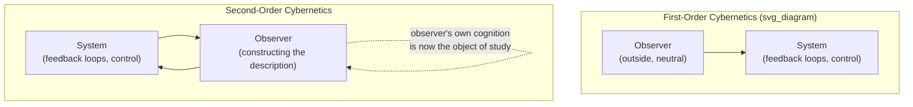

## Second-Order Cybernetics: The Observer in the System

### Overview

Second-order cybernetics is the reflexive turn within cybernetics that treats the observer as part of the system being observed, rather than as a neutral, external analyst describing a system's control loops from outside. Emerging primarily through the work of Heinz von Foerster from the late 1960s onward — and often summarized in his own phrase distinguishing "the cybernetics of observed systems" (first-order) from "the cybernetics of observing systems" (second-order) — the field directly addresses the limitation identified at the close of the previous item: that first-order cybernetics' external-observer stance breaks down for systems involving human perception, social organization, or any situation where observing and modeling a system changes the system itself.

### The Core Shift: From Observed System to Observing System

**Key Points**

- **First-order cybernetics** asks: "how does this system regulate itself?" — the observer's own perspective, biases, and involvement are treated as irrelevant to the analysis.
- **Second-order cybernetics** asks: "how does the observer's own cognitive and perceptual apparatus construct what counts as 'the system' and 'the feedback loop' in the first place?" — the act of observation is itself brought inside the frame of what is being studied.
- This is not merely an added caveat to first-order cybernetics — it is a categorically different question, since it makes the observer's role in constructing the system description a primary object of inquiry rather than a methodological detail to be minimized.

The diagram's second-order loop deliberately shows the observer both acting on the system description and being fed back into as an object of the same reflexive inquiry — there is no position outside the loop from which a final, observer-independent description of the system can be issued.

### Von Foerster's Key Contributions

- **"The cybernetics of observing systems"**: Von Foerster's reframing positioned the observer's nervous system, perceptual apparatus, and cognitive construction process as themselves cybernetic systems worthy of study, rather than as a transparent window onto an independently existing system.
- **Objectivity as a claim without an observer** ("objectivity is a subject's delusion that observing can be done without him"): [Inference] This aphorism, widely attributed to von Foerster in the secondary literature, captures the field's central epistemological claim — that any description of a system already encodes the describer's distinctions and choices, and cannot be fully separated from them.
- **Eigenforms / eigenvalues of cognition**: Von Foerster proposed that stable, recurring "objects" of perception and cognition can be understood as stable states (eigenvalues) that emerge from a recursive process of an observer repeatedly applying their own operations to their own outputs — a formal way of describing how what an observer treats as a persistent, real "thing" is itself a product of the observer's own recursive cognitive process rather than a directly given external fact.
- **Second-order effects on management and therapy cybernetics**: Von Foerster's ideas were extended into family therapy (via the Milan school) and organizational cybernetics, where the therapist or consultant's own presence and framing were recognized as inseparable from the system being described and intervened upon.

### Relationship to Radical Constructivism

Second-order cybernetics developed in close dialogue with radical constructivism, particularly the work of Ernst von Glasersfeld, which holds that knowledge is actively constructed by a cognizing subject rather than passively received as a direct copy of an external reality.

- **Key claim**: What an organism or observer "knows" about the world is not a mirror of objective reality but a viable model — one that has not yet been contradicted by experience — constructed through the observer's own perceptual and cognitive operations.
- **Structural coupling (Maturana and Varela)**: Related work by biologists Humberto Maturana and Francisco Varela on autopoiesis (self-producing living systems) reinforced the second-order cybernetic claim that a living system's perception of its environment is determined by its own internal organization, not by a neutral transcription of external stimuli — meaning two observers with different internal organizations can construct genuinely different, equally "viable" descriptions of the same environment.

**Key Points**

- [Inference] The relationship between second-order cybernetics and radical constructivism is generally described in the literature as mutually reinforcing rather than one being strictly derived from the other — both emerged from overlapping intellectual circles in the same period and converged on closely related claims about the observer-dependence of knowledge.

### Worked Example: Family Therapy Applying Second-Order Cybernetics

**Example**

- **First-order framing**: A family therapist observes a family system from outside, diagnosing a dysfunctional feedback loop (e.g., a child's misbehavior reinforcing a parent's overcontrolling response, which reinforces further misbehavior) and prescribes an intervention to break that loop, treating the therapist's own observation and framing as a neutral, unaffected description of the family's actual dynamics.
- **Second-order framing**: The therapist recognizes that their presence, questions, and theoretical framework actively shape what the family reports and how family members interpret their own behavior during the session — the "dysfunctional loop" the therapist identifies is partly a joint construction arising from the therapist-family interaction, not a pre-existing, independently observable fact about the family that exists identically whether or not the therapist is present.
- **Practical consequence**: Second-order-informed therapeutic approaches (associated with the Milan school of family therapy) explicitly incorporate the therapist's own hypotheses and interventions as part of the system under discussion, using techniques like circular questioning that invite family members to comment on each other's perceptions, rather than treating the therapist's diagnostic frame as an external, objective given.

### Implications for Systems-Thinking Practice

- **Weltanschauung and second-order cybernetics converge on the same epistemological point**: Checkland's insistence that "system" is an epistemological device rather than an objectively given entity (see Worldview and Weltanschauung in Systems Inquiry) is closely related to second-order cybernetics' claim that any system description is inseparable from the observer constructing it — [Inference] though the two traditions developed largely independently, with SSM drawing more directly on organizational action research and second-order cybernetics drawing more directly on biology, neurophysiology, and communication theory.
- **Facilitator/consultant reflexivity**: A practitioner using any of the methods covered in this course (SSM, causal loop diagramming, leverage-point analysis) is not a neutral external describer of the client system — the practitioner's own framing, questions, and prior assumptions actively shape which system description emerges, a second-order cybernetic point directly relevant to facilitation practice.
- **Limits on claiming a single "correct" system model**: Since second-order cybernetics holds that no observer-independent system description is available even in principle, it provides theoretical grounding for SSM's practice of maintaining multiple, parallel root definitions (Root Definitions of Purposeful Activity Systems) rather than seeking to converge on one final, objectively correct model.

### Critiques and Boundaries of Second-Order Cybernetics

- **Risk of epistemological relativism**: Critics have raised the concern that if all system descriptions are observer-constructed, it becomes unclear on what grounds one description could be judged better, more accurate, or more useful than another — a tension the field has addressed partly through von Glasersfeld's "viability" criterion (a construction is retained not because it is objectively true, but because it has not yet been contradicted by experience and continues to function adequately), though [Inference] whether viability fully resolves the relativism concern remains a point of ongoing philosophical debate rather than a settled matter.
- **Practical applicability**: Some practitioners have noted that second-order cybernetics' abstractions, while philosophically important, are less directly operationalizable into a step-by-step method compared with, for instance, SSM's CATWOE or the Strategic Choice Approach's decision-area mapping — its primary contribution is often described as a reflexive stance practitioners should hold while using other, more concrete methods, rather than a standalone method in its own right.

### Relationship to Other Course Concepts

- Second-order cybernetics provides the deepest theoretical grounding for the Weltanschauung concept and SSM's multiple-root-definition practice covered earlier in this course, even though the two traditions arose largely independently.
- It extends the first-order control-loop concepts covered in the previous item (First-Order Cybernetics: Control and Communication) by making the modeler's own act of drawing the control loop part of what needs to be examined, rather than treating the loop as a directly given, external fact.
- It offers a cybernetic-tradition parallel to the reflexive belief loop discussed under the Ladder of Inference — both describe a system (an observer's cognition, in each case) whose own outputs feed back to shape its subsequent inputs and constructions.

**Related Topics**

- First-Order Cybernetics: Control and Communication
- Radical Constructivism (von Glasersfeld) and Viable Knowledge
- Autopoiesis and Structural Coupling (Maturana and Varela)
- Worldview and Weltanschauung in Systems Inquiry
- Circular Questioning and the Milan School of Family Therapy
- Reflexivity in Facilitation and Systems Practice