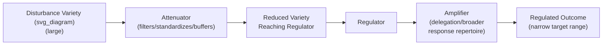

## Requisite Variety and Regulation

### Overview

Requisite Variety, formalized by W. Ross Ashby as the Law of Requisite Variety (sometimes called Ashby's Law), is a foundational theorem of cybernetics stating that a regulator can only successfully control a system's outcomes to the extent that the regulator possesses at least as much variety — as much range of distinguishable states or responses — as the disturbances it must counteract. Introduced briefly as a supporting concept in First-Order Cybernetics: Control and Communication, this item treats the law directly: its formal statement, derivation logic, quantitative expression via information theory, and its extensive application across engineering, biology, and organizational design.

### Formal Statement of the Law

Ashby's own formulation, often condensed to the phrase "only variety can destroy variety," states that if a regulator R is to hold a system's essential variable(s) within an acceptable range despite disturbances D acting on the system, the variety of R must be at least as great as the variety of D.

$$V(R) \geq V(D)$$

where $V(\cdot)$ denotes variety — the number of distinguishable states a system can exhibit or a regulator can distinguish and respond to.

**Key Points**

- "Variety," in Ashby's technical sense, is a count of distinguishable states, not a vague notion of complexity or flexibility — it is precisely quantifiable given a well-defined system.
- The law is a logical/mathematical result about the structure of regulation itself, not an empirical generalization that happens to hold in observed cases — Ashby derived it formally within his broader treatment of cybernetics as the science of regulation and control.
- The law applies regardless of domain: it holds identically whether the regulator is a thermostat, an immune system, a management team, or an automated trading algorithm, because it is a statement about the abstract relationship between variety in a regulator and variety in what it must regulate against, independent of the physical substrate involved.

### The Information-Theoretic Expression

Ashby connected variety to Shannon's information theory, expressing variety in terms of entropy (uncertainty) measured in bits:

$$V = \log_2(n)$$

where $n$ is the number of distinguishable states. The Law of Requisite Variety can then be restated: the entropy (uncertainty-reducing capacity) of the regulator's possible responses must be at least as large as the entropy of the disturbance it faces, for the regulator to reduce the outcome variable's variety down to the desired, narrow target range.

$$H(\text{Outcome}) \geq H(\text{Disturbance}) - H(\text{Regulator's Response Repertoire})$$

**Key Points**

- This framing makes explicit why "more information channels" and "more response options" are, from a cybernetic standpoint, functionally equivalent routes to increasing a regulator's effective variety — both increase the entropy term representing the regulator's capacity.
- A regulator's variety can come from either sensing more distinct disturbance states (better information) or being capable of more distinct responses (broader action repertoire); a deficiency in either can be a bottleneck, and the law does not by itself specify which side of the deficiency to address — that is a design decision made in light of the specific system.

### The Amplification and Attenuation Corollary

Because a regulator's own inherent variety is often smaller than the full variety of disturbances it faces, Ashby noted two complementary strategies for achieving requisite variety in practice, rather than requiring the regulator to match disturbance variety directly:

- **Variety amplification**: Increasing the regulator's effective variety, e.g., by giving it more sensors, more possible actions, more decision rules, or delegating decisions to sub-regulators that each handle a portion of the variety.
- **Variety attenuation**: Reducing the variety of disturbances the regulator actually has to handle, e.g., through standardization, filtering, buffering, or pre-processing that collapses many distinguishable disturbance states into fewer categories before they reach the regulator.

**Key Points**

- Most real-world regulatory designs use a combination of both strategies rather than relying purely on brute-force matching of variety — this is a practical corollary Ashby himself emphasized, since matching raw disturbance variety directly is frequently infeasible for a single regulator.
- Attenuation and amplification are themselves regulatory design choices, meaning the practical work of "achieving requisite variety" in an engineered or organizational system usually means designing the right combination of filters (attenuators) and delegated/expanded response capacity (amplifiers), not literally building a regulator with brute-force matching variety.

### Worked Example: Customer Service Escalation Design

**Example**

- **Disturbance variety**: A customer service operation faces an enormous range of distinct customer issues — billing errors, technical faults, complaints, refund requests, each with many sub-variants.
- **Naive (variety-mismatched) design**: A single-tier support system where every agent must be prepared to resolve every possible issue type has a regulator (the individual agent) whose variety is far smaller than the disturbance variety it faces, predicting poor and inconsistent outcomes — precisely what the Law of Requisite Variety would predict.
- **Attenuation applied**: A tiered intake system with a structured triage script collapses the wide range of raw customer issues into a smaller number of standardized categories before an agent ever engages, reducing the effective variety reaching any single agent.
- **Amplification applied**: Escalation paths to specialized agents or teams for categories that remain high-variety even after triage (e.g., complex billing disputes) effectively give the overall system a larger aggregate response repertoire than any single generalist agent could hold alone.
- **Outcome**: The overall system achieves requisite variety not by making every individual agent capable of matching the full disturbance variety, but by combining attenuation (triage) and amplification (specialist escalation, delegation) so that the *system's* aggregate variety, distributed across its components, meets or exceeds the variety of customer issues it must handle.

### Applications Beyond Engineering

- **Biological regulation**: The immune system is frequently cited as a biological instance of requisite variety in action — the adaptive immune system's capacity to generate an extremely large repertoire of distinct antibody structures (its "variety") is what allows it to counter the enormous variety of possible pathogen structures it may encounter, a rough biological parallel to Ashby's formal claim.
- **Organizational design (Stafford Beer's Viable System Model)**: Beer, a direct intellectual successor to Ashby, built an entire framework of organizational cybernetics (the Viable System Model, covered as a related topic) around the explicit application of requisite variety to management structure — arguing that a management layer must possess (through delegation, information systems, or standardized procedures) variety proportionate to the variety of situations the units it manages actually encounter, or regulation will fail.
- **Policy and regulatory design**: [Inference] The law is often invoked analogically in discussions of regulatory agencies overseeing complex industries, suggesting that a regulator with a narrow, fixed rulebook (low variety) will struggle to adequately govern an industry whose practices evolve with high variety over time — though this is an extrapolated application of Ashby's formal engineering result to a social-policy context, and should be read as an illustrative analogy rather than a direct, literally identical proof.

### Relationship to Policy Resistance and Unintended Consequences

Requisite Variety offers a formal cybernetic explanation for why some interventions covered earlier in this course fail structurally, rather than through poor execution:

- **Policy resistance reframed**: A policy intervention (see Policy Resistance and Why Interventions Fail) with low variety — a single, rigid rule applied uniformly — attempting to regulate a system with high behavioral variety among affected actors is, from Ashby's perspective, predictably likely to fail, since the regulator (the policy) does not possess requisite variety relative to the variety of ways actors can respond to and route around it.
- **Unintended consequences reframed**: The model-boundary explanation given in Unintended Consequences of Systemic Interventions (an intervention's model excludes real system variety) can be restated in Ashby's terms: the intervention's designer possessed less variety in their model than the real system's actual disturbance variety, guaranteeing gaps at the model's boundary where unaccounted-for variety produces unpredicted effects.

**Key Points**

- Requisite Variety is, in this sense, one of the deepest and most general formal explanations available in this course for why policy resistance and unintended consequences are structurally common rather than incidental design failures — they are frequently variety mismatches, expressible in Ashby's precise, quantifiable terms.

### Relationship to Other Course Concepts

- Requisite Variety is the formal cybernetic principle underlying the earlier, briefer mention in First-Order Cybernetics: Control and Communication, and provides the quantitative backbone (via Shannon entropy) for the qualitative discussion of feedback and control given there.
- It provides a structural, information-theoretic explanation for the leverage-point critique that low-leverage, parameter-level interventions are prone to policy resistance (Policy Resistance and Why Interventions Fail): a parameter tweak typically adds little regulator variety relative to the full variety of actor responses it must counteract.
- It underlies Stafford Beer's Viable System Model, the next natural extension of cybernetic organizational theory in this course's progression from control-loop fundamentals toward applied organizational cybernetics.

**Related Topics**

- First-Order Cybernetics: Control and Communication
- Stafford Beer's Viable System Model
- Variety Amplification and Attenuation in Organizational Design
- Policy Resistance and Why Interventions Fail
- Shannon's Information Theory and Entropy
- Immune System Regulation as a Biological Analogue of Requisite Variety