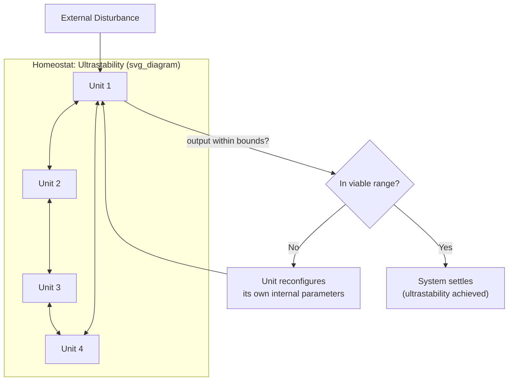

## Homeostasis and Self-Regulating Systems

### Overview

Homeostasis is the property of a system by which it actively maintains a set of essential internal variables within a stable, viable range despite ongoing external disturbances and internal perturbations, achieved through coordinated negative feedback mechanisms rather than through rigid, unchanging structure. Introduced briefly in First-Order Cybernetics: Control and Communication as one of the field's founding concepts, this item develops homeostasis directly: its physiological origin, its formal cybernetic treatment via Ashby's homeostat, the concept of essential variables and viability, and its extension to organizational and ecological self-regulation.

### Origin and Physiological Definition

The term originates with physiologist Walter Cannon (*The Wisdom of the Body*, 1932), who described how mammalian organisms maintain stable internal conditions — body temperature, blood glucose, blood pH, hydration — despite continuously varying external conditions, through coordinated physiological negative-feedback mechanisms.

**Key Points**

- Cannon's biological usage predates and directly informed cybernetics' formal adoption of the concept; Wiener and Ashby explicitly drew on physiological homeostasis as the paradigm case motivating the abstract, cross-domain treatment of self-regulation in cybernetics.
- Homeostasis is not stasis or the absence of change — it is *dynamic* stability, actively maintained through continuous corrective action in response to continuous disturbance, distinguishing it from a system that is simply inert or unchanging.
- A homeostatic system's stability is bounded: it can absorb disturbances up to some limit (a viability range), beyond which its regulatory mechanisms are overwhelmed and the essential variable moves outside the range the system can tolerate — a boundary condition with direct relevance to resilience and tipping-point discussions elsewhere in systems thinking.

### Essential Variables and Viability

Ashby formalized homeostasis around the concept of **essential variables**: a small set of internal variables (in a biological organism, things like body temperature or blood oxygen level) that must be kept within specific bounds for the system to continue existing as the kind of system it is. The system's entire regulatory apparatus can be understood, in Ashby's framework, as existing to keep these essential variables within their viable range, using whatever adjustments to non-essential variables are necessary to do so.

$$\text{System survives} \iff \forall i,\ L_i \leq E_i(t) \leq U_i$$

where $E_i(t)$ is the value of essential variable $i$ at time $t$, and $[L_i, U_i]$ is that variable's viable range.

**Key Points**

- Distinguishing essential from non-essential variables is itself a modeling choice with real consequences: a system may sacrifice stability in a non-essential variable in order to protect an essential one (e.g., an organism restricting peripheral blood flow — a non-essential adjustment — to protect core body temperature, an essential variable, during cold exposure).
- The essential-variable framing generalizes directly to organizational and ecological contexts: an organization might treat solvency and legal compliance as essential variables it will protect even at the cost of other, non-essential objectives (market share, growth rate) when the two come into conflict under stress.

### Ashby's Homeostat

Ashby built a physical device, the **homeostat** (1948), to demonstrate that self-regulating, adaptive behavior toward essential-variable stability could be produced by a relatively simple electromechanical system, without any centrally pre-programmed model of the specific disturbances it would face.

- **Mechanism**: The homeostat consisted of four interconnected units, each capable of altering its own internal configuration when its output moved outside an acceptable range, until the whole system settled into a configuration where all units' outputs remained within bounds — a demonstration of what Ashby called "ultrastability": stability achieved not by a fixed response to anticipated disturbances, but by a higher-order process of reconfiguring the system's own internal structure when ordinary regulation fails.
- **Significance**: The homeostat was one of the first physical demonstrations that adaptive, goal-seeking-looking behavior could emerge from a system with no explicit internal representation of its "goal" — the behavior emerged from the interaction of simple local rules (each unit correcting itself when its output left bounds) rather than from a centrally specified target the system was consciously pursuing.

### Levels of Regulatory Response

Cybernetic treatments of homeostasis typically distinguish two nested levels of response to disturbance:

- **First-order (ordinary) regulation**: The system's normal negative-feedback loop, correcting a deviation of an essential variable back toward its setpoint using its existing, fixed regulatory structure — analogous to a thermostat cycling heat on and off.
- **Second-order (ultrastable) regulation**: When ordinary regulation is insufficient to keep an essential variable within its viable range, the system alters its own internal structure or regulatory rules (as demonstrated by the homeostat's unit reconfiguration) to find a new configuration that restores viability — a structurally deeper form of adaptation than simply cycling the existing control loop.

**Key Points**

- [Inference] This two-level structure is often noted, in the secondary literature, as anticipating the single-loop versus double-loop learning distinction covered earlier in this course (Single-Loop versus Double-Loop Learning): ordinary regulation parallels single-loop correction (adjust the action, keep the governing structure fixed), while ultrastable reconfiguration parallels double-loop learning (revise the governing structure itself) — though Ashby's homeostat work and Argyris and Schön's organizational-learning work developed independently, in different disciplinary traditions, and the parallel is best treated as a structural analogy rather than a documented direct influence.

### Worked Example: Organizational Homeostasis Under Revenue Disruption

**Example**

- **Essential variable**: Cash runway (months of operating expenses covered by available cash) must remain above a minimum viable threshold for the organization to continue operating.
- **Ordinary (first-order) regulation**: A sudden drop in revenue triggers existing, pre-established cost controls — deferring discretionary spending, pausing hiring — using the organization's existing budget-management process without any structural change to how the organization operates.
- **Disturbance exceeds ordinary regulation's capacity**: If the revenue drop is large enough that discretionary cost controls alone cannot keep cash runway above the viable threshold, ordinary regulation is insufficient.
- **Ultrastable (second-order) response**: The organization restructures itself — exiting a product line, renegotiating supplier contracts, changing its core business model — altering its own internal structure rather than merely adjusting existing spending levers, in order to bring cash runway back within a viable range under the new, harsher revenue conditions.
- **Relation to essential-variable tradeoffs**: This restructuring may sacrifice non-essential variables (market share, product breadth, headcount) explicitly to protect the essential variable (solvency), directly illustrating the essential/non-essential distinction introduced above.

### Homeostasis versus Homeorhesis and Morphogenesis

- **Homeostasis**: Maintaining a *fixed* setpoint or narrow range for an essential variable over time (e.g., constant body temperature).
- **Homeorhesis** (a related but distinct concept, from developmental biology): Maintaining a stable *trajectory* of change over time, rather than a fixed value — relevant to systems that are expected to develop or grow along a particular path and to resist deviation from that path, rather than resist all change.
- **Morphogenesis**: The generation of new structure or pattern, standing in contrast to homeostasis's maintenance of existing structure — a system exhibiting morphogenesis is changing its own form, not correcting deviations from a fixed form, connecting back to Ashby's ultrastability concept where structural reconfiguration itself becomes the adaptive mechanism.

**Key Points**

- [Inference] These distinctions matter for systems-thinking practice because treating a system's current state as something to be homeostatically defended, when the system's actual healthy functioning requires homeorhetic (trajectory-following) change or even morphogenetic (structural) transformation, can lead to intervention designs that suppress necessary change rather than support it — though which framing applies to a given real system is a substantive judgment call rather than something derivable from the terminology alone.

### Relationship to Requisite Variety

Homeostatic regulation is directly governed by Ashby's Law of Requisite Variety (Requisite Variety and Regulation): a homeostatic system can only maintain its essential variables within their viable range if its regulatory variety is at least as great as the variety of disturbances it faces. The homeostat's ultrastability mechanism can be understood as a way of increasing the system's effective variety on demand — by reconfiguring itself, the system generates new response options beyond its original, fixed regulatory repertoire, directly implementing variety amplification (introduced in the previous item) as an emergency capability triggered specifically when ordinary regulation proves insufficient.

### Relationship to Other Course Concepts

- Homeostasis operationalizes the abstract control-loop concept introduced in First-Order Cybernetics: Control and Communication into the specific, biologically grounded concept of essential-variable maintenance, giving the earlier chapter's control-loop diagram a concrete physiological and organizational referent.
- Its two-level (ordinary/ultrastable) regulatory structure provides a cybernetic precursor and structural parallel to single-loop versus double-loop learning (Single-Loop versus Double-Loop Learning), extending that distinction's relevance beyond organizational learning into general self-regulating system behavior.
- It depends directly on Requisite Variety (Requisite Variety and Regulation) as its formal governing law, and anticipates the Viable System Model's more extensive organizational application of essential-variable regulation and structural adaptation.

**Related Topics**

- First-Order Cybernetics: Control and Communication
- Requisite Variety and Regulation
- Ashby's Homeostat and Ultrastability
- Single-Loop versus Double-Loop Learning
- Stafford Beer's Viable System Model
- Resilience, Tipping Points, and Loss of Viability in Complex Systems