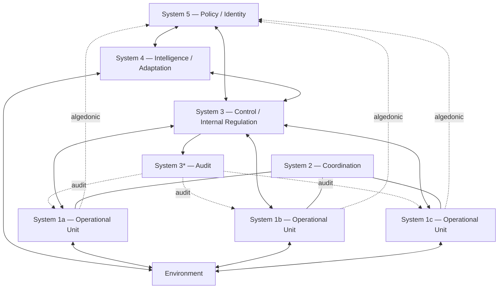

## The Viable System Model

### Overview

The Viable System Model (VSM) is a cybernetic model developed by Stafford Beer for diagnosing and designing organizations capable of maintaining independent existence within a changing environment. Rather than describing what an organization produces, VSM describes the structural and communicational relationships an organization must have to remain "viable" — meaning capable of adapting, surviving, and self-regulating as conditions change. It applies recursively: a viable system is composed of viable systems, and is itself a component of a larger viable system.

VSM emerged from Beer's application of cybernetic principles (feedback, variety, homeostasis) to management and organizational structure, most fully articulated in his trilogy *Brain of the Firm*, *The Heart of Enterprise*, and *Diagnosing the System for Organizations*.

### Foundational Concepts

**Viability**

A system is viable if it can maintain a separate existence, adapting to a changing environment over time. Viability is not about optimality or efficiency in a static sense — it is about sustained capacity to respond to disturbance and change without losing identity.

**Requisite Variety**

VSM rests heavily on Ashby's Law of Requisite Variety: only variety can absorb variety. A regulating system must possess as much variety (range of possible states/responses) as the system it regulates, or it cannot control it. Organizational design under VSM is largely the design of variety engineering — amplifying the variety of control mechanisms and attenuating the variety of the environment so the two can be matched.

**Recursion**

VSM is recursive: any viable system contains viable systems, and is itself contained within a viable system of the next higher order. Each recursive level exhibits the same five-subsystem structure. This is formalized as the **Recursive System Theorem**: if a viable system contains a viable system, the organizational structure of both must be isomorphic.

### The Five Subsystems

VSM decomposes any viable system into five interacting subsystems, labeled System 1 through System 5.

#### System 1 — Operations

The primary activities that produce the organization's core purpose — the actual "doing" units. Each System 1 element is itself a viable system (recursively containing its own Systems 1–5) and interacts directly with the environment relevant to its operation.

- Represents the semi-autonomous operational divisions or units
- Each has direct environmental contact and its own local management
- Multiple System 1 units typically exist in parallel

#### System 2 — Coordination

Handles coordination between System 1 units to prevent oscillation, conflict, or destructive resource competition. System 2 is anti-oscillatory — it dampens conflicts arising from the interaction of otherwise autonomous operational units.

- Examples: shared scheduling systems, standard operating procedures, common information systems
- Does not command System 1; it provides shared mechanisms so units self-coordinate

#### System 3 — Control (Internal Regulation, "Here and Now")

Responsible for the internal, immediate regulation of the organization — resource allocation, synergy between System 1 units, and overall internal stability. System 3 interprets policy from System 5 into operational directives and monitors System 1 performance.

- Negotiates resource bargains with System 1 units
- Optimizes the "inside and now" of the organization
- Contains **System 3*** (System 3-star): a sporadic, direct audit channel that bypasses normal reporting lines to verify System 1 conditions independently (e.g., spot audits, direct inspections)

#### System 4 — Intelligence (External Adaptation, "Outside and Then")

Responsible for looking outward and forward — environmental scanning, strategic planning, market intelligence, and forecasting. System 4 balances System 3's internal focus with awareness of external threats and opportunities.

- Manages the organization's model of its environment and its own future
- Mediates between System 3 (internal stability) and System 5 (identity/purpose)
- The System 3–4 homeostat is a key balancing loop: too much System 3 dominance produces an inward-looking, rigid organization; too much System 4 dominance produces a chaotic, change-obsessed one lacking operational discipline

#### System 5 — Policy (Identity and Ethos)

Provides overall identity, purpose, values, and ultimate authority. System 5 balances the internal (System 3) and external (System 4) perspectives, resolves conflicts between them, and maintains the organization's ethos — its "closure" as an identifiable, self-consistent system.

- Sets the organization's fundamental purpose and constraints
- Does not micromanage operations; intervenes primarily in balancing System 3/4 tension or during identity-level crises

### Communication Channels

VSM specifies not just subsystems but the **channels** connecting them, each with a required variety-carrying capacity:

- **Command axis**: System 5 → 4 → 3 → 1 (policy translated into operational directives)
- **Resource bargain channel**: System 3 ↔ System 1 (negotiated resource allocation and accountability)
- **Coordination channel**: System 1 ↔ System 1 via System 2
- **Audit channel**: System 3* → System 1 (sporadic direct monitoring)
- **Algedonic channel**: An alert signal that bypasses the normal hierarchy entirely, going straight from System 1 (or any level) to System 5 when a disturbance is severe enough to threaten viability — analogous to a pain/pleasure signal in a nervous system

The **algedonic signal** is one of VSM's most distinctive mechanisms: it exists precisely because normal reporting channels may be too slow or too filtered to convey existential threats in time.

### Diagram: The Five Systems and Channels

### SVG: Recursive Nesting Concept (svg_diagram)

<svg xmlns="http://www.w3.org/2000/svg" viewBox="0 0 640 320">
<text x="320" y="24" font-size="15" font-weight="bold" text-anchor="middle" fill="#1a1a1a">Recursive Structure of the VSM (svg_diagram)</text>
<rect x="20" y="50" width="600" height="250" rx="10" fill="none" stroke="#2b6cb0" stroke-width="2" />
<text x="35" y="75" font-size="13" fill="#2b6cb0">Organization (Recursion Level 0)</text>
<rect x="50" y="90" width="150" height="190" rx="8" fill="none" stroke="#805ad5" stroke-width="2" />
<text x="60" y="110" font-size="11" fill="#805ad5">System 1a (Level 1)</text>
<rect x="70" y="125" width="50" height="50" rx="6" fill="none" stroke="#38a169" stroke-width="1.5" />
<text x="80" y="145" font-size="9" fill="#38a169">S1</text>
<rect x="130" y="125" width="50" height="50" rx="6" fill="none" stroke="#38a169" stroke-width="1.5" />
<text x="140" y="145" font-size="9" fill="#38a169">S3</text>
<rect x="70" y="185" width="50" height="50" rx="6" fill="none" stroke="#38a169" stroke-width="1.5" />
<text x="80" y="205" font-size="9" fill="#38a169">S4</text>
<rect x="130" y="185" width="50" height="50" rx="6" fill="none" stroke="#38a169" stroke-width="1.5" />
<text x="140" y="205" font-size="9" fill="#38a169">S5</text>
<rect x="245" y="90" width="150" height="190" rx="8" fill="none" stroke="#805ad5" stroke-width="2" />
<text x="255" y="110" font-size="11" fill="#805ad5">System 1b (Level 1)</text>
<rect x="450" y="90" width="150" height="190" rx="8" fill="none" stroke="#805ad5" stroke-width="2" />
<text x="460" y="110" font-size="11" fill="#805ad5">System 1c (Level 1)</text>

<text x="320" y="310" font-size="11" text-anchor="middle" fill="#555">Each System 1 unit is itself a full VSM (isomorphic structure)</text>

</svg>

### Worked Example — Applying VSM to a Software Development Organization

Mapping the batac-dms-style organization structure onto VSM:

- **System 1**: Development teams delivering features (e.g., document intake, records search, workflow approvals) — each team operates semi-autonomously against its own backlog
- **System 2**: Shared CI/CD pipelines, coding standards, sprint calendars, and shared component libraries that prevent teams from conflicting or duplicating effort
- **System 3**: Engineering management allocating headcount and infrastructure budget across teams, monitoring velocity and incident rates
- **System 3***: Ad hoc code audits, security reviews, or unannounced production health checks
- **System 4**: Technology strategy function — evaluating new frameworks, tracking regulatory/compliance changes (e.g., government data retention rules), planning migrations
- **System 5**: Executive/product leadership setting organizational mission (e.g., "digitize LGU records reliably and securely") and resolving System 3/4 tension (e.g., "should we pause feature delivery to adopt a new architecture?")
- **Algedonic signal**: A critical production outage or data breach bypassing normal ticketing and escalating directly to leadership

### Diagnostic Use of VSM

VSM is used as a **diagnostic tool** to identify structural pathologies in existing organizations:

| Pathology | Symptom | Typical Cause |
| --- | --- | --- |
| Oscillation between units | Recurring conflict, duplicated work | Missing or weak System 2 |
| Internal focus, blindsided by market shifts | Strategy lags reality | Underdeveloped System 4 |
| Chaotic strategic churn, operational instability | Constant reorganization, low delivery | System 4 dominance over System 3 |
| Identity drift, inconsistent decisions | Conflicting priorities across divisions | Weak or absent System 5 |
| Slow crisis response | Executives learn of failures late | Missing or blocked algedonic channel |
| Micromanagement | Loss of local autonomy in System 1 | System 3 exceeding variety-absorption remit, violating requisite autonomy |

[Inference] The specific pathology diagnosis in any real organization depends on empirical investigation of actual information flows, not just formal org charts, since documented reporting lines often diverge from actual communication channels.

### Relationship to Other Cybernetic Concepts

- **Ashby's Law of Requisite Variety**: Directly underlies the variety-engineering rationale for every VSM channel and subsystem
- **Homeostasis**: The System 3–4 balance and System 5's identity-preserving role are explicitly modeled as homeostatic loops
- **Second-order cybernetics**: VSM's recursive, self-referential structure (a viable system containing viable systems) reflects second-order cybernetic concerns with self-organization and observer-inclusive systems
- **Feedback control theory**: System 1's environmental interaction and System 3's resource bargaining constitute nested feedback loops

### Limitations and Critiques

- [Unverified] Some organizational theorists argue VSM's biological/neurological metaphor (borrowed from human nervous system anatomy) does not map cleanly onto human social organizations, where actors have agency, politics, and competing interests not present in neurons
- Practical application requires significant training in the model's terminology and diagnostic method, limiting adoption compared to simpler frameworks (e.g., RACI matrices, org charts)
- Critics note VSM can be used descriptively (diagnosing pathology) or prescriptively (designing structure), and the model does not itself resolve which normative structure is "correct" — that remains a political/managerial choice
- [Speculation] The model's rigor and internal consistency can create a false sense of completeness — comprehensive variety mapping is more feasible on paper than in dynamic, real-world organizations

### Key Points

- VSM is a recursive, five-subsystem cybernetic model (Systems 1–5) for organizational viability
- Requisite variety and homeostasis are the theoretical foundations
- The algedonic channel provides an emergency bypass around normal hierarchy
- System 3/4 balance determines whether an organization is too rigid or too chaotic
- VSM is primarily diagnostic — identifying structural pathology from communication-channel deficiencies

**Related Topics**

- Ashby's Law of Requisite Variety
- Second-Order Cybernetics and Autopoiesis
- Homeostasis and Feedback Control Loops
- Organizational Cybernetics (Beer's broader body of work)
- Team Syntegrity (Beer's later non-hierarchical decision model)
- Soft Systems Methodology (Checkland) as a contrasting systems approach