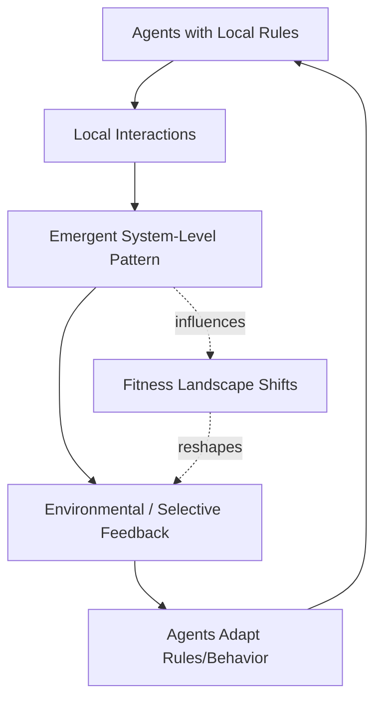

## Complex Adaptive Systems Fundamentals

### Overview

A Complex Adaptive System (CAS) is a system composed of many interacting components ("agents") whose collective behavior gives rise to properties not present in, or predictable from, any individual component. CAS theory emerged from work at institutions like the Santa Fe Institute (with contributors including John Holland, Murray Gell-Mann, and Stuart Kauffman) as a framework spanning biology, economics, ecology, sociology, and computer science.

Unlike simple mechanical systems, which can be understood by decomposing them into parts and analyzing each in isolation, CAS require studying the interactions between parts, because it is precisely those interactions — not the parts themselves — that produce the system's characteristic behavior.

### Core Defining Properties

**1. Agents**

CAS consist of multiple agents — components capable of some form of independent behavior, decision-making, or state change (e.g., organisms, traders, neurons, cells, firms). Agents follow local rules and typically have only partial, local information about the system as a whole.

**2. Interaction and Interconnection**

Agents interact with each other and with the environment. These interactions are typically nonlinear — small changes in interaction rules or initial conditions can produce disproportionately large changes in outcomes.

**3. Emergence**

System-level patterns, structures, or behaviors arise from agent interactions without being explicitly programmed or centrally directed. Emergent properties are not reducible to the sum of individual agent properties.

**4. Self-Organization**

Order arises spontaneously from local interactions, without external control or a central controller imposing global structure. This differs from top-down "organization by design."

**5. Adaptation**

Agents (and the system as a whole) adjust their behavior/rules based on experience, feedback, or environmental change. This is the "adaptive" component distinguishing CAS from merely "complex" systems (which may be intricate but static).

**6. Nonlinearity**

Outputs are not proportional to inputs. Feedback loops (both amplifying/positive and dampening/negative) are pervasive, producing behavior that cannot be predicted by linear extrapolation.

**7. Path Dependence and History**

The current state of a CAS depends on its specific historical trajectory, not just current conditions — the same starting conditions can lead to different outcomes depending on the sequence of events (sensitive dependence).

**8. Co-Evolution**

Agents evolve in response to each other; changes in one part of the system alter the fitness landscape for other parts, driving continuous mutual adaptation.

### CAS vs. Merely Complicated Systems

| Property | Complicated System | Complex Adaptive System |
| --- | --- | --- |
| Predictability | High, given full information | Low, even with full information (due to nonlinearity/sensitivity) |
| Decomposability | Parts can be studied independently | Interactions dominate; parts are not independently meaningful |
| Behavior source | Explicit design/engineering | Emergent from local rules |
| Response to perturbation | Proportional | Often disproportionate (nonlinear) |
| Example | A jet engine | An ant colony, a market, an ecosystem, an immune system |

A jet engine has thousands of parts but is *complicated*, not complex: each part's function is fully specified by design, and the whole is (in principle) fully predictable from specifications. An ant colony is *complex*: no single ant "knows" the colony's foraging strategy; it emerges from simple local rules (e.g., pheromone trail following) executed by many agents.

### Edge of Chaos

A frequently cited (though debated) concept in CAS theory: complex adaptive systems tend to exhibit the richest, most adaptive behavior when operating near a boundary region between excessive order (rigid, unresponsive) and excessive disorder (chaotic, unable to maintain structure) — termed the **edge of chaos**.

- Systems too far toward order are stable but cannot adapt to novel conditions
- Systems too far toward chaos cannot maintain coherent structure or accumulate useful adaptations
- [Contested] The edge-of-chaos hypothesis, popularized by Christopher Langton's cellular automata research and Stuart Kauffman's NK fitness landscape models, is not universally accepted as a precise or measurable property; some researchers argue it is better understood as a suggestive metaphor than a rigorously demonstrated general law

### Fitness Landscapes (Kauffman's NK Model)

A **fitness landscape** is a conceptual space where each point represents a possible configuration of a system, and the "height" represents that configuration's fitness/performance. Agents/systems evolve by moving across this landscape, typically via local search (small mutations/changes), seeking higher-fitness configurations.

- **N** = number of components in the system
- **K** = degree of interdependency between components (how many other components each component's fitness contribution depends on)
- Low K: smooth, single-peaked landscapes — easy to optimize via simple hill-climbing
- High K: "rugged" landscapes with many local peaks — hill-climbing gets trapped in local optima; global optimization becomes computationally intractable
- This model is used to explain why some systems evolve toward good-but-not-optimal solutions and why radical innovation may require "landscape-jumping" moves rather than incremental improvement

### Feedback Loops in CAS

- **Positive (reinforcing) feedback**: amplifies deviations, driving exponential growth or runaway divergence (e.g., viral adoption, market bubbles, autocatalytic chemical reactions)
- **Negative (balancing) feedback**: dampens deviations, driving the system toward equilibrium or a stable state (e.g., predator-prey population regulation, thermostatic control, homeostasis)
- Real CAS typically contain many interacting positive and negative feedback loops simultaneously, at different time scales, producing complex dynamics (oscillation, punctuated equilibrium, chaotic attractors) rather than simple convergence or divergence

### Diagram: CAS Core Dynamic Loop

### SVG: Fitness Landscape Ruggedness (svg_diagram)

<svg xmlns="http://www.w3.org/2000/svg" viewBox="0 0 640 300">
<text x="320" y="24" font-size="15" font-weight="bold" text-anchor="middle" fill="#1a1a1a">Smooth vs Rugged Fitness Landscape (svg_diagram)</text>

<text x="150" y="55" font-size="12" text-anchor="middle" fill="`#2b6cb0`" font-weight="bold">Low K (Smooth)</text>

<path d="M40,220 Q150,60 260,220" fill="none" stroke="`#2b6cb0`" stroke-width="2.5" />

<circle cx="150" cy="80" r="4" fill="`#2b6cb0`" />

<text x="150" y="70" font-size="9" text-anchor="middle" fill="`#2b6cb0`">global peak</text>

<line x1="40" y1="220" x2="260" y2="220" stroke="#999" stroke-width="1" />

<text x="490" y="55" font-size="12" text-anchor="middle" fill="`#c05621`" font-weight="bold">High K (Rugged)</text>

<path d="M380,220 Q410,120 440,180 Q460,90 490,150 Q520,60 550,160 Q570,110 600,220" fill="none" stroke="`#c05621`" stroke-width="2.5" />

<circle cx="520" cy="63" r="4" fill="`#c05621`" />

<text x="520" y="53" font-size="9" text-anchor="middle" fill="`#c05621`">global peak</text>

<circle cx="410" cy="123" r="4" fill="`#975a16`" />

<text x="410" y="113" font-size="9" text-anchor="middle" fill="`#975a16`">local peak (trap)</text>

<line x1="380" y1="220" x2="600" y2="220" stroke="#999" stroke-width="1" />

<text x="150" y="260" font-size="10" text-anchor="middle" fill="#333">Hill-climbing reliably finds global peak</text>

<text x="490" y="260" font-size="10" text-anchor="middle" fill="#333">Hill-climbing gets trapped in local peaks</text>

</svg>

### Modeling Approaches for CAS

**Agent-Based Modeling (ABM)**

The dominant simulation methodology for CAS: individual agents are programmed with local decision rules and interaction protocols; the model is run forward in time; system-level patterns are observed as emergent outputs rather than specified inputs. Notable platforms/frameworks: NetLogo, Repast, Mesa (Python).

**Cellular Automata**

Grid-based discrete models where each cell's state updates based on a fixed local rule referencing neighboring cells' states (e.g., Conway's Game of Life). Used to study emergence and the edge-of-chaos hypothesis (Wolfram's classification of CA behavior into four classes: fixed, periodic, chaotic, and "complex"/edge-of-chaos).

**Network/Graph-Theoretic Models**

CAS are frequently modeled as networks (nodes = agents, edges = interactions), enabling analysis via network science metrics (degree distribution, clustering coefficient, small-world properties, scale-free structure) to understand how topology shapes system-level dynamics.

**System Dynamics (Stock-and-Flow Models)**

A complementary, more aggregate modeling approach (associated with Jay Forrester) representing the system via stocks, flows, and feedback loops using differential/difference equations rather than discrete agents — useful for macro-level CAS behavior but does not capture agent heterogeneity or emergence in the same granular way as ABM.

### Worked Example — Software Ecosystem as a CAS

Framing a technology ecosystem (e.g., an open-source package ecosystem, or the interacting microservices/teams around a platform like batac-dms) using CAS vocabulary:

- **Agents**: individual developers, teams, or services, each following local rules (coding conventions, release cadence, personal incentives)
- **Interactions**: dependency relationships, API contracts, pull requests, communication channels
- **Emergence**: overall system reliability, architectural coherence, or technical debt accumulation emerges from many local decisions, not from any single specification
- **Feedback**: incident postmortems (negative feedback, correcting behavior) vs. viral internal adoption of a convenient but poorly-vetted pattern (positive feedback, potentially harmful)
- **Fitness landscape framing**: refactoring choices exist on a landscape where local improvements (removing one team's tech debt) may be trapped in a local optimum relative to a global architectural redesign
- [Inference] This framing is useful for reasoning about why purely top-down architectural mandates often fail to produce intended system-wide behavior — the emergent behavior results from the aggregate of local incentives, not the mandate text itself

### Common Misconceptions

- **CAS is not synonymous with "complicated."** A system with many parts but fully specified, centrally designed behavior (e.g., a large but conventional software monolith with no adaptive/learning behavior) is complicated, not necessarily complex-adaptive, unless its components exhibit genuine local autonomy and adaptive feedback.
- **Emergence does not imply unpredictability in all respects.** Many emergent properties are statistically predictable in aggregate (e.g., traffic flow patterns) even though individual agent behavior is not.
- **Self-organization does not mean "no constraints."** Agents still operate under rules/constraints; the absence of a central *controller* does not mean the absence of *structure* shaping interactions.

### Key Points

- CAS = many interacting, adaptive agents producing emergent, nonlinear, path-dependent system behavior
- Distinguished from "merely complicated" systems by irreducibility of the whole to independently-analyzable parts
- Edge-of-chaos and NK fitness-landscape models are influential (though contested) explanatory frameworks
- Agent-based modeling is the primary simulation tool for studying CAS behavior
- Feedback loops (positive/negative) operating at multiple scales generate the rich dynamics characteristic of CAS

**Related Topics**

- Emergence and Downward Causation
- Agent-Based Modeling Techniques (NetLogo, Mesa)
- Ashby's Law of Requisite Variety
- Autopoiesis and Self-Producing Systems
- Network Science: Small-World and Scale-Free Networks
- Punctuated Equilibrium and Path Dependence