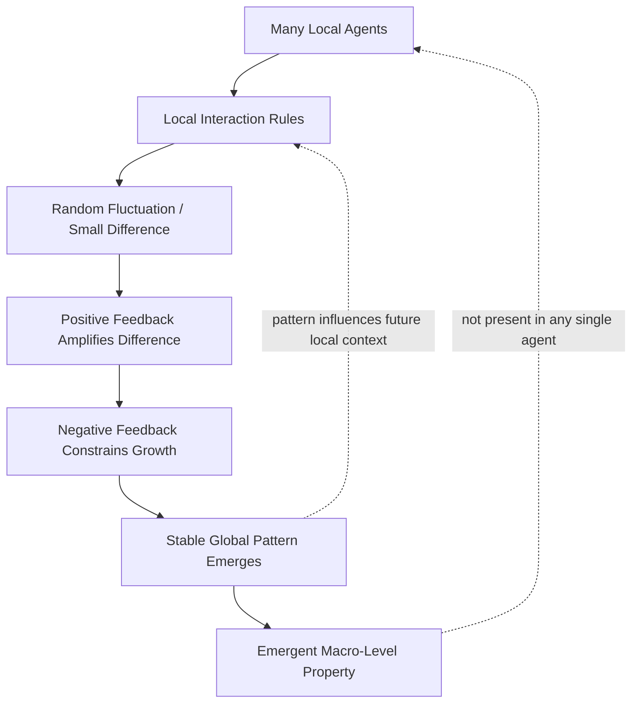

## Self-Organization and Emergence

### Definition

**Self-organization** is the process by which a system develops global structure, pattern, or order spontaneously from local interactions among its components, without central control, external design, or a blueprint dictating the outcome. **Emergence** is the closely related concept describing properties, behaviors, or patterns that exist at the system (macro) level but are not present in, or directly deducible from, any single component in isolation — they arise from the interactions among components. Self-organization is a *process*; emergence is the *outcome* or *property* that process produces. The two are usually discussed together because self-organizing systems are the primary source of genuinely emergent phenomena.

### Core Concepts

**Local rules, global pattern**: Every component follows simple rules based only on local information — its own state and the state of its immediate neighbors or interactions. No component has access to or responds to the global pattern. The global pattern nonetheless emerges as a coherent structure, purely from the aggregate of local interactions repeated across many components and iterations.

**Absence of central control**: There is no conductor, blueprint, or external controller directing the outcome. Order arises "from the bottom up," in contrast to designed or engineered order, which is imposed "from the top down."

**Novelty and irreducibility**: Emergent properties are often described as irreducible — they cannot be fully explained, predicted, or derived by analyzing components individually, even with complete knowledge of each component's rules. [Inference] The degree to which emergent properties are *in principle* unpredictable from component rules (as opposed to merely difficult to predict in practice) is itself a matter of ongoing philosophical and scientific debate — "weak emergence" (predictable in principle via simulation, but not by direct analytic derivation) is generally accepted, while "strong emergence" (irreducible even in principle) remains contested.

**Levels of description**: Self-organizing systems typically exhibit multiple levels — a micro level (individual agents/components and their local rules) and a macro level (the emergent pattern). Behavior at the macro level often requires different concepts, vocabulary, or models entirely distinct from those used to describe the micro level (e.g., "traffic jam" as a macro concept doesn't exist in the physics of a single car).

### Necessary Conditions for Self-Organization

- **Many interacting components**: A sufficient number of agents/elements must be present for statistical and interaction effects to produce stable patterns rather than noise.
- **Local interaction rules**: Components must interact with neighbors (spatial, network, or informational neighbors) rather than requiring global information.
- **Positive feedback (amplification)**: Small initial fluctuations or differences are amplified rather than damped, allowing a pattern to "take hold" and grow (e.g., a slightly stronger pheromone trail attracts more ants, which reinforces the trail further).
- **Negative feedback (constraint/stabilization)**: Some balancing mechanism prevents unbounded amplification and stabilizes the pattern once it forms (e.g., resource depletion, saturation, competition).
- **Openness / energy-matter flow (for dissipative structures)**: Many self-organizing physical and biological systems are open systems, exchanging energy or matter with their environment; they maintain organized structure far from thermodynamic equilibrium by continuously dissipating energy (Prigogine's concept of dissipative structures).
- **Randomness or variability as a driver**: Random fluctuations often act as the initial "seed" that positive feedback then amplifies into a definite pattern, meaning self-organizing systems typically require some stochastic element rather than being purely deterministic from a single fixed starting condition.

### Mechanism Diagram (svg_diagram)

### Types and Examples

**Physical/Chemical Systems**

- **Bénard convection cells**: A fluid heated from below spontaneously organizes into regular hexagonal convection cells once a critical temperature gradient is crossed — a classic example of a dissipative structure.
- **Belousov-Zhabotinsky reaction**: A chemical reaction that spontaneously produces oscillating, self-organizing spatial patterns (spirals, waves) far from equilibrium.
- **Crystal formation**: Atoms/molecules following simple bonding rules self-assemble into ordered lattice structures.

**Biological Systems**

- **Ant colony foraging**: Individual ants follow simple pheromone-based rules (lay pheromone when carrying food, follow stronger pheromone trails). The colony as a whole "solves" shortest-path foraging problems with no ant having a global map — a strong example of **stigmergy** (indirect coordination through modification of a shared environment).
- **Flocking/schooling behavior**: Birds or fish follow simple local rules (align with neighbors, maintain minimum separation, move toward local center of mass) — famously modeled in Craig Reynolds' "Boids" simulation — producing coherent, fluid group-level motion with no leader.
- **Termite mound construction**: Termites follow local stigmergic rules based on pheromone-laden building material, collectively constructing complex, functionally ventilated mound architecture with no architect or blueprint.
- **Cellular differentiation and morphogenesis**: Genetically identical cells self-organize into differentiated tissues and organ structures through local chemical signaling gradients (related to Turing's reaction-diffusion models).

**Social and Economic Systems**

- **Market price formation**: In a decentralized market, no single agent sets the "market price," yet a stable price emerges from the aggregate of many local buy/sell decisions — a canonical example of emergence in economics (related to Adam Smith's "invisible hand").
- **Urban neighborhood formation**: Residential/commercial clustering patterns emerge from local individual location decisions (e.g., Schelling's segregation model, where mild individual preferences produce strong emergent segregation patterns at the city level).
- **Traffic jams ("phantom jams")**: A traffic jam can emerge and propagate backward through a line of cars from purely local driver behavior (following distance, reaction time), with no single cause, obstruction, or "leader" car required.

**Computational/Artificial Systems**

- **Cellular automata (e.g., Conway's Game of Life)**: Extremely simple local update rules on a grid produce a vast range of complex emergent structures — gliders, oscillators, and even Turing-complete computation — from rules with no reference to those higher-level structures.
- **Swarm robotics**: Robots programmed with only local sensing and simple rules collectively perform complex tasks (mapping, object clustering, formation control) without centralized coordination.
- **Neural networks / deep learning**: Individual neurons/weights encode no recognizable high-level concept, yet the trained network as a whole exhibits emergent capabilities (feature detection, in large language models even reasoning-like behavior) not explicitly programmed. [Inference] The extent to which large-model capabilities should be characterized as "emergent" in the strict complexity-science sense, versus a smooth (if steep) scaling phenomenon, remains an actively debated question in the ML research community.

### Formal/Mathematical Framing

Self-organization is frequently modeled using:

- **Agent-based models (ABMs)**: Discrete agents with individual state and rule sets, simulated over many time steps, with the aggregate pattern observed as an emergent output (e.g., NetLogo, Mesa).
- **Reaction-diffusion equations**: Partial differential equations of the general form

$$\frac{\partial u}{\partial t} = D_u \nabla^2 u + f(u, v)$$

$$\frac{\partial v}{\partial t} = D_v \nabla^2 v + g(u, v)$$

describing how two (or more) interacting, diffusing substances can spontaneously form stable spatial patterns (Turing patterns) from a uniform initial state — foundational to modeling morphogenesis and many physical/chemical pattern-forming systems.

- **Percolation theory and phase transitions**: Many self-organizing systems exhibit sharp, threshold-like transitions between disordered and ordered macro states as a control parameter crosses a critical value — conceptually related to physical phase transitions.
- **Self-Organized Criticality (SOC)**: A related concept (Bak, Tang, Wiesenfeld) describing systems that naturally evolve toward a critical state without external tuning, at which point small perturbations can trigger cascading effects of any size (classic model: the sandpile model, where grains added one at a time eventually trigger avalanches following a power-law size distribution). SOC is often cited as an explanation for the ubiquity of power-law distributions in natural and social systems (earthquake magnitudes, forest fire sizes, extinction events).

### Relationship to Systems Thinking Concepts

- Self-organization is the generative mechanism that produces **archetypal system behaviors** and complex adaptive system properties: it is the "how" behind pattern formation, while feedback loops (reinforcing/balancing) are the causal mechanisms driving it.
- Emergence is closely tied to the systems-thinking principle that **the whole is more than the sum of its parts** — a foundational tenet distinguishing systems thinking from purely reductionist analysis.
- Self-organizing systems are typically also **complex adaptive systems (CAS)**, meaning they additionally exhibit adaptation/learning of the local rules themselves over time (evolutionary or learning-based rule change), not just fixed-rule pattern formation.

### Practical Implications

- **Design implication**: In organizational and software system design, self-organization suggests that robust, scalable coordination can sometimes be achieved more effectively through well-designed local rules/incentives (e.g., microservice contracts, team-level autonomy with shared protocols) than through centralized top-down control — this underlies agile/Scrum's emphasis on self-organizing teams.
- **Predictive limitation**: Because emergent outcomes are sensitive to local interactions, initial conditions, and stochastic fluctuations, precise long-term prediction of a self-organizing system's exact macro state is often infeasible even with complete knowledge of the local rules; simulation and probabilistic/statistical characterization (e.g., expected pattern class, distribution of outcomes) are typically the practical limit. [Unverified] The specific sensitivity-to-initial-conditions profile varies significantly by system and is not a fixed universal quantity.
- **Diagnostic implication**: When observing an unexpected or "designed-looking" pattern in a real system (market behavior, organizational culture, network traffic) with no identifiable designer, self-organization is a legitimate hypothesis to investigate before assuming hidden central coordination or agency.

### Related Topics

- Complex Adaptive Systems (CAS)
- Feedback Loops (Reinforcing and Balancing)
- Stigmergy and Indirect Coordination
- Self-Organized Criticality and Power-Law Distributions
- Agent-Based Modeling
- Cellular Automata (Conway's Game of Life)
- Dissipative Structures and Far-from-Equilibrium Thermodynamics
- Turing Patterns and Reaction-Diffusion Systems
- Schelling's Segregation Model
- Phase Transitions and Critical Phenomena