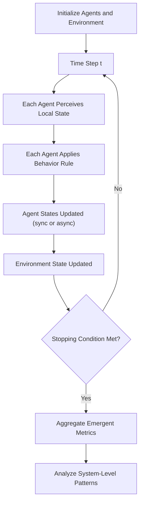

## Agent-Based Modeling Concepts


### Overview

Agent-Based Modeling (ABM) is a simulation methodology in which a system is represented as a collection of autonomous, interacting entities called **agents**, each governed by local rules. Rather than specifying system-level behavior directly (as in equation-based/system-dynamics models), ABM specifies agent-level behavior and lets system-level patterns emerge from simulated interaction over time. ABM is the primary computational tool for studying Complex Adaptive Systems empirically.

The approach is used across ecology (predator-prey dynamics), economics (market simulations), epidemiology (disease spread), urban planning (traffic and pedestrian flow), sociology (opinion dynamics, segregation models), and organizational science.

### Core Components of an ABM

**1. Agents**

The fundamental units of the model. Each agent has:

- **State**: internal variables (e.g., position, resources, opinion, health status)
- **Behavior rules**: how the agent updates its state and acts, typically as a function of its own state and the state of its local environment/neighbors
- **Decision logic**: ranges from simple deterministic rules to stochastic rules to learning-based rules (e.g., reinforcement learning agents)

**2. Environment**

The space in which agents exist and interact. Common environment types:

- **Grid-based (lattice)**: discrete cells, often with von Neumann (4-neighbor) or Moore (8-neighbor) neighborhoods
- **Continuous space**: agents have real-valued coordinates
- **Network-based**: agents are nodes in a graph; interactions follow edges
- **No explicit space**: agents interact via random pairing or global aggregation (e.g., market-clearing models)

**3. Interaction Rules**

Define how agents affect each other: local communication, resource competition/exchange, imitation, movement, reproduction, or information transmission.

**4. Time Structure**

- **Discrete time steps ("ticks")**: most common; all agents update per step (synchronous) or in randomized order (asynchronous)
- **Continuous time / event-driven**: agents act based on scheduled or triggered events rather than fixed ticks (common in discrete-event simulation hybrids)

**5. Emergent Output**

The system-level patterns/metrics the model is designed to observe — these are *not* directly programmed but arise from the simulation run (e.g., aggregate population dynamics, spatial clustering, price convergence).

### Update Schemes

| Scheme | Description | Consideration |
| --- | --- | --- |
| Synchronous | All agents compute their next state based on the current state, then update simultaneously | Avoids order-dependent artifacts; can misrepresent real-world asynchronous processes |
| Asynchronous (random order) | Agents update one at a time in randomized sequence each step | More realistic for many social/biological systems; introduces order-dependent stochasticity |
| Asynchronous (fixed order) | Agents update in a fixed sequence | Can introduce systematic bias; rarely used without justification |
| Event-driven | Agents act only when triggered by an event, not on a fixed clock | Efficient for sparse-event systems; more complex to implement |

[Inference] The choice of update scheme is not a minor implementation detail — it can materially change simulation outcomes, particularly in models with strong local interaction effects (e.g., cellular automata), so it should be reported explicitly in any rigorous ABM study.

### Canonical Example Models

**Schelling's Segregation Model**

Agents of two types occupy a grid and relocate if the fraction of like-type neighbors falls below a personal tolerance threshold. Even with mild individual preferences (e.g., wanting at least 30% similar neighbors), the model reliably produces strong aggregate spatial segregation — a landmark demonstration that macro-level patterns can emerge from mild micro-level preferences, without any agent desiring segregation as an explicit goal.

**Conway's Game of Life**

A cellular automaton (a constrained/simplified form of ABM) where each cell (agent) is alive or dead, updating based on a fixed rule referencing its 8 neighbors. Demonstrates how extremely simple local rules can generate a wide range of emergent structures — from static "still lifes" to oscillators to moving "gliders" to complex, unpredictable long-term evolution.

**Boids (Flocking Model)**

Craig Reynolds' model of flocking/schooling behavior using three simple local rules per agent:

- **Separation**: steer to avoid crowding local flockmates
- **Alignment**: steer toward the average heading of local flockmates
- **Cohesion**: steer toward the average position of local flockmates

These three purely local rules, with no leader and no global flock-shape specification, produce realistic emergent flocking behavior — a widely cited demonstration of decentralized emergence.

**Sugarscape**

Epstein and Axtell's model of agents moving on a landscape of renewable "sugar" resources, used to demonstrate emergent phenomena including wealth distribution inequality, migration, trade, and disease spread from simple foraging/metabolism rules.

### Diagram: ABM Simulation Loop



### SVG: Moore vs Von Neumann Neighborhood (svg_diagram)

<svg xmlns="http://www.w3.org/2000/svg" viewBox="0 0 640 260">
<text x="320" y="24" font-size="15" font-weight="bold" text-anchor="middle" fill="#1a1a1a">Grid Neighborhood Types (svg_diagram)</text>

<text x="150" y="55" font-size="12" text-anchor="middle" fill="`#2b6cb0`" font-weight="bold">Von Neumann (4-neighbor)</text>

<g stroke="#333" stroke-width="1" fill="none">

<rect x="90" y="70" width="40" height="40" />

<rect x="130" y="70" width="40" height="40" />

<rect x="170" y="70" width="40" height="40" />

<rect x="90" y="110" width="40" height="40" />

<rect x="130" y="110" width="40" height="40" fill="`#bee3f8`" />

<rect x="170" y="110" width="40" height="40" />

<rect x="90" y="150" width="40" height="40" />

<rect x="130" y="150" width="40" height="40" />

<rect x="170" y="150" width="40" height="40" />

</g>

<rect x="130" y="70" width="40" height="40" fill="`#c6f6d5`" />

<rect x="90" y="110" width="40" height="40" fill="`#c6f6d5`" />

<rect x="170" y="110" width="40" height="40" fill="`#c6f6d5`" />

<rect x="130" y="150" width="40" height="40" fill="`#c6f6d5`" />

<text x="490" y="55" font-size="12" text-anchor="middle" fill="`#c05621`" font-weight="bold">Moore (8-neighbor)</text>

<g stroke="#333" stroke-width="1" fill="`#fbd38d`">

<rect x="430" y="70" width="40" height="40" />

<rect x="470" y="70" width="40" height="40" />

<rect x="510" y="70" width="40" height="40" />

<rect x="430" y="110" width="40" height="40" />

<rect x="510" y="110" width="40" height="40" />

<rect x="430" y="150" width="40" height="40" />

<rect x="470" y="150" width="40" height="40" />

<rect x="510" y="150" width="40" height="40" />

</g>

<rect x="470" y="110" width="40" height="40" fill="`#bee3f8`" stroke="#333" />

<text x="150" y="230" font-size="10" text-anchor="middle" fill="#333">Green = neighbors of center cell</text>

<text x="490" y="230" font-size="10" text-anchor="middle" fill="#333">Orange = neighbors of center cell</text>

</svg>

### ABM Software Frameworks

| Framework | Language | Notes |
| --- | --- | --- |
| NetLogo | Logo-based DSL | Widely used in education; large model library; simplest to prototype in |
| Mesa | Python | Integrates with Python data science stack (pandas, matplotlib); good for research pipelines |
| Repast Simphony | Java | Mature, used in academic/government research; strong GIS integration |
| MASON | Java | Fast, lightweight, designed for large-scale simulations |
| AnyLogic | Java-based GUI | Commercial; combines ABM with system dynamics and discrete-event simulation |
| Agents.jl | Julia | Newer, performance-oriented; growing adoption for large-scale simulation |

[Inference] Framework choice typically trades off ease of prototyping (NetLogo) against integration with broader analysis/ML pipelines (Mesa, Agents.jl) and raw simulation performance at scale (MASON, Agents.jl); exact performance characteristics are version- and workload-dependent.

### Minimal Mesa-Style Pseudocode Skeleton

```python
class Agent:
    def __init__(self, unique_id, model, state):
        self.unique_id = unique_id
        self.model = model
        self.state = state

    def step(self):
        neighbors = self.model.get_neighbors(self)
        # Local decision rule references only local state
        self.state = self.decide(self.state, neighbors)

class Model:
    def __init__(self, num_agents):
        self.agents = [Agent(i, self, initial_state()) for i in range(num_agents)]
        self.schedule = RandomActivation(self.agents)  # async random order

    def step(self):
        self.schedule.step()  # invokes agent.step() for each agent
        self.collect_metrics()  # aggregate emergent output
```

[Inference] This is a generic illustrative skeleton, not literal Mesa API syntax; actual framework APIs (e.g., Mesa's `Model`, `Agent`, `RandomActivation` / `AgentSet` scheduling in current versions) should be verified against current documentation, since ABM framework APIs evolve across versions.

### Validation and Calibration Challenges

- **Overfitting to emergent output**: because ABM has many free parameters (agent rule thresholds, interaction radii), it is possible to tune a model until it reproduces a target emergent pattern without the underlying rules being empirically justified — a well-known methodological risk
- **Sensitivity analysis**: systematic variation of parameters to determine which drive emergent outcomes and which are inconsequential; essential for distinguishing robust findings from artifacts of specific parameter choices
- **Verification vs. validation**: verification confirms the model is implemented correctly (matches its specification); validation confirms the model's behavior corresponds to real-world referent data — these are distinct and both necessary
- **Equation-free nature**: because ABM lacks closed-form analytical solutions in most nontrivial cases, statistical analysis of many simulation runs (Monte Carlo methods) is typically required to characterize the distribution of possible outcomes

### Worked Example — Modeling Document Workflow Bottlenecks as an ABM

Applying ABM concepts to a document-processing pipeline (e.g., resembling batac-dms-style approval workflows):

- **Agents**: individual documents/requests moving through approval stages, each with state (current stage, priority, age)
- **Environment**: the workflow graph — a network-based environment where "location" = current approval stage node
- **Behavior rule**: a document agent advances to the next stage if its approver's local queue permits, with priority-based ordering
- **Interaction**: documents compete for a shared, capacity-limited resource (approver attention) — analogous to competitive resource models in ecology
- **Emergent output**: aggregate turnaround-time distribution, queue-length buildup at specific stages — none of which is directly specified, but which emerges from the interaction of per-document rules and approver capacity constraints
- [Inference] Such a model could reveal whether delays are structural (a stage lacks sufficient throughput capacity) or stochastic (occasional overload from correlated arrival bursts) — a distinction relevant to deciding between adding capacity versus smoothing arrival patterns, though this specific claim would need to be confirmed via an actual simulation run, not asserted a priori

### Key Points

- ABM specifies local agent rules and environment; system-level patterns emerge from simulation rather than being directly coded
- Update scheme (synchronous vs. asynchronous) can materially affect outcomes
- Canonical models (Schelling, Boids, Game of Life, Sugarscape) each demonstrate a distinct emergence mechanism
- Validation requires distinguishing genuine emergent insight from overfit or artifact-driven results via sensitivity analysis
- Framework choice trades off prototyping speed against integration and raw performance

**Related Topics**

- Complex Adaptive Systems Fundamentals
- Cellular Automata and Wolfram's Classification
- Network Science: Graph-Based Interaction Models
- Monte Carlo Methods and Sensitivity Analysis
- System Dynamics (Stock-and-Flow Modeling) as a Contrasting Approach
- Emergence and Downward Causation