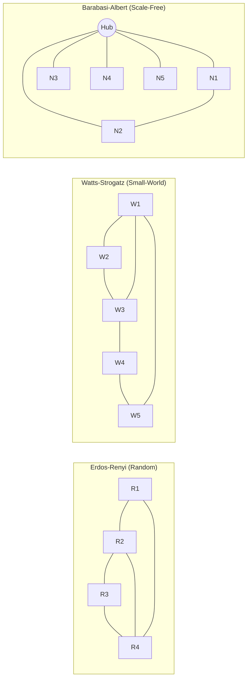

## Network Theory and Systems Structure

### Overview

Network theory (also called network science or graph theory when emphasizing its mathematical foundation) studies systems represented as collections of **nodes** (entities) connected by **edges** (relationships). Within complexity science, network theory provides the structural substrate for understanding how a system's topology — the pattern of connections — shapes emergent dynamics, robustness, information flow, and vulnerability. Many complex adaptive systems (biological, social, technological) are best understood not just through their agents' rules, but through the **structure of interaction** those agents are embedded in.

The field draws on graph theory (mathematics), statistical mechanics (physics), and empirical work across sociology, biology, and computer science.

### Basic Graph-Theoretic Definitions

- **Node (vertex)**: a discrete entity in the system (person, protein, server, city)
- **Edge (link)**: a connection or relationship between two nodes
- **Directed vs. undirected**: edges may have direction (A → B, e.g., "follows," "cites") or be symmetric (A — B, e.g., "is friends with")
- **Weighted vs. unweighted**: edges may carry a magnitude (e.g., interaction frequency, bandwidth) or simply represent presence/absence of a connection
- **Degree**: the number of edges connected to a node (in-degree/out-degree for directed graphs)
- **Path**: a sequence of edges connecting two nodes; **shortest path length** is the minimum number of edges (or minimum weighted cost) between two nodes
- **Connected component**: a maximal subset of nodes all reachable from one another

### Key Structural Metrics

**Degree Distribution**

The probability distribution of node degrees across the network. This single property strongly shapes network behavior:

- **Random (Erdős–Rényi) networks**: degree distribution approximates a Poisson/binomial distribution — most nodes have similar degree, no significant hubs
- **Scale-free networks**: degree distribution follows a power law, $P(k) \sim k^{-\gamma}$ — a small number of highly connected "hub" nodes coexist with many low-degree nodes

**Clustering Coefficient**

Measures the extent to which a node's neighbors are also connected to each other (i.e., the tendency to form tightly-knit local groups/triangles). High clustering is characteristic of social networks ("my friends know each other").

**Path Length and Small-World Property**

**Average path length** is the mean shortest-path distance between all node pairs. **Small-world networks** combine high clustering (like regular lattices) with short average path length (like random graphs) — the structural basis of the "six degrees of separation" phenomenon (Watts and Strogatz, 1998).

**Centrality Measures**

Quantify a node's structural importance:

| Centrality Type | Measures | Use Case |
| --- | --- | --- |
| Degree centrality | Number of direct connections | Identifying locally influential nodes |
| Betweenness centrality | How often a node lies on shortest paths between other node pairs | Identifying bridges/bottlenecks/brokers |
| Closeness centrality | Inverse of average distance to all other nodes | Identifying nodes that can spread information fastest |
| Eigenvector centrality | Weighted by the importance of a node's neighbors (importance begets importance) | Identifying influence within influential circles (basis of Google's PageRank) |

### Canonical Network Models

**Erdős–Rényi (Random Graph) Model**

Each possible edge between $N$ nodes is included independently with probability $p$. Produces relatively homogeneous degree distribution and low clustering; used as a theoretical baseline against which "real-world" network properties are compared.

**Watts–Strogatz (Small-World) Model**

Starts from a regular ring lattice (high clustering, long paths) and randomly rewires a small fraction of edges, which dramatically shortens average path length while preserving most local clustering — reproducing the small-world property observed empirically in many real networks.

**Barabási–Albert (Scale-Free / Preferential Attachment) Model**

New nodes joining the network preferentially attach to already highly-connected nodes ("rich get richer" / **preferential attachment**), producing a power-law degree distribution with hub nodes. This mechanism explains why many real-world networks (the web, citation networks, some biological networks) exhibit scale-free structure without any central design imposing it.

### Diagram: Three Canonical Network Topologies

### SVG: Scale-Free Hub Structure (svg_diagram)

<svg xmlns="http://www.w3.org/2000/svg" viewBox="0 0 640 300">
<text x="320" y="24" font-size="15" font-weight="bold" text-anchor="middle" fill="#1a1a1a">Scale-Free Network Hub Structure (svg_diagram)</text>
<circle cx="320" cy="150" r="22" fill="#c05621" />
<text x="320" y="155" font-size="10" text-anchor="middle" fill="white" font-weight="bold">HUB</text>
<g stroke="#999" stroke-width="1.2">
<line x1="320" y1="150" x2="150" y2="70" />
<line x1="320" y1="150" x2="180" y2="200" />
<line x1="320" y1="150" x2="230" y2="260" />
<line x1="320" y1="150" x2="420" y2="60" />
<line x1="320" y1="150" x2="480" y2="130" />
<line x1="320" y1="150" x2="470" y2="230" />
<line x1="320" y1="150" x2="380" y2="270" />
<line x1="320" y1="150" x2="250" y2="90" />
</g>
<circle cx="150" cy="70" r="8" fill="#2b6cb0" />
<circle cx="180" cy="200" r="8" fill="#2b6cb0" />
<circle cx="230" cy="260" r="8" fill="#2b6cb0" />
<circle cx="420" cy="60" r="8" fill="#2b6cb0" />
<circle cx="480" cy="130" r="8" fill="#2b6cb0" />
<circle cx="470" cy="230" r="8" fill="#2b6cb0" />
<circle cx="380" cy="270" r="8" fill="#2b6cb0" />
<circle cx="250" cy="90" r="8" fill="#2b6cb0" />
<line x1="150" y1="70" x2="250" y2="90" stroke="#ccc" stroke-width="1" />

<text x="320" y="290" font-size="10" text-anchor="middle" fill="#333">Few hubs carry disproportionate connectivity; most nodes have low degree</text>

</svg>

### Robustness and Vulnerability

Network topology strongly determines resilience to failure or attack:

- **Random failure**: nodes fail/removed at random. Scale-free networks are highly robust to random failure — because most nodes are low-degree, random removal rarely hits a hub
- **Targeted attack**: nodes removed in order of highest degree/centrality first. Scale-free networks are highly vulnerable to targeted attack — removing a few hubs can fragment the network rapidly
- Random (Erdős–Rényi) networks show intermediate, more uniform vulnerability to both failure types, since there are no disproportionately important hubs
- This **robust-yet-fragile** property is widely cited to explain the resilience of infrastructures like the internet or power grids to random component failure, alongside their susceptibility to deliberate attacks on key hubs

[Inference] The precise robustness/fragility trade-off depends on the specific degree exponent and network size; the qualitative pattern (robust to random failure, fragile to targeted attack) is well-established in network science literature, but exact fragmentation thresholds are network-specific and typically require simulation or analytical percolation-theory calculation to determine for a given real network.

### Network Structure and Systems Behavior

Connecting topology back to broader systems/cybernetic concepts:

- **Modularity**: the degree to which a network decomposes into densely-connected sub-groups (modules/communities) with sparser connections between them. High modularity can localize failures/disturbances (a shock in one module doesn't propagate freely) — relevant to VSM's System 2 coordination role and to requisite-variety arguments about containing disturbance
- **Bow-tie architecture**: many complex systems (metabolic networks, the web, some economic supply chains) exhibit a "bow-tie" structure — a large fan-in of diverse inputs converging through a small, highly conserved "core" set of intermediate components, then fanning back out to diverse outputs. [Inference] This structure is argued to balance robustness of the conserved core against evolvability/flexibility at the peripheries, though the generality of this claim across all domains remains an active research question
- **Cascading failures**: interdependent networks (e.g., power grid coupled to a control network) can experience failure cascades where a local disturbance propagates and amplifies across coupled network layers — a phenomenon studied extensively after major infrastructure blackouts

### Community Detection

Identifying densely-connected subgroups (communities/modules) within a larger network is a major subfield:

- **Modularity maximization** (e.g., the Louvain method, Leiden algorithm): partitions nodes to maximize the difference between actual within-community edge density and the density expected under a random null model
- **Hierarchical clustering approaches**: build a dendrogram of nested community structure based on edge betweenness or similarity metrics (e.g., Girvan–Newman algorithm)
- [Inference] Different community-detection algorithms can produce different partitions of the same network, particularly in networks with ambiguous or overlapping community structure; results should be interpreted as one reasonable partitioning among possibly several, not a uniquely "correct" answer, unless validated against independent ground truth

### Worked Example — Modeling a Microservices Architecture as a Network

Applying network-theoretic analysis to a service-oriented system (relevant to a TypeScript/Fastify/tRPC-style backend):

- **Nodes**: individual services (e.g., document-intake service, auth service, search-indexing service)
- **Edges**: API calls/dependencies between services (directed, since a call has a caller and a callee)
- **Degree analysis**: a service called by many others (high in-degree) is a potential hub — a natural candidate for careful reliability engineering, analogous to a hub's vulnerability to targeted attack
- **Betweenness centrality**: a service that mediates many otherwise-unrelated service-to-service call chains (e.g., an auth or gateway service) represents a structural bottleneck/single point of failure, even if its raw call volume (degree) is unremarkable
- **Modularity**: well-bounded service domains (e.g., "documents," "workflow," "notifications") ideally form distinct, loosely-coupled modules — high modularity here corresponds to lower blast radius when one domain experiences an incident
- [Inference] This kind of dependency-graph analysis is a standard, well-established practice in distributed-systems reliability engineering (often surfaced via service-mesh observability tooling), though the specific metrics and thresholds considered "healthy" vary by system scale and are not fixed universal constants

### Key Points

- Networks represent systems as nodes and edges; topology (not just node behavior) shapes system-level dynamics
- Degree distribution distinguishes random, small-world, and scale-free network classes, each with distinct real-world analogues
- Centrality measures (degree, betweenness, closeness, eigenvector) identify different kinds of structural importance
- Scale-free networks are robust to random failure but fragile to targeted attack on hubs — a key robustness/fragility duality
- Community detection and modularity connect network structure to disturbance containment, echoing cybernetic coordination principles

**Related Topics**

- Complex Adaptive Systems Fundamentals
- Agent-Based Modeling Concepts
- Percolation Theory and Cascading Failures
- The Viable System Model (System 2 Coordination Parallel)
- PageRank and Eigenvector-Based Ranking Algorithms
- Community Detection Algorithms (Louvain, Leiden, Girvan–Newman)