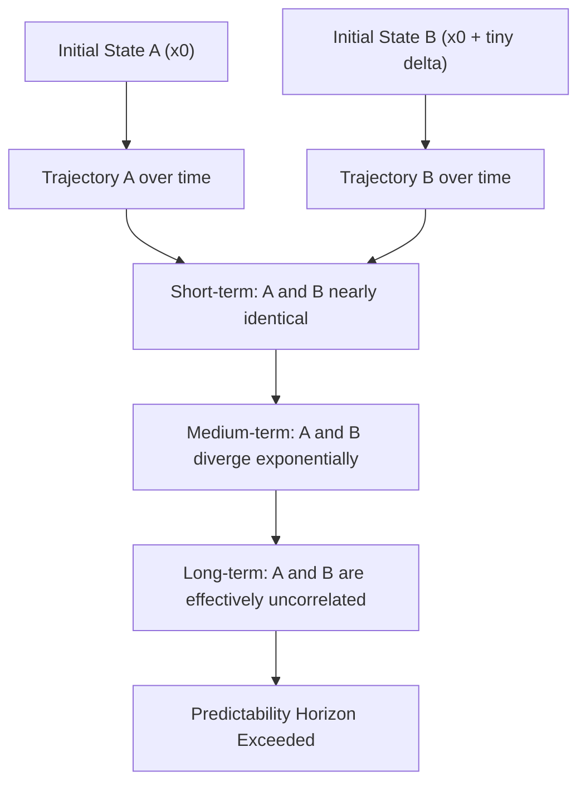

## Chaos Theory and Sensitive Dependence on Initial Conditions

### Definition

Chaos theory is the branch of mathematics and dynamical systems theory studying deterministic systems whose long-term behavior is highly sensitive to initial conditions, such that arbitrarily small differences in starting state lead to exponentially diverging outcomes over time. **Sensitive dependence on initial conditions (SDIC)**, popularly known as the "butterfly effect," is the defining diagnostic property of chaotic systems: it means the system is fully deterministic (governed by fixed rules with no randomness) yet practically unpredictable beyond a finite time horizon, because no measurement of the initial state can ever be made with infinite precision.

### Core Concepts

**Determinism without predictability**: A chaotic system is not random. Given the exact same initial condition, it will always produce the exact same trajectory. The apparent unpredictability arises purely from the impossibility of specifying that initial condition with perfect (infinite-decimal) precision, combined with the system's tendency to amplify any imprecision exponentially.

**Exponential divergence and the Lyapunov exponent**: The rate at which two initially close trajectories separate is quantified by the **Lyapunov exponent** ($\lambda$). For a chaotic system, nearby trajectories separated by an initial distance $\delta_0$ diverge approximately as:

$$\delta(t) \approx \delta_0 e^{\lambda t}$$

A positive Lyapunov exponent ($\lambda > 0$) is the formal, quantitative signature of chaos. The **predictability horizon** — the time beyond which forecasts become meaningless — scales only logarithmically with the precision of the initial measurement, meaning even drastically improving measurement precision buys comparatively little additional predictive time.

**Deterministic vs. stochastic unpredictability**: Chaos must be distinguished from randomness. A coin flip is stochastic (no underlying deterministic rule generates unpredictability). A chaotic system like the weather is fully rule-governed (physics equations) but unpredictable in practice past roughly 1–2 weeks due to SDIC, not due to any randomness in the underlying physics.

**Strange attractors**: Chaotic systems are typically dissipative (they lose energy) yet do not settle to a fixed point or simple periodic cycle. Instead, trajectories are drawn toward a bounded, non-repeating geometric structure in phase space called a **strange attractor**, which characteristically has a fractal (non-integer) dimension. The Lorenz attractor's iconic "butterfly wing" shape is the most widely recognized example.

**Topological mixing and dense periodic orbits**: Formally (following the common Devaney definition), a dynamical system is chaotic if it exhibits (1) sensitive dependence on initial conditions, (2) topological transitivity/mixing (the system evolves so that any region of phase space eventually overlaps with any other region), and (3) dense periodic orbits (points arbitrarily close to any given point will return arbitrarily close to their starting point infinitely often).

### Diagram — Divergence of Nearby Trajectories (svg_diagram)

### The Lorenz System (Canonical Example)

Edward Lorenz discovered SDIC in 1961 while re-running a simplified atmospheric convection model, entering a rounded initial value (0.506 instead of the stored 0.506127) and finding the re-run diverged completely from the original within simulated "weeks." The **Lorenz system** is the standard reference model:

$$\frac{dx}{dt} = \sigma(y - x)$$

$$\frac{dy}{dt} = x(\rho - z) - y$$

$$\frac{dz}{dt} = xy - \beta z$$

where $\sigma$, $\rho$, and $\beta$ are system parameters (classically $\sigma = 10$, $\rho = 28$, $\beta = 8/3$, the parameter regime at which chaotic behavior was originally observed). Despite being only three coupled, fully deterministic ordinary differential equations with no stochastic term, the system produces the strange attractor and exhibits full SDIC — it is often cited as the simplest widely known continuous-time chaotic system.

### The Logistic Map (Canonical Discrete Example)

A simpler, discrete-time model frequently used to introduce chaos and the route to it via **period-doubling bifurcation**:

$$x_{n+1} = r \, x_n (1 - x_n)$$

As the growth-rate parameter $r$ increases from 0 toward 4:

- For $r < 3$: the system settles to a single stable fixed point.
- At $r = 3$: the fixed point bifurcates into a stable 2-cycle.
- As $r$ increases further, the period doubles repeatedly (4-cycle, 8-cycle, ...) at an ever-accelerating rate, converging at $r \approx 3.56995$ (the **Feigenbaum point**).
- Beyond the Feigenbaum point, the system enters chaotic behavior for most parameter values, interspersed with narrow periodic "windows."

The ratio at which successive period-doubling intervals shrink converges to the **Feigenbaum constant** $\delta \approx 4.669201...$, a universal constant appearing across many unrelated period-doubling routes to chaos — a striking example of universality in nonlinear dynamics.

### Route to Chaos (Common Pathways)

- **Period-doubling bifurcation**: Demonstrated above via the logistic map; also seen in real physical systems (dripping faucets, certain electronic oscillators).
- **Intermittency**: A system alternates unpredictably between long stretches of near-regular behavior and short chaotic bursts.
- **Quasi-periodicity breakdown**: A system with two or more incommensurate oscillation frequencies transitions to chaos as the frequencies interact and lock/break in complex ways.

### Distinguishing Chaos from Randomness and from Simple Complexity

| Property | Deterministic Chaos | True Randomness (Stochastic) | Simple Nonlinear (Non-chaotic) |
| --- | --- | --- | --- |
| Underlying rule | Fixed, deterministic | None (or probabilistic only) | Fixed, deterministic |
| Reproducibility from exact same state | Always identical | Never identical | Always identical |
| Sensitivity to initial conditions | Exponential (positive Lyapunov exponent) | N/A (no meaningful trajectory concept) | Bounded/proportional, not exponential |
| Long-term predictability | Bounded predictability horizon | None at any horizon | Predictable indefinitely (within model validity) |
| Phase-space structure | Bounded strange attractor, fractal dimension | No structured attractor | Simple attractor (point, limit cycle) |

### Real-World Examples and Applications

**Weather and climate**: The paradigmatic example. Numerical weather prediction is fundamentally limited to a predictability horizon of roughly 10–14 days regardless of computational power increases, because atmospheric dynamics are chaotic — this is a direct practical consequence of SDIC, not a limitation of current modeling technology. [Inference] Climate (long-term statistical behavior of the attractor) remains far more predictable than weather (specific trajectory), since climate projections concern the shape/statistics of the attractor rather than a specific future trajectory — this weather/climate distinction is a standard and important point often misunderstood in public discourse.

**Double pendulum**: A simple mechanical system — a pendulum attached to the end of another pendulum — governed by fully deterministic classical mechanics, yet exhibits visibly chaotic, unpredictable swinging behavior after a short time, making it a common physical demonstration of SDIC.

**Cardiac dynamics**: Certain cardiac arrhythmias have been modeled using chaos theory, where heart rhythm irregularities show signatures of low-dimensional chaotic dynamics rather than pure noise — relevant to detecting instability before onset of dangerous arrhythmias. [Unverified] The degree to which specific cardiac pathologies are best characterized as chaotic (versus stochastic or simply irregular periodic) remains an active and debated area within cardiac electrophysiology research.

**Population dynamics**: The logistic map itself originated as a discrete-time population growth model; real ecological population data (e.g., certain insect population studies) have shown signatures consistent with chaotic dynamics at high growth-rate regimes.

**Financial markets**: Some researchers have proposed that certain market price dynamics show chaotic signatures rather than pure random-walk behavior, though this remains contested territory. [Speculation] Robust, universally accepted evidence of low-dimensional deterministic chaos (as opposed to high-dimensional stochastic or fat-tailed random processes) in real financial time series is a long-standing and unresolved debate in econophysics.

### Relationship to Systems Thinking and Complexity Science

- Chaos theory demonstrates that **unpredictability does not require complexity of structure** — even a three-variable deterministic system (Lorenz) or a single-variable iterated map (logistic) can be chaotic. This corrects the intuitive assumption that "many parts" is necessary for unpredictable behavior.
- It provides the formal mathematical grounding for the systems-thinking observation that **precise long-term forecasting of complex systems is often fundamentally, not just practically, limited** — reinforcing the emphasis in systems thinking on scenario planning, robustness, and adaptive management over point-forecasting.
- Chaos and self-organization/emergence are related but distinct: chaos concerns unpredictability of trajectory in already-defined dynamical equations, while self-organization/emergence concerns the spontaneous generation of pattern/structure from many interacting agents. A system can be self-organizing without being chaotic (converging to a stable attractor) and can be chaotic without exhibiting emergent macro-structure in the CAS sense — though many real complex systems exhibit both properties simultaneously.
- The **edge of chaos** concept (associated with complex adaptive systems research, e.g., Stuart Kauffman, Christopher Langton) proposes that many adaptive/living systems operate in a narrow regime between rigid order and full chaos, where this boundary zone maximizes adaptability and information-processing capacity. [Inference] The edge-of-chaos hypothesis, while influential, is a theoretical framework with mixed and system-dependent empirical support rather than a universally validated law.

### Practical Implications and Limitations

- **Forecast confidence intervals should widen, not narrow, with model refinement in chaotic domains beyond a certain point**: Improving initial-condition measurement precision or model resolution yields diminishing returns on forecast horizon once SDIC dominates, a critical caveat for any high-stakes long-range prediction in a suspected chaotic system.
- **Ensemble forecasting as the practical response**: Because a single trajectory forecast is unreliable beyond the predictability horizon, operational systems (e.g., weather services) run many simulations from slightly perturbed initial conditions and report the resulting *distribution* of outcomes rather than a single deterministic prediction — a direct engineering response to SDIC.
- **Behavioral disclaimer**: [Inference] Whether a specific real-world system under study is genuinely low-dimensional deterministic chaos, high-dimensional stochastic noise, or a mixture of both often cannot be conclusively determined from finite, noisy empirical time-series data alone, and claims of "chaos" in applied fields should be treated with appropriate methodological scrutiny (e.g., correlation dimension estimates, surrogate data testing).

### Related Topics

- Self-Organization and Emergence
- Complex Adaptive Systems (CAS)
- Strange Attractors and Fractal Dimension
- Bifurcation Theory and the Feigenbaum Constant
- Ensemble Forecasting
- Edge of Chaos (Kauffman, Langton)
- Nonlinear Dynamical Systems
- Power-Law Distributions and Self-Organized Criticality