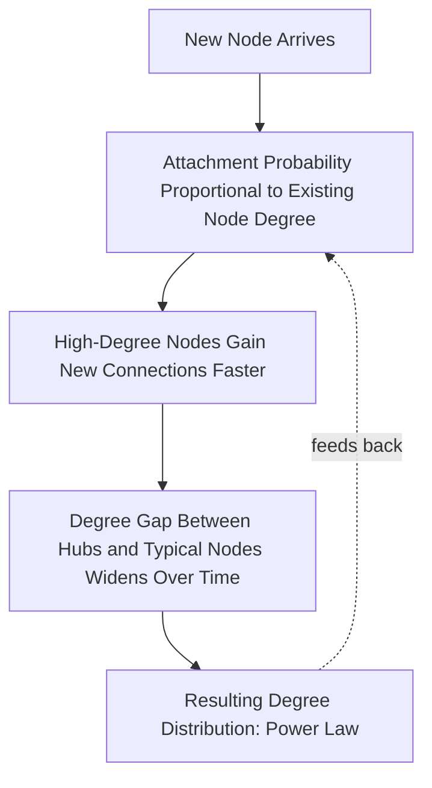

## Power Laws, Scale-Free Networks, and Tipping Points

### Overview

Power laws, scale-free network structure, and tipping points are three closely interrelated phenomena that recur across complex systems in physics, biology, ecology, economics, and social science. A **power law** describes a mathematical relationship where one quantity varies as a fixed power of another, producing distributions with a small number of extreme events and a long "tail" of smaller ones. **Scale-free networks** are a specific network topology whose degree distribution follows a power law. **Tipping points** refer to critical thresholds at which a system undergoes an abrupt, often irreversible, qualitative shift in state. Together, these concepts explain why many complex systems exhibit rare, disproportionately large events and sudden regime changes rather than smooth, predictable change.

### Power Laws — Mathematical Definition

A power-law relationship has the form:

$$P(x) \sim x^{-\alpha}$$

where $P(x)$ is the probability (or frequency) of observing a value $x$, and $\alpha$ is the scaling exponent. Key mathematical properties:

- **Scale invariance**: a power law looks the same at any scale of observation — there is no characteristic "typical" size, unlike a normal (Gaussian) distribution which has a well-defined mean and standard deviation around which most observations cluster
- **Heavy/fat tails**: extreme values occur far more frequently than a normal distribution would predict — a power-law distribution assigns much greater probability mass to rare, large events
- **Log-log linearity**: plotting $\log P(x)$ against $\log x$ produces a straight line with slope $-\alpha$, which is the standard empirical diagnostic used to identify power-law behavior in data (though this method has well-documented statistical pitfalls, discussed below)

### Power Laws vs. Normal Distributions

| Property | Normal (Gaussian) Distribution | Power-Law Distribution |
| --- | --- | --- |
| Characteristic scale | Yes — mean and standard deviation are meaningful | No — scale-invariant, "scale-free" |
| Tail behavior | Thin tails — extreme deviations vanishingly rare | Fat/heavy tails — large events occur with non-negligible frequency |
| Variance | Finite and well-defined | May be infinite or undefined for $\alpha \leq 3$ |
| Example phenomena | Human height, measurement error | City sizes, wealth distribution, earthquake magnitudes, word frequency (Zipf's Law), website link counts |
| Predictive intuition | "Six sigma" events are effectively impossible | Extreme events are rare but expected to occur eventually |

[Inference] The practical consequence of fat tails is significant: risk models built assuming Gaussian behavior (e.g., some historical financial risk models) can drastically underestimate the probability of extreme events if the underlying process is actually power-law distributed — this was a widely discussed critique following the 2008 financial crisis, associated in particular with Nassim Taleb's work on "fat tails" and rare, high-impact events.

### Common Examples of Power-Law Phenomena

- **Zipf's Law**: word frequency in natural language is inversely proportional to its frequency rank — the second most common word appears about half as often as the most common, the third about a third as often, and so on
- **City size distribution**: a small number of megacities coexist with a much larger number of small towns, following an approximately power-law (Zipf-like) size distribution in many countries
- **Earthquake magnitudes (Gutenberg–Richter law)**: the frequency of earthquakes decreases as a power law of magnitude — large earthquakes are rare but not vanishingly so, unlike under a normal-distribution assumption
- **Wealth and income distribution**: the upper tail of wealth distributions in many economies follows an approximate power law (the Pareto distribution — origin of the informal "80/20 rule")
- **Scale-free network degree distributions**: as covered under network theory — a small number of hub nodes with very high degree

### Generative Mechanisms Behind Power Laws

Power laws are not arbitrary — several well-studied mechanisms reliably generate them:

**Preferential Attachment ("Rich Get Richer")**

As covered in network theory: new connections/resources preferentially accrue to entities that already have more, producing power-law growth. This is the mechanism behind the Barabási–Albert scale-free network model and is argued to underlie phenomena from citation counts to wealth accumulation.

**Self-Organized Criticality (SOC)**

Proposed by Per Bak, Chao Tang, and Kurt Wiesenfeld: certain dissipative dynamical systems naturally evolve toward a critical state without any external fine-tuning of a control parameter, at which point they exhibit power-law-distributed event sizes. The canonical illustrative model is the **sandpile model**: grains added one at a time to a pile eventually trigger avalanches; avalanche sizes follow a power-law distribution once the pile reaches its self-organized critical slope, with occasional large avalanches interspersed among mostly small ones.

**Multiplicative Random Processes**

Processes where growth is proportional to current size (multiplicative rather than additive random walks) tend to generate log-normal or power-law-like distributions, relevant to models of firm size, city growth, and some biological growth processes.

### Diagram: Preferential Attachment Generating a Power Law

### SVG: Power-Law vs Normal Distribution Tails (svg_diagram)

<svg xmlns="http://www.w3.org/2000/svg" viewBox="0 0 640 300">
<text x="320" y="24" font-size="15" font-weight="bold" text-anchor="middle" fill="#1a1a1a">Power-Law vs Normal Distribution Tails (svg_diagram)</text>
<line x1="60" y1="250" x2="600" y2="250" stroke="#333" stroke-width="1.5" />
<line x1="60" y1="250" x2="60" y2="50" stroke="#333" stroke-width="1.5" />
<text x="320" y="275" font-size="10" text-anchor="middle" fill="#333">Event Size</text>
<text x="30" y="150" font-size="10" text-anchor="middle" fill="#333" transform="rotate(-90 30 150)">Frequency</text>
<path d="M70,60 Q160,60 200,140 Q240,220 280,245 Q320,250 400,250 Q500,250 590,250" fill="none" stroke="#2b6cb0" stroke-width="2.5" />
<text x="150" y="55" font-size="11" fill="#2b6cb0" font-weight="bold">Normal (thin tail)</text>
<path d="M70,70 Q140,180 220,215 Q320,235 420,242 Q520,246 590,248" fill="none" stroke="#c05621" stroke-width="2.5" />
<text x="450" y="220" font-size="11" fill="#c05621" font-weight="bold">Power-Law (fat tail)</text>

<text x="320" y="290" font-size="10" text-anchor="middle" fill="#333">At large event sizes, power-law frequency remains far above normal-distribution frequency</text>

</svg>

### Empirical Detection Pitfalls

Identifying a genuine power law in real data is methodologically harder than it appears:

- Naive log-log plotting can make many non-power-law distributions (e.g., log-normal) appear approximately linear over a limited range, leading to false-positive power-law claims
- **Clauset, Shalizi, and Newman (2009)** established a now-standard rigorous methodology combining maximum-likelihood estimation of the scaling exponent with goodness-of-fit testing (via Kolmogorov–Smirnov statistics and bootstrapping) against alternative heavy-tailed distributions (log-normal, exponential, stretched exponential), rather than relying on visual log-log linearity alone
- [Inference] A substantial portion of claimed "power laws" in the complexity science literature prior to this methodological standard, and in some subsequent popular-science treatments, have been challenged on the grounds of insufficient statistical rigor in distinguishing true power-law behavior from other heavy-tailed alternatives — this is a recognized methodological controversy in the field, not a settled non-issue

### Tipping Points and Critical Transitions

A **tipping point** is a threshold at which a small additional change triggers a large, often qualitative and difficult-to-reverse shift in system state — closely related to the concept of a **critical transition** or **phase transition** in physics.

**Key Characteristics of Tipping Points**

- **Threshold nonlinearity**: system response is roughly proportional to perturbation size below the threshold, then disproportionately large near/beyond it
- **Hysteresis**: after crossing a tipping point, returning the driving variable to its original value may not restore the original state — the system can remain "locked in" to the new regime (bistability)
- **Early warning signals**: research (notably by Marten Scheffer and colleagues) has identified statistical precursors that often (though not universally) appear before a critical transition: **critical slowing down** (the system recovers from small perturbations more slowly as it approaches the tipping point), increasing variance, and increasing autocorrelation in system-state time series

**Examples of Tipping Points Across Domains**

| Domain | Example |
| --- | --- |
| Ecology | Lake eutrophication — a lake can shift abruptly from clear to turbid, algae-dominated state past a nutrient-loading threshold |
| Climate | Potential abrupt shifts in ocean circulation patterns or ice-sheet stability past certain warming thresholds |
| Social systems | Rapid shifts in social norms or political opinion once a "critical mass" of adopters is reached (related to network cascade/percolation dynamics) |
| Finance | Market crashes/bank runs, where confidence loss cascades once a threshold of withdrawal/selling is reached |
| Epidemiology | Disease outbreak threshold — $R_0 > 1$ marks the tipping point between an outbreak dying out and sustained epidemic growth |

[Inference] The reliability of early-warning-signal detection (critical slowing down, rising variance/autocorrelation) as a *predictive* tool remains an active research area; these signals have been demonstrated in controlled experimental systems and some retrospective analyses of historical transitions, but their real-time predictive power in noisy, high-dimensional real-world systems (especially climate tipping points) is a subject of ongoing scientific debate, not a fully solved forecasting method.

### Connecting the Three Concepts

The relationship between power laws, scale-free networks, and tipping points is not coincidental — they share underlying dynamical mechanisms:

- **Scale-free networks and cascading tipping points**: because scale-free networks concentrate connectivity in hubs, a tipping-point-triggering failure or behavior change at a hub node can cascade disproportionately through the network — connecting network topology directly to tipping-point dynamics (as covered in Network Theory's robust-yet-fragile discussion)
- **Self-organized criticality and power-law event sizes**: SOC systems (like the sandpile model) sit persistently near a critical/tipping threshold, which is precisely why their event-size distribution is a power law — most perturbations are small, but the system's proximity to criticality means occasional perturbations cascade into system-wide "avalanches," analogous to a tipping point being crossed locally many times at different scales
- **Percolation theory** provides the formal mathematical bridge: as connectivity (or another control parameter) crosses a critical threshold, network-wide connected clusters suddenly emerge or fragment — a direct mathematical model of a network-level tipping point, closely related to the robustness/fragility analysis of scale-free structures

### Worked Example — Interpreting Incident/Outage Data Through This Lens

Applying these concepts to operational systems (e.g., interpreting incident severity distributions in a software platform):

- Incident *duration* or *impact scope* in many real systems empirically resembles a heavy-tailed rather than normal distribution — most incidents are minor and brief, but a small number are disproportionately severe, consistent with power-law-like behavior rather than a "typical incident size" assumption
- [Inference] If a system's dependency graph has scale-free characteristics (a few heavily-depended-upon shared services), then incidents affecting those hub services should be expected to disproportionately drive the heavy tail of impact severity — a testable hypothesis via a system's specific dependency graph and incident history, not a universal law that automatically applies to every such system
- Recognizing this pattern argues against risk-planning approaches that assume "average-case" incident severity (a Gaussian intuition) and toward capacity/resilience planning explicitly accounting for rare, high-impact tail events — consistent with the broader point that fat-tailed systems require different risk management approaches than thin-tailed ones

### Key Points

- Power laws are scale-invariant distributions with fat tails, contrasting sharply with the "typical value" assumption of normal distributions
- Preferential attachment and self-organized criticality are two well-established generative mechanisms producing power-law behavior
- Rigorous statistical methods (Clauset–Shalizi–Newman) are required to distinguish genuine power laws from other heavy-tailed distributions — visual log-log linearity alone is insufficient
- Tipping points involve threshold nonlinearity and often hysteresis; early-warning signals (critical slowing down, rising variance/autocorrelation) are an active but not fully solved research area
- Scale-free network structure, self-organized criticality, and tipping-point dynamics are mechanistically linked via percolation-theoretic critical transitions

**Related Topics**

- Network Theory and Systems Structure
- Self-Organized Criticality and the Sandpile Model
- Percolation Theory and Critical Transitions
- Chaos Theory and Sensitive Dependence on Initial Conditions
- Complex Adaptive Systems Fundamentals
- Fat-Tailed Risk and Extreme Value Theory