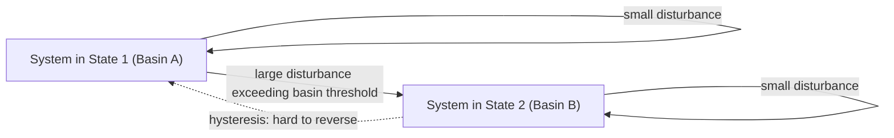
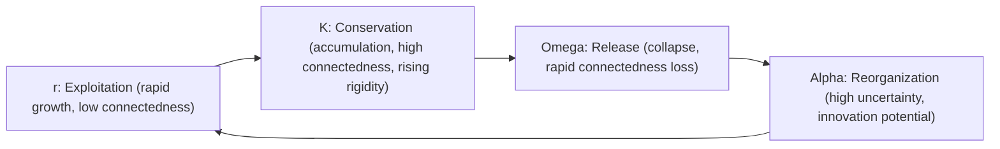

## Resilience, Robustness, and Adaptive Cycles

### Overview

Resilience, robustness, and the adaptive cycle are related but distinct concepts describing how complex systems respond to disturbance over time. While often used loosely or interchangeably in casual language, complexity science and ecological systems theory treat them as precise, distinguishable properties. **Robustness** concerns a system's ability to resist change under perturbation while remaining in its current state. **Resilience** concerns a system's capacity to absorb disturbance and reorganize while retaining essentially the same function, structure, and identity — including the ability to recover after change, not merely resist it. The **adaptive cycle**, developed principally by ecologist C.S. Holling, describes a recurring four-phase pattern of growth, conservation, collapse, and reorganization that many complex systems exhibit over time, providing a dynamic (rather than static) framework for understanding resilience.

### Robustness vs. Resilience — A Critical Distinction

| Property | Robustness | Resilience |
| --- | --- | --- |
| Core question | Can the system resist change under a given disturbance? | Can the system absorb disturbance and reorganize while retaining function/identity? |
| Relationship to change | Emphasizes *resisting* change | Emphasizes *adapting through* change |
| Failure mode | Robust systems can fail catastrophically once a disturbance exceeds their resistance threshold ("robust yet fragile") | Resilient systems may change form/structure substantially yet preserve core function |
| Static or dynamic view | Often treated as a static property (can the system withstand X) | Inherently dynamic — involves a trajectory through disturbance and reorganization over time |
| Example | A dam designed to withstand a specific flood magnitude | A wetland ecosystem that floods, temporarily changes species composition, then reorganizes to a functionally similar state |

[Inference] A widely cited insight in resilience theory is that optimizing purely for robustness against known, anticipated disturbances can reduce a system's resilience to unanticipated or novel disturbances — because resources and structural adaptations devoted to resisting one class of shock are often unavailable for absorbing and adapting to a different kind of shock. This "robust yet fragile" trade-off is discussed extensively in Holling's work and subsequent resilience literature, though the precise conditions under which the trade-off holds are context-dependent rather than a universal law.

### Engineering Resilience vs. Ecological Resilience

Holling distinguished two historically conflated notions of resilience:

- **Engineering resilience**: the time a system takes to return to a single, presumed stable equilibrium after a disturbance — implicitly assumes there is one "correct" state to return to, and measures resilience as speed of recovery/return
- **Ecological resilience**: the magnitude of disturbance a system can absorb before it shifts into a qualitatively different stability regime (a different "basin of attraction") — does not assume a single equilibrium; explicitly allows for multiple possible stable states

This distinction matters because engineering resilience (fast recovery to the *same* state) and ecological resilience (capacity to absorb disturbance without regime shift, even if the state changes) are not the same property and can even trade off against each other — a system engineered for fast recovery to a fixed state may be brittle with respect to large or novel disturbances that push it past its basin boundary.

### Multiple Stable States and Basins of Attraction

Ecological resilience is formally grounded in the concept of a system having potentially **multiple stable states** (alternative stable equilibria), each with its own **basin of attraction** — the region of state space from which the system will return to that particular equilibrium after a small disturbance.

- A system can absorb disturbances that keep it within its current basin of attraction, returning to the same qualitative state
- A sufficiently large disturbance can push the system across a basin boundary, after which it settles into a different stable state — a **regime shift** — which may be difficult or impossible to reverse (hysteresis)
- Resilience, in this framing, is the *size* of the basin of attraction (how much disturbance can be absorbed before a regime shift), not merely the *speed* of return within a basin

### Diagram: Basins of Attraction and Regime Shift

### The Adaptive Cycle (Holling's Panarchy Model)

Holling proposed that many ecological, and by extension social and organizational, systems move through a recurring four-phase cycle, often depicted as a figure-eight or infinity-loop trajectory across two axes: **connectedness** (degree of internal structural linkage/control) and **potential** (accumulated resources/capital available for future reorganization).

**Phase 1 — Exploitation (r)**

Rapid growth phase; opportunistic colonization of available resources; low connectedness, low regulation; high resilience to disturbance because the system has few rigid structures to break.

**Phase 2 — Conservation (K)**

Slow accumulation and storage of resources/capital; increasing connectedness and structural rigidity as the system optimizes and specializes; efficiency increases but resilience decreases as slack/redundancy is progressively consumed by increasing internal connection and control.

**Phase 3 — Release / "Creative Destruction" (Ω, Omega)**

Rapid, often chaotic collapse triggered by accumulated fragility (from the conservation phase) meeting a disturbance; previously bound-up resources/capital are suddenly released; connectedness drops sharply and abruptly.

**Phase 4 — Reorganization (α, Alpha)**

Released resources are available for novel recombination; high uncertainty and innovation potential; low connectedness but high potential for new structural configurations to emerge, leading back into a new exploitation phase.

### Diagram: The Adaptive Cycle (Panarchy)

### SVG: Adaptive Cycle Figure-Eight (svg_diagram)

<svg xmlns="http://www.w3.org/2000/svg" viewBox="0 0 640 340">
<text x="320" y="24" font-size="15" font-weight="bold" text-anchor="middle" fill="#1a1a1a">Adaptive Cycle — Connectedness vs Potential (svg_diagram)</text>
<line x1="80" y1="290" x2="580" y2="290" stroke="#333" stroke-width="1.5" />
<line x1="80" y1="290" x2="80" y2="60" stroke="#333" stroke-width="1.5" />
<text x="330" y="315" font-size="10" text-anchor="middle" fill="#333">Connectedness</text>
<text x="45" y="175" font-size="10" text-anchor="middle" fill="#333" transform="rotate(-90 45 175)">Potential</text>
<path d="M120,270 C180,230 230,200 300,150 C340,120 380,90 420,80" fill="none" stroke="#38a169" stroke-width="2.5" />
<text x="200" y="255" font-size="10" fill="#38a169" font-weight="bold">r: Exploitation</text>
<path d="M420,80 C460,75 500,80 520,100 C535,115 535,140 520,160" fill="none" stroke="#2b6cb0" stroke-width="2.5" />
<text x="470" y="70" font-size="10" fill="#2b6cb0" font-weight="bold">K: Conservation</text>
<path d="M520,160 C500,220 400,260 300,265" fill="none" stroke="#c05621" stroke-width="2.5" stroke-dasharray="6,3" />
<text x="470" y="220" font-size="10" fill="#c05621" font-weight="bold">Omega: Release</text>
<path d="M300,265 C220,270 150,270 120,270" fill="none" stroke="#805ad5" stroke-width="2.5" stroke-dasharray="3,3" />
<text x="160" y="288" font-size="10" fill="#805ad5" font-weight="bold">Alpha: Reorganize</text>
<circle cx="120" cy="270" r="4" fill="#333" />
<circle cx="420" cy="80" r="4" fill="#333" />
<circle cx="520" cy="160" r="4" fill="#333" />
<circle cx="300" cy="265" r="4" fill="#333" />
</svg>

### Panarchy — Cross-Scale Linkage of Adaptive Cycles

Holling and Lance Gunderson extended the single adaptive cycle into **panarchy**: a nested hierarchy of adaptive cycles operating at different spatial and temporal scales (e.g., individual organism, population, ecosystem, biome), where cycles at different scales interact through two cross-scale connections:

- **"Revolt"**: a fast, small-scale collapse (release phase) can cascade upward and trigger a crisis in a larger, slower-scale cycle — small local failures can occasionally trigger larger regime shifts
- **"Remember"**: a slower, larger-scale cycle in its conservation phase can provide accumulated resources/structure that help a smaller-scale cycle recover during its reorganization phase — larger, more stable structures buffer and stabilize faster-cycling components

[Inference] Panarchy is a conceptually influential framework for reasoning about cross-scale resilience (e.g., how local organizational failures relate to broader institutional stability), but it is primarily a qualitative, heuristic model rather than one with widely standardized quantitative metrics; applying it rigorously to a specific novel domain typically requires domain-specific operationalization of "connectedness," "potential," and phase boundaries.

### Resilience Engineering — Practical/Organizational Adaptation

Separately from ecological systems theory, the field of **resilience engineering** (developed in safety science, associated with researchers like Erik Hollnagel, David Woods, and Sidney Dekker) applies related concepts to organizational and sociotechnical systems, particularly safety-critical ones (aviation, healthcare, nuclear operations):

- **Four cornerstones of resilient performance** (Hollnagel's framework):
  - **Respond** — knowing what to do when disturbance occurs
  - **Monitor** — knowing what to look for to detect emerging threats
  - **Anticipate** — knowing what to expect, forecasting future conditions
  - **Learn** — knowing what has happened, extracting lessons from past events (including successes, not just failures)
- Emphasizes that safety and resilience emerge from ongoing adaptive capacity of people and organizations under everyday variability, not solely from compliance with fixed procedures — a system can follow every written procedure and still be brittle if it lacks adaptive capacity for situations the procedures did not anticipate

### Worked Example — Applying Resilience Concepts to a Software Organization

Applying robustness/resilience and adaptive-cycle framing to a development organization (relevant to a long-running codebase like batac-dms):

- **Robustness measure**: does the system withstand a known category of disturbance (e.g., a traffic spike, a known-format malformed input) without failing? This is measurable and testable directly (load testing, fuzz testing)
- **Ecological resilience measure**: if a genuinely novel disturbance occurs (e.g., an unanticipated dependency failure, a new regulatory requirement), can the team/system reorganize and recover functional capability, even if the resulting architecture differs from the original? This is harder to test in advance and depends on organizational adaptive capacity, not just code-level robustness
- **Adaptive cycle framing**: a codebase's early rapid-feature-growth phase (exploitation) followed by increasing structural coupling and technical debt (conservation) can eventually require a disruptive refactor or rewrite (release) followed by architectural reorganization (reorganization) — [Inference] this is an illustrative analogy drawn from Holling's model rather than a literal claim that software systems follow the identical ecological dynamics; the degree to which software systems truly exhibit adaptive-cycle-like dynamics as opposed to simply "accumulating technical debt linearly" would need empirical investigation of the specific system's history to assess, not be assumed by analogy alone
- **Resilience engineering framing**: an engineering team's on-call/incident-response capability (respond, monitor, anticipate, learn) is a more direct, empirically-grounded application than the ecological adaptive-cycle analogy — postmortems that extract genuine learning (not just root-cause blame) are a concrete instantiation of the "learn" cornerstone

### Key Points

- Robustness resists change within a fixed state; resilience absorbs disturbance and permits reorganization while preserving core function/identity — these are distinct and can trade off against each other
- Holling's distinction between engineering resilience (speed of return to a single equilibrium) and ecological resilience (size of the basin of attraction before regime shift) is foundational
- The adaptive cycle (exploitation → conservation → release → reorganization) describes a recurring pattern of growth, rigidification, collapse, and renewal
- Panarchy extends this to cross-scale interactions between nested adaptive cycles via "revolt" and "remember" dynamics
- Resilience engineering operationalizes related concepts for sociotechnical/organizational safety via the respond–monitor–anticipate–learn framework

**Related Topics**

- Complex Adaptive Systems Fundamentals
- The Viable System Model (Organizational Adaptive Capacity)
- Power Laws, Scale-Free Networks, and Tipping Points (Regime Shifts)
- Autopoiesis and Self-Producing Systems
- Safety-II and Resilience Engineering in Sociotechnical Systems
- Basins of Attraction and Multi-Stable Dynamical Systems