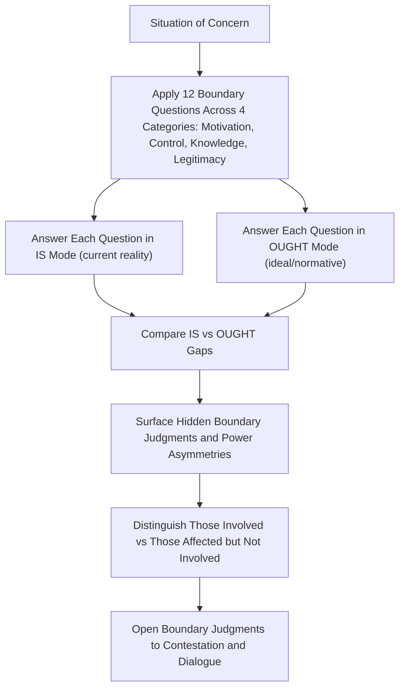

## Critical Systems Thinking and Critical Systems Heuristics

### Overview

Critical Systems Thinking (CST) is a meta-level movement within systems science that emerged largely in response to perceived limitations in both "hard" systems approaches (which assume consensus on goals and treat problems as technically well-defined) and early "soft" systems approaches (which address multiple perspectives but were seen by some critics as insufficiently attentive to power and coercion). CST's central concern is that any systems intervention rests on **boundary judgments** — decisions about what is included as relevant to "the system" and what is excluded — and that these judgments are inherently value-laden and contestable, not neutral technical facts. **Critical Systems Heuristics (CSH)**, developed by Werner Ulrich, is the most influential and widely used methodology within the CST tradition, providing a structured toolkit for surfacing and critiquing these boundary judgments.

### The Core Problem CST Addresses: Boundary Judgments

Every systems analysis or intervention must decide, implicitly or explicitly, what counts as part of "the system," who counts as a relevant stakeholder, and what counts as a legitimate measure of success. These decisions are **boundary judgments**. CST's foundational claim is that:

- Boundary judgments are unavoidable — no analysis can include everything
- Boundary judgments are inherently normative — they encode whose interests, knowledge, and values are treated as relevant, and whose are excluded
- Boundary judgments are frequently made implicitly, by experts or powerful stakeholders, without being surfaced for scrutiny or debate — which can silently disadvantage those excluded from the boundary
- Making boundary judgments explicit and contestable (**boundary critique**) is therefore an ethical and methodological necessity, not an optional refinement

This concern distinguishes CST from purely technical or purely pluralist ("soft") systems approaches: CST explicitly foregrounds power, marginalization, and coercion as core methodological concerns, not incidental features of a situation.

### CST's Critique of Hard and Soft Systems Approaches

| Approach Type | Assumption | CST's Critique |
| --- | --- | --- |
| Hard systems (e.g., systems engineering, operations research) | A single, well-defined problem and objective function exist; the task is optimization | Assumes away disagreement about goals and values; treats boundary-setting as a technical, not normative, act |
| Soft systems (e.g., Soft Systems Methodology) | Multiple legitimate worldviews exist; the task is facilitating mutual understanding among stakeholders | [Contested] Some CST theorists (notably Ulrich, and later Michael Jackson) argue soft approaches can still under-address structural power asymmetries — facilitating "understanding" between parties with grossly unequal power is not the same as addressing that inequality |
| Critical systems thinking | Boundary judgments encode power and values; these must be made explicit and open to contestation, especially by those affected but not empowered to participate | Positions itself as addressing what it sees as a gap left by both hard and soft traditions |

[Inference] This three-way categorization (hard/soft/critical) is a widely used pedagogical framing in systems thinking literature, but practitioners differ on how sharply these traditions should be separated in practice; some methodologies (and some practitioners) deliberately blend soft and critical elements rather than treating them as mutually exclusive schools.

### Total Systems Intervention and Critical Systems Practice

Building on CST's critique, Robert Flood and Michael Jackson proposed **Total Systems Intervention (TSI)**, later evolved into **Critical Systems Practice (CSP)** — a meta-methodology for selecting and combining different systems methods (hard, soft, and critical) depending on the nature of a given situation, rather than treating any single methodology as universally applicable.

- **Systems of Systems Methodologies (SOSM)**: a framework categorizing problem situations along two dimensions — the complexity of relationships (simple vs. complex) and the degree of agreement among stakeholders (unitary, pluralist, or coercive) — used to guide which methodology (or combination) is appropriate for a given situation
- **Methodological complementarism**: the principle that different methodologies have different strengths suited to different situation types, and a critical systems practitioner should be able to select and combine them reflectively rather than being committed to a single "one true method"

### Critical Systems Heuristics (CSH) — Werner Ulrich's Framework

CSH, developed by Werner Ulrich (drawing on Kantian critical philosophy and Habermasian discourse ethics), is the most developed and widely applied methodology within CST. Its central tool is **boundary critique**, operationalized through a structured set of **twelve boundary questions**, organized into **four categories** reflecting four distinct sources of influence over how a situation is framed.

#### The Four Boundary Categories

The categories are motivation, control, knowledge, and legitimacy, and their associated boundary questions are designed to uncover what is and what is not relevant to the system of interest. [Springer](https://link.springer.com/article/10.1007/s11213-023-09665-9)

CSH makes this explicit through its twelve boundary questions, organised around four sources of selectivity: motivation, control, knowledge, and legitimacy. [ResearchGate](https://www.researchgate.net/publication/43642939_Critical_Systems_Heuristics)

| Category | Concern | Representative Question Focus |
| --- | --- | --- |
| Motivation (Sources of Value) | Whose purposes and values does the system serve? | Who is the intended beneficiary? What is the actual purpose? What is the measure of success/improvement? |
| Control (Sources of Power) | Who has decision-making authority? | Who is the decision-maker with power to change the system's boundary conditions and resources? What resources are controlled by the decision-maker? What conditions lie outside the decision-maker's control? |
| Knowledge (Sources of Expertise) | Whose knowledge and expertise count as legitimate? | Who is considered a legitimate expert? What counts as relevant knowledge/expertise? Where does guarantee for the intervention's success ultimately lie? |
| Legitimacy (Sources of Legitimation) | Whose voice is heard, and on what moral basis does the system claim legitimacy? | Who represents the interests of those affected but not involved? What space is granted to the perspectives of those negatively affected? What worldview underlies the definition of "improvement"? |

Ulrich derived his twelve boundary categories and the corresponding boundary questions from these four deep-seated sources of human intentionality. [Integration and Implementation Insights](https://i2insights.org/2022/05/24/critical-systems-heuristics/)

#### The "Is" and "Ought" Modes

Each question is considered in two modes: an ideal mode (what 'should' be), and a descriptive mode (what 'is'), making twenty-four questions in total. Each boundary question may be asked in both the "is" and "ought to be" modes, offering another dimension to the framework as users can explore the system as it is now, and as it would be ideally. [Better Evaluation](https://www.betterevaluation.org/methods-approaches/approaches/critical-system-heuristics)[Springer](https://link.springer.com/article/10.1007/s11213-023-09665-9)

Comparing the gap between the "is" answer and the "ought" answer for each question is itself diagnostically revealing — a large gap indicates an area of significant normative tension or contested legitimacy within the situation, worth surfacing explicitly for discussion among stakeholders.

#### "Those Involved" vs. "Those Affected"

A central conceptual distinction in CSH: the framework distinguishes between 'systems' as conceptual tools and 'situations' as real-world contexts, and crucially separates **those involved** (participants with power or standing in a decision process) from **those affected but not involved** — people who bear the consequences of a system's design or operation without having a voice in shaping it. Each question should be considered not only from the standpoint of those involved but also from the perspective of those not involved but concerned or potentially affected. Surfacing this gap is one of CSH's primary emancipatory functions. [Academia.edu](https://www.academia.edu/18042593/Critical_Systems_Heuristics)[Wulrich](https://wulrich.com/downloads/ulrich_1996a.pdf)

### Diagram: The CSH Boundary Critique Process

### SVG: Four Boundary Categories Structure (svg_diagram)

<svg xmlns="http://www.w3.org/2000/svg" viewBox="0 0 640 320">
<text x="320" y="24" font-size="15" font-weight="bold" text-anchor="middle" fill="#1a1a1a">CSH Four Boundary Categories (svg_diagram)</text>
<rect x="40" y="60" width="260" height="100" rx="8" fill="none" stroke="#2b6cb0" stroke-width="2" />
<text x="170" y="82" font-size="12" text-anchor="middle" fill="#2b6cb0" font-weight="bold">Motivation</text>
<text x="170" y="102" font-size="9" text-anchor="middle" fill="#333">Beneficiary / Purpose /</text>
<text x="170" y="116" font-size="9" text-anchor="middle" fill="#333">Measure of Improvement</text>
<rect x="340" y="60" width="260" height="100" rx="8" fill="none" stroke="#38a169" stroke-width="2" />
<text x="470" y="82" font-size="12" text-anchor="middle" fill="#38a169" font-weight="bold">Control</text>
<text x="470" y="102" font-size="9" text-anchor="middle" fill="#333">Decision-Maker / Resources /</text>
<text x="470" y="116" font-size="9" text-anchor="middle" fill="#333">Conditions Outside Control</text>
<rect x="40" y="180" width="260" height="100" rx="8" fill="none" stroke="#c05621" stroke-width="2" />
<text x="170" y="202" font-size="12" text-anchor="middle" fill="#c05621" font-weight="bold">Knowledge</text>
<text x="170" y="222" font-size="9" text-anchor="middle" fill="#333">Legitimate Expert / Relevant</text>
<text x="170" y="236" font-size="9" text-anchor="middle" fill="#333">Expertise / Guarantee of Success</text>
<rect x="340" y="180" width="260" height="100" rx="8" fill="none" stroke="#805ad5" stroke-width="2" />
<text x="470" y="202" font-size="12" text-anchor="middle" fill="#805ad5" font-weight="bold">Legitimacy</text>
<text x="470" y="222" font-size="9" text-anchor="middle" fill="#333">Representation of Affected /</text>
<text x="470" y="236" font-size="9" text-anchor="middle" fill="#333">Worldview of "Improvement"</text>

<text x="320" y="305" font-size="10" text-anchor="middle" fill="#333">Each category: 3 questions x (is/ought modes) = 24 total responses</text>

</svg>

### Functions of Boundary Critique

The twelve critical boundary questions can be used, first, to identify boundary judgments systematically; second, to analyse alternative reference systems for defining a problem or assessing a solution proposal; and third, to challenge in a compelling way any claims to knowledge, rationality or 'improvement' that rely on hidden boundary judgments or take them for granted. [Wulrich](https://wulrich.com/downloads/ulrich_2002b.pdf)

The first two applications are basic for dealing with multiple perspectives in basically cooperative settings — they can help people understand why, in respect to one and the same situation, their considerations of "fact" and "value" differ, and can thus help bridge such differences or at least promote mutual understanding and cooperation. The third application leads to an emancipatory employment of systems thinking, offering both those involved in and those affected by professional practice a new critical competence, regardless of their theoretical knowledge or special expertise with respect to the problem in question. [Syscoi](https://stream.syscoi.com/2019/12/28/w-ulrichs-home-page-a-mini-primer-of-critical-systems-heuristics/)[Wulrich](https://wulrich.com/downloads/ulrich_2002b.pdf)

### Boundary Critique as an Ongoing, Participatory Process

Boundary critique is presented as a participatory process of unfolding and questioning boundary judgements rather than as an expert-driven process of boundary setting. This reflects CSH's philosophical commitment (rooted in Kantian critique and Habermasian discourse ethics) that no expert, however well-intentioned, can neutrally define a system's boundaries on behalf of all affected parties — legitimacy requires ongoing, open contestability, not a one-time expert determination. Experts must acknowledge their lay status regarding boundary judgments to ensure rational discourse. [Academia.edu](https://www.academia.edu/18042593/Critical_Systems_Heuristics)[Academia.edu](https://www.academia.edu/23198797/Ulrich_W_1987_Critical_heuristics_of_social_systems_design)

### CST/CSH in Evaluation Practice

CSH has found significant application in program and policy evaluation, distinct from its origins in systems design: CSH is regarded as part of a 'systems thinking in practice' framework for evaluating complex situations from different stakeholder perspectives, framing the situation under evaluation as a reference system evaluated by a toolbox comprising four sets of questions evaluating built-in values, power structures, expert assumptions, and the moral basis on which an intervention operates, considered from the perspective of both intended beneficiaries and those who might be negatively affected. [ResearchGate](https://www.researchgate.net/publication/43642939_Critical_Systems_Heuristics)

Rather than asking "what do you see in this situation?" as in most evaluation approaches, CSH inquires more deeply into the underlying assumptions — values, power structures, knowledge bases, and moral stances — that affect how different concerned parties perceive a situation. Case studies applying CSH span contexts including participatory planning and stakeholder engagement in international development settings. [Better Evaluation](https://www.betterevaluation.org/methods-approaches/approaches/critical-system-heuristics)[Better Evaluation](https://www.betterevaluation.org/methods-approaches/approaches/critical-system-heuristics)

### Critiques and Open Debates

- CSH has been influential in shaping the critical systems thinking tradition, but remains a relatively underutilised method in practice compared to its theoretical prominence. [Springer](https://link.springer.com/article/10.1007/s11213-023-09665-9)
- The positioning of CSH research and practice within the broader systems thinking tradition has itself been the subject of ongoing scholarly debate — some scholars question whether CSH is best understood as a "systems method" in the same sense as SSM or VSM, or as a distinct critical-philosophical framework that uses systems language instrumentally [Springer](https://link.springer.com/article/10.1007/s11213-023-09665-9)
- [Inference] A practical critique noted in the literature concerns the resource and skill intensity of rigorous boundary critique — systematically working through twelve questions in both is/ought modes, across multiple stakeholder perspectives, requires significant facilitation skill and time investment, which may explain the gap between CSH's theoretical influence and its comparatively limited routine practical adoption
- CST more broadly has evolved to consider "CST for citizens" — an aim not that professionals ought to take an advocacy stance in favor of certain groups, but that critical systems thinking should be developed so that ordinary citizens can use it on their own behalf, reflecting an ongoing debate about whether CST's emancipatory aims are best served by expert-mediated application or by direct citizen empowerment [Academia.edu](https://www.academia.edu/23198797/Ulrich_W_1987_Critical_heuristics_of_social_systems_design)

### Worked Example — Applying CSH to a Government Digitization Project

Applying boundary critique to a document management system rollout for a local government unit (illustrative, in the spirit of a batac-dms-type digitization initiative):

- **Motivation**: Who is the intended beneficiary — is it primarily government staff efficiency, or citizens seeking faster service? What measure of "success" is being used (processing time reduction vs. citizen satisfaction vs. audit compliance), and who chose that measure?
- **Control**: Who has authority to change system requirements or budget — IT department leadership, elected officials, or an external vendor? What conditions (e.g., legacy paper-based legal requirements, national e-governance mandates) lie outside any single decision-maker's control?
- **Knowledge**: Whose expertise is treated as authoritative in designing the system — software engineers, records-management professionals, or the front-line clerks who currently process documents manually? Is the tacit knowledge of long-serving clerical staff being solicited, or only formal technical requirements?
- **Legitimacy**: Who represents the interests of citizens who may lack digital literacy or internet access and could be disadvantaged by a purely digital process? What worldview of "improvement" underlies the project — is digitization assumed to be unambiguously beneficial for all affected parties, or could it create new forms of exclusion for those without ready system access?
- [Inference] This worked example applies the general CSH question structure to an illustrative scenario; a genuine CSH application would require direct engagement with actual stakeholders to answer these questions empirically, rather than assuming answers analytically — the framework's value lies precisely in surfacing answers through participatory dialogue, not in an analyst's own inference.

### Key Points

- CST centers on the claim that boundary judgments — decisions about what's relevant to a system — are unavoidable, value-laden, and often made implicitly by the powerful at the expense of those affected
- CST distinguishes itself from both hard systems approaches (which treat boundaries as technical) and soft systems approaches (which some CST theorists argue underweight power asymmetries)
- CSH's core tool is boundary critique via twelve questions across four categories: motivation, control, knowledge, legitimacy — each asked in both "is" and "ought" modes
- The distinction between "those involved" and "those affected but not involved" is central to CSH's emancipatory aim
- CSH has strong theoretical influence but is noted in the literature as comparatively underutilized in routine practice relative to that influence

**Related Topics**

- Soft Systems Methodology (Checkland)
- Total Systems Intervention and Critical Systems Practice
- The Viable System Model (Contrasted as a "Hard-to-Soft" Structural Approach)
- Habermasian Discourse Ethics and Communicative Rationality
- Multi-Methodology and the Systems of Systems Methodologies (SOSM) Framework
- Stakeholder Analysis and Participatory Evaluation Methods