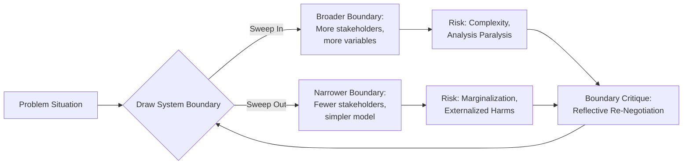

## Boundary Critique

### Definition and Core Concept

Boundary critique is a philosophical and methodological framework within critical systems thinking that examines how the "boundaries" of a system of interest are drawn — that is, what is included as relevant, what is excluded as irrelevant, and who gets to make that determination. Every systems analysis, model, or intervention necessarily draws a boundary around what counts as "the system," and boundary critique treats this act of boundary-setting as inherently value-laden and contestable rather than neutral or purely technical.

The central claim is that no system boundary is given by nature; it is always a construction that reflects the purposes, values, and power positions of whoever draws it. Because different stakeholders have different interests, the same "problem situation" can be bounded in radically different ways, producing different definitions of what is relevant, what counts as a solution, and who benefits.

### Historical Origins

Boundary critique originated with the philosopher and systems theorist C. West Churchman, particularly in his 1970 paper "The Anatomy of Systems Teams" and his 1971 book *The Design of Inquiring Systems*, where he argued that systems designers must confront an "enemy" — the unexamined assumptions that limit systems rationality — chiefly by continually questioning the boundaries of the system under study.

Werner Ulrich systematized these ideas into a rigorous methodology in his 1983 work *Critical Heuristics of Social Planning*, drawing on Churchman's philosophy and Immanuel Kant's critical philosophy (particularly the idea of critique as reflection on the limits and conditions of knowledge). Ulrich's **Critical Systems Heuristics (CSH)** is the most fully developed operationalization of boundary critique and remains the primary practical toolkit associated with it.

### Why Boundaries Matter: The Problem of Selective Inclusion

Any systems model, however comprehensive it appears, is necessarily a selective representation. Decisions about scope inevitably:

- Include certain stakeholders as legitimate participants and exclude others
- Define certain concerns as "relevant" and others as "externalities" or "out of scope"
- Privilege certain sources of expertise (e.g., technical/managerial) over others (e.g., experiential/lay knowledge)
- Determine what counts as evidence of success or failure

**Key Points**

- Boundary judgments are unavoidable — there is no "view from nowhere" or boundary-free systems analysis
- Boundary judgments are normative — they encode whose interests count
- Boundary judgments are provisional — they can and should be revisited as understanding deepens
- Making boundary judgments explicit is itself an ethical and political act, not merely a technical step

### Ulrich's Critical Systems Heuristics (CSH)

CSH provides the most widely used formal apparatus for boundary critique, built around **twelve boundary questions** organized into four categories, each with an "is" mode (how things currently stand) and an "ought" mode (how things should stand). The gap between "is" and "ought" answers reveals hidden assumptions and contested boundary judgments.

The four categories, each addressing a core social role:

1. **Sources of Motivation** — Who benefits? What is the purpose?
   - Client/beneficiary, purpose, measure of improvement
2. **Sources of Control** — Who has power? Who decides?
   - Decision-maker, resources controlled, the wider institutional/social environment (conditions not controlled)
3. **Sources of Knowledge** — Who is considered expert?
   - Expert/professional providing relevant knowledge, nature of that expertise, guarantor of success (what/who ensures the plan will work)
4. **Sources of Legitimacy** — Who is affected but not involved? Who speaks for them?
   - Witness representing the interests of those affected but not involved (the "affected" as opposed to the "involved"), emancipation (opportunity for those affected to develop independently of the design), worldview underlying the whole exercise

**Example**

| Category | Boundary Question (abbreviated, "ought" mode) | Illustrative Answer (hospital IT system redesign) |
| --- | --- | --- |
| Motivation | Who *ought to* be the client/beneficiary? | Patients and clinical staff, not just hospital administration |
| Control | Who *ought to* be the decision-maker? | A joint clinician-patient advisory board, not IT department alone |
| Knowledge | Who *ought to* count as an expert? | Nurses and patients with lived experience of workflow, not only software vendors |
| Legitimacy | Who *ought to* represent those affected but not involved? | Patient advocacy groups representing non-participating patients |

Comparing the "is" answer (e.g., "the IT department alone decides") against the "ought" answer (e.g., "clinicians and patients should co-decide") exposes a **boundary judgment gap** — a signal that the current system boundary marginalizes legitimate stakeholders.

### The Sweep-In / Sweep-Out Dynamic

Boundary critique treats boundary-setting as a continuous negotiation between two pressures:

- **Sweeping in**: Expanding the boundary to include more stakeholders, variables, and consequences — improving comprehensiveness but risking analysis paralysis or loss of focus
- **Sweeping out**: Narrowing the boundary to keep analysis tractable — improving feasibility but risking the marginalization of affected parties ("externalization" of costs or harms)

This tension is not something to be permanently resolved; it is meant to be managed reflectively and revisited iteratively as a project unfolds.

### Involved vs. Affected Stakeholders

A foundational distinction in boundary critique is between:

- **The Involved**: Those who participate in defining the system — decision-makers, planners, experts, clients
- **The Affected**: Those who bear the consequences of the system's operation or the intervention but have no say in shaping it

Boundary critique's ethical thrust centers on surfacing the **affected-but-not-involved**, since this group's marginalization is often invisible to those inside the boundary. Ulrich uses the concept of "witnesses" — representatives who can voice the perspective of the affected within the planning process — as a partial remedy, while stressing that genuine emancipation requires the affected eventually gaining a voice of their own rather than only being spoken for.

### Relationship to Critical Systems Thinking (CST)

Boundary critique is the conceptual anchor of the broader **Critical Systems Thinking (CST)** movement, which itself emerged partly as a critique of earlier "hard" systems approaches (e.g., systems engineering, systems analysis) for treating system boundaries as objectively given, and of pure "soft" systems approaches (e.g., Soft Systems Methodology) for under-theorizing power and marginalization.

CST, informed by boundary critique, rests on three commitments often summarized as:

1. **Critical awareness**: Reflecting on the assumptions, values, and boundary judgments embedded in any methodology or model
2. **Social awareness**: Recognizing that methodologies operate within particular social/organizational conditions that shape which approach is even feasible
3. **Methodological pluralism**: No single method is universally appropriate; different situations call for different tools (this commitment underlies **Total Systems Intervention** and later **Multimethodology**, e.g., Mingers and Brocklesby's mixing of hard, soft, and emancipatory methods).

### Boundary Objects and Boundary Critique (Conceptual Distinction)

Boundary critique should be distinguished from Susan Leigh Star's concept of **boundary objects** (artifacts flexible enough to be used meaningfully across different communities of practice, e.g., a shared database schema interpreted differently by clinicians and administrators). Boundary objects are about *coordination across* boundaries; boundary critique is about *interrogating the legitimacy of* boundaries themselves. They are complementary but address different problems.

### Practical Application Process

**Next Steps** (typical CSH-based facilitation sequence)

1. Identify the problem situation and initial stakeholder map
2. Pose all twelve boundary questions in "is" mode with the involved stakeholders (planners, decision-makers)
3. Pose the same twelve questions in "ought" mode, ideally involving both the involved and representatives of the affected
4. Compare "is" vs. "ought" answers to surface boundary judgment gaps
5. Facilitate dialogue on contested boundary judgments — this is often done through structured workshops or Socratic-style questioning
6. Redraw the system boundary (or explicitly justify retaining it) based on the dialogue
7. Document boundary judgments transparently so they can be revisited as the situation evolves
8. Iterate — boundary critique is not a one-time gate but a recurring checkpoint throughout an intervention's lifecycle

### Common Critiques and Limitations

- [Inference] In practice, genuine involvement of the "affected" can be difficult to operationalize when those groups are diffuse, unorganized, or lack resources to participate in workshops, even though CSH's normative framework calls for their inclusion.
- Power asymmetries that boundary critique aims to expose can also constrain the boundary critique process itself — decision-makers who commission the analysis may resist boundary judgments that threaten their authority.
- The twelve-question framework, while systematic, can become a checklist exercise if not paired with genuine facilitation skill and organizational will to act on findings.
- [Unverified] The degree to which boundary critique demonstrably changes real-world outcomes (versus improving the quality of dialogue and awareness) is not something with extensive controlled comparative evidence; most support comes from case studies and practitioner reports rather than systematic empirical evaluation.

### Illustrative Diagram: CSH Four Categories (svg_diagram)

<svg xmlns="http://www.w3.org/2000/svg" viewBox="0 0 640 460">
\<style\>
.box { fill: #eef3fb; stroke: #2c5282; stroke-width: 1.5; }
.title { font: bold 13px sans-serif; fill: #1a365d; }
.label { font: 12px sans-serif; fill: #2d3748; }
.center { fill: #fefcbf; stroke: #b7791f; stroke-width: 2; }
.centertext { font: bold 14px sans-serif; fill: #744210; }
\</style\>
<text x="320" y="24" text-anchor="middle" class="title">Critical Systems Heuristics: Four Boundary Categories (svg_diagram)</text>
<rect x="240" y="200" width="160" height="60" rx="8" class="center" />
<text x="320" y="225" text-anchor="middle" class="centertext">System Boundary</text>
<text x="320" y="243" text-anchor="middle" class="centertext">Judgment</text>
<rect x="30" y="60" width="200" height="90" rx="8" class="box" />
<text x="130" y="82" text-anchor="middle" class="title">Sources of Motivation</text>
<text x="130" y="102" text-anchor="middle" class="label">Client / Beneficiary</text>
<text x="130" y="120" text-anchor="middle" class="label">Purpose</text>
<text x="130" y="138" text-anchor="middle" class="label">Measure of Improvement</text>
<rect x="410" y="60" width="200" height="90" rx="8" class="box" />
<text x="510" y="82" text-anchor="middle" class="title">Sources of Control</text>
<text x="510" y="102" text-anchor="middle" class="label">Decision-Maker</text>
<text x="510" y="120" text-anchor="middle" class="label">Resources Controlled</text>
<text x="510" y="138" text-anchor="middle" class="label">Decision Environment</text>
<rect x="30" y="320" width="200" height="90" rx="8" class="box" />
<text x="130" y="342" text-anchor="middle" class="title">Sources of Knowledge</text>
<text x="130" y="362" text-anchor="middle" class="label">Expert / Professional</text>
<text x="130" y="380" text-anchor="middle" class="label">Expertise Type</text>
<text x="130" y="398" text-anchor="middle" class="label">Guarantor of Success</text>
<rect x="410" y="320" width="200" height="90" rx="8" class="box" />
<text x="510" y="342" text-anchor="middle" class="title">Sources of Legitimacy</text>
<text x="510" y="362" text-anchor="middle" class="label">Witness (Affected)</text>
<text x="510" y="380" text-anchor="middle" class="label">Emancipation</text>
<text x="510" y="398" text-anchor="middle" class="label">Worldview</text>
<line x1="230" y1="105" x2="240" y2="215" stroke="#4a5568" stroke-width="1.5" />
<line x1="410" y1="105" x2="400" y2="215" stroke="#4a5568" stroke-width="1.5" />
<line x1="230" y1="365" x2="240" y2="245" stroke="#4a5568" stroke-width="1.5" />
<line x1="410" y1="365" x2="400" y2="245" stroke="#4a5568" stroke-width="1.5" />
</svg>

### Conclusion

Boundary critique reframes systems analysis as an inescapably ethical activity: every act of modeling a system is simultaneously an act of deciding whose interests matter. Ulrich's Critical Systems Heuristics operationalizes this insight through structured "is/ought" boundary questions across motivation, control, knowledge, and legitimacy, exposing the gap between who currently shapes a system and who should. Rather than seeking a single "correct" boundary, the practice cultivates ongoing reflective vigilance — continually asking who is swept in, who is swept out, and who bears the difference.

**Related Topics**

- Critical Systems Heuristics (CSH) — detailed methodology and question set
- Total Systems Intervention (TSI)
- Multimethodology (Mingers and Brocklesby)
- Soft Systems Methodology (SSM) — Checkland
- Churchman's "Enemies of the Systems Approach"
- Stakeholder Analysis vs. Boundary Critique
- Emancipatory Systems Thinking
- Systemic Intervention (Midgley)
- Boundary Objects (Star and Griesemer) — conceptual contrast
- Power and Participation in Systems Design