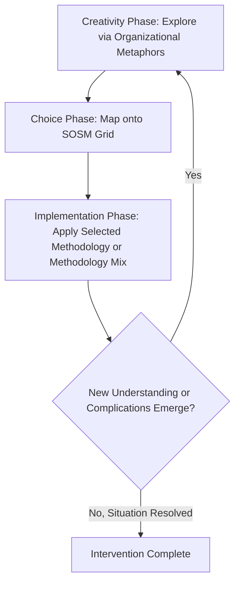

## Total Systems Intervention and Multimethodology

### Definition

**Total Systems Intervention (TSI)** is a meta-methodology developed by Robert Flood and Michael Jackson (early 1990s) that provides a structured framework for selecting and combining different systems methodologies (hard systems, soft systems, cybernetic, critical, etc.) based on the nature of the problem situation, rather than committing to a single methodology for all problems. **Multimethodology** (most fully developed by Jonathan Mingers) is the broader research and practice tradition concerned with combining multiple methodologies — often across different paradigms — within a single intervention, and with the theoretical and practical justification for doing so. TSI is generally regarded as one of the foundational and most influential concrete implementations of the multimethodology idea, situated within the wider Critical Systems Thinking (CST) movement.

Both arose from the same core critique: that any single systems methodology (Hard Systems Engineering, Soft Systems Methodology, System Dynamics, Viable System Model, etc.) is designed around implicit assumptions about the nature of the problem situation — e.g., whether stakeholders share unitary goals, whether the system is well-defined and quantifiable — and applying it to a mismatched situation produces poor or even harmful results.

### Theoretical Foundations

**Critique of methodological monism**: Prior to CST, practitioners tended to be trained in and loyal to a single methodology, applying it universally ("if all you have is a hammer, every problem looks like a nail"). TSI's foundational claim is that different methodologies possess different strengths matched to different problem types, and that a practitioner's job includes correctly diagnosing which type of problem situation is present *before* selecting a methodology.

**Complementarism**: TSI operationalizes complementarism — the philosophical position that different paradigms and methodologies can be used together, in a principled and structured way, without requiring the users to fully resolve deep incommensurability debates between the paradigms at the philosophical level. This makes TSI distinct from naive eclecticism (grabbing tools without theoretical justification) and from the incommensurability thesis that different paradigms can never be combined.

**Grounding in Burrell and Morgan's paradigm framework**: TSI classifies problem situations and methodologies along dimensions derived from the Burrell and Morgan sociological paradigms (functionalist, interpretive, radical humanist, radical structuralist) as adapted to systems thinking, primarily along two axes:

- **Systems complexity**: simple vs. complex (how many interacting elements, how much interconnection and interdependence)
- **Participant relations**: unitary, pluralist, or coercive (whether stakeholders share common interests/goals, hold genuinely diverse but reconcilable interests, or hold fundamentally conflicting/coercive interests with significant power imbalances)

This produces a **System of Systems Methodologies (SOSM)**, a matrix mapping problem-situation types to appropriate methodology families.

### The System of Systems Methodologies (SOSM) Grid

|  | Unitary | Pluralist | Coercive |
| --- | --- | --- | --- |
| **Simple** | Hard Systems Thinking / Systems Engineering, Operations Research | Soft Systems Methodology (SSM), Strategic Assumption Surfacing and Testing (SAST) | Critical Systems Heuristics (CSH) |
| **Complex** | System Dynamics, Viable System Model (VSM), Complexity Theory approaches | Interactive Planning, Soft Systems Methodology (in more complex settings) | Critical Systems Heuristics combined with emancipatory/participative approaches, Postmodern Systems Thinking |

- **Simple-Unitary**: A well-bounded technical problem with agreed goals — hard systems methods (optimization, systems engineering) are well suited.
- **Simple-Pluralist / Complex-Pluralist**: Stakeholders have differing perspectives and interests but are willing to negotiate toward accommodation — soft, interpretive methodologies (SSM) that surface and reconcile multiple worldviews are well suited.
- **Coercive (Simple or Complex)**: Significant power asymmetries and fundamentally conflicting interests exist among stakeholders — critical/emancipatory approaches (CSH) explicitly designed to surface whose voices are included/excluded and to challenge power structures are called for.

### TSI's Three-Phase Iterative Process

TSI is structured as a cyclical, three-phase process (not strictly linear — practitioners iterate and revisit phases as understanding develops):

1. **Creativity Phase**: Stakeholders and facilitators use "systems metaphors" (drawing on Gareth Morgan's organizational metaphors — machine, organism, brain, culture, political system, psychic prison, flux/transformation, domination) to generate multiple ways of seeing and framing the problem situation. This phase deliberately resists premature convergence on a single problem definition, surfacing the complexity/participant-relations characteristics of the situation.
2. **Choice Phase**: Based on the dominant and dependent metaphors/characteristics surfaced in the Creativity Phase, the SOSM grid is consulted to select the most appropriate methodology (or combination of methodologies) for intervention — matching problem type to method.
3. **Implementation Phase**: The chosen methodology (or methodologies) is applied in practice to address the problem situation, and the results feed back to potentially revisit the Creativity Phase if new understanding emerges (e.g., an intervention reveals previously hidden coercive dynamics, prompting a return to reframe the situation).

### Process Diagram (svg_diagram)

### Multimethodology: Broader Framework (Mingers)

While TSI is a specific meta-methodology, **Multimethodology** as a field (most associated with Jonathan Mingers' body of work) generalizes the underlying combination logic and provides additional structuring concepts:

- **The Grid of Points of Intervention**: Mingers proposed that any research/intervention engages with at least three "worlds" or aspects of reality — the material (objective, physical), the social (intersubjective, cultural/normative), and the personal (subjective, individual meaning) — and any given methodology tends to engage more strongly with some of these than others. Multimethodology argues that combining methodologies allows an intervention to more fully address all three, where a single methodology would leave gaps.
- **Modes of combination**: Multimethodology identifies distinct ways methodologies (or parts of methodologies) can be combined within a single intervention:
  - **Sequential combination**: Different methodologies (or phases of different methodologies) are used one after another (e.g., SSM used to explore the problem situation, followed by System Dynamics to build a quantitative model of the agreed structural issues).
  - **Parallel combination**: Different methodologies are used simultaneously on different aspects of the same problem.
  - **Partial/embedded combination**: Techniques or tools from one methodology are inserted into and used within the structure of another (e.g., using rich pictures, a SSM technique, within an otherwise hard-systems-engineering project).
- **Paradigm mixing justification**: Because methodologies often originate from different, sometimes incompatible philosophical paradigms (e.g., positivist Hard Systems Engineering vs. interpretivist SSM), multimethodology draws on **critical realism** (particularly Bhaskar's stratified ontology) as a philosophical grounding that allows different methodologies addressing different "domains" or "strata" of reality to be legitimately combined without requiring full paradigm reconciliation.

### Comparison: TSI vs. General Multimethodology

| Aspect | Total Systems Intervention (TSI) | Multimethodology (general) |
| --- | --- | --- |
| Originators | Robert Flood, Michael Jackson | Jonathan Mingers (principal), with broader contributor base |
| Scope | A specific, structured three-phase meta-methodology with the SOSM grid as its selection mechanism | A broader theoretical and practical research program about combining methodologies generally |
| Selection mechanism | Explicit grid (complexity × participant relations) | More flexible; grounded in critical realism and the three-worlds framework rather than a single fixed grid |
| Primary theoretical grounding | Burrell and Morgan paradigms, complementarism | Critical realism, stratified ontology |
| Relationship | TSI is often cited as a key precursor and specific instance within the broader multimethodology tradition | Encompasses TSI as one prominent example alongside other combination approaches |

### Real-World Application Example

**Example — Public Sector Service Redesign**

A city government wants to redesign its permitting process. Initial diagnosis reveals: department staff broadly agree the process is inefficient (suggesting unitary/simple elements for some sub-processes), but different stakeholder groups (applicants, inspectors, elected officials) hold sharply differing views on priorities and hold unequal power over the outcome (suggesting pluralist-to-coercive, complex elements overall).

A TSI-informed intervention might: (1) run a Creativity Phase workshop using multiple organizational metaphors to surface these differing framings; (2) in the Choice Phase, recognize the situation spans multiple SOSM cells — some sub-processes are simple-unitary (workflow bottlenecks solvable via process mapping/hard systems methods), while the overall governance question is complex-pluralist-to-coercive (requiring SSM-style stakeholder reconciliation plus CSH-style attention to whose interests are marginalized); (3) in Implementation, sequentially combine hard systems process analysis for the technical workflow with SSM for stakeholder alignment and CSH questions to explicitly check whose voices were excluded from the redesign.

### Critiques and Limitations

- **SOSM grid oversimplification**: Critics (including some within the CST tradition itself) argue the simple/complex and unitary/pluralist/coercive categorizations are themselves reductive labels imposed on messy, often ambiguous real situations, risking a new form of methodological rigidity if applied mechanically.
- **Practitioner skill dependency**: TSI and multimethodology require practitioners to be genuinely competent across multiple methodologies from different paradigms — a significant training and expertise burden compared to mastering a single methodology, which can limit real-world adoption.
- **Risk of superficial combination**: [Inference] Without careful theoretical grounding (as multimethodology's critical realist foundation attempts to provide), combining methodologies risks producing an incoherent patchwork rather than a principled, mutually reinforcing intervention — this is precisely the theoretical gap multimethodology's "three worlds" and combination-mode framework is intended to close.
- **Contested paradigm commensurability**: The underlying philosophical question of whether genuinely incommensurable paradigms (e.g., strict positivism and strict interpretivism) can ever be legitimately combined, even under complementarism or critical realism, remains a live debate in the philosophy of social science and management science. [Unverified] The degree of consensus achieved on this question within the CST/multimethodology research community itself has evolved but is not fully settled.

### Related Topics

- Critical Systems Thinking (CST)
- Soft Systems Methodology (SSM)
- Critical Systems Heuristics (CSH)
- Viable System Model (VSM)
- System Dynamics
- Burrell and Morgan's Sociological Paradigms
- Critical Realism (Bhaskar)
- Organizational Metaphors (Gareth Morgan)