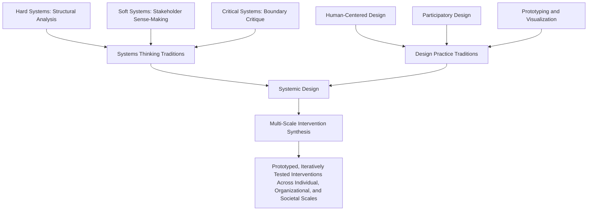

## Systems of Systems and Systemic Design

### Overview

"Systems of Systems" (SoS) and "Systemic Design" represent two related but distinct extensions of systems thinking that address large-scale, multi-component, multi-stakeholder challenges. **Systems of Systems** is primarily an engineering and management concept describing collections of independently operated, managerially and operationally distinct systems that combine to produce capabilities none could achieve alone. **Systemic Design** is a design discipline that integrates systems thinking methodologies (including critical and soft systems approaches) with design practice, particularly human-centered and participatory design, to address complex social and organizational challenges. Both concepts sit at the intersection of complexity science, critical systems thinking, and practical intervention in large, multi-actor situations.

### Systems of Systems (SoS) — Defining Characteristics

A System of Systems is a set or arrangement of independent systems that are integrated to produce a capability greater than the sum of the constituent systems' individual capabilities. SoS are distinguished from a single, monolithic complex system by several defining characteristics, most influentially articulated by Mark Maier:

**Operational Independence of Constituent Systems**

Each constituent system continues to operate independently and usefully to accomplish its own purposes, even when disconnected from the larger SoS. A constituent system was not necessarily built to be part of the SoS and can be removed without destroying its own standalone utility.

**Managerial Independence of Constituent Systems**

Each constituent system is managed, in significant part, for its own purposes rather than the purposes of the SoS as a whole. Different constituent systems may have entirely separate ownership, funding, and governance structures.

**Geographic Distribution**

Constituent systems are often geographically distributed, exchanging only information (not, for instance, significant mass or energy) across their interfaces — a characteristic that historically distinguished SoS thinking from traditional single-platform engineering.

**Emergent Behavior**

The SoS performs functions and carries out purposes that do not reside in any single constituent system — capability emerges from the interaction of independently operating and independently managed systems, which is a substantially harder engineering and governance challenge than emergence within a single, centrally-designed system.

**Evolutionary Development**

An SoS is never fully formed or finished; it typically evolves incrementally over time as constituent systems are added, removed, modified, or upgraded independently of the overall SoS design authority — if there even is a single design authority.

### SoS vs. a Single Complex System

| Property | Single Complex System | System of Systems |
| --- | --- | --- |
| Design authority | Typically one integrated design authority | Distributed across multiple independent authorities |
| Component autonomy | Components generally do not have independent purpose outside the system | Constituent systems retain independent operational purpose |
| Evolution | Managed as a planned lifecycle | Evolves incrementally and often unpredictably as constituents change independently |
| Governance | Centralized | Distributed, often requiring negotiated agreements rather than command authority |
| Example | A single aircraft's avionics suite | Air traffic control combining independently-operated airline systems, airport systems, and national airspace management systems |

### SoS Taxonomy (Maier / Dahmann Classifications)

A commonly cited taxonomy (originating with Maier, later refined by Judith Dahmann and colleagues in systems engineering practice) classifies SoS by degree of centralized control:

| Type | Description |
| --- | --- |
| Directed | A central management authority owns the SoS purpose, resourcing, and the constituent systems' evolution; constituents are subordinated to the central authority's SoS-level objectives |
| Acknowledged | Recognized SoS objectives, designated management, and resources exist for the SoS, but constituent systems retain their own independent management, objectives, funding, and development approaches; the SoS-level authority must negotiate rather than command |
| Collaborative | Constituent systems interact more or less voluntarily to fulfill agreed-upon central purposes; there is no overall SoS authority to enforce coordination — participation and standards compliance are voluntary |
| Virtual | No central management authority, no centrally agreed-upon purpose; large-scale behavior emerges from constituent systems relying on relatively invisible mechanisms (e.g., market forces, shared informal standards) to maintain it |

[Inference] This four-fold typology is widely referenced in systems engineering and defense-acquisition literature; the boundaries between categories in real-world cases are often ambiguous, and a given large-scale system arrangement may exhibit characteristics of more than one type simultaneously or shift between types over time as governance arrangements evolve.

### Diagram: SoS Governance Spectrum

### SVG: SoS Constituent Independence Structure (svg_diagram)

<svg xmlns="http://www.w3.org/2000/svg" viewBox="0 0 640 300">
<text x="320" y="24" font-size="15" font-weight="bold" text-anchor="middle" fill="#1a1a1a">System of Systems — Independent Constituents (svg_diagram)</text>
<rect x="60" y="70" width="140" height="90" rx="8" fill="none" stroke="#2b6cb0" stroke-width="2" />
<text x="130" y="100" font-size="10" text-anchor="middle" fill="#2b6cb0" font-weight="bold">Constituent A</text>
<text x="130" y="120" font-size="8" text-anchor="middle" fill="#333">Own management,</text>
<text x="130" y="133" font-size="8" text-anchor="middle" fill="#333">own purpose</text>
<rect x="250" y="70" width="140" height="90" rx="8" fill="none" stroke="#38a169" stroke-width="2" />
<text x="320" y="100" font-size="10" text-anchor="middle" fill="#38a169" font-weight="bold">Constituent B</text>
<text x="320" y="120" font-size="8" text-anchor="middle" fill="#333">Own management,</text>
<text x="320" y="133" font-size="8" text-anchor="middle" fill="#333">own purpose</text>
<rect x="440" y="70" width="140" height="90" rx="8" fill="none" stroke="#c05621" stroke-width="2" />
<text x="510" y="100" font-size="10" text-anchor="middle" fill="#c05621" font-weight="bold">Constituent C</text>
<text x="510" y="120" font-size="8" text-anchor="middle" fill="#333">Own management,</text>
<text x="510" y="133" font-size="8" text-anchor="middle" fill="#333">own purpose</text>
<line x1="200" y1="115" x2="250" y2="115" stroke="#666" stroke-width="1.5" stroke-dasharray="4,2" />
<line x1="390" y1="115" x2="440" y2="115" stroke="#666" stroke-width="1.5" stroke-dasharray="4,2" />
<path d="M130,160 Q320,230 510,160" fill="none" stroke="#805ad5" stroke-width="2" stroke-dasharray="6,3" />
<text x="320" y="245" font-size="11" text-anchor="middle" fill="#805ad5" font-weight="bold">Emergent SoS-level Capability</text>
<text x="320" y="262" font-size="9" text-anchor="middle" fill="#333">(exists only through interaction, resides in no single constituent)</text>
</svg>

### Challenges Specific to SoS Engineering and Governance

- **Interoperability without central control**: because constituent systems are independently managed, achieving interoperability (shared data formats, communication protocols, timing standards) often requires negotiated standards and voluntary compliance rather than top-down mandate — especially in collaborative or virtual SoS types
- **Emergent failure modes**: unexpected interactions between independently-tested constituent systems can produce SoS-level failures that no single constituent system's own testing would reveal, since the failure mode exists only in the interaction, not in any individual component
- **Evolutionary unpredictability**: because constituents evolve independently (often on different upgrade cycles, driven by their own separate priorities), the SoS as a whole is a continuously moving target rather than a fixed, once-designed artifact — a governance and requirements-management challenge distinct from traditional systems engineering
- **Distributed accountability**: when SoS-level failures occur, assigning responsibility is often genuinely ambiguous, since no single constituent-system owner has full authority (or full knowledge) of the whole — a challenge with direct parallels to the accountability difficulties described in critical systems thinking's concern with power and boundary-setting

### Systemic Design — Integrating Systems Thinking with Design Practice

**Systemic Design** is a discipline (associated prominently with the Systemic Design Research Network and designers/theorists including Peter Jones and Alex Ryan) that combines systems thinking's attention to complexity, interconnection, and multiple stakeholder perspectives with design practice's emphasis on synthesis, prototyping, visualization, and human-centeredness. It positions itself as addressing a gap: systems thinking methodologies are often strong on analysis and diagnosis but comparatively weaker on generative design of interventions, while design practice is often strong on synthesis and prototyping but historically weaker on handling large-scale, multi-stakeholder complexity.

**Key characteristics of systemic design:**

- **Multi-scale, multi-stakeholder framing**: explicitly designs across scales — from individual user experience up through organizational, institutional, and societal levels — rather than treating design as bounded to a single product or service scale
- **Gigamapping**: a visualization technique (associated with Birger Sevaldson) for representing extremely large, complex webs of relationships, stakeholders, and system elements relevant to a design challenge, often spanning far more scope than conventional design research maps, in order to surface unexpected connections and leverage points
- **Integration of "hard," "soft," and critical systems methods**: systemic design explicitly draws on the full spectrum of systems methodologies (structural/hard methods for well-defined subsystems, soft methods like SSM for stakeholder sense-making, critical methods like CSH for boundary critique) rather than committing to a single systems tradition
- **Design synthesis as intervention**: rather than only diagnosing a complex situation (as critical systems approaches emphasize), systemic design explicitly aims to generate concrete, prototypable interventions — bridging systems analysis and design synthesis into a single iterative practice

### Diagram: Systemic Design's Integration of Systems and Design Traditions

### Relationship to Critical Systems Thinking and Boundary Critique

Systemic design and SoS both connect back to earlier concepts in this chapter:

- **Boundary critique** is directly relevant to systemic design's gigamapping practice: deciding what to include in a gigamap (and what to leave out) is itself a boundary judgment, and systemic design practitioners are encouraged to treat the map's boundary as provisional and contestable, echoing CSH's emphasis on boundary judgments as never neutral
- **The Viable System Model's recursion principle** parallels SoS's nested structure: just as VSM's System 1 units are themselves viable systems, SoS constituent systems are themselves complete, independently viable systems — though SoS governance (often "acknowledged" or "collaborative," lacking VSM's unifying System 5 authority) is typically far less centrally coordinated than a classical VSM hierarchy
- **Critical Systems Practice's methodological complementarism** (selecting/combining methods based on situation type) is a direct precursor to systemic design's explicit integration of hard, soft, and critical methods within a single practice

### Worked Example — Framing a Multi-Agency Government Digital Service as an SoS and a Systemic Design Challenge

Applying both frameworks to a scenario resembling multi-agency government digitization (e.g., a national e-governance initiative that a local system like batac-dms might eventually need to interoperate with):

**As a System of Systems:**

- Constituent systems: the local government unit's own document management system, a national civil registry system, a separate tax/revenue system, and a national identity verification system — each independently built, funded, and managed by different agencies
- SoS type: likely "acknowledged" — a national e-governance mandate may designate overall interoperability objectives and standards, but each constituent agency retains its own budget, technical roadmap, and internal priorities, requiring negotiation rather than command to achieve integration
- Emergent SoS capability: a citizen being able to complete an end-to-end government transaction (e.g., register a business) across multiple previously siloed systems — a capability residing in the integration itself, not in any single agency's system

**As a Systemic Design Challenge:**

- A gigamapping exercise might reveal that citizen trust in data-sharing across agencies, rather than any purely technical interoperability barrier, is the primary leverage point limiting adoption — a connection unlikely to surface from a narrowly-scoped technical requirements process
- Multi-scale design would need to address the individual citizen's user experience, the front-line clerical staff's workflow across agencies, the inter-agency governance agreements, and national policy/legal frameworks simultaneously, rather than optimizing any single scale in isolation
- [Inference] This worked example illustrates how the two frameworks complement each other — SoS thinking clarifies the governance and technical-independence challenges, while systemic design methods (gigamapping, multi-scale synthesis) help identify non-obvious leverage points and generate concrete interventions — though a genuine application of either framework would require direct engagement with the actual agencies and stakeholders involved, not analytical inference alone.

### Key Points

- Systems of Systems describes collections of operationally and managerially independent systems that jointly produce emergent capability
- SoS governance ranges across a spectrum from directed (centrally controlled) to virtual (no central authority), with most large-scale real-world SoS falling into acknowledged or collaborative categories
- SoS present distinct engineering/governance challenges: negotiated interoperability, emergent failure modes, evolutionary unpredictability, and distributed accountability
- Systemic Design integrates systems thinking (hard, soft, and critical traditions) with design practice's synthesis and prototyping strengths, operating across multiple scales simultaneously
- Gigamapping is systemic design's signature technique for visualizing large-scale complexity and surfacing non-obvious leverage points
- Both frameworks connect to boundary critique and VSM's recursive structure, while addressing governance and design challenges those earlier frameworks do not fully resolve

**Related Topics**

- Critical Systems Thinking and Critical Systems Heuristics
- Boundary Critique
- The Viable System Model (Recursive Structure Comparison)
- Total Systems Intervention and Multi-Methodology
- Complex Adaptive Systems Fundamentals
- Participatory and Human-Centered Design Methods