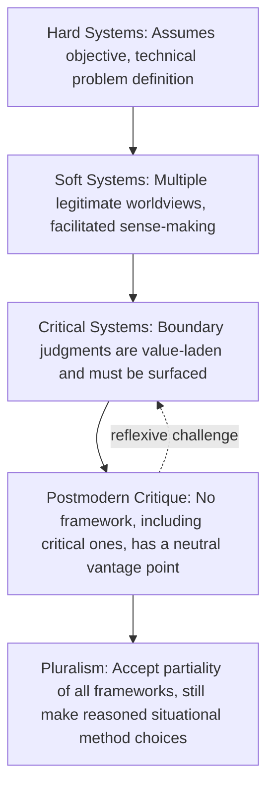

## Postmodern and Pluralist Critiques of Systems Practice

### Overview

Postmodern and pluralist critiques of systems practice represent a further reflexive turn within the systems thinking tradition — one that questions not just particular methodologies (as Critical Systems Thinking does with hard and soft approaches) but the deeper theoretical assumptions underlying the entire systems project itself, including CST's own critical apparatus. Where CST critiques hard and soft systems approaches for inadequately addressing power and boundary judgments, postmodern and pluralist critiques go further, questioning whether *any* systemic framework — including a critical one — can legitimately claim a privileged, coherent, or totalizing vantage point from which to characterize a complex social situation. This body of critique draws heavily on postmodern and poststructuralist philosophy (Foucault, Lyotard, Derrida) as applied to systems and organizational theory, primarily through the work of theorists such as Robert Chia, Martin Reynolds, and, from a related but distinct pluralist angle, R.L. Flood and Norma Romm.

### The Core Postmodern Critique: Skepticism Toward Metanarratives

Jean-François Lyotard's influential characterization of the postmodern condition as **"incredulity toward metanarratives"** — skepticism toward totalizing, universal frameworks that claim to explain or legitimate knowledge and action across all contexts — is directly applicable to systems thinking's own foundational aspirations. Systems thinking, across its hard, soft, and even critical variants, has historically often presented itself as offering a comprehensive, coherent framework for understanding and intervening in complex situations. Postmodern critique challenges this aspiration on several fronts:

- **Anti-foundationalism**: there is no neutral, foundational vantage point (not even a "critical" one) from which boundary judgments, stakeholder interests, or problem definitions can be adjudicated as more or less legitimate — all framings are irreducibly partial and situated
- **Suspicion of systematizing language itself**: the very vocabulary of "systems," "boundaries," "wholes," and "emergence" can be seen as imposing an artificial coherence and order onto situations that may be better characterized by genuine fragmentation, contradiction, and undecidability — the systems vocabulary may smuggle in an assumption of underlying order that a more radically pluralist or postmodern stance would resist
- **Power/knowledge (Foucauldian) critique**: drawing on Michel Foucault, this strand argues that systems methodologies — even explicitly emancipatory ones like CSH — are themselves a form of expert knowledge/practice that exercises disciplinary power, structuring how problems can be thought about and who counts as a legitimate speaker, in ways that are not fully escaped simply by adding participatory or boundary-critical elements

### The Reflexive Challenge to Critical Systems Thinking Itself

A particularly sharp form of this critique targets CST directly: if CSH's boundary critique claims that all boundary judgments are contestable and value-laden, does this claim not apply equally to CSH's own boundary judgments — its choice of four categories (motivation, control, knowledge, legitimacy), its framing of "those involved" versus "those affected," and its underlying Kantian/Habermasian philosophical commitments?

[Contested] This reflexive challenge has been explicitly engaged with by Ulrich and other CST theorists rather than dismissed: Ulrich has acknowledged that CSH's own categories and framework represent a particular (if carefully reasoned and philosophically grounded) boundary judgment, not a view from nowhere, and has argued that CSH's value lies in making its own assumptions as explicit and available for critique as those of any situation it is applied to — a form of self-referential consistency, rather than a claim to have escaped the critique it applies to others. Whether this response fully satisfies a thoroughgoing postmodern skeptic, or merely relocates the problem, remains a genuinely debated point in the systems literature rather than a settled question.

### Pluralism as a Related but Distinct Position

**Pluralism** (as developed within systems practice particularly by Flood and Romm, building on but distinct from a fully postmodern position) shares postmodernism's rejection of a single totalizing framework but takes a somewhat different practical stance:

| Position | Core Stance | Practical Implication |
| --- | --- | --- |
| Strong postmodern skepticism | No systemic framework can legitimately claim coherent, action-guiding authority; even "multi-methodology" risks imposing an implicit meta-framework | Radical caution about any systematic intervention methodology, including critical/participatory ones |
| Pluralism (Flood and Romm) | Multiple methodologies and paradigms are all potentially useful and none should be given automatic supremacy, but practitioners can still make reasoned, situationally-justified (if always contestable) choices about which methods to combine and how | Supports continued practical methodology use (including multi-methodology approaches like Total Systems Intervention) while remaining explicitly reflexive about the contestability of those choices |

Flood and Romm's pluralism is sometimes explicitly positioned as an attempt to take postmodern insights about the partiality and contestability of all frameworks seriously, while still providing practitioners with actionable guidance — rather than concluding, as a more radical postmodern stance might suggest, that systematic methodological guidance is itself illegitimate.

### Diagram: The Escalating Reflexive Critique

### SVG: Escalating Layers of Reflexive Critique (svg_diagram)

<svg xmlns="http://www.w3.org/2000/svg" viewBox="0 0 640 320">
<text x="320" y="24" font-size="15" font-weight="bold" text-anchor="middle" fill="#1a1a1a">Layers of Reflexive Critique in Systems Practice (svg_diagram)</text>
<rect x="120" y="230" width="400" height="60" rx="6" fill="#bee3f8" stroke="#2b6cb0" stroke-width="1.5" />
<text x="320" y="265" font-size="11" text-anchor="middle" fill="#2b6cb0" font-weight="bold">Hard Systems (objective problem definition)</text>
<rect x="140" y="170" width="360" height="55" rx="6" fill="#c6f6d5" stroke="#38a169" stroke-width="1.5" />
<text x="320" y="202" font-size="11" text-anchor="middle" fill="#38a169" font-weight="bold">Soft Systems (multiple worldviews)</text>
<rect x="160" y="110" width="320" height="55" rx="6" fill="#feebc8" stroke="#c05621" stroke-width="1.5" />
<text x="320" y="142" font-size="11" text-anchor="middle" fill="#c05621" font-weight="bold">Critical Systems (boundary judgments critiqued)</text>
<rect x="185" y="55" width="270" height="50" rx="6" fill="#e9d8fd" stroke="#805ad5" stroke-width="1.5" />
<text x="320" y="85" font-size="10" text-anchor="middle" fill="#805ad5" font-weight="bold">Postmodern: critiques the critique itself</text>

<text x="320" y="310" font-size="10" text-anchor="middle" fill="#333">Each layer questions the vantage point claimed by the layer above it</text>

</svg>

### Chia's Organizational-Theoretic Postmodern Critique

Robert Chia's work extends postmodern critique specifically into organizational theory's relationship with systems thinking, arguing for a shift from viewing organizations as pre-given, bounded "things" (entities to be modeled, whether via hard, soft, or critical systems tools) toward viewing organizing as an ongoing, processual, and inherently fluid activity that resists stable representation by any systems model. [Inference] This process-philosophical stance (drawing on Alfred North Whitehead's process philosophy as well as postmodern theory) is a more radical challenge than CST's boundary critique, since it questions whether "the organization" or "the system" is a coherent, stable object of analysis at all, rather than merely questioning how its boundaries should be drawn.

### Critiques of the Postmodern Critique

The postmodern and pluralist critique has itself been contested from within the systems community:

- **The performative contradiction concern**: critics argue that a fully consistent postmodern skepticism toward all frameworks is difficult to act upon in practice — any intervention, including a deliberately anti-systematic one, still requires some organizing framework to decide what to do next, raising the question of whether radical postmodern skepticism is practically actionable as a guide to intervention, or is better understood as a permanently unresolved theoretical caution to be held alongside practical methodology use rather than a replacement for it
- **The relativism concern**: if all framings are equally partial and no framework has privileged authority, critics ask whether this collapses into a form of relativism that makes it difficult to argue that some interventions are genuinely more just, more inclusive, or more emancipatory than others — a concern in tension with CST's own emancipatory aims, which do implicitly claim some framings (e.g., ones that surface marginalized voices) are normatively preferable to others
- [Inference] Ulrich's own response — treating boundary critique as a practice of ongoing, transparent self-limitation rather than a claim to comprehensive or final truth — is one commonly cited way systems theorists attempt to hold postmodern insights about partiality alongside a continued commitment to practical, reasoned methodological guidance, though whether this fully resolves the underlying philosophical tension, as opposed to managing it pragmatically, remains genuinely disputed in the literature rather than settled.

### Practical Implications for Systems Practitioners

Despite their more abstract philosophical register, these critiques carry practical implications for how systems methodologies should be used:

- **Epistemic humility as ongoing practice**: practitioners are encouraged to treat any systems model, framework, or boundary judgment (including their own preferred ones, such as CSH or SSM) as a provisional, situated construction rather than a discovered truth about the situation — a stance sometimes termed **critical reflexivity**
- **Resistance to methodology as a fixed toolkit applied unreflectively**: the postmodern/pluralist critique reinforces (from a different philosophical direction) Total Systems Intervention's methodological complementarism — no single method, including critical ones, should be applied as a rote, unreflective procedure across all situations
- **Attention to whose voice shapes even "participatory" processes**: because postmodern critique extends Foucauldian power/knowledge concerns to systems practice itself, even genuinely well-intentioned participatory or emancipatory processes (as discussed in the preceding syllabus item) should remain subject to ongoing scrutiny regarding whose framing of "participation" or "emancipation" is being enacted, rather than treating those labels as self-certifying

### Worked Example — Applying Reflexive Postmodern Caution to a Digitization Initiative's Evaluation Framework

Applying this critique to a scenario resembling evaluation of a government digitization project:

- A project team might apply CSH's boundary questions rigorously, genuinely surfacing previously marginalized citizen concerns and revising the project boundary accordingly — a good-faith and methodologically sound critical systems practice
- A postmodern/reflexive critique would still ask: whose choice was it to use CSH specifically (as opposed to, say, a locally-generated, non-Western framework for evaluating fairness), and does the very act of applying a formalized Western academic systems methodology to a Philippine local government context carry its own unexamined assumptions about what counts as rigorous or legitimate evaluation?
- [Inference] This is not necessarily an argument against using CSH or similar frameworks — most systems theorists engaging with this critique argue for continued, reflexively-aware use of such tools rather than their abandonment — but it does suggest that a genuinely thorough boundary critique would, at some point, need to include critical reflection on the methodology's own cultural and disciplinary origins as one more boundary judgment worth surfacing, rather than treating the methodology itself as a neutral, unexamined given.

### Key Points

- Postmodern critique extends skepticism about totalizing frameworks (Lyotard's "incredulity toward metanarratives") to systems thinking itself, including critical systems approaches
- The reflexive challenge asks whether CSH's own boundary categories and Kantian/Habermasian foundations are themselves an unexamined, contestable boundary judgment
- Pluralism (Flood and Romm) shares postmodern skepticism about single totalizing frameworks but retains a practical commitment to reasoned, situationally-justified methodology choices
- Chia's process-philosophical critique challenges whether "the organization" or "the system" is a stable object of analysis at all
- Critics of the postmodern position raise performative-contradiction and relativism concerns; most systems theorists respond with ongoing critical reflexivity rather than either full acceptance or full rejection of postmodern skepticism

**Related Topics**

- Critical Systems Thinking and Critical Systems Heuristics
- Boundary Critique
- Total Systems Intervention and Methodological Complementarism
- Participatory and Emancipatory Systems Approaches
- Foucauldian Power/Knowledge and Organizational Theory
- Process Philosophy and Organizing as Ongoing Activity (Chia, Whitehead)