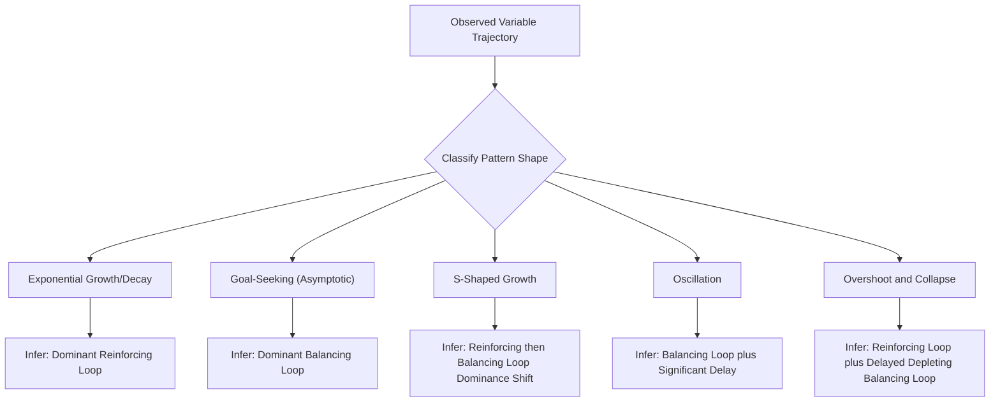

## Behavior-Over-Time Graphs

### Overview

Behavior-Over-Time Graphs (BOTGs), also called reference behavior patterns or time-series behavior graphs, are a foundational visualization tool in systems thinking used to plot how one or more key variables in a system change over a time horizon. Unlike static snapshots or single-point comparisons, BOTGs make visible the *trajectory* of change — whether a variable is growing, declining, oscillating, stabilizing, or exhibiting more complex dynamic patterns — which is essential groundwork for identifying the underlying feedback structure responsible for that behavior. BOTGs are typically the first tool introduced in systems dynamics education (associated with Donella Meadows, Peter Senge, and the broader System Dynamics tradition founded by Jay Forrester) because they train the crucial habit of thinking in patterns and trends rather than isolated events.

### Purpose and Function

The central premise behind BOTGs is the systems-thinking principle that **structure produces behavior** — the pattern a variable traces over time is a symptom of the underlying feedback loops, delays, and stock-and-flow structure generating it. Before attempting to diagnose or intervene in a system, a BOTG forces the practitioner to:

- Move from thinking about isolated **events** ("the server went down yesterday") to thinking about **patterns of behavior** ("server load has been steadily climbing for six months, punctuated by periodic spikes")
- Identify the actual shape of change (linear, exponential, oscillating, S-shaped, overshoot-and-collapse, etc.) rather than assuming a default trend
- Compare multiple related variables' trajectories on a shared timeline to spot correlations, lags, and interactions worth investigating further
- Establish a **reference mode** — an explicit, shared understanding among stakeholders of what pattern the system has actually exhibited — that any subsequent causal loop diagram or stock-and-flow model must be able to reproduce or explain

### Common Behavior Patterns

BOTGs typically reveal one of several canonical archetypal patterns, each of which points toward a different underlying feedback structure:

| Pattern | Description | Typical Underlying Structure |
| --- | --- | --- |
| Exponential growth | Accelerating increase, doubling over roughly consistent time intervals | Dominant reinforcing (positive) feedback loop |
| Exponential decay/collapse | Accelerating decrease toward a floor | Dominant reinforcing loop acting in the depleting direction |
| Goal-seeking (asymptotic approach) | Rapid initial change that decelerates and levels off near a target value | Dominant balancing (negative) feedback loop correcting toward a goal |
| S-shaped growth (logistic) | Exponential growth that transitions into goal-seeking behavior as a constraint is approached | Reinforcing loop dominant early, balancing loop dominant later as a carrying capacity is approached |
| Oscillation | Regular or irregular rise-and-fall cycling around a level | Balancing loop combined with a significant time delay |
| Overshoot and collapse | Growth beyond a sustainable limit followed by a sharp decline, often below the original sustainable level | Reinforcing growth loop combined with a delayed balancing loop tied to a depletable resource |
| S-shaped growth with overshoot and oscillation | Growth, overshoot past a limit, followed by oscillation around the sustainable level rather than full collapse | Balancing loop with delay strong enough to cause overshoot but not full resource depletion |

[Inference] These canonical patterns and their associated structural explanations are standard, well-established teaching content within the System Dynamics tradition (see Meadows' *Thinking in Systems* and related pedagogical materials); real-world data frequently shows noisier, hybrid, or ambiguous patterns that require judgment to classify, rather than always cleanly matching one archetype.

### Diagram: Canonical Behavior-Over-Time Patterns

### SVG: Six Canonical BOTG Shapes (svg_diagram)

<svg xmlns="http://www.w3.org/2000/svg" viewBox="0 0 640 380">
<text x="320" y="24" font-size="15" font-weight="bold" text-anchor="middle" fill="#1a1a1a">Canonical Behavior-Over-Time Patterns (svg_diagram)</text>
<g>
<line x1="40" y1="110" x2="180" y2="110" stroke="#ccc" stroke-width="1" />
<line x1="40" y1="110" x2="40" y2="50" stroke="#ccc" stroke-width="1" />
<path d="M40,105 Q100,100 130,80 Q155,60 175,55" fill="none" stroke="#2b6cb0" stroke-width="2.5" />
<text x="110" y="130" font-size="9" text-anchor="middle" fill="#333">Exponential Growth</text>
</g>
<g transform="translate(210,0)">
<line x1="40" y1="110" x2="180" y2="110" stroke="#ccc" stroke-width="1" />
<line x1="40" y1="110" x2="40" y2="50" stroke="#ccc" stroke-width="1" />
<path d="M40,105 Q70,60 110,55 Q150,52 175,52" fill="none" stroke="#38a169" stroke-width="2.5" />
<text x="110" y="130" font-size="9" text-anchor="middle" fill="#333">Goal-Seeking</text>
</g>
<g transform="translate(420,0)">
<line x1="40" y1="110" x2="180" y2="110" stroke="#ccc" stroke-width="1" />
<line x1="40" y1="110" x2="40" y2="50" stroke="#ccc" stroke-width="1" />
<path d="M40,105 Q90,102 115,75 Q140,50 175,48" fill="none" stroke="#c05621" stroke-width="2.5" />
<text x="110" y="130" font-size="9" text-anchor="middle" fill="#333">S-Shaped Growth</text>
</g>
<g transform="translate(0,170)">
<line x1="40" y1="110" x2="180" y2="110" stroke="#ccc" stroke-width="1" />
<line x1="40" y1="110" x2="40" y2="50" stroke="#ccc" stroke-width="1" />
<path d="M40,80 Q60,50 80,80 Q100,110 120,80 Q140,50 160,80 Q170,95 175,80" fill="none" stroke="#805ad5" stroke-width="2.5" />
<text x="110" y="130" font-size="9" text-anchor="middle" fill="#333">Oscillation</text>
</g>
<g transform="translate(210,170)">
<line x1="40" y1="110" x2="180" y2="110" stroke="#ccc" stroke-width="1" />
<line x1="40" y1="110" x2="40" y2="50" stroke="#ccc" stroke-width="1" />
<path d="M40,105 Q90,55 120,50 Q140,60 150,90 Q160,105 175,108" fill="none" stroke="#c53030" stroke-width="2.5" />
<text x="110" y="130" font-size="9" text-anchor="middle" fill="#333">Overshoot and Collapse</text>
</g>
<g transform="translate(420,170)">
<line x1="40" y1="110" x2="180" y2="110" stroke="#ccc" stroke-width="1" />
<line x1="40" y1="110" x2="40" y2="50" stroke="#ccc" stroke-width="1" />
<path d="M40,105 Q80,60 110,52 Q120,65 100,72 Q115,80 105,68" fill="none" stroke="#975a16" stroke-width="2.5" />
<text x="110" y="130" font-size="9" text-anchor="middle" fill="#333">Overshoot and Oscillation</text>
</g>
</svg>

### Constructing a Behavior-Over-Time Graph

**1. Select Key Variables**

Identify the small number of variables (typically 2–5) most central to understanding the situation of concern — enough to reveal meaningful relationships, but not so many that the graph becomes illegible or dilutes focus.

**2. Choose an Appropriate Time Horizon**

The time horizon must be long enough to reveal the actual pattern of interest — a horizon that is too short can make oscillatory or S-shaped behavior look like simple linear growth, and can entirely miss slow-building trends. A common systems-thinking guideline is to extend the horizon well beyond the period being actively managed, to reveal historical context and plausible future continuation.

**3. Plot Qualitatively or Quantitatively**

BOTGs can be constructed from precise quantitative data when available, but are equally valuable as **qualitative sketches** — hand-drawn approximations of remembered or anticipated trends, used in group facilitation settings where precise data may not be readily available but shared understanding of the general trajectory is valuable to establish before deeper analysis.

**4. Include Multiple Related Variables on a Shared Timeline**

Plotting related variables together (e.g., both a resource level and the rate consuming it) on the same time axis makes visible important lag relationships and helps identify which variable's behavior is driving, versus responding to, another's.

**5. Use the BOTG to Establish the "Reference Mode"**

The resulting graph(s) become the shared reference mode — an explicit target that any subsequent causal loop diagram or stock-and-flow model constructed to explain the situation must be capable of reproducing. If a proposed causal structure cannot generate the observed reference mode when simulated or reasoned through, that is a signal the structural explanation is incomplete or incorrect.

### BOTGs in the Broader Systems Modeling Workflow

BOTGs typically occupy a specific early position in the standard systems dynamics modeling sequence:

This sequencing reflects the systems-dynamics principle that behavior should be established and agreed upon by stakeholders *before* attempting to hypothesize the causal structure generating it — grounding subsequent modeling work in an explicit, shared empirical or perceived pattern rather than jumping directly to causal speculation.

### Common Pitfalls

- **Event-focused thinking creeping back in**: practitioners under time pressure may default back to discussing single recent events ("the outage last Tuesday") rather than sketching the actual multi-period trend, undermining the pattern-recognition purpose of the exercise
- **Too-short time horizon**: as noted above, an insufficiently long horizon can make cyclical, S-shaped, or slow-building patterns misleadingly appear linear or flat
- **Conflating precision with accuracy**: a precisely plotted quantitative graph from incomplete or unrepresentative data can convey false confidence; a rougher qualitative sketch that accurately captures the general shape of change (even without exact values) is often more useful for establishing shared understanding than spuriously precise but unrepresentative numbers
- **Single-variable tunnel vision**: plotting only one variable in isolation can miss important lag or interaction effects with related variables that would be visible if plotted together on the same timeline
- [Inference] These pitfalls are commonly emphasized in systems-dynamics facilitation training materials; their relative frequency and severity in practice would depend on the specific facilitation context and group composition, which is not something a general reference document can quantify.

### Worked Example — Behavior-Over-Time Analysis of a Document Processing Backlog

Applying BOTG construction to a scenario resembling a document management system's approval-workflow backlog (relevant to a batac-dms-style system):

- **Key variables selected**: incoming document volume (rate), documents processed per week (rate), and total pending backlog (stock) — plotted together over a 12-month horizon rather than just the most recent month
- **Observed pattern**: incoming volume shows steady modest growth; processing rate was roughly matched to incoming volume for the first six months, then fell behind after a policy change added an additional required review step, causing pending backlog to shift from a stable oscillation around a low level into accelerating growth — an S-shaped-to-exponential-growth transition rather than the goal-seeking pattern seen in the first half of the year
- **Diagnostic value of the graph**: plotting all three variables together on a shared timeline makes visible that the backlog growth began coincident with the policy change (a lag/correlation observation), rather than beginning during the general volume growth trend — a distinction that would be far less obvious from looking at backlog totals alone without the accompanying rate variables
- **Reference mode established**: any subsequent causal loop diagram of this workflow would need to explain why the system transitioned from goal-seeking/oscillating behavior to accelerating backlog growth specifically around the policy-change timepoint — a concrete, falsifiable target for the next stage of analysis
- [Inference] This worked example is illustrative of the BOTG construction process and the kind of pattern-transition insight the technique is designed to surface; whether backlog dynamics in any specific real system actually follow this trajectory would need to be verified against that system's actual historical data, not assumed from the analogy alone.

### Key Points

- Behavior-Over-Time Graphs plot key variables' trajectories over a sufficient time horizon to reveal patterns, shifting analysis from isolated events to systemic trends
- Canonical patterns (exponential growth/decay, goal-seeking, S-shaped, oscillation, overshoot-and-collapse) each point toward characteristic underlying feedback structures
- BOTGs establish the "reference mode" that subsequent causal loop diagrams and stock-and-flow models must be able to reproduce
- Common pitfalls include reverting to event-focused thinking, choosing too-short a time horizon, and over-trusting spurious quantitative precision
- BOTGs occupy an early, foundational position in the standard systems-dynamics modeling workflow, prior to causal loop diagramming and formal simulation

**Related Topics**

- Causal Loop Diagrams and Feedback Loop Identification
- Stock-and-Flow Modeling
- System Dynamics Simulation (Forrester's Foundational Work)
- Complex Adaptive Systems Fundamentals (Feedback Loops)
- Systems Archetypes (Limits to Growth, Shifting the Burden, etc.)
- The Adaptive Cycle (Holling) as a Related Behavioral Pattern Framework