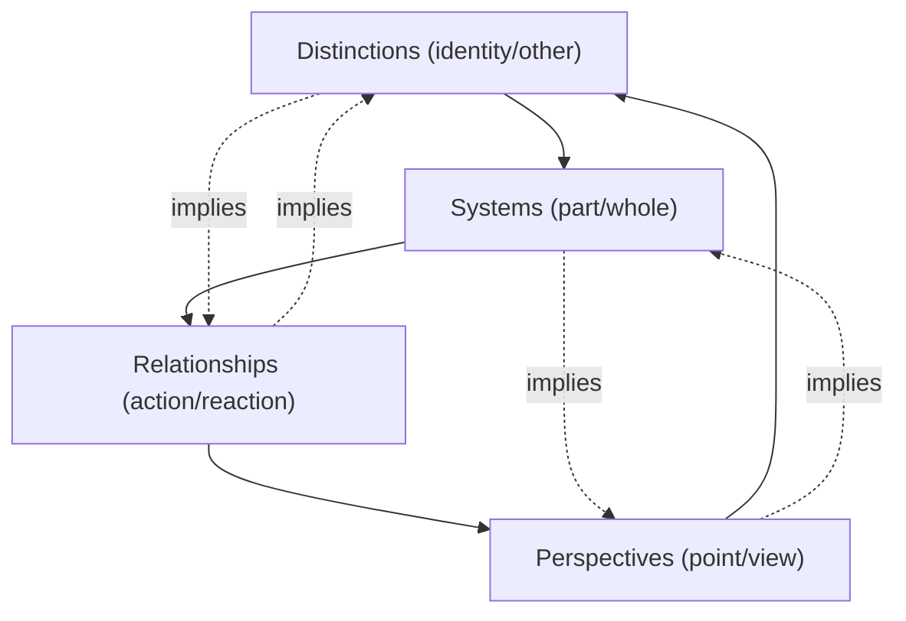

## DSRP: Distinctions, Systems, Relationships, and Perspectives

### Overview

DSRP is a meta-cognitive framework developed by Dr. Derek Cabrera positing that all complex thought and systems thinking arise from four simple, universal patterns of mind: **Distinctions**, **Systems**, **Relationships**, and **Perspectives**. Rather than being a domain-specific method, DSRP claims to be a generative grammar underlying how humans (and mental models generally) organize information into structure, applicable recursively to any subject matter, at any scale, in any field.

The core claim is that these four patterns are not merely useful heuristics but are structurally necessary and mutually co-defining — you cannot make a distinction without implying a system, and you cannot identify a system without an underlying distinction, and so on. This interdependence is central to how DSRP is taught and applied.

### Theoretical Foundation

DSRP emerged from Cabrera's doctoral work at Cornell University, synthesizing ideas from general systems theory (Bertalanffy), cybernetics, cognitive science, and structuralism. The framework is documented primarily in:

- *Systems Thinking Made Simple* (Cabrera & Cabrera)
- *Flock Leadership* and various academic papers on "DSRP theory" and "Cabrera Framework"

[Inference] The degree to which DSRP is considered a fully validated cognitive-science theory versus a practical instructional heuristic is debated in academic circles; it is more widely adopted in K-12 education and organizational consulting contexts than in formal systems-engineering literature.

### The Four Elements

#### 1. Distinctions (D)

A Distinction is the identification of a "thing" (an idea, boundary, or entity) by simultaneously defining what it **is** and what it **is not** (the "identity-other" pair).

- **Key Points**
  - Every concept exists only relative to a boundary separating it from its background/context
  - Denoted as $i \leftrightarrow o$ (identity vs. other)
  - Drawing a distinction is the most primitive cognitive act in the framework — nothing can be "seen" or discussed without one
- **Example**

  A "customer" is only a meaningful category because it is distinguished from "non-customer." Changing where that boundary is drawn (e.g., including trial users or excluding churned accounts) changes the entire analysis downstream.

#### 2. Systems (S)

A System is formed by organizing things into **part-whole** relationships. Any "thing" can simultaneously be viewed as a whole made of parts, and as a part of some larger whole.

- **Key Points**
  - Denoted as $p \leftrightarrow w$ (part vs. whole)
  - Systems are recursive/fractal: a part at one level of analysis is a whole at another
  - This is the element most closely aligned with traditional "systems thinking" definitions (holism, emergence, hierarchy)
- **Example**

  An "engine" is a whole composed of parts (pistons, valves, camshaft), but the engine itself is a part of the whole "car," which is a part of the whole "transportation system."

#### 3. Relationships (R)

A Relationship is the identification of **action/reaction** or **cause/effect** connections between two or more things.

- **Key Points**
  - Denoted as $r \leftrightarrow r$ (reaction ↔ reaction), often visualized as bidirectional influence, not simple linear causality
  - DSRP emphasizes that relationships are frequently reciprocal (feedback), not one-directional
  - This element connects directly to causal loop diagramming and feedback-loop analysis
- **Example**

  Increased marketing spend (action) leads to increased sales leads (reaction), but increased sales leads can also justify increased marketing budget (reciprocal reaction) — a reinforcing loop.

#### 4. Perspectives (P)

A Perspective is a **point (viewpoint origin)** looking toward a **view (what is seen)**. Changing the point changes what is seen, even when looking at the identical system.

- **Key Points**
  - Denoted as $p \leftrightarrow v$ (point vs. view)
  - Perspectives determine which distinctions, systems, and relationships become salient
  - This is the element most connected to stakeholder analysis, empathy mapping, and multi-stakeholder systems modeling
- **Example**

  A "traffic congestion problem" viewed from a commuter's point emphasizes travel time; viewed from an urban planner's point emphasizes land use and infrastructure capacity; viewed from an environmentalist's point emphasizes emissions.

### The Co-Implicative Structure

DSRP theory asserts these four elements are **not independent categories** but co-arise — using any one necessarily invokes the others. This is often depicted as a nested/interlocking diagram rather than a flat list.

[Inference] The exact "necessity" of this co-implication (i.e., that it is logically impossible to invoke one element without the others) is a philosophical claim of the theory rather than an empirically falsifiable one; practitioners generally treat it as a useful working assumption for prompting more thorough analysis.

### DSRP as a Visualization/Mapping Technique

Within systems mapping specifically, DSRP is operationalized through **four corresponding diagram types**, each with a standardized visual grammar (originally developed for the "Thinking at Every Desk" and Cabrera Research Lab curricula):

| DSRP Element | Diagram Form | Visual Convention |
| --- | --- | --- |
| Distinctions | Circle with boundary line | Solid circle = identity; dashed boundary = other/context |
| Systems | Nested circles (part-whole) | Larger circle = whole; smaller circles inside = parts |
| Relationships | Arrows between nodes | Double-headed or looped arrows to show reciprocal action-reaction |
| Perspectives | Circle with a "viewing arrow/eye" | An origin point with a directional cone toward the system |

#### Combined DSRP Map Structure

A full DSRP map layers all four elements onto a single diagram: distinctions define the nodes, systems nest the nodes into hierarchies, relationships connect the nodes with causal arrows, and a perspective marker indicates whose point of view organized the map.

<svg xmlns="http://www.w3.org/2000/svg" viewBox="0 0 640 420">
<text x="320" y="24" text-anchor="middle" font-size="15" font-weight="bold" font-family="sans-serif">DSRP Composite Map (svg_diagram)</text>

<circle cx="60" cy="80" r="14" fill="none" stroke="#8e44ad" stroke-width="2" />
<text x="60" y="85" text-anchor="middle" font-size="10" font-family="sans-serif">P</text>
<path d="M74,80 L140,150" stroke="#8e44ad" stroke-width="1.5" stroke-dasharray="4,3" marker-end="url(#arrowP)" />
<text x="80" y="110" font-size="10" font-family="sans-serif" fill="#8e44ad">viewpoint</text>

<ellipse cx="360" cy="220" rx="220" ry="150" fill="none" stroke="#2c3e50" stroke-width="2" stroke-dasharray="6,4" />
<text x="360" y="80" text-anchor="middle" font-size="12" font-family="sans-serif" fill="#2c3e50">Whole (System boundary = Distinction)</text>

<circle cx="260" cy="220" r="55" fill="#eaf2f8" stroke="#2980b9" stroke-width="2" />
<text x="260" y="215" text-anchor="middle" font-size="11" font-family="sans-serif">Part A</text>
<text x="260" y="230" text-anchor="middle" font-size="9" font-family="sans-serif">(identity)</text>
<circle cx="440" cy="220" r="55" fill="#eafaf1" stroke="#27ae60" stroke-width="2" />
<text x="440" y="215" text-anchor="middle" font-size="11" font-family="sans-serif">Part B</text>
<text x="440" y="230" text-anchor="middle" font-size="9" font-family="sans-serif">(other)</text>

<path d="M310,205 L390,205" stroke="#c0392b" stroke-width="2" marker-end="url(#arrowR)" />
<path d="M390,235 L310,235" stroke="#c0392b" stroke-width="2" marker-end="url(#arrowR)" />
<text x="350" y="195" text-anchor="middle" font-size="9" font-family="sans-serif" fill="#c0392b">action</text>
<text x="350" y="252" text-anchor="middle" font-size="9" font-family="sans-serif" fill="#c0392b">reaction</text>

<circle cx="245" cy="235" r="18" fill="#fff" stroke="#2980b9" stroke-width="1.2" />
<text x="245" y="238" text-anchor="middle" font-size="7" font-family="sans-serif">sub-part</text>
</svg>

### Applying DSRP: A Worked Method

A standard DSRP-guided analysis walks through four prompting questions in sequence (often iterated multiple passes):

1. **Distinctions**: "What is the thing I'm identifying? What is it not (its context/background)?"
2. **Systems**: "What are its parts? What larger whole is it part of?"
3. **Relationships**: "What does it act upon? What acts upon it?"
4. **Perspectives**: "From whose point am I viewing this? What would the view be from a different point?"

- **Example — Applying DSRP to "Employee Turnover"**
  - *Distinction*: Turnover = employees who leave voluntarily; distinguished from involuntary terminations and internal transfers.
  - *System*: Turnover is a part of the larger "Human Capital" system; it itself has parts (exit reasons: compensation, management, growth, culture).
  - *Relationship*: Low pay (action) → higher turnover (reaction); higher turnover (action) → increased training cost and lower morale (reaction) → potentially more turnover (reinforcing loop).
  - *Perspective*: From HR's point, turnover is a cost metric; from a departing employee's point, it's a career decision; from a competitor's point, it's a talent acquisition opportunity.

### Relationship to Other Systems Mapping Techniques

| Technique | Relationship to DSRP |
| --- | --- |
| Causal Loop Diagrams (CLD) | Roughly maps to the "Relationships" element; DSRP frames CLDs as one specific expression of R |
| Stock-and-flow diagrams | Combines Systems (part-whole structure of stocks) and Relationships (flows) |
| Mind mapping | Primarily expresses Distinctions and Systems (hierarchical categorization) without formalizing R or P |
| Stakeholder analysis | A specialized, narrower application of the Perspectives element |
| Soft Systems Methodology (Checkland) | Shares emphasis on multiple "Weltanschauung" (worldviews), conceptually overlapping with Perspectives |

[Unverified] Direct empirical comparisons of analytical outcomes (e.g., decision quality, comprehensiveness of models produced) between DSRP-guided mapping and other structured methods such as CLD or SSM are not well established in peer-reviewed literature; most support for DSRP's effectiveness comes from classroom-based and organizational case studies rather than controlled comparative studies.

### Common Pitfalls

- **Treating the four elements as a checklist rather than recursive** — DSRP is intended to be applied iteratively (each pass can reveal new distinctions/systems/relationships/perspectives), not as a one-pass form to fill out.
- **Conflating "Systems" with "the whole framework"** — within DSRP terminology, "Systems" specifically refers to the part-whole organizing pattern, not the entirety of DSRP itself, which can cause naming confusion when explaining the model.
- **Ignoring reciprocal relationships** — defaulting to one-directional cause-effect arrows undercuts the framework's emphasis on action-reaction feedback.
- **Fixing the perspective too early** — anchoring analysis to a single stakeholder's point before mapping distinctions/systems/relationships can bias which parts and boundaries get noticed at all.

### Practical Facilitation Tips

- When facilitating a group DSRP session, assign different colored sticky notes or diagram layers to each of the four elements (D, S, R, P) so participants can visually audit which elements have been under-explored.
- Use explicit "perspective-switching" prompts ("Now map this as if you were the customer / regulator / competitor") to force at least 2–3 distinct perspective passes before finalizing a model.
- Pair DSRP with a causal loop diagram or stock-and-flow model as the "output artifact" — DSRP is best used as the elicitation/thinking scaffold, while CLDs or system dynamics diagrams serve as the formal deliverable.

### Related Topics

- Causal Loop Diagrams (CLDs) and feedback loop identification
- Stock-and-flow modeling / System Dynamics (Forrester)
- Iceberg Model (Events–Patterns–Structures–Mental Models)
- Soft Systems Methodology (Checkland) and Rich Pictures
- Stakeholder mapping and multi-perspective analysis
- Cognitive load and mental model theory in systems education
- Hierarchy theory and holarchy (Koestler's "holon" concept, relevant to the Systems element)