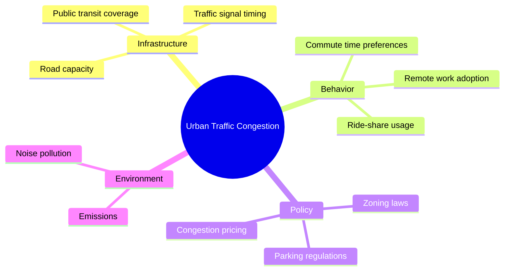
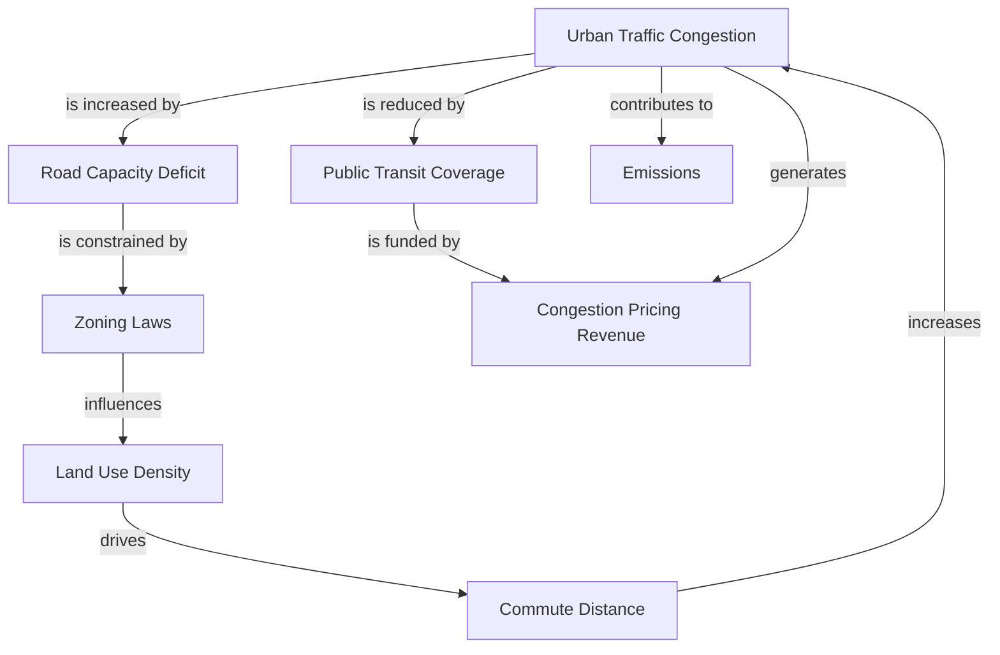

## Concept Maps and Mind Maps for Systems

### Overview

Concept maps and mind maps are both graphical knowledge-organization techniques used to externalize mental models, but they differ structurally in ways that matter significantly for systems thinking work. Both predate formal "systems mapping" as a discipline but are frequently used as entry-level or complementary tools alongside causal loop diagrams, stock-and-flow models, and DSRP-based maps.

- **Mind Maps**: Radial, hierarchical diagrams that branch outward from a single central concept, primarily used for brainstorming, note-taking, and categorization.
- **Concept Maps**: Node-and-link networks where every connection is explicitly labeled with a relationship (a linking phrase), forming readable propositions. Developed formally by Joseph Novak at Cornell in the 1970s, grounded in Ausubel's assimilation theory of meaningful learning.

The key distinction for systems work: concept maps can represent **non-hierarchical, cross-linked** relationships (which is what makes them useful for showing feedback and interdependency), while mind maps are structurally biased toward **tree hierarchies** radiating from one root idea.

### Mind Maps

#### Structure and Conventions

- **Key Points**
  - Single central node (the topic)
  - Branches radiate outward, typically color-coded by theme
  - Sub-branches represent further decomposition (parent → child, one-directional)
  - Often uses images, icons, and varying line thickness to aid memory encoding (Tony Buzan's original technique emphasized this for cognitive/mnemonic purposes)
  - Cross-branch connections are rare and, when present, are usually an ad hoc addition rather than a native feature of the form
- **Typical Use in Systems Contexts**
  - Initial brainstorming to enumerate all elements, actors, and factors relevant to a system before deeper structural mapping
  - Organizing a stakeholder list, a set of subsystems, or the scope boundary of an analysis
  - Meeting facilitation and rapid capture of group ideas prior to formal structuring
- **Limitation for Systems Thinking**

  [Inference] Because mind maps' native grammar is a tree, they poorly represent feedback loops, bidirectional causality, and shared dependencies (a factor influencing multiple branches) without deviating from the standard convention — making them a good *divergent* (idea-generation) tool but a weak *convergent* (structural/causal) tool.

#### Example Mind Map — "Urban Traffic Congestion" (brainstorm stage)

Note: this is a legitimate brainstorm artifact, but as written it does not show that "Zoning laws" (Policy) directly affects "Road capacity" (Infrastructure) — a cross-branch relationship a pure mind map cannot natively express.

### Concept Maps

#### Structure and Conventions

- **Key Points**
  - Nodes = concepts (usually nouns or noun phrases), enclosed in boxes/circles
  - Links = labeled arrows expressing a relationship verb/phrase (e.g., "causes," "requires," "is part of," "regulates")
  - Node + link + node forms a **proposition** — a complete, readable semantic unit
  - Explicitly supports **cross-links**: connections between concepts in different branches/hierarchies, which is exactly the feature needed to represent systemic interdependency
  - Typically organized with more general/inclusive concepts near the top and more specific concepts toward the bottom (progressive differentiation), though this is a convention, not a strict rule
- **Formal Elements (per Novak & Cañas)**
  - **Focus question**: the guiding question the map is built to answer, which anchors scope and prevents unbounded sprawl
  - **Parking lot**: an auxiliary list of concepts identified but not yet placed, used during iterative construction
  - **Cross-links**: the differentiator from hierarchy-only diagrams; represent creative leaps or integration across subdomains

#### Example Concept Map — "Urban Traffic Congestion" (same topic, structural stage)

Note the explicit cross-link: `A -->|generates| E` and `E -->|funds| C`, forming a reinforcing loop (congestion → pricing revenue → transit funding → reduced congestion) — a structural relationship a mind map's radial grammar does not naturally accommodate.

### Comparative Table

| Attribute | Mind Map | Concept Map |
| --- | --- | --- |
| Root structure | Single central node, radial | No mandatory single root; can have multiple entry points |
| Link labels | Usually unlabeled or implicit | Mandatory labeled linking phrases (propositions) |
| Cross-links | Atypical / manual deviation | Native, expected feature |
| Best cognitive use | Divergent thinking, free association, memory/recall | Convergent thinking, relationship articulation, integration of knowledge domains |
| Systems-thinking fit | Good for initial scoping/brainstorming | Good for representing structure, dependencies, and (partially) feedback |
| Formal theoretical grounding | Buzan's mnemonic/cognitive techniques | Ausubel's assimilation theory, Novak's learning research |
| Typical tooling | MindMeister, XMind, Freemind, Miro | CmapTools (Institute for Human & Machine Cognition), yEd, Miro, Lucidchart |

### Building a Concept Map: Standard Method

1. **Define the focus question** — e.g., "What factors influence customer churn in a subscription business?"
2. **Identify and rank concepts** — from most general/inclusive to most specific, typically 15–25 concepts for a workable map.
3. **Construct a preliminary hierarchy** — place broader concepts higher, more specific concepts lower.
4. **Add linking phrases** — connect concept pairs with a verb/phrase that forms a true proposition when read aloud (concept → link → concept).
5. **Identify cross-links** — actively look for relationships between concepts in different branches; this step is where systemic/non-obvious interdependencies typically surface.
6. **Revise iteratively** — concept maps are explicitly meant to be reworked multiple times; Novak's research emphasizes that map quality improves substantially across 3+ revision cycles.

### Relationship to Formal Systems Mapping Techniques

- **Versus Causal Loop Diagrams (CLD)**: A concept map's cross-linked propositions can be a precursor to a CLD, but CLDs impose additional formal constraints (arrows must denote a causal polarity, +/− or same/opposite; loops must be explicitly classified as reinforcing (R) or balancing (B)). A concept map's "influences" link is causally looser than a CLD's polarity-marked arrow.
- **Versus DSRP maps**: Concept maps primarily externalize the *Systems* (part-whole/hierarchy) and *Relationships* (labeled links) elements of DSRP; they do not natively prompt for *Distinctions* (explicit identity/other boundaries) or *Perspectives* (whose viewpoint), which a DSRP-guided facilitation would add on top.
- **Versus Rich Pictures (Soft Systems Methodology)**: Rich Pictures are less formally structured and intentionally embrace ambiguity/emotion via freeform sketching; concept maps are more textually precise and propositional.

### Common Pitfalls

- **"Spider map" mislabeling** — a mind map with a few added cross-links is sometimes still called a "concept map" informally, but without labeled links it lacks the propositional clarity that makes concept maps analytically useful.
- **Overloading a single map** — both formats degrade in readability past roughly 25–30 nodes; large systems are better served by a hierarchy of nested/linked maps (a "map of maps") than one dense diagram.
- **Skipping the focus question** — concept maps built without a guiding focus question tend to sprawl into unbounded general knowledge structures rather than answering a specific systems question.
- **Treating links as directionless** — omitting the linking phrase (just drawing an arrow) collapses the map back toward mind-map ambiguity and loses the propositional/semantic precision that differentiates the technique.
- **Confusing hierarchy position with causal direction** — in a concept map, "higher" typically means "more general," not "causally upstream"; conflating these two axes is a frequent source of misreading, especially when concept maps are later translated into CLDs.

### Practical Facilitation Tips

- Start group sessions with a **mind map** for unconstrained idea capture (5–10 minutes, no critique), then transition the same content into a **concept map** structure once the group is ready to articulate relationships explicitly.
- Use sticky notes or a digital whiteboard (Miro, Mural) for the concept-map construction phase so that hierarchy and cross-links can be physically rearranged before finalizing linking phrases.
- When digitizing, CmapTools remains the reference implementation aligned with Novak & Cañas's original methodology, including built-in support for focus questions and a parking lot for unplaced concepts.

### Next Steps

- Causal Loop Diagrams (CLD): adding polarity and feedback-loop classification on top of concept-map relationships
- Rich Pictures and Soft Systems Methodology (SSM)
- DSRP: Distinctions, Systems, Relationships, and Perspectives (formal complement covering boundary-setting and multi-perspective analysis)
- Affinity diagramming and KJ Method for clustering brainstormed concepts
- Ausubel's Assimilation Theory and meaningful learning (theoretical foundation of concept mapping)
- Argument maps (a specialized concept-map variant for reasoning/debate structures)