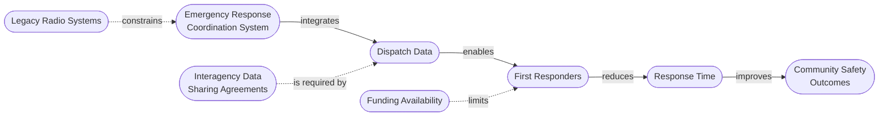
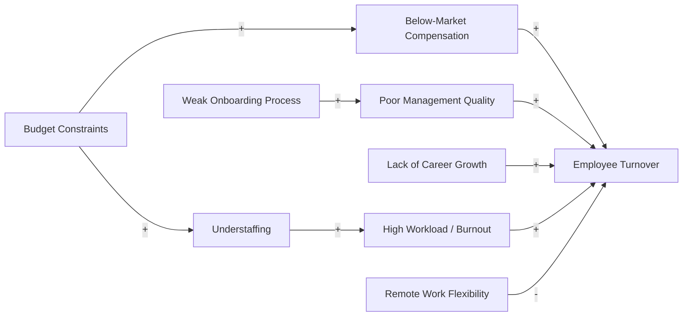

## Systemigrams and Multiple-Cause Diagrams

### Overview

Systemigrams and Multiple-Cause Diagrams (MCDs) are two distinct but related systems-mapping techniques that emphasize narrative and causal texture over the more formal, polarity-driven notation of causal loop diagrams. Both are used when an analyst needs to represent a situation with many interacting factors converging on outcomes, but they emerged from different traditions and serve somewhat different purposes.

- **Systemigrams** ("systemic diagrams") combine a grammatically structured natural-language narrative with a network diagram, so the diagram can be read as a sentence flowing through nodes.
- **Multiple-Cause Diagrams** are a System Dynamics tradition tool used to map out all the plausible contributing causes of a single outcome variable before formalizing feedback loops.

Both are commonly used at the **problem articulation / early modeling** stage, prior to building formal stock-and-flow or causal loop models.

### Systemigrams

#### Origins and Purpose

Systemigrams were developed by Duncan Brown (and later formalized academically by Hitchins and others in the systems engineering community) as a way to communicate complex systems architecture and strategy to non-technical stakeholders, particularly in defense and large-scale engineering programs. The core innovation is treating the diagram as a **parsed sentence**: a main narrative "backbone" runs through the diagram, and the nodes and links along that backbone form a grammatically valid statement when read in sequence.

#### Structure and Conventions

- **Key Points**
  - A **main statement (backbone)** runs diagonally or horizontally across the diagram — typically the mission, purpose, or central narrative of the system — composed of a subject, verb phrases, and objects
  - **Static nodes**: things (nouns) — actors, systems, resources, artifacts
  - **Transformation nodes**: relationships/verbs connecting static nodes (e.g., "provides," "enables," "constrains," "delivers")
  - **Ellipses/ovals**: typically used for the primary backbone nodes
  - **Branches**: secondary narrative threads that hang off the backbone, providing supporting context, constraints, or enabling conditions without breaking the main sentence flow
  - Reading the backbone alone should produce a coherent natural-language sentence describing the system's purpose
- **Distinguishing Feature**

  [Inference] Because the diagram is constructed to be linguistically parseable, systemigrams are considered unusually effective for executive/non-technical audiences and for capturing "system of systems" narratives (mission statements, program intents) — this is a design goal of the technique rather than a universally benchmarked outcome.

#### Example Systemigram — "Emergency Response Coordination System" (backbone narrative)

Backbone sentence (read left to right): *"The Emergency Response Coordination System integrates Dispatch Data to enable First Responders, which reduces Response Time, thereby improving Community Safety Outcomes."*

In this diagram, the solid horizontal chain (A→B→C→D→E) is the backbone/main narrative; the dashed branches (F, G, H) are supporting context nodes that qualify the backbone without interrupting its readability as a sentence.

#### Systemigram Construction Method

1. **Draft the backbone sentence** — write the system's core purpose/mission as a single grammatical sentence before diagramming anything.
2. **Decompose into static and transformation nodes** — nouns become boxes/ovals, verbs become labeled connecting arrows.
3. **Lay out the backbone** — typically diagonal (upper-left to lower-right) or horizontal, preserving reading order.
4. **Add branch narratives** — attach constraints, enablers, and supporting detail as secondary threads without breaking backbone readability.
5. **Validate by reading aloud** — the backbone alone must form a coherent sentence; if it does not, node/verb selection needs revision.

### Multiple-Cause Diagrams (MCDs)

#### Origins and Purpose

Multiple-Cause Diagrams originate from the System Dynamics tradition (Forrester-influenced practice, widely taught via the System Dynamics Society and texts such as Maani & Cavana's *Systems Thinking, System Dynamics*). Their purpose is narrower and more tactical than a systemigram: **enumerate every plausible cause of a single focal outcome variable**, without yet worrying about feedback loop closure, polarity consistency, or stock/flow distinctions.

#### Structure and Conventions

- **Key Points**
  - A single **outcome/effect variable** is placed at the right (or center)
  - Multiple **causal factors** point into it via arrows, each optionally marked with polarity ($+$ or $-$) indicating whether an increase in the cause increases ($+$) or decreases ($-$) the effect
  - Causes can themselves have causes, producing multiple **causal chains/layers** feeding into the same outcome
  - Unlike a full causal loop diagram, an MCD does **not** require closed feedback loops — it is explicitly a fan-in, divergent-cause diagram, often the raw material from which loops are later identified
  - MCDs are considered an intermediate step between free-form brainstorming (e.g., a mind map of "everything related to X") and a rigorous CLD with named, closed loops
- **Typical Use**

  Used early in a System Dynamics modeling engagement, often directly after stakeholder interviews, to consolidate all named causal factors before the modeler looks for cycles and assigns reinforcing (R) / balancing (B) loop labels.

#### Example Multiple-Cause Diagram — "Declining Employee Retention"

Note the fan-in structure: multiple independent causal chains (A/I, B/G, C, D/H, E) all converge on the single outcome variable F, with polarity signs indicating direction of influence, but no loop is yet closed back from F to any upstream cause — that closure step belongs to a subsequent CLD pass.

#### MCD Construction Method

1. **Name the focal outcome variable precisely** — e.g., "Employee Turnover Rate," not the vaguer "Retention Problem."
2. **Brainstorm all plausible direct causes** — typically drawn from stakeholder interviews, data review, or root-cause techniques (5 Whys, fishbone/Ishikawa diagrams).
3. **Assign polarity to each causal arrow** — $+$ if cause and effect move in the same direction, $-$ if they move oppositely.
4. **Trace causes-of-causes** — extend chains backward as far as stakeholders can meaningfully substantiate.
5. **Hand off to CLD development** — once the MCD is populated, scan for any arrow that could plausibly point back toward an upstream node; converting such a chain into a closed loop is the entry point into formal causal loop diagramming.

### Comparative Table

| Attribute | Systemigram | Multiple-Cause Diagram |
| --- | --- | --- |
| Primary origin | Systems engineering (Hitchins/Brown) | System Dynamics (Forrester tradition) |
| Core organizing principle | Grammatical backbone (narrative sentence) | Fan-in causality toward one outcome |
| Node types | Static (noun) and transformation (verb) nodes | Causal factor variables (typically all nouns/metrics) |
| Loop closure | Not applicable — not causally cyclic by design | Optional/incidental; not required, but often a precursor to finding loops |
| Polarity notation | Not typically used | Commonly used ($+/-$) |
| Best audience | Executives, non-technical stakeholders, program narratives | Analysts/modelers building toward a CLD or system dynamics model |
| Typical scale | Whole-system mission/strategy | Single outcome variable and its immediate causal web |

### Relationship to Other Systems Mapping Techniques

- **Versus Causal Loop Diagrams (CLD)**: An MCD is essentially a CLD's "raw material" — a CLD additionally requires identifying and explicitly labeling closed feedback loops (R/B) among the causes, which an MCD does not attempt.
- **Versus Concept Maps**: A systemigram's backbone-plus-branches structure resembles a concept map with an enforced single primary reading path; a concept map has no such constraint and can have multiple co-equal hierarchies.
- **Versus Fishbone/Ishikawa Diagrams**: MCDs and fishbone diagrams share the fan-in-toward-one-effect structure; fishbone diagrams typically organize causes into fixed categories (e.g., People, Process, Equipment, Environment — the "6 Ms"), while MCDs allow a freer, causally-chained structure without mandatory categorization.
- **Versus DSRP**: A systemigram's backbone (subject–verb–object chain) is a direct visual expression of DSRP's *Relationships* element (action/reaction chains), while its branch structure often expresses *Systems* (part-whole/contextual) relationships.

### Common Pitfalls

- **Systemigrams**: Forcing too much detail into the backbone breaks grammatical readability — best practice is to keep the backbone to 5–8 nodes and push supporting detail into branches.
- **Systemigrams**: Choosing weak or vague verbs for transformation nodes (e.g., "relates to," "affects") undermines the narrative clarity that is the technique's main value proposition; strong, specific verbs are preferred (e.g., "authorizes," "constrains," "supplies").
- **MCDs**: Omitting polarity signs turns the diagram into an ambiguous, uninterpretable arrow-map; polarity is what allows later loop-sign analysis (determining reinforcing vs. balancing behavior) once loops are identified.
- **MCDs**: Stopping causal decomposition too early (only one layer of causes) limits the diagram's usefulness for root-cause identification; the technique's value increases with 2–3 layers of cause-of-cause tracing.
- **Both**: Treating either diagram as a finished analytical artifact rather than an intermediate scaffold — systemigrams are communication tools, and MCDs are pre-loop-identification tools; neither substitutes for a validated dynamic model when quantitative behavior prediction is required.

### Practical Facilitation Tips

- For systemigrams, draft the backbone sentence collaboratively with stakeholders *before* opening any diagramming software — getting agreement on the narrative in plain language first prevents rework on node/arrow placement later.
- For MCDs, run the causal brainstorm as a facilitated group session using sticky notes per causal factor, then digitize once the group agrees on polarity signs — disagreements about polarity often reveal hidden definitional ambiguity in the outcome variable itself.
- When an MCD has grown dense (25+ nodes), consider splitting it into sub-diagrams keyed to major causal clusters, then merge only the top 1–2 layers into a synthesized top-level view.

### Related Topics

- Causal Loop Diagrams (CLD) — reinforcing/balancing loop classification
- Fishbone (Ishikawa) diagrams and the 5 Whys root-cause technique
- Stock-and-Flow diagrams and System Dynamics modeling
- Concept maps for systems (backbone/branch structural comparison)
- Behavior-over-time (BOT) graphs paired with MCDs during problem articulation
- Rich Pictures (Soft Systems Methodology) as a less formal narrative alternative