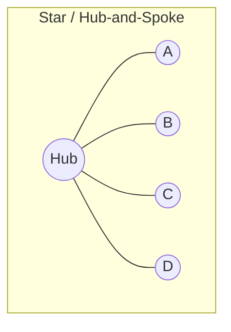
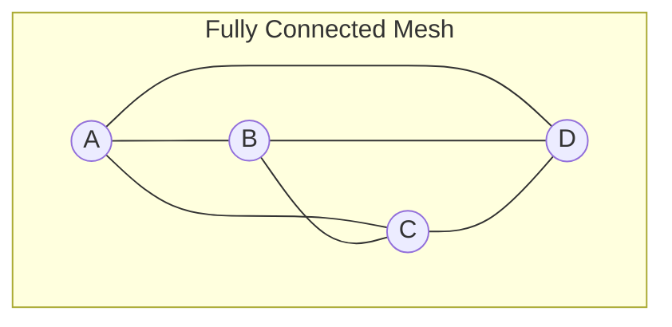
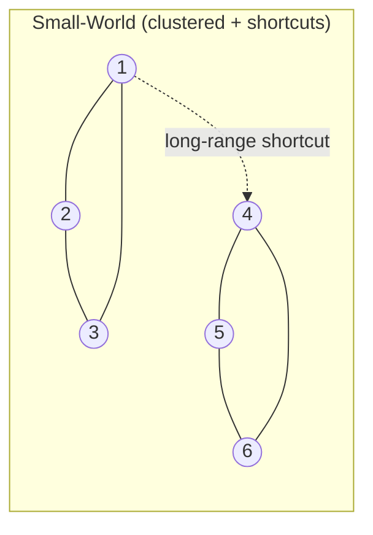
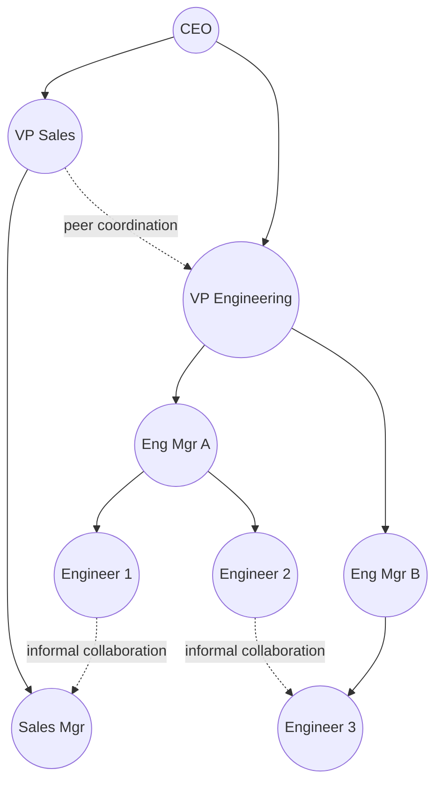

## Network and Relationship Mapping

### Overview

Network and Relationship Mapping is the practice of representing a system as a set of **nodes** (entities) and **edges** (connections/relationships), drawing on graph theory as its mathematical foundation. Where causal loop diagrams emphasize directional influence and feedback, and concept maps emphasize propositional meaning, network mapping emphasizes **structural topology**: how entities are connected, how tightly clustered they are, which nodes are central or peripheral, and how information/influence/resources could plausibly flow across the structure.

Within systems thinking, network mapping is used to analyze social systems (organizations, communities, stakeholder ecosystems), infrastructure systems (supply chains, transportation, utility grids), and abstract systems (citation networks, software dependency graphs, ecological food webs) where the *pattern of connection itself* — not just individual cause-effect pairs — is the object of analysis.

### Theoretical Foundation: Graph Theory Basics

- **Key Points**
  - A network is formally a graph $G = (V, E)$, where $V$ is the set of vertices/nodes and $E$ is the set of edges/links
  - Edges may be **directed** (A → B implies a one-way relationship) or **undirected** (A — B implies mutual/symmetric relationship)
  - Edges may be **weighted** (carrying a magnitude, e.g., transaction volume, frequency of contact, distance) or **unweighted** (simple presence/absence of connection)
  - A network may be **unimodal** (all nodes are the same type, e.g., people-to-people) or **bimodal/multimodal** (multiple node types, e.g., people-to-organizations, or people-to-events)

### Core Structural Metrics

| Metric | Definition | Systems-Thinking Interpretation |
| --- | --- | --- |
| Degree centrality | Number of direct connections a node has | Identifies highly connected "hub" entities |
| Betweenness centrality | How often a node lies on the shortest path between other node pairs | Identifies "brokers" or bottleneck/gatekeeper entities |
| Closeness centrality | Average shortest distance from a node to all others | Identifies nodes positioned to spread information/influence quickly |
| Eigenvector centrality | Weights a node's importance by the importance of its neighbors | Identifies nodes connected to other influential nodes (not just many nodes) |
| Density | Ratio of actual edges to all possible edges | Indicates overall connectivity/cohesion of the network |
| Clustering coefficient | Degree to which a node's neighbors are also connected to each other | Identifies tightly-knit local clusters/cliques |
| Path length | Number of edges in the shortest route between two nodes | Indicates how quickly effects/information could propagate system-wide |
| Modularity | Degree to which the network decomposes into distinct sub-communities | Identifies natural subsystem/silo boundaries |

$$C_D(v) = \frac{deg(v)}{n-1}$$

Where $C_D(v)$ is the normalized degree centrality of node $v$ and $n$ is the total number of nodes in the network.

[Inference] Which centrality metric is "most important" is context-dependent — betweenness is often more diagnostically useful than degree centrality for identifying single points of failure or informal power brokers in organizational network analysis, even though degree centrality is more commonly reported because it's simpler to compute and explain.

### Common Network Structures Relevant to Systems Thinking

- **Star/Hub-and-Spoke**: High fragility — removing the hub disconnects the entire network; common in centralized organizations or single-supplier supply chains.
- **Fully Connected Mesh**: High resilience but costly to maintain (edge count grows as $\binom{n}{2}$); rare at scale, more common in small tight-knit teams.
- **Small-World Networks**: Characterized by high local clustering plus a few long-range "shortcut" edges, producing short average path lengths despite low overall density — a structure observed empirically in many social and biological systems (Watts-Strogatz model).
- **Scale-Free Networks**: A small number of highly-connected hub nodes and many low-degree nodes, with degree distribution following a power law; associated with the Barabási–Albert preferential-attachment model and observed in phenomena like citation networks and the World Wide Web link structure.

### Example — Organizational Communication Network Map

- **Key Points**
  - Solid arrows represent the **formal hierarchy** (reporting lines)
  - Dashed lines represent **informal ties** (cross-functional collaboration not visible on an org chart)
  - This dual-layer approach — formal structure overlaid with informal/emergent ties — is a hallmark technique in Organizational Network Analysis (ONA), frequently revealing that actual information flow diverges substantially from the official hierarchy

### Network Mapping Methodology

1. **Define node and edge types** — decide what counts as an entity (people, teams, organizations, components, species) and what counts as a relationship (communication, dependency, trust, material flow, predation).
2. **Collect relational data** — via surveys (e.g., "who do you go to for advice?"), transaction logs, communication metadata, citation records, or direct observation.
3. **Construct the adjacency structure** — typically represented as an **adjacency matrix** (rows/columns = nodes, cell values = edge presence/weight) or an **edge list** (pairs of connected nodes, optionally weighted).
4. **Compute structural metrics** — centrality, density, clustering, modularity, as relevant to the analytical question.
5. **Visualize using a layout algorithm** — common algorithms include force-directed layouts (e.g., Fruchterman-Reingold, ForceAtlas2), which position densely connected nodes closer together and push weakly connected/peripheral nodes outward.
6. **Interpret in context** — structural position (centrality, brokerage, cluster membership) is only meaningful relative to the systemic question being asked (resilience, information flow, influence, vulnerability).

### Adjacency Matrix Representation

For the small network A–B–C–D where A-B, B-C, B-D, and C-D are connected:

|  | A | B | C | D |
| --- | --- | --- | --- | --- |
| A | 0 | 1 | 0 | 0 |
| B | 1 | 0 | 1 | 1 |
| C | 0 | 1 | 0 | 1 |
| D | 0 | 1 | 1 | 0 |

This matrix form is the standard input structure for most network analysis software libraries (e.g., NetworkX in Python, igraph in R) and is the basis from which centrality and clustering metrics are computationally derived.

### Common Network/Relationship Mapping Applications in Systems Work

- **Organizational Network Analysis (ONA)**: Mapping informal collaboration, advice-seeking, and trust networks to reveal influence structures not visible on formal org charts; frequently used to identify unrecognized "connectors" or at-risk knowledge silos.
- **Stakeholder Network Mapping**: Extending simple stakeholder lists into a relational map showing which stakeholders influence, depend on, or coalition with which others — a structural complement to DSRP's Perspectives element.
- **Supply Chain / Value Network Mapping**: Representing suppliers, manufacturers, distributors, and customers as nodes with material/information/financial flows as edges, used to identify single points of failure and concentration risk.
- **Ecological/Food Web Mapping**: Representing species as nodes and predator-prey or symbiotic relationships as edges, a long-standing application in ecosystem systems modeling.
- **Social Network Analysis (SNA)**: The academic discipline most closely associated with formal network mapping methodology, contributing much of the centrality/clustering metric vocabulary used across other domains.

### Relationship to Other Systems Mapping Techniques

| Technique | Relationship to Network Mapping |
| --- | --- |
| Causal Loop Diagrams | CLDs are a special-purpose directed network where edges also carry causal polarity and the analysis targets closed feedback loops rather than general topology |
| Concept Maps | Concept maps are semantically labeled networks; network mapping typically foregrounds structural metrics over propositional readability |
| DSRP | Network maps are a direct visual expression of the *Relationships* (action/reaction) element; centrality analysis can also reveal implicit *Systems* (part-whole clustering via modularity) |
| Systemigrams | A systemigram's backbone is effectively a constrained path through a larger implicit network, prioritizing narrative readability over full structural analysis |

### Common Pitfalls

- **Confusing visual centrality with structural centrality** — a node drawn in the visual middle of a force-directed layout is not necessarily the highest-centrality node by any formal metric; always check computed values, not just layout position.
- **Treating a network snapshot as static truth** — most real-world relational systems (organizations, supply chains, ecosystems) evolve; a network map represents a moment in time, and static interpretation of a stale map can lead to misdiagnosis of current vulnerabilities. [Inference] The rate at which a given network map becomes stale is highly context-dependent (organizational networks may shift over months; supply chains over years), so no fixed re-mapping cadence applies universally.
- **Ignoring edge direction/weight when both matter** — collapsing a weighted, directed network into a simple undirected diagram for visual simplicity can erase critical asymmetries (e.g., a one-way dependency mistaken for mutual collaboration).
- **Over-indexing on a single centrality metric** — degree, betweenness, closeness, and eigenvector centrality can rank the same node very differently depending on which structural property matters for the question being asked; using only one risks a misleading conclusion about which node is "most important."
- **Sampling bias in data collection** — relational data gathered via voluntary surveys (e.g., "list who you collaborate with") often undercounts weak ties and asymmetric relationships, systematically skewing the resulting map toward self-reported, salient connections.

### Practical Facilitation Tips

- When mapping organizational networks, gather data via a short, anonymous relational survey (e.g., "Who do you turn to for X?") rather than relying solely on formal org charts, since informal structure is often where the most diagnostically useful gap lies.
- Use force-directed layout tools (Gephi, NetworkX with Matplotlib, Kumu) for networks beyond roughly 20–30 nodes; manual layout becomes impractical and visually misleading at that scale.
- Pair a quantitative centrality table with the visual network map when presenting to stakeholders — the diagram alone invites eyeballing/misjudging importance, while the metrics table grounds interpretation in computed structure.

### Related Topics

- Social Network Analysis (SNA) methodology and metrics
- Organizational Network Analysis (ONA) for informal influence mapping
- Causal Loop Diagrams (structural comparison: general topology vs. causal polarity)
- Small-world and scale-free network models (Watts-Strogatz, Barabási–Albert)
- Supply chain resilience and single-point-of-failure analysis
- Graph visualization tools (Gephi, NetworkX, Kumu, yEd)
- Stakeholder mapping and multi-perspective analysis (DSRP Perspectives)