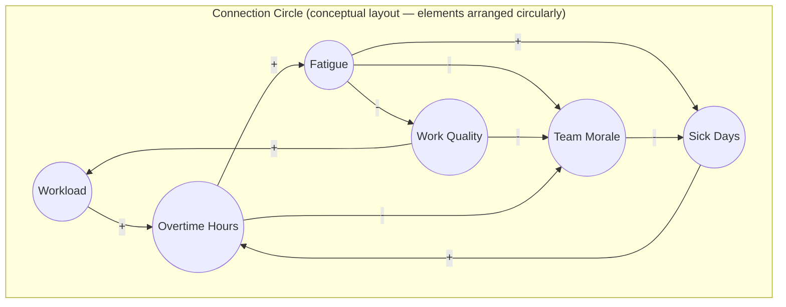

## Connection Circles for Communicating Systems

### Overview

A Connection Circle is a systems-mapping technique that arranges all elements of a system around the circumference of a circle and draws curved directional lines across the interior to represent causal relationships between them. It was popularized by Peter Senge and colleagues in *The Fifth Discipline Fieldbook* as a simplified alternative to causal loop diagrams — specifically designed to let groups quickly surface the *number and density* of interconnections in a system without yet committing to a fully resolved loop structure or feedback classification.

Its primary strength is visual: because every element sits on a fixed circle boundary, connection circles avoid the layout ambiguity and crossing-line clutter that arise when causal loop diagrams grow large, making the sheer volume of interdependency in a system immediately apparent even to viewers unfamiliar with systems notation.

### Structure and Conventions

- **Key Points**
  - Elements (variables, factors, actors) are listed **once each** around the circumference of a circle, typically in no particular causal order (order is often just alphabetical or by category for readability, not encoding meaning)
  - Each causal relationship is drawn as a **line or curve across the interior** of the circle connecting the two relevant elements
  - An **arrowhead** indicates the direction of influence (which element affects which)
  - Lines are frequently drawn with a **slight curve** (rather than straight chords) to reduce visual overlap and make individual relationships easier to trace by eye
  - Polarity ($+$/$-$) may optionally be added at the arrowhead end, similar to causal loop diagram convention, though many introductory connection circles omit polarity to keep the diagram maximally simple
  - Unlike a causal loop diagram, a connection circle does **not** require identifying or labeling closed feedback loops — loops are visually implied by the crossing pattern but are not the primary analytical unit

### Example — Connection Circle for "Team Burnout Dynamics"

[Inference] Rendering an actual connection circle requires elements positioned on a literal circle with chords drawn across the interior; the diagram above uses a flowchart layout only as a textual/logical stand-in to convey the same node-relationship data, since true circular chord layouts are not expressible in standard flowchart diagram syntax. A native connection circle would place Workload, Overtime Hours, Fatigue, Work Quality, Sick Days, and Team Morale evenly around a circle's edge with straight or gently curved chords connecting them.

#### SVG Rendering — True Circular Layout

<svg xmlns="http://www.w3.org/2000/svg" viewBox="0 0 500 500">
<text x="250" y="24" text-anchor="middle" font-size="15" font-weight="bold" font-family="sans-serif">Connection Circle: Team Burnout Dynamics (svg_diagram)</text>
<circle cx="250" cy="270" r="180" fill="none" stroke="#bbb" stroke-width="1" stroke-dasharray="2,3" />

<circle cx="250" cy="90" r="6" fill="#2980b9" />
<text x="250" y="75" text-anchor="middle" font-size="11" font-family="sans-serif">Workload</text>

<circle cx="405.9" cy="180" r="6" fill="#2980b9" />
<text x="415" y="175" text-anchor="start" font-size="11" font-family="sans-serif">Overtime Hours</text>

<circle cx="405.9" cy="360" r="6" fill="#2980b9" />
<text x="415" y="365" text-anchor="start" font-size="11" font-family="sans-serif">Fatigue</text>

<circle cx="250" cy="450" r="6" fill="#2980b9" />
<text x="250" y="468" text-anchor="middle" font-size="11" font-family="sans-serif">Work Quality</text>

<circle cx="94.1" cy="360" r="6" fill="#2980b9" />
<text x="85" y="365" text-anchor="end" font-size="11" font-family="sans-serif">Sick Days</text>

<circle cx="94.1" cy="180" r="6" fill="#2980b9" />
<text x="85" y="175" text-anchor="end" font-size="11" font-family="sans-serif">Team Morale</text>

<path d="M250,90 Q330,135 405.9,180" fill="none" stroke="#27ae60" stroke-width="1.5" marker-end="url(#arrGreen)" />
<path d="M405.9,180 Q430,270 405.9,360" fill="none" stroke="#27ae60" stroke-width="1.5" marker-end="url(#arrGreen)" />
<path d="M405.9,360 Q330,405 250,450" fill="none" stroke="#c0392b" stroke-width="1.5" marker-end="url(#arrRed)" />
<path d="M250,450 Q170,270 250,90" fill="none" stroke="#27ae60" stroke-width="1.5" marker-end="url(#arrGreen)" />
<path d="M405.9,360 Q280,300 94.1,360" fill="none" stroke="#27ae60" stroke-width="1.5" marker-end="url(#arrGreen)" />
<path d="M94.1,360 Q250,300 405.9,180" fill="none" stroke="#27ae60" stroke-width="1.5" marker-end="url(#arrGreen)" />
<path d="M94.1,180 Q60,270 94.1,360" fill="none" stroke="#c0392b" stroke-width="1.5" marker-end="url(#arrRed)" />
<path d="M405.9,360 Q250,230 94.1,180" fill="none" stroke="#c0392b" stroke-width="1.5" marker-end="url(#arrRed)" />
<path d="M250,450 Q170,320 94.1,180" fill="none" stroke="#c0392b" stroke-width="1.5" marker-end="url(#arrRed)" />
<path d="M405.9,180 Q250,320 94.1,180" fill="none" stroke="#c0392b" stroke-width="1.5" marker-end="url(#arrRed)" />
<text x="250" y="495" text-anchor="middle" font-size="9" font-family="sans-serif" fill="#555">Green = reinforcing (+), Red = weakening/inhibiting (-)</text>

</svg>

### Connection Circle Construction Method

1. **List all relevant elements** — brainstorm the variables/factors/actors involved in the system under study (typically 6–15 elements; beyond ~20 the circle becomes visually cluttered).
2. **Arrange elements around the circle** — order is generally not causally meaningful, though some practitioners cluster related elements adjacently for readability.
3. **Draw one connection per identified causal relationship** — for each pair of elements where one plausibly affects the other, draw a chord across the interior with an arrowhead at the affected element.
4. **Optionally add polarity** — mark each arrowhead $+$ (same-direction influence) or $-$ (opposite-direction influence) if the group has enough clarity to do so at this stage.
5. **Read the resulting density** — a connection circle with many crossing chords visually communicates high systemic interconnection even before any individual loop is named, which is often the primary communicative payload of the exercise.
6. **(Optional) migrate to a CLD** — once the group has surfaced the full relationship set, elements and connections can be repositioned into a traditional causal loop diagram layout to explicitly name and classify feedback loops.

### Purpose and Positioning in the Systems-Mapping Workflow

- **Key Points**
  - Connection circles are primarily a **communication and elicitation tool**, not a rigorous analytical model — they are frequently used in workshops specifically to help a group *see* that a system is highly interconnected before diving into more technical modeling
  - Because the circular layout removes the need to decide *where* to place each node (a major source of friction and rework when constructing causal loop diagrams by hand), connection circles are often faster to build collaboratively in a live session
  - They are commonly used as a **precursor step** to causal loop diagramming: the same relationship data gathered in a connection circle session is frequently the direct input to a subsequent CLD, where nodes are repositioned to make loops visually traceable

### Comparative Table

| Attribute | Connection Circle | Causal Loop Diagram (CLD) |
| --- | --- | --- |
| Node layout | Fixed on a circle's circumference | Free-form, arranged to make loops visually traceable |
| Loop identification | Implicit / not the focus | Explicit — loops are named and classified (R/B) |
| Ease of collaborative construction | High — no layout decisions needed | Lower — node placement requires iteration to avoid crossing lines |
| Best use stage | Early elicitation, communicating interconnectedness | Formal analysis, feedback loop behavior prediction |
| Typical audience | Broad/mixed, including non-technical stakeholders | Analysts and stakeholders trained in systems notation |
| Visual scaling | Degrades past ~15–20 elements (chord clutter) | Degrades differently — large CLDs need multiple sub-diagrams to stay readable |

### Relationship to Other Systems Mapping Techniques

- **Versus Multiple-Cause Diagrams**: An MCD fans multiple causes into a single outcome variable; a connection circle has no privileged "outcome" node — every element can be both a cause and an effect of others, and the diagram represents the whole web simultaneously rather than converging on one variable.
- **Versus Causal Loop Diagrams**: A connection circle can be understood as a CLD's raw relationship data rendered in a layout-free format; converting a connection circle into a CLD is largely a matter of repositioning nodes so that closed cycles become visually traceable and can be labeled R (reinforcing) or B (balancing).
- **Versus Network Mapping**: A connection circle is structurally a specific graph layout convention (circular/chord diagram) applied to a causal network; in general network-visualization terminology, this layout style is sometimes called a "chord diagram," widely used outside systems thinking as well (e.g., in genomics and trade-flow visualization).
- **Versus DSRP**: The connection circle is a direct visual expression of DSRP's *Relationships* element (action/reaction pairs among identified Distinctions), used at a stage before Systems (part-whole hierarchy) or Perspectives are formally layered on.

### Common Pitfalls

- **Overloading the circle with too many elements** — beyond roughly 15–20 nodes, the number of possible chords grows quickly ($\binom{n}{2}$ possible pairs), and the diagram becomes an unreadable tangle; splitting into sub-system connection circles is preferable at that scale.
- **Treating chord density as automatically meaningful** — a highly interconnected-looking diagram communicates *complexity*, but density alone does not indicate which relationships are strongest, most leveraged, or most in need of intervention; polarity and, eventually, loop analysis are needed for that.
- **Skipping the transition to a CLD when loop analysis is actually needed** — because connection circles are fast and visually satisfying to build, groups sometimes stop at this stage even when the underlying question requires understanding specific feedback loop behavior (reinforcing runaway growth vs. balancing/self-correcting dynamics), which the connection circle does not make explicit.
- **Inconsistent element granularity** — mixing highly specific elements (e.g., "Tuesday team meeting attendance") with broad ones (e.g., "Organizational Culture") on the same circle produces relationships of very different analytical weight, making the diagram harder to interpret consistently.

### Practical Facilitation Tips

- In live workshops, physically draw the circle on a whiteboard or large paper with elements pre-placed, then invite participants to draw connecting lines one at a time, explaining the causal logic aloud as they draw — this surfaces disagreement about causal direction in real time.
- Use two different line colors (or dashed/solid) to distinguish reinforcing ($+$) from weakening ($-$) relationships even in a simplified version, since this small addition substantially increases the diagram's analytical value without adding much construction complexity.
- After the group has built a dense connection circle, ask "which two or three elements have the most connections?" as an informal proxy for identifying high-leverage points, before proceeding to any formal centrality or loop analysis.

### Related Topics

- Causal Loop Diagrams (formal loop identification and R/B classification)
- Multiple-Cause Diagrams (fan-in causal structure for a single outcome)
- Network and Relationship Mapping (chord diagrams as a general graph-layout convention)
- DSRP: Distinctions, Systems, Relationships, and Perspectives
- Leverage points analysis (Meadows) as a follow-on to identifying densely connected elements
- Behavior-over-time graphs for validating relationships surfaced in a connection circle