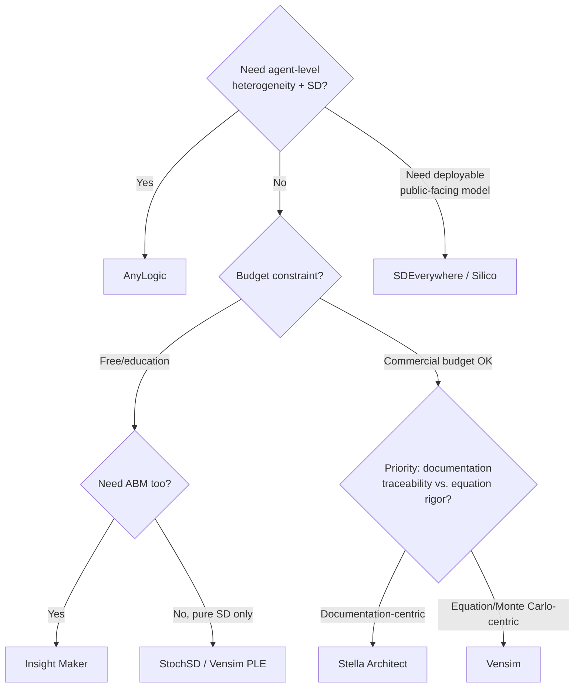

## Comparing System Dynamics Software Platforms

### Overview

System dynamics software platforms translate stock-and-flow structures and causal loop diagrams into executable simulations that generate quantitative behavior-over-time output. While the underlying mathematics (integration of differential/difference equations describing stocks accumulating flows) is common across tools, platforms diverge significantly in modeling paradigm scope (pure system dynamics vs. multi-method), collaboration model, pricing, and target audience (education vs. enterprise consulting vs. policy analysis). Choosing a platform is less about which one is "best" and more about matching engine capabilities and workflow needs to the modeling task.

### Core Evaluation Dimensions

- **Key Points**
  - **Modeling paradigm scope**: pure system dynamics (stocks/flows/feedback only) vs. multi-method (system dynamics + agent-based modeling + discrete event simulation in the same model)
  - **Deployment model**: desktop-installed vs. browser-based/cloud
  - **Licensing/cost**: free/open-source vs. commercial with tiered licensing vs. free education-restricted editions
  - **Collaboration support**: real-time multi-user editing, version control, sharing/publishing of interactive model runs
  - **Analysis capabilities**: sensitivity analysis, Monte Carlo simulation, optimization (e.g., genetic algorithms), calibration against historical data
  - **Extensibility**: scripting support, API access, code export (e.g., to C for embedding in other applications)

### Platform-by-Platform Comparison

#### Vensim (Ventana Systems)

- **Paradigm**: Primarily continuous system dynamics simulation, with some discrete delay and discrete-event functionality, built in C/C++. It supports flexible array syntax with mapping among dimensions for multilevel hierarchical models, reusable modules, multidimensional arrays, optimization, and Monte Carlo analysis. [Wikipedia](https://en.wikipedia.org/wiki/Comparison_of_system_dynamics_software)
- **Licensing**: Proprietary and commercial, with a free Personal Learning Edition (PLE) available for education and personal use. [Wikipedia](https://en.wikipedia.org/wiki/Comparison_of_system_dynamics_software)
- **Strengths**: Long-established in academic and engineering/economics/management contexts; described as having a user-friendly interface well suited to researchers and analysts new to the field who want to quickly build and run simulations of complex systems. Strong support for Monte Carlo-based probabilistic scenario exploration. [Wordpress](https://systemdynamicstutor.wordpress.com/vensim-compared-to-some-others/)
- **Best fit**: [Inference] Teams whose primary need is disciplined, equation-correctness-checked system dynamics simulation rather than multi-paradigm modeling, based on how it is generally positioned relative to multi-method tools like AnyLogic in current buyer's-guide comparisons.

#### Stella / Stella Architect (isee systems)

- **Paradigm**: Stock-and-flow system dynamics with an equation-centric specification style.
- **Strengths**: Stella Architect keeps model documentation integrated into the authoring workflow and ties it to run execution, which improves traceability during collaborative model review because inputs, outputs, and iteration history stay organized around review-ready artifacts. It fits models where equation-centric specification and structured scenario experiment settings are prioritized to produce comparable results for behavior over time under controlled parameter changes. [Gitnux](https://gitnux.org/best/systems-thinking-software/)[World Metrics](https://worldmetrics.org/best/system-dynamics-simulation-software/)
- **Licensing**: Commercial, tiered (Stella Architect being the higher-end authoring/publishing tier above the base Stella product).
- **Best fit**: Teams needing tightly coupled documentation-plus-execution artifacts for defensible, review-ready models — common in policy analysis and academic publication contexts.

#### AnyLogic

- **Paradigm**: Multi-method — natively supports multimethod models where system dynamics stocks and flows interact directly with agent-based-modeling agents and discrete-event-simulation queues; for example, aggregate market dynamics can drive individual agent decisions in economic simulations. This makes it a versatile option across a wide range of industries and applications. [Grokipedia](https://grokipedia.com/page/Comparison_of_system_dynamics_software)[Wordpress](https://systemdynamicstutor.wordpress.com/vensim-compared-to-some-others/)
- **Strengths**: Offers dedicated sensitivity experiments that propagate parameter variations through the model, often combined with optimization engines like genetic algorithms to iteratively search for parameter combinations that maximize or minimize objective functions, such as cost minimization in supply chain models. Well suited to teams that require repeatable scenario experiments inside one project and exportable time-series datasets for measurable coverage and baseline-versus-delta reporting. [Grokipedia](https://grokipedia.com/page/Comparison_of_system_dynamics_software)[World Metrics](https://worldmetrics.org/best/system-dynamics-simulation-software/)
- **Contrast**: Traditional system dynamics tools like Vensim and Stella primarily focus on continuous modeling and require external scripting or plugins for hybrid integration (such as linking Vensim outputs to agent-based models via DLL calls), which limits their native fluidity compared to AnyLogic's built-in multi-method engine. [Grokipedia](https://grokipedia.com/page/Comparison_of_system_dynamics_software)
- **Best fit**: Situations where aggregate feedback dynamics and individual-level (agent) heterogeneity must be simulated together in the same experiment — e.g., epidemiological models combining population-level SD with individual contact-network ABM.

#### Insight Maker

- **Paradigm**: Integrates three general modeling approaches — System Dynamics, Agent-Based Modeling, and imperative programming — in a unified modeling framework, with a graphical model construction interface implemented purely in client-side code that runs in the browser. [ScienceDirect](https://www.sciencedirect.com/science/article/pii/S1569190X14000513)
- **Licensing**: Completely free, running entirely in the browser with no downloads or plugins needed. [Insightmaker](https://insightmaker.com/)
- **Distinctive features**: Supports building rich pictures and causal loop diagrams, and offers a "storytelling" feature to craft a narrative around a model alongside standard documentation and learning resources. Advanced features include model scripting and an optimization tool. [TechRepublic](https://www.techrepublic.com/article/systems-thinking-with-a-chromebook/)[ScienceDirect](https://www.sciencedirect.com/science/article/pii/S1569190X14000513)
- **Best fit**: Education, rapid prototyping, and public-facing model sharing where zero licensing cost and browser accessibility outweigh the need for enterprise-grade optimization or hybrid ABM/DES depth found in AnyLogic.

#### Powersim Studio

- **Paradigm**: Continuous system dynamics with parameter-sweep-based sensitivity analysis.
- **Strengths**: Facilitates parameter sweeps, allowing users to define ranges for variables and execute batch simulations to map output variations, though it lacks native genetic-algorithm optimization support found in AnyLogic. [Grokipedia](https://grokipedia.com/page/Comparison_of_system_dynamics_software)
- **Best fit**: Teams wanting batch/sweep-style sensitivity exploration without the overhead of a full multi-method engine.

#### Other Notable Tools

| Tool | Positioning |
| --- | --- |
| StochSD | Free (AGPL v3), JavaScript-based, combining stochastic and deterministic modeling for continuous system simulation; built on the InsightMaker engine with click-and-draw stock-and-flow construction, mainly intended for education and research on small-to-medium CSS models. |
| Kumu | Organizes complex data into relationship maps, supporting stakeholder mapping, systems mapping, social network mapping, community asset mapping, and concept mapping — closer to a systems-mapping/network tool than a full SD simulation engine. |
| SDEverywhere | Allows deployment of interactive System Dynamics models into mobile, desktop, and web apps for policymakers and the general public, or running the model as high-performance compiled C code for external analysis. |
| iMODELER (Consideo) | Web-based, collaborative modeling software supporting both quantitative modeling (system dynamics, theory-of-constraints process modeling) and qualitative modeling (including fuzzy cognitive maps), with direct translation of causal loop diagrams into quantitative models; free for qualitative modeling. |
| Silico / PathFwd | A purpose-built, browser-only tool for System Dynamics modeling, positioned as intuitive for teaching and professional work, reportedly used by over 10,000 System Dynamics practitioners, strategists, department leaders, teachers, and students. |
| SIMLIN | A web-first System Dynamics modeling editor and engine. |
| Miro / Loopy | Support collaborative causal mapping and review workflows but with limited simulation depth compared to dedicated SD engines. |

### Comparative Summary Table

| Platform | Paradigm Scope | Deployment | License Model | Distinctive Strength |
| --- | --- | --- | --- | --- |
| Vensim | Pure SD (+ light discrete-event) | Desktop | Commercial + free PLE | Equation-correctness checking, Monte Carlo |
| Stella Architect | Pure SD | Desktop | Commercial, tiered | Integrated documentation + execution traceability |
| AnyLogic | Multi-method (SD + ABM + DES) | Desktop/Cloud | Commercial | Native hybrid modeling, optimization engines |
| Insight Maker | SD + ABM + scripting | Browser | Free | Zero-cost, narrative/storytelling features |
| Powersim Studio | Pure SD | Desktop | Commercial | Batch parameter sweeps |
| StochSD | SD (stochastic + deterministic) | Browser | Free (AGPL v3) | Stochastic CSS modeling for education |
| Kumu | Relationship/network mapping | Browser | Freemium | Stakeholder/social network visualization |
| SDEverywhere | SD (deployment/compilation) | Compiled/Web | Open-source | High-performance C export for embedding |

### Decision Framework

[Inference] This decision tree reflects general positioning drawn from current comparative buyer's-guide sources rather than a single authoritative benchmark; actual best fit depends heavily on team skill level, existing organizational tooling, and specific model complexity, so it should be treated as a starting heuristic rather than a definitive selection rule.

### Common Pitfalls in Platform Selection

- **Choosing based on visual polish rather than engine fit** — a tool with an attractive collaborative whiteboard interface (e.g., Miro-style causal mapping) may have "limited simulation depth" compared to dedicated SD engines, meaning teams that need actual quantitative behavior-over-time output can hit a capability wall after initial mapping.
- **Underestimating multi-method needs upfront** — starting a project in a pure-SD tool (Vensim, Stella) and later discovering agent-level heterogeneity is required often necessitates a costly migration to a multi-method platform like AnyLogic, since hybrid integration in pure-SD tools typically requires external scripting/DLL linking rather than native support.
- **Ignoring licensing lock-in for collaborative review** — free browser-based tools (Insight Maker, StochSD) lower entry barriers but may lack the enterprise-grade documentation/traceability integration found in commercial tools like Stella Architect, which matters for regulatory or policy contexts requiring auditable model provenance.
- [Unverified] Marketing claims of being "independently tested" or offering "editorial rankings" on comparison/roundup sites should be weighed cautiously, since several such sources disclose paid placements or affiliate commissions influencing ranking order.

### Related Topics

- Stock-and-Flow Diagrams and quantitative system dynamics modeling
- Causal Loop Diagrams as the qualitative precursor to SD simulation models
- Agent-Based Modeling (ABM) and its integration with system dynamics
- Sensitivity analysis, Monte Carlo simulation, and model calibration techniques
- Behavior-over-time (BOT) graphs for validating simulation output against real-world data
- Model documentation and traceability standards for policy-relevant simulations