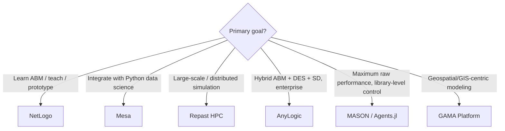

## Agent-Based Modeling Platforms

### Overview

Agent-Based Modeling (ABM) platforms provide the computational infrastructure to simulate complex systems as populations of autonomous, interacting agents rather than aggregate equations. Where system dynamics tools (Vensim, Stella) model a system as continuous stocks and flows at the population level, ABM platforms model **individual entities** with their own state, behavior rules, and local interactions, from which system-level (emergent) patterns arise bottom-up. Agent-based modeling has become an increasingly valuable approach for studying complex systems across economics, social science, biology, and ecology, and the choice of platform significantly affects development speed, scalability, and analytical rigor.

### Core Evaluation Dimensions

- **Key Points**
  - **Programming paradigm**: domain-specific language (DSL) with GUI vs. general-purpose language library/framework
  - **Abstraction level**: how much scaffolding (built-in spatial grids, scheduler, visualization) is provided vs. how much the modeler must build manually
  - **Performance/scalability**: single-machine simulation of thousands of agents vs. distributed/parallel simulation of millions
  - **Visualization**: built-in 2D/3D rendering vs. external plotting/analysis libraries
  - **Community and model library**: availability of published, reusable reference models
  - **Interoperability**: integration with data science stacks (Python/R), GIS data, or other simulation paradigms (system dynamics, discrete event)

### Platform-by-Platform Comparison

#### NetLogo

- **Paradigm**: A free, open-source, cross-platform, multi-agent programmable modeling environment implemented in Java/Scala, designed specifically for simulating emergent phenomena in natural and social systems.
- **Strengths**: Offers an intuitive, domain-specific programming language with a GUI to create and edit simulation components, extensive visualization tools including two-dimensional and three-dimensional displays, and a large model library supported by an active community. It has become the standard platform for developing ABMs, in large part due to a community that continually contributes extensions — including GIS data support, 3D visualization, and integration with other languages such as Python via PyNetLogo or Pylogo.
- **Adoption context**: Historical analysis of published ABM platform usage (OpenABM/CoMSES.net records from 2008–2018) shows NetLogo as clearly the dominant platform among agent-based modeling researchers during that period.
- **Best fit**: Education, rapid prototyping, and research contexts where ease of learning and a mature reference-model ecosystem outweigh the need for maximum raw performance or tight integration with a broader software pipeline.

#### Mesa

- **Paradigm**: A Python-based framework emphasizing modularity and extensibility, providing a flexible and easy-to-use API for building and running agent-based models, and offering easy integration into data science workflows.
- **Strengths**: Because it is Python-native, Mesa integrates naturally with the broader Python data-science stack (NumPy, pandas, matplotlib, scikit-learn), making it well suited to teams that want to combine ABM output directly with statistical analysis or machine-learning pipelines. It provides a range of data collection and analysis tools to support model evaluation.
- **Best fit**: Teams already working in Python who want ABM as one component of a larger analytical or data-science workflow, rather than a standalone modeling environment.

#### Repast (Repast Simphony / Repast HPC)

- **Paradigm**: A Java-based (Repast Simphony) or C++-based (Repast HPC) open-source toolkit, described as a scalable platform for building and running large-scale agent-based models.
- **Strengths**: Provides a range of data collection and analysis tools similar to Mesa, and — particularly in its HPC variant — is oriented toward large-scale, potentially distributed simulations of complex adaptive systems.
- **Best fit**: Research contexts requiring simulation of very large agent populations where computational scalability outweighs the value of a simplified DSL.

#### AnyLogic

- **Paradigm**: A professional multimethod simulation platform, Java-based, supporting agent-based modeling alongside discrete-event and system-dynamics paradigms in the same model. It enables users to create autonomous agents with custom behaviors, states, interactions, and decision logic, uniquely integrating agent-based simulation with discrete-event and system-dynamics paradigms to allow hybrid models for complex-systems analysis.
- **Strengths**: Rich visualization, GIS mapping, 3D animation, and extensive model libraries support rapid development; it is widely adopted in industries such as logistics, manufacturing, healthcare, and defense. Advanced features include cloud-based experiment management and custom agent behavior via Java scripting and statecharts.
- **Trade-off**: [Inference] Several comparative sources describe AnyLogic as having a steep learning curve requiring programming knowledge, positioning it as a professional/enterprise tool rather than an introductory teaching platform — a trade-off consistent with its broader multimethod scope compared to NetLogo's simpler DSL.
- **Best fit**: Enterprise and applied contexts where ABM must be combined with discrete-event process flows or aggregate system-dynamics feedback in a single hybrid model — e.g., supply chain simulations combining agent-level shipment tracking with system-level inventory dynamics.

#### MASON

- **Paradigm**: A high-performance Java multi-agent simulation library, used as one of the most relevant and widely used tools alongside NetLogo, Repast, Flame, and AnyLogic for simulation design.
- **Strengths**: Emphasizes fast, flexible model development as a library (rather than a full GUI-driven environment), making it suited to modelers comfortable working closer to raw Java code for performance-sensitive simulations.
- **Best fit**: Performance-critical research applications where a lightweight library approach is preferred over a heavier GUI-based environment.

#### GAMA Platform

- **Paradigm**: An open-source modeling and simulation environment focused specifically on geospatial agent-based simulations.
- **Strengths**: Native GIS integration makes it particularly suited to spatially explicit models — land-use change, urban planning, epidemiological spread tied to real geography.
- **Best fit**: Projects where spatial/geographic data is central to agent behavior and environment, rather than a generic grid or network space.

#### Other Notable Frameworks

| Tool | Positioning |
| --- | --- |
| Agents.jl | A Julia-based ABM framework emphasizing performance and minimal code complexity; comparative benchmarking against Mesa, NetLogo, and MASON evaluates both runtime speed and lines-of-code required to express equivalent models (e.g., the Flockers, Schelling segregation, and Wolf-Sheep-Grass reference models), used as standard cross-platform benchmarks in the ABM research community. |
| Swarm | An early, foundational general-purpose agent-based systems platform, implemented in C, historically influential in establishing ABM as a research paradigm. |
| krABMaga | A framework compared directly against Agents.jl, MASON, Mesa, NetLogo, and Repast on standard benchmark models, illustrating that formal head-to-head performance comparison is an active area of ABM tooling research. |
| JADE / SARL / Cougaar / Soar | Java-based agent platforms with roots closer to multi-agent AI/robotics research (e.g., Soar for general learning/cognitive architectures) rather than social-science or ecological ABM specifically. |

### Comparative Summary Table

| Platform | Language/Base | Deployment | License | Distinctive Strength |
| --- | --- | --- | --- | --- |
| NetLogo | Java/Scala, custom DSL | Desktop/GUI | Free, open-source | Ease of learning, largest model library, dominant research adoption |
| Mesa | Python | Library/script | Free, open-source | Data-science ecosystem integration |
| Repast Simphony/HPC | Java / C++ | Desktop / HPC cluster | Free, open-source | Large-scale/distributed simulation |
| AnyLogic | Java | Desktop/Cloud | Commercial | Multimethod hybrid (ABM + DES + SD), enterprise visualization |
| MASON | Java (library) | Library | Free, open-source | High-performance lightweight simulation |
| GAMA | Custom DSL (GAML) | Desktop/GUI | Free, open-source | Native GIS/geospatial modeling |
| Agents.jl | Julia | Library/script | Free, open-source | Performance benchmarking, minimal code complexity |

### Standard Reference/Benchmark Models

ABM platform comparisons in the literature commonly use a small set of canonical models to benchmark performance and code complexity:

- **Flockers** (Craig Reynolds): agents move within a continuous toroidal space according to simple local rules, producing emergent flocking behavior — one of the most famous ABM demonstrations of emergence from simple rules.
- **Schelling Segregation Model**: a simple 2D-grid model in which agents decide whether to relocate based on the composition of their local neighborhood, a canonical demonstration of emergent macro-segregation from mild individual preferences.
- **Wolf-Sheep-Grass**: a predator-prey-resource model simulating population dynamics of predators and prey coexisting in a shared environment, commonly used to benchmark both performance and correctness across platforms.

### Common Pitfalls in Platform Selection

- **Choosing based on popularity alone** — NetLogo's dominance in published research reflects historical adoption and ease of teaching, not necessarily the best fit for every project; [Inference] a project requiring tight integration with an existing Python-based data pipeline may be better served by Mesa despite NetLogo's larger model library.
- **Underestimating the learning curve of multimethod tools** — AnyLogic's power comes from combining ABM with discrete-event and system-dynamics paradigms, but this multimethod flexibility is frequently noted as requiring more programming knowledge than a single-paradigm DSL like NetLogo's, making it a heavier initial investment for teams only needing pure ABM.
- **Overlooking performance requirements until scale becomes a problem** — GUI-driven environments (NetLogo, GAMA) are excellent for prototyping but may not scale efficiently to millions of agents; performance-oriented library frameworks (MASON, Agents.jl, Repast HPC) exist specifically to address this, and switching platforms mid-project is costly.
- **Treating benchmark comparisons as universally authoritative** — cross-platform benchmarks (e.g., Agents.jl vs. Mesa/NetLogo/MASON on Flockers/Schelling/Wolf-Sheep-Grass) measure runtime and lines-of-code on specific reference models under specific hardware; [Unverified] results "can only vary slightly... with different hardware" per some benchmark documentation, but the degree of variation across radically different model types (e.g., spatially dense vs. network-based agent interactions) is not guaranteed to generalize from these standard benchmarks.

### Related Topics

- Comparing System Dynamics Software Platforms (paradigm contrast: aggregate stocks/flows vs. individual agents)
- Emergence and self-organization in complex adaptive systems
- Schelling segregation model and other canonical ABM demonstrations
- Multi-method modeling (combining ABM, discrete-event simulation, and system dynamics)
- GIS-integrated spatial modeling for agent-based simulations
- Calibration and validation techniques for agent-based models