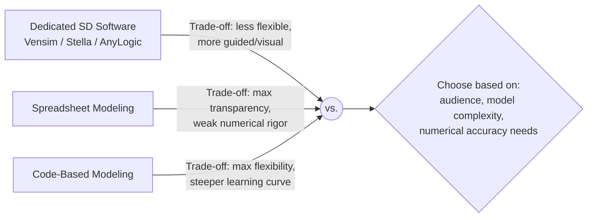

## Spreadsheet and Code-Based Systems Modeling


### Overview

Spreadsheet and code-based systems modeling refers to building dynamic system models using general-purpose tools — spreadsheets (Excel, Google Sheets) or general-purpose programming languages (Python, R, Julia, MATLAB) — rather than dedicated system dynamics or agent-based modeling software. This approach trades the guided modeling grammar and built-in visualization of purpose-built platforms (Vensim, Stella, NetLogo) for maximum flexibility, transparency of underlying computation, and integration with existing organizational tooling and data pipelines.

This is often the **default entry point** for systems modeling in organizational and analytical contexts, since spreadsheets are near-universally available and general-purpose languages offer virtually unlimited extensibility, but both approaches carry structural trade-offs specific to representing feedback and stock-flow dynamics.

### Spreadsheet-Based Modeling

#### Structure and Conventions

- **Key Points**
  - Stocks are typically represented as **cell values in a column**, with each row representing a discrete time step
  - Flows are represented as **formulas** referencing the prior time step's stock value plus/minus inflow and outflow calculations
  - Feedback is implemented via **circular-reference-avoiding recursive formulas**: each new row's stock value is computed from the previous row, never referencing itself directly, which is how spreadsheets simulate what would otherwise be a circular dependency in continuous system dynamics notation
  - This is a **discrete-time (Euler-method-style) approximation** of continuous system dynamics — spreadsheets do not natively support differential equation solvers, so all dynamics must be manually discretized into fixed time steps

#### Example — Simple Bathtub Stock-Flow Model in Spreadsheet Form

| Time (t) | Inflow Rate | Outflow Rate | Stock (Water Level) |
| --- | --- | --- | --- |
| 0 | — | — | 100 (initial) |
| 1 | `=10` | `=0.05*C0` (5% of prior stock) | `=D0+B1-C1` |
| 2 | `=10` | `=0.05*C1` | `=D1+B2-C2` |
| 3 | `=10` | `=0.05*C2` | `=D2+B3-C3` |

- **Key Points**
  - Column D (Stock) at each row references the **previous row's** stock value plus the current row's inflow minus outflow — this row-by-row recursion is the spreadsheet equivalent of numerical integration
  - The outflow formula referencing `0.05*C(t-1)` demonstrates a simple **balancing feedback loop**: as stock grows, outflow grows proportionally, pulling the system toward equilibrium
  - Extending this pattern down thousands of rows (representing many time steps) is the standard way to simulate a system dynamics model without dedicated SD software

#### Strengths and Limitations of Spreadsheet Modeling

- **Key Points**
  - **Strengths**: Nearly universal tool availability and familiarity; transparent, auditable formulas (every cell's calculation is inspectable); easy integration with existing organizational data (budgets, forecasts already live in spreadsheets); no additional licensing cost beyond existing office software
  - **Limitations**: No native support for continuous-time integration methods (Euler's method with small time steps is the de facto standard, introducing discretization error); feedback loops require careful manual row-referencing discipline to avoid errors; poor scalability for models with many interacting stocks (formula complexity grows quickly and becomes error-prone to audit); no built-in causal loop diagram or stock-flow visual notation — the underlying structure is implicit in formulas rather than visually explicit
  - [Inference] The discretization error inherent in a fixed-time-step spreadsheet model (versus an adaptive-step differential equation solver used by dedicated SD software) is generally small for slowly-changing systems with large time steps relative to the dynamics, but can become significant for systems with fast oscillatory behavior or stiff dynamics — this is a standard numerical-methods consideration rather than a spreadsheet-specific flaw, though spreadsheets make it easier to overlook since there is no built-in warning for step-size-related error.

#### When Spreadsheet Modeling Is Appropriate

- Small-to-medium models with a limited number of stocks (roughly under 10–15) where formula auditability outweighs the need for sophisticated numerical methods
- Organizational contexts where stakeholders are more comfortable reviewing formulas in a familiar spreadsheet interface than interpreting a stock-flow diagram
- Quick "back of the envelope" dynamic modeling before committing to a dedicated SD tool investment
- Situations requiring direct integration with existing financial/operational spreadsheets (budget models, headcount planning, inventory forecasting)

### Code-Based Modeling

#### Structure and Conventions

- **Key Points**
  - Stocks are represented as **variables** (scalars, arrays, or more complex data structures) updated within a simulation loop
  - Flows are represented as **functions or expressions** computing rate-of-change values
  - Time integration uses established numerical methods: **Euler's method** (simple, fast, less accurate), **Runge-Kutta methods** (RK4 commonly used for improved accuracy), or **adaptive-step solvers** (e.g., `scipy.integrate.odeint` / `solve_ivp` in Python, which automatically adjust step size for accuracy and stability)
  - Code-based modeling supports **arbitrary complexity**: nonlinear relationships, stochastic elements (Monte Carlo sampling), agent-level heterogeneity, and integration with external data sources or machine-learning components, none of which are natural fits for spreadsheet formulas

#### Example — Simple Stock-Flow Model in Python (Euler Integration)

```python
import numpy as np
import matplotlib.pyplot as plt

# Parameters
initial_stock = 100.0
inflow_rate = 10.0
outflow_fraction = 0.05
dt = 1.0          # time step
n_steps = 50

# Arrays to hold simulation results
time = np.arange(0, n_steps * dt, dt)
stock = np.zeros(n_steps)
stock[0] = initial_stock

# Euler integration loop
for t in range(1, n_steps):
    outflow = outflow_fraction * stock[t - 1]
    net_flow = inflow_rate - outflow
    stock[t] = stock[t - 1] + net_flow * dt

plt.plot(time, stock)
plt.xlabel("Time")
plt.ylabel("Stock Level")
plt.title("Bathtub Stock-Flow Model (Euler Method)")
plt.show()
```

- **Key Points**
  - This produces mathematically identical output to the spreadsheet version above, but the loop structure makes the discretization mechanism explicit and easy to modify (e.g., swapping `dt` to a smaller value for finer resolution, or replacing the Euler loop with a call to `scipy.integrate.solve_ivp` for adaptive-step accuracy)
  - Because this is ordinary code, it can be version-controlled (Git), unit-tested, parameterized for batch sensitivity runs, and integrated into larger data pipelines — capabilities that are considerably harder to achieve reliably in spreadsheet form

#### Example — Same Model Using a Differential Equation Solver

```python
from scipy.integrate import solve_ivp
import numpy as np

def bathtub_ode(t, y, inflow_rate, outflow_fraction):
    stock = y[0]
    outflow = outflow_fraction * stock
    d_stock_dt = inflow_rate - outflow
    return [d_stock_dt]

sol = solve_ivp(
    bathtub_ode,
    t_span=[0, 50],
    y0=[100.0],
    args=(10.0, 0.05),
    dense_output=True
)

t_eval = np.linspace(0, 50, 200)
stock_values = sol.sol(t_eval)[0]
```

- **Key Points**
  - `solve_ivp` uses an adaptive-step Runge-Kutta method by default, automatically refining the time step where the system changes rapidly and coarsening it where the system is stable — a numerical-accuracy advantage not available in fixed-step spreadsheet models
  - This pattern generalizes directly to multi-stock systems by expanding `y` into a vector and returning a corresponding vector of derivatives, forming the basis for coding arbitrarily complex system dynamics models entirely in general-purpose code

#### Strengths and Limitations of Code-Based Modeling

- **Key Points**
  - **Strengths**: Full numerical-methods sophistication (adaptive integration, stiff-equation solvers); scalability to large/complex models (hundreds of stocks, stochastic elements, hybrid agent-based components); reproducibility and version control; seamless integration with data science and machine learning tooling; batch experimentation (parameter sweeps, Monte Carlo analysis) is straightforward to script
  - **Limitations**: Requires programming proficiency, raising the barrier to entry for non-technical stakeholders; no built-in visual stock-flow or causal loop diagram — the model structure lives in code and must be separately diagrammed for stakeholder communication; higher risk of latent bugs in custom-written integration logic if not carefully validated against known analytical or reference solutions; less immediately auditable by non-programmers compared to a transparent spreadsheet formula trail

### Comparative Table

| Attribute | Spreadsheet Modeling | Code-Based Modeling |
| --- | --- | --- |
| Tool availability | Near-universal (Excel/Sheets) | Requires programming environment/skills |
| Numerical methods | Fixed-step Euler-style only | Full range: Euler, RK4, adaptive solvers |
| Auditability by non-programmers | High — formulas are directly inspectable | Low — requires reading code |
| Scalability (many stocks/agents) | Poor — formula complexity grows unmanageably | Good — arbitrary complexity supported |
| Stochastic/Monte Carlo support | Possible but cumbersome (manual random functions, data tables) | Native and efficient (standard libraries) |
| Version control / reproducibility | Weak (manual file versioning, prone to silent edits) | Strong (Git, scripted pipelines) |
| Built-in visualization | Native charting, but no stock-flow diagram notation | Requires external plotting libraries (matplotlib, etc.) |
| Integration with existing data | Excellent (native to office data ecosystems) | Excellent (via APIs, database connectors, data science stack) |
| Best team fit | Analysts/stakeholders without programming background | Data scientists, engineers, quantitative researchers |

### Relationship to Dedicated System Dynamics Software



[Inference] Dedicated SD software occupies a middle ground — offering built-in visual stock-flow/causal loop notation and validated numerical solvers that spreadsheets lack, while remaining more guided and less flexible than general-purpose code — which is why many practitioners migrate from spreadsheet prototypes to dedicated SD tools once a model's complexity exceeds what formulas can cleanly express, or migrate to code when a model's complexity exceeds what a GUI-driven tool can accommodate (e.g., large agent populations or custom stochastic processes).

### Common Pitfalls

- **Spreadsheets**: Hidden circular reference errors — accidentally referencing a cell's own row instead of the prior row breaks the discrete-time recursion pattern and can produce silently incorrect results or Excel's circular-reference warning, depending on settings.
- **Spreadsheets**: Formula drift across large numbers of rows — copying a formula down thousands of rows without careful absolute/relative reference discipline (`$` anchoring) is a common source of subtle, hard-to-detect errors in large spreadsheet models.
- **Spreadsheets**: Treating a spreadsheet model as a finished analytical deliverable when the underlying structure (feedback loops, delays) is not visually documented anywhere — this makes the model's assumptions opaque to anyone except the original formula author.
- **Code-based**: Choosing a fixed, overly large time step (`dt`) for Euler integration without testing against a smaller step or reference solution, which can produce numerically unstable or inaccurate results, particularly for systems with fast dynamics or strong feedback loops (a classic numerical-methods pitfall independent of the modeling domain).
- **Code-based**: Under-documenting model structure in code comments or accompanying diagrams, making the model difficult for non-programming stakeholders (or even other programmers returning later) to understand without reading every line.
- **Both**: Skipping validation against known behavior — whether in a spreadsheet or code, failing to check simple test cases (e.g., a stock should approach a known equilibrium value under constant inflow/outflow) before trusting more complex model output.

### Practical Recommendations

- Start complex feedback-heavy models in a spreadsheet only as a **quick prototype**; migrate to dedicated SD software or code once the model exceeds roughly 8–10 interacting stocks or requires proper differential-equation accuracy.
- When building in code, always validate the integration approach against a simplified analytically-solvable case (e.g., pure exponential decay) before trusting results on a complex nonlinear model.
- Pair either approach with a hand-drawn or diagrammed causal loop diagram / stock-flow diagram as external documentation, since neither spreadsheets nor raw code natively provide the visual structure that dedicated SD tools offer.
- For stochastic or Monte Carlo analysis, code-based modeling (Python with NumPy/SciPy, or R) is markedly more efficient and less error-prone than spreadsheet-based random-number workarounds (e.g., Excel Data Tables or manual `RAND()` chains).

### Related Topics

- Comparing System Dynamics Software Platforms (dedicated tools vs. general-purpose alternatives)
- Numerical integration methods (Euler, Runge-Kutta, adaptive-step solvers)
- Stock-and-Flow Diagrams as the visual notation underlying both spreadsheet and code models
- Monte Carlo simulation and sensitivity analysis
- Version control and reproducibility practices for quantitative models
- Agent-Based Modeling Platforms (code-based approach extended to individual-level heterogeneity)