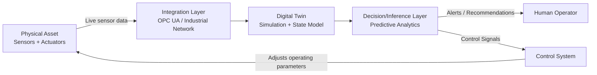

## Digital Twins and Real-Time System Models

### Overview

A digital twin is a virtual representation of a physical system that maintains a live, bidirectional data connection with its physical counterpart, enabling continuous synchronization, simulation, and — in more advanced implementations — feedback control. Digital twin real-time process simulation is defined as the bidirectional, data-driven coupling between a physical system and its virtual counterpart, where the virtual model continuously ingests live sensor data, executes simulations, and optionally feeds control decisions back to the physical layer.

Within systems thinking and modeling, digital twins represent the convergence of several previously distinct disciplines: system dynamics/simulation modeling, IoT sensor networks, real-time data engineering, and (increasingly) machine learning. The defining characteristic that distinguishes a digital twin from a conventional simulation model is **live, continuous synchronization** with a physical instance, rather than a static or offline representation.

### Core Architectural Layers

Recent architectural analyses converge on a layered structure connecting the physical and virtual domains:

- **Physical layer**: the actual asset, process, or system — sensors (temperature, vibration, pressure, position), actuators, and control hardware (e.g., PLCs — Programmable Logic Controllers)
- **Integration/communication layer**: the synchronization core connecting physical and virtual domains, commonly using industrial communication standards such as OPC UA (Open Platform Communications Unified Architecture) for standardized information models and service abstraction, alongside general-purpose networking (Ethernet, industrial routers)
- **Digital/virtual layer**: the simulation/model environment (physics-based models, 3D visualization engines, reduced-order models) that ingests live data and computes predicted or current system state
- **Decision/control layer**: where simulation output is translated into either human-facing alerts/recommendations or, in closed-loop implementations, direct control signals fed back to the physical layer

### The Ingest-Simulate-Infer-Decide Pattern

A commonly described modern architectural principle frames the digital twin operational loop as: **ingest, simulate, infer, decide**. Rather than the older "data warehouse plus visualization layer" approach that asked retrospective questions about past state, the modern pattern is event-driven and asks what is happening now, what it implies, and what should happen next.

A representative closed-loop example: temperature, vibration, and pressure sensors stream live data; an edge service detects a threshold breach; the digital twin updates the machine's state; a simulation predicts failure probability over the next several hours; a maintenance decision is triggered; the control system adjusts operating parameters to reduce stress; and operators receive an alert with a recommended action. This is described as operational intelligence rather than mere monitoring — a twin that informs decisions is useful, while a twin that supports real-time control can directly influence performance and resilience.

- **Key Points**
  - The architecture explicitly separates a **fast path** (low-latency control loop responses) from a **smart path** (more computationally intensive predictive/inferential modeling), since industrial control systems require latency and trust guarantees that experimental or heavier models cannot always meet
  - This separation lets teams keep the fast path fast and the smart path smart, rather than attempting to run a single monolithic model that serves both purposes

### Five Identifiable Sub-Domains

Current analysis of the digital twin real-time simulation landscape identifies five core sub-domains:

1. **Discrete-event simulation-based digital twins** — for manufacturing and logistics processes, modeling systems as sequences of discrete events (e.g., a part entering/leaving a production stage)
2. **Physics-based and CFD (Computational Fluid Dynamics) real-time simulation using reduced-order models** — high-fidelity physical simulations compressed into computationally tractable approximations that can run at real-time speed
3. **Data-model-driven hybrid simulation** — combining first-principles physical models with data-driven (statistical/ML) components
4. **Co-simulation architectures for virtual commissioning** — testing and validating control logic against a virtual model before deployment to physical hardware
5. **Predictive clone-twin sequencing** — running temporally offset copies of the twin to forecast future system states ahead of real time

[Inference] These five sub-domains are not mutually exclusive in practice; a mature industrial digital twin deployment often combines several simultaneously (e.g., a reduced-order physics model feeding a discrete-event production simulation, augmented with a data-driven predictive-maintenance component).

### Example Implementation Pattern — Industrial Automation Training Twin

A documented reference implementation for an industrial automation training environment illustrates a typical build pipeline:

1. **3D design**: Geometric modeling of equipment using tools such as SolidWorks or Fusion 360, adding textures, colors, and realistic physical properties, with models exported in standard interchange formats (`.step`, `.fbx`, `.obj`) to ensure interoperability with simulation and visualization platforms.
2. **Visualization and animation**: Import into a real-time visualization/game engine (e.g., Unity 3D), configuring scenarios, lighting, and component motion, with scripts implementing real-time reading and writing of variables so the twin responds to physical-process changes and vice versa.
3. **Communication**: An industrial network (Ethernet managed through an industrial router) connects the physical controller (e.g., a Siemens S7-1500 PLC) to the virtual environment, acting as the synchronization core between the digital twin and the physical plant.

[Unverified] The specific library used for PLC data access in this reference implementation is noted as lightweight and efficient but does not incorporate some advanced capabilities typically available in industrial communication standards such as OPC UA, including standardized information models and service abstraction layers — illustrating a common trade-off in twin implementations between simplicity/speed of integration and standards-compliant interoperability.

### Standards and Governance

The Digital Twin Consortium unites industry, academia, and governmental bodies to define shared practices, interoperability frameworks, and educational resources for the digital twin domain. Several standards contribute to the technical specification and governance of digital twin systems, with OPC UA being one of the most frequently referenced for standardized information modeling in industrial contexts.

A related architectural concern in large deployments is **fragmentation**: as organizations move from isolated digital twin instances to plant-wide ecosystems spanning cloud and edge infrastructure, coordination challenges emerge among heterogeneous assets, data sources, and services. Proposed solutions include cloud-native "Digital Twin Computing Layer" concepts that provide a unified control and orchestration plane for composing and operating digital twin applications, with standardized interaction supported through semantic digital twin models and API- or message-based communication mechanisms.

### Emerging Trends

- **AI-native twin generation**: A shift from architecture-definition patents toward using generative transformer networks and large language models to synthesize digital twin model structure directly from available data, rather than manually engineering simulation models — potentially reducing deployment time and cost, though [Speculation] the maturity and reliability of fully LLM-generated twin structures for safety-critical industrial control applications remains an open and actively contested area, as generative model-to-twin pipelines are still emerging.
- **Federation for multi-system interoperability**: Connecting multiple digital twins (e.g., across a multinational, multimodal transportation network) into federated structures rather than isolated single-asset twins.
- **Automated visual synchronization and cloud elasticity**: Improving the ability of the visualization layer to stay synchronized with physical state changes while allowing simulation compute resources to scale elastically in the cloud.
- **MLOps integration for predictive models**: Applying machine-learning-operations practices to automate the deployment and lifecycle management of predictive models within digital twins, supporting dynamic adjustment to evolving conditions (e.g., traffic pattern shifts in intelligent transportation system twins) while maintaining computational efficiency and scalability.

### Relationship to Other Systems Modeling Techniques

| Technique | Relationship to Digital Twins |
| --- | --- |
| System Dynamics / Stock-Flow Models | Often embedded as the underlying continuous-simulation engine within a digital twin's virtual layer, particularly for aggregate process behavior |
| Agent-Based Modeling | Used within digital twins to represent discrete, heterogeneous entities (e.g., individual vehicles in a traffic twin, individual products in a logistics twin) |
| Discrete-Event Simulation | One of the five core sub-domains identified for manufacturing/logistics digital twins, modeling sequences of discrete process events |
| Causal Loop Diagrams | Typically used at the design/conceptual stage to map feedback structure before it is implemented as executable code within the twin's simulation layer |

### Common Pitfalls

- **Treating monitoring as a full digital twin** — a system that only visualizes live sensor data without executing predictive simulation or informing decisions is more accurately a live dashboard than a digital twin; the defining value is in the ingest-simulate-infer-decide loop, not visualization alone.
- **Underestimating latency and trust requirements for closed-loop control** — plugging an experimental or unvalidated model directly into a live control loop without the fast-path/smart-path separation risks safety and reliability failures; industrial control systems require validated, low-latency responses that heavier predictive models generally cannot guarantee.
- **Standards fragmentation across vendors and assets** — using lightweight, proprietary communication libraries instead of standardized protocols (e.g., OPC UA) speeds initial integration but can create interoperability debt when scaling from a single-asset twin to a plant-wide or federated ecosystem.
- [Inference] **Overestimating ROI without measuring specific operational pain points** — some current industry commentary explicitly cautions that digital twin return-on-investment is not demonstrated merely by adopting the technology label, but requires measuring concrete operational improvements (e.g., reduced downtime, extended asset life) tied to specific use cases.

### Practical Implementation Tips

- Start with a narrowly scoped physical asset or process (a single machine or production line) before attempting a plant-wide or federated twin, given the coordination challenges documented in multi-asset digital twin ecosystems.
- Explicitly separate the fast (control-loop) and smart (predictive/inferential) computational paths architecturally from the outset, rather than retrofitting this separation after a monolithic design proves too slow or unreliable for real-time control.
- Favor standards-compliant communication layers (OPC UA or equivalent) over lightweight custom integrations when the digital twin is expected to scale beyond a single pilot asset, to avoid interoperability debt later.
- Validate any AI/ML-generated model structure (including LLM-synthesized twin architectures) against known physical behavior and edge cases before connecting it to any closed-loop control pathway, given the early and evolving maturity of generative twin-synthesis approaches.

### Related Topics

- Comparing System Dynamics Software Platforms (simulation engines often embedded within twins)
- Agent-Based Modeling Platforms (discrete entity representation within twins)
- IoT sensor architecture and edge computing for real-time data ingestion
- OPC UA and industrial communication standards
- Predictive maintenance and failure-probability modeling
- MLOps for production machine-learning model lifecycle management
- Federated systems and multi-twin interoperability