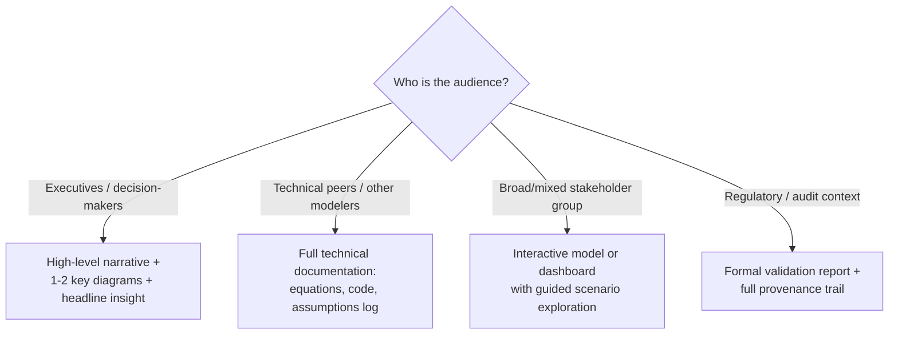

## Model Documentation and Communication

### Overview

Model Documentation and Communication refers to the practices, formats, and standards used to make a systems model — whether a causal loop diagram, a stock-flow simulation, an agent-based model, or a digital twin — understandable, auditable, and usable by people who did not build it. A model's analytical value is capped by how well its assumptions, structure, and limitations can be communicated to the stakeholders who must act on its conclusions. This is frequently the most under-invested phase of a modeling project relative to its impact on whether the model is trusted, correctly interpreted, and actually used for decision-making.

Documentation and communication are related but distinct: **documentation** is the durable, structured record of what the model contains and why; **communication** is the act of conveying model insights to a specific audience for a specific decision. A well-documented model can still be poorly communicated, and vice versa.

### Why Documentation Matters in Systems Modeling Specifically

- **Key Points**
  - Systems models (especially those with feedback loops and delays) frequently produce **counterintuitive results** — behavior that diverges from linear, mental-model expectations — making transparent documentation of assumptions essential for stakeholders to trust conclusions rather than dismiss them as implausible
  - Models are built on **structural assumptions** (which variables are included, which are excluded, what functional form relationships take) that are often invisible in the final output (a chart or dashboard) unless explicitly documented
  - Systems models are frequently **revisited and modified** over time as understanding improves; without documentation, later modelers (including the original author, months later) must reverse-engineer intent from formulas or code
  - Poor documentation is a leading cause of models being **abandoned or distrusted** after the original builder leaves a project or team

### Core Documentation Components

#### 1. Purpose and Scope Statement

- **Key Points**
  - States the specific question(s) the model is designed to answer
  - Explicitly defines the **boundary** of the system being modeled (what is included, what is deliberately excluded)
  - Documents the intended **audience and use case** (e.g., "for internal strategic planning discussion," not "for regulatory submission") — a model built for one purpose is frequently misapplied to another without this statement
- **Example**

  *"This model estimates the effect of pricing changes on customer churn over a 12-month horizon for the mid-market segment. It excludes enterprise accounts, which follow contractual renewal cycles not captured by this model's assumptions. Intended for internal pricing-strategy discussion, not for financial forecasting to external stakeholders."*

#### 2. Assumptions Log

- **Key Points**
  - A running list of every non-obvious assumption embedded in the model — functional forms, parameter values, excluded variables, boundary conditions
  - Each assumption should note its **source** (data-derived, expert judgment, simplification for tractability) and, where relevant, its **sensitivity** (how much the conclusion changes if the assumption is varied)
  - This is where [Inference], [Speculation], and [Unverified]-style labeling is most valuable in a modeling context: distinguishing which model components rest on solid data versus which rest on plausible but unverified expert judgment

#### 3. Structural Diagram(s)

- **Key Points**
  - A visual representation (causal loop diagram, stock-flow diagram, concept map, DSRP map) of the model's structure, independent of the underlying code or spreadsheet formulas
  - Serves as the primary artifact non-technical stakeholders will actually engage with — most audiences will look at a diagram before they read equations or code
  - Should be kept synchronized with the underlying model; a diagram that has drifted out of alignment with actual model logic is a common source of stakeholder confusion and mistrust

#### 4. Variable/Parameter Dictionary

- **Key Points**
  - A table defining every named variable: its meaning, units, data type, source, and (for parameters) the numeric value used and justification
  - Prevents the common failure mode where a variable name (e.g., "growth rate") is ambiguous about units, time period, or whether it represents a fraction or a percentage

| Variable | Definition | Units | Source | Notes |
| --- | --- | --- | --- | --- |
| `churn_rate` | Fraction of customers lost per month | Fraction (0–1) | Historical CRM data, trailing 12 months | Assumed constant; does not vary by cohort |
| `price_elasticity` | % change in demand per 1% price change | Dimensionless | Expert estimate | [Inference] Not directly measured; based on analogous market studies |

#### 5. Validation and Limitations Statement

- **Key Points**
  - Documents how the model was validated: comparison against historical data, sensitivity testing, expert review, or extreme-condition testing (does the model behave sensibly at boundary values, e.g., zero or very large inputs?)
  - Explicitly states known limitations: what the model does **not** capture, conditions under which its output should not be trusted, and how confident the modeler is in specific outputs versus general directional insight
  - [Inference] Systems models are frequently more reliable for directional/qualitative insight (does this policy increase or decrease the outcome, and through what feedback mechanism) than for precise quantitative point predictions, and this distinction is worth stating explicitly in a limitations section rather than left implicit.

### Communication Formats by Audience

#### For Executive/Decision-Maker Audiences

- Lead with the **headline insight**, not the model mechanics — what does this mean for the decision at hand
- Use one or two carefully chosen diagrams (a simplified causal loop diagram or a single behavior-over-time chart) rather than the full technical structure
- Explicitly separate what the model **shows** (structural/mechanistic insight) from what it **predicts** (quantitative output), since executives may otherwise treat a directional insight as a precise forecast
- Anticipate and preemptively address the most likely objection or counterintuitive result, since systems models frequently produce conclusions that clash with linear intuition

#### For Technical Peer Audiences

- Provide full model equations/code, the complete assumptions log, and validation methodology
- Enable reproducibility: technical peers should be able to re-run the model and verify outputs independently
- Document the numerical methods used (integration technique, time step, solver choice) since these materially affect reproducibility for continuous system dynamics models

#### For Interactive/Exploratory Communication

- **Key Points**
  - Interactive dashboards or simplified interactive models (e.g., a slider-based interface letting stakeholders adjust a key parameter and see resulting behavior-over-time output) are increasingly used to let stakeholders build intuition themselves rather than passively receiving conclusions
  - This approach is particularly valuable for feedback-rich systems, since direct manipulation of assumptions helps stakeholders viscerally experience how a small parameter change can produce disproportionate (nonlinear) outcomes — a core systems-thinking insight that is hard to convey through static charts alone
  - Tools like Insight Maker's "storytelling" feature, or dedicated dashboard layers in platforms like Stella Architect and AnyLogic, are built specifically to support this style of guided exploratory communication

### Standard Documentation Structure (Template)

1. **Title and version** — including a version history/changelog for models that are iteratively revised
2. **Purpose and scope**
3. **Structural diagram(s)**
4. **Variable/parameter dictionary**
5. **Assumptions log**
6. **Methodology** — modeling approach used (SD, ABM, DES, hybrid), software/tools, numerical methods
7. **Validation and testing performed**
8. **Known limitations and appropriate use cases**
9. **Key findings/insights** — summarized for the primary intended audience
10. **Appendix** — full equations/code, raw data sources, references

### Common Pitfalls

- **Documenting the model after the fact rather than alongside construction** — assumptions and design decisions are far more accurately captured in the moment they are made than reconstructed from memory weeks or months later; the most reliable documentation processes treat the assumptions log as a living document updated throughout model construction.
- **Conflating the diagram with the model** — presenting only a causal loop diagram without documenting the underlying quantitative relationships, parameter values, and validation gives stakeholders false confidence that the diagram fully represents a rigorously tested model when it may only represent conceptual structure.
- **Over-precision in stakeholder communication** — presenting simulation output with a false sense of numerical precision (e.g., "customer churn will be 14.3% in Q3") when the underlying model is better suited to directional/qualitative insight can lead to stakeholder overreliance and eventual loss of trust when point predictions prove inaccurate.
- **Omitting the limitations section** — a model presented without explicit statement of what it does not capture is frequently applied outside its valid scope by stakeholders who were never told the boundary existed.
- **Static documentation for a living model** — when a model continues to be revised after initial deployment, documentation that is not versioned or updated alongside model changes quickly becomes actively misleading rather than merely incomplete.
- **Audience mismatch** — presenting full technical equations and code to an executive audience, or an oversimplified narrative-only summary to a technical peer audience expected to validate or extend the model, both undermine effective communication even when the underlying model is sound.

### Practical Recommendations

- Maintain the assumptions log and variable dictionary as living documents updated in real time during model construction, not retrospectively compiled at project completion.
- Always pair quantitative output with an explicit statement of confidence level and appropriate use scope, particularly when presenting to non-technical decision-makers who may otherwise treat model output as precise forecast rather than structural insight.
- When possible, build a lightweight interactive version (even a simple parameter-slider interface) alongside the full technical model, since stakeholder-driven exploration tends to build deeper and more durable intuition than passively presented conclusions.
- Version every model iteration with a changelog documenting what changed and why, particularly for models used repeatedly over an extended period across changing organizational contexts.

### Related Topics

- Causal Loop Diagrams and Multiple-Cause Diagrams as structural documentation artifacts
- Sensitivity analysis and Monte Carlo methods for quantifying assumption impact
- Comparing System Dynamics Software Platforms (built-in documentation/traceability features)
- Stakeholder mapping and multi-perspective communication (DSRP Perspectives)
- Model validation techniques for system dynamics and agent-based models
- Version control and reproducibility practices for quantitative models