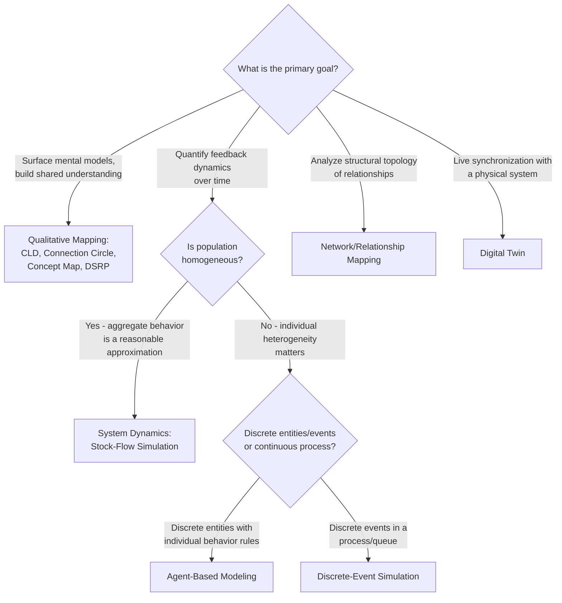

## Choosing the Right Modeling Approach for a Problem

### Overview

Choosing the right modeling approach is a methodological decision that precedes tool selection: before deciding whether to use Vensim, NetLogo, a spreadsheet, or a digital twin, the analyst must first determine which **class** of modeling technique fits the problem's structure, the question being asked, and the resources available. Selecting the wrong approach — using system dynamics where agent-level heterogeneity is essential, or building an agent-based model where an aggregate feedback structure would suffice — leads to models that are either misleadingly imprecise or needlessly expensive to build and maintain.

This decision is not purely technical; it also depends on audience, timeline, data availability, and the type of insight actually needed (qualitative/directional vs. quantitative/predictive).

### Key Decision Dimensions

- **Key Points**
  - **Question type**: Is the goal to understand feedback structure and leverage points (qualitative), or to generate quantitative forecasts/predictions (quantitative)?
  - **Population homogeneity**: Are the entities in the system reasonably represented by an aggregate/average behavior, or does individual heterogeneity (different agents behaving differently) materially affect the outcome?
  - **Spatial/network structure**: Does the system's behavior depend on where entities are located or how they are connected, or is location/connectivity irrelevant to the question?
  - **Time horizon and dynamics**: Is the system continuous and slowly evolving, or driven by discrete events (arrivals, transactions, state transitions)?
  - **Data availability**: Is there sufficient historical/empirical data to calibrate a quantitative model, or is the analysis necessarily exploratory/conceptual?
  - **Audience and decision context**: Does the audience need a communicable conceptual map, or a rigorously validated simulation to support a high-stakes quantitative decision?
  - **Resources and timeline**: What programming/modeling expertise, budget, and time are available?

### Mapping Problem Characteristics to Technique Families

### Qualitative Mapping Techniques — When to Use

- **Fit indicators**: Early-stage problem exploration; need to build shared understanding across stakeholders with differing perspectives; the primary deliverable is insight into structure and feedback, not a numerical forecast; limited or contested data; short timeline; non-technical audience
- **Representative techniques**: Causal Loop Diagrams, Connection Circles, Concept Maps, Multiple-Cause Diagrams, DSRP maps, Systemigrams
- **Example scenario**: A cross-functional team investigating "why has employee engagement been declining" benefits more from a facilitated causal loop diagramming session — surfacing hypothesized feedback loops and stakeholder perspectives — than from an immediately quantitative model, since the underlying causal structure and relevant variables are not yet agreed upon.

### System Dynamics — When to Use

- **Fit indicators**: The system is reasonably represented by aggregate stocks and flows (e.g., total inventory, total population, cumulative revenue); feedback loops and delays are central to the dynamics being studied; historical data exists to calibrate rates and parameters; the question concerns emergent time-based behavior (growth, oscillation, overshoot-and-collapse) at a population/aggregate level
- **Fit contraindicators**: Individual-level heterogeneity is central to the question (e.g., "which specific customer segments churn and why" rather than "what is the aggregate churn rate over time")
- **Example scenario**: Modeling a company's hiring pipeline — where "employees," "open positions," and "attrition" can be reasonably treated as aggregate stocks with well-defined inflow/outflow rates — is a natural fit for system dynamics rather than agent-based modeling, since individual employee-level variation is not the primary driver of the dynamics being studied.

### Agent-Based Modeling — When to Use

- **Fit indicators**: Individual heterogeneity (different agents with different states, rules, or locations) materially affects emergent system behavior; the research question concerns how micro-level interactions produce macro-level patterns (emergence); spatial or network position matters to agent behavior; the system exhibits path-dependence or history-dependent effects not well captured by aggregate averages
- **Fit contraindicators**: The system can be adequately approximated by aggregate behavior, making the additional complexity of individual-agent simulation unnecessary overhead; limited computational resources or expertise for building and validating agent-level behavior rules
- **Example scenario**: Modeling residential segregation patterns (the Schelling model) fundamentally requires representing individual households with individual relocation decisions based on local neighborhood composition — an aggregate stock-flow model cannot represent the spatial clustering dynamics that emerge from individual agent decisions.

### Discrete-Event Simulation — When to Use

- **Fit indicators**: The system is naturally structured as a sequence of discrete events (arrivals, service completions, state transitions) rather than continuous flows; queuing, resource contention, and process-flow bottlenecks are central to the question; common in manufacturing, logistics, healthcare patient-flow, and call-center capacity modeling
- **Relationship to other approaches**: [Inference] Discrete-event simulation is often combined with system dynamics or agent-based modeling in multi-method platforms (e.g., AnyLogic) when a problem has both aggregate feedback dynamics and discrete process-flow characteristics — for example, a supply chain model might use system dynamics for aggregate inventory feedback while using discrete-event simulation for individual shipment processing.

### Network/Relationship Mapping — When to Use

- **Fit indicators**: The central question concerns structural topology — who is connected to whom, which entities are central/peripheral, how resilient the structure is to node removal — rather than dynamic behavior over time
- **Example scenario**: Identifying single points of failure in a supply chain, or informal influence brokers in an organization, is primarily a network-structure question best served by centrality and connectivity analysis rather than a time-based simulation.

### Digital Twins — When to Use

- **Fit indicators**: A physical asset or process exists with live sensor instrumentation; the use case requires continuous, real-time synchronization between the virtual model and physical state (not a one-time or periodic model run); the organization has the infrastructure (IoT, industrial communication standards, computational resources) to support live bidirectional data flow
- **Fit contraindicators**: The physical system does not yet exist (pre-deployment planning), or there is no practical way to instrument it with live sensors — in these cases, a conventional simulation model (system dynamics, ABM, or DES) run offline is more appropriate than attempting a live twin

### Combining Approaches (Hybrid Modeling)

- **Key Points**
  - Real-world problems frequently do not fit neatly into a single technique category; hybrid/multi-method approaches combine two or more paradigms in a single model
  - Common combinations: system dynamics (aggregate feedback) + agent-based modeling (individual heterogeneity) for problems where both macro-level feedback and micro-level variation matter; agent-based modeling + network mapping when agent interactions are structured by an explicit relationship network rather than random mixing; qualitative mapping (CLD/DSRP) as a design phase preceding any quantitative technique
  - [Inference] Starting with a qualitative mapping technique (CLD, connection circle, or DSRP) before committing to a specific quantitative modeling paradigm is widely considered good practice regardless of which quantitative technique is eventually chosen, since it clarifies system boundary, key variables, and stakeholder perspectives before computational investment begins.

### A Practical Selection Checklist

1. **Clarify the question first** — write down the specific decision or insight the model needs to support before considering any tool or technique.
2. **Determine whether qualitative or quantitative output is actually needed** — many organizational questions are well served by a rigorous qualitative map and do not require a fully quantitative simulation.
3. **Assess population homogeneity** — would an aggregate/average representation lose the insight you need, or is it a reasonable simplification?
4. **Assess spatial/network dependence** — does location or connection structure materially affect the answer?
5. **Assess data availability** — quantitative techniques (SD, ABM with calibrated parameters) require data; if data is sparse or contested, a qualitative technique or a lightweight exploratory model is more honest than a falsely precise quantitative one.
6. **Match resources to technique complexity** — a multi-method AnyLogic model requiring programming expertise is not the right choice for a team needing a fast, low-cost, high-collaboration mapping exercise.
7. **Consider the audience's needs** — a technique that produces a highly technical output is a poor fit if the primary audience is non-technical executives who need a communicable narrative.

### Common Pitfalls

- **Defaulting to the most sophisticated available tool** — teams with access to a powerful multi-method platform (e.g., AnyLogic) sometimes default to building an agent-based or hybrid model even when a much simpler causal loop diagram or aggregate system dynamics model would answer the actual question, incurring unnecessary cost and complexity.
- **Choosing a technique before clarifying the question** — starting with "let's build a system dynamics model" before clearly articulating what decision the model needs to inform risks building a technically sound model that does not actually answer the question stakeholders care about.
- **Ignoring data constraints** — committing to a quantitative technique (requiring calibrated parameters) when the underlying data does not exist or is highly contested produces a model with false precision; a qualitative technique is often more honest and useful in genuinely data-sparse situations.
- **Underestimating the value of starting qualitative** — skipping qualitative mapping and moving directly to quantitative modeling can mean key variables, feedback loops, or stakeholder disagreements about system boundary are discovered late, after significant quantitative modeling investment has already been made.
- **Overlooking hybrid needs** — forcing a problem that genuinely has both aggregate feedback and individual heterogeneity into a single-paradigm technique (pure SD or pure ABM) can produce a model that is either too coarse or unnecessarily complex relative to a well-scoped hybrid approach.

### Practical Recommendations

- Begin nearly every systems modeling engagement with a qualitative mapping session (CLD, connection circle, or DSRP-guided discussion) regardless of the eventual quantitative technique, since this phase is comparatively low-cost and surfaces critical assumptions and disagreements early.
- Explicitly state, before building anything, whether the deliverable needs to answer "what direction and through what mechanism" (qualitative/structural insight) or "how much and by when" (quantitative/predictive insight) — this single distinction eliminates many candidate techniques immediately.
- When in doubt between system dynamics and agent-based modeling, prototype a small, simplified version of both approaches on a subset of the problem before committing to a full build, since the relative importance of aggregate feedback versus individual heterogeneity is often clearer empirically than it is in the abstract.
- Revisit the modeling-approach decision if the question changes significantly during a project — a model built to answer one question is not automatically well-suited to a related but distinct follow-up question.

### Related Topics

- Comparing System Dynamics Software Platforms
- Agent-Based Modeling Platforms
- Causal Loop Diagrams and Connection Circles as qualitative precursors
- Digital Twins and Real-Time System Models
- Model Documentation and Communication
- Hybrid/multi-method simulation (combining SD, ABM, and DES)
- DSRP: Distinctions, Systems, Relationships, and Perspectives (framing the initial problem-scoping stage)